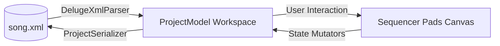
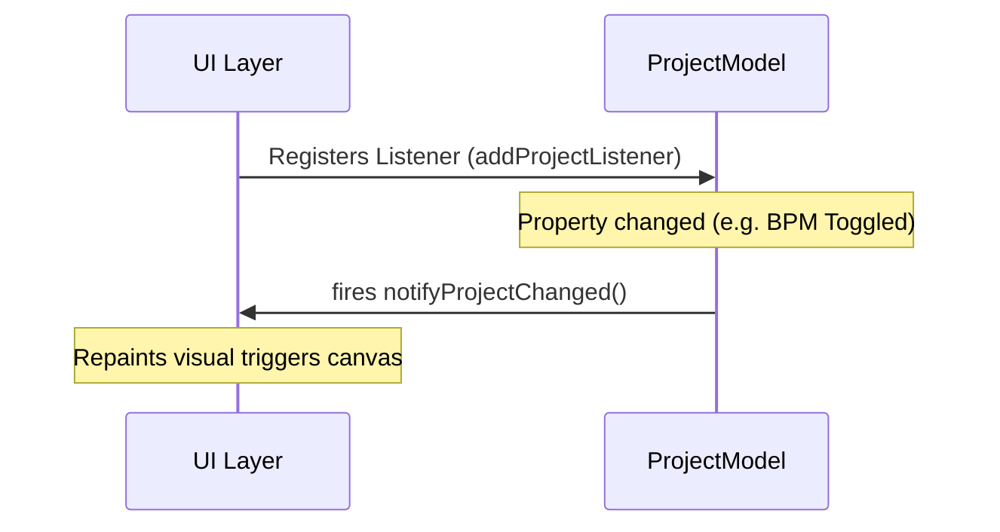

# Deluge-Java Workstation: Master Design Specification

This document outlines the architecture for a software-only emulation of the **Synthstrom Deluge** workflow, optimized for Deluge-Java and modern PC hardware (Java 25).

---

## 1. Core Architectural Pillars

### 1.1 The Virtual Matrix
- **Grid**: 16x8 interactive Swing GridPanel. High-performance rendering for sample-accurate playhead feedback.
- **View Modes**: should be a combox box choice above the grid.
    - **Clip (F1)**: Note sequencing for a single track.
    - **Song (F2)**: "Session View" for launching multiple clips simultaneously.
    - **Arranger (F3)**: Linear timeline overview for horizontal song structure.

### 1.2 The ChucK Bridge
- **Shared Memory**: All grid states, mutes, and automation are stored in `ChuckArray` objects globally accessible by both Java and ChucK.
- **Dynamic Shredding**: Track types (Synth/Kit) are managed by independent ChucK shreds that can be hot-swapped via `Machine.replace()` without stopping the global clock.

---

## 2. Command & Parameter Interface

### 2.1 The Command Sidebar (Right Side)
A horizonal row  of high-contrast buttons providing hardware-parity control.

- **Transport**: `PLAY`, `RESTART`, `RECORD`, `TEMPO (TAP)`.
- **Navigation**: `SONG`, `CLIP`, `ARRANGER`. (combo box)
- **Utility**: `SHIFT`, `LEARN`, `UNDO/REDO`, `COPY/PASTE`.

### 2.2 The Parameter Matrix
A 12-row button grid that assigns the two primary **Gold Knobs** (Top Sliders) to specific UGen parameters.

| Button | Knob 1 (Q Key) | Knob 2 (W Key) |
| :--- | :--- | :--- |
| **MASTER** | Volume | Pan |
| **LPF** | Frequency | Resonance |
| **HPF** | Frequency | Resonance |
| **ENV 1** | Attack | Release |
| **DELAY** | Feedback | Time/Sync |
| **REVERB** | Amount | Decay/Size |
| **MOD FX** | Rate | Depth |
| **DIST/BIT** | Distortion | Bitcrush |

---

## 3. Row Management & Contextual Inspector

Each of the 8 rows in the matrix features a **Contextual Config Button [⚙]** and an **Audition Pad [○]**.

### 3.3 The Row Configuration Popup [⚙]
Clicking the gear icon opens a contextual modal. This is where "deep editing" happens without cluttering the main grid.

#### A. For KIT Tracks (Samples)
- **Sample Selection**: Browse the internal `SAMPLES/` library or load external `.wav` files.
- **Sample Shaping**:
    - **Pitch**: Coarse (-24 to +24 semitones) and Cents tuning.
    - **Start/End Points**: Truncate the sample playback range.
    - **Reverse**: Toggle playback direction.
    - **Mute Group**: Assign to a group (e.g., Group 1 for all Hi-Hats) so only one plays at a time.
- **Per-Sample ADSR**: Dedicated Attack and Decay/Release sliders for the drum hit.

#### B. For SYNTH Tracks (Engine)
- **Oscillator Settings**:
    - **Type**: Sine, Saw, Square, Triangle, Noise (OSC A and OSC B independently).
    - **Pulse Width**: Adjust for Square waves (`oscAPhaseWidth` / `oscBPhaseWidth`).
    - **Wave Index**: Wavetable position (`oscAWaveIndex` / `oscBWaveIndex`) — modulatable.
    - **Fold depth** (`LOCAL_FOLD`) — wavefolding distortion depth, also patch-cable-able.
- **4 Envelopes** (ENV_0 through ENV_3, per §23.1):
    - ENV_0 = Amplitude (always routes to volume).
    - ENV_1–3 = Modulation envelopes with per-envelope destination dropdown.
    - All stages exponential (Attack uses `getDecay4`, Decay/Release use `getDecay8`).
    - **FAST_RELEASE** 6th stage fires on voice-steal (sine curve, very short).
- **4 LFOs** (per §23.2):
    - LFO 0/1 = **Per-voice** (phase resets on note-on).
    - LFO 2/3 = **Global** (free-running, no reset).
    - Waveforms: Sine, Saw, Square, Triangle, S&H, Random Walk, **Warbler** (asymmetric fast/slow, not a separate effect).
    - Each LFO has rate (Hz or tempo-synced), depth, and destination.
- **Filter** — three modes (per §23.4):
    - `LADDER 12dB` — 2-pole Moog-style (`WPDiodeLadder` limited).
    - `LADDER 24dB` — 4-pole Moog-style (`WPDiodeLadder`).
    - `SVF` — State Variable Filter with `MORPH` slider (0=LP, 0.5=BP, 1=HP). `tanh` band saturation. `MORPH` is a modulation destination.
- **Arpeggiator** (per §23.5):
    - **Note Mode**: Off, Up, Down, Up-Down, Random, Walk1/2/3, As-Played, Pattern.
    - **Octave Mode**: Up, Down, Up-Down, Alternate, Random.
    - **Rhythm Pattern**: 51 presets (0–50), each up to 6 steps.
    - **Rate**: Sync with Even/Triplet/Dotted subdivision.
- **Portamento**: Glide time in Mono/Legato mode.

#### C. Universal Track Actions
- **MIDI Routing**: Assign an input MIDI channel for external hardware control.
- **Track Name**: Rename the row for better organization (e.g., "Main Kick").
- **Effect Sends**: Dial in how much of this specific track goes to the global **Delay** and **Reverb** buses.
- **Duplicate/Delete**: Quick management of the workstation layout.

### 3.2 How to Mute a Row
1. **Via UI**: Click the `[M]` button next to the track name. The row's grid cells will dim to indicate inactivity.
2. **Via Shift**: Hold the `⇧ SHIFT` button (or keyboard `Shift`) and click the **Audition Pad [○]**.
3. **Via Keyboard**: Press `Alt + 1` through `Alt + 8` to toggle mutes for the respective tracks.

---

## 4. Synthesis & Effects Engine

### 4.1 Internal Signal Chain
Every track in ChucK follows a Deluge-style insert chain:
`Source (Osc/Sample) -> Bitcrush -> Distortion -> LPF/HPF -> Mod FX (Chorus/Phase) -> EQ -> Send 1 (Delay) -> Send 2 (Reverb) -> Master Bus`.

### 4.2 Modulation Logic (Patch Cables)
Compatible with Deluge XML `<patchCable>` tags.
- **Sources**: LFO 1–4 (2 per-voice + 2 global), Envelope 0–3, Velocity, Note, Aftertouch, MPE x/y/z, Compressor, Random, Sidechain.
- **Destinations**: Every parameter in the Signal Chain. **Pitch destinations use quadratic scaling** (from firmware `patch_cable_set.cpp`): `output = (amount>>15) * (amount>>16)`, signed. Volume destinations use linear scaling.
- **Per-voice vs global LFOs**: LFO 0/1 reset phase on each note-on (per-voice). LFO 2/3 are free-running (global). This distinction is critical for vibrato vs sweeping effects.

---

## 5. Keyboard & Interaction Mapping

| Action | Mapping |
| :--- | :--- |
| **Play / Stop** | `Space` |
| **Note Entry** | `Left Click` |
| **Inspector** | `Right Click` on [⚙] or `Ctrl + G` |
| **Secondary Function** | Hold `Shift` |
| **Zoom Time** | `Ctrl + Mouse Wheel` |
| **Scroll Tracks** | `Shift + Mouse Wheel` |
| **Knob 1 / 2** | `Q` / `W` (or top sliders) |

---

## 6. XML Compatibility Strategy

- **Preset Loader**: Background parser for `SYNTHS/` and `KITS/` XML files.
- **Hex Mapper**: Automatic conversion of 32-bit Deluge hex values (`0x7FFFFFFF`) to ChucK-friendly floats (`0.0 - 1.0`).
- **Path Resolver**: Resolves relative `<fileName>` tags against the factory `SAMPLES/` root directory.

## 11. The Virtual OLED: Real-time Feedback Engine

A dedicated feedback zone (Top Center) that emulates and expands upon the hardware screen.

### 11.1 Display Modes
- **Value Mode (Transient)**: Triggered by Gold Knob movement. Displays:
    - **Parameter Name** (e.g., `REVERB DECAY`)
    - **Numeric Value** (e.g., `4.2s`)
    - **Visual Graphic**: A small Sparkline or Curve representing the parameter change.
- **Context Mode (Static)**: When no knobs are moving. Displays:
    - **Current BPM** & **Time Signature**.
    - **Selected Track Name** (e.g., `TR1: KICK`).
    - **Smart Hint**: Dynamic text like `[ALT]+[1-8] TO MUTE`.
- **System Mode**:
    - **VU Meter**: Stereophonic peak level monitoring.
    - **CPU Load**: ChucK VM processing percentage.

### 11.2 The "Status Ribbon" (Bottom)
While the OLED handles high-level status, a secondary **Status Ribbon** at the bottom provides logs for:
- File loading progress (`Loading SAMPLES/Drums/808...`)
- Error notifications (`FILE NOT FOUND: rim.wav`)
- MIDI Input activity indicators.

## 12. Song Management & Kit Creation

### 12.1 The Song XML (Master Project)
Unlike individual Kits, a **Song** is a master XML file located in the `/SONGS` folder.
- **Project Scope**: It contains references to multiple Kits and Synths, their current sequences (patterns), mutes, and automation.
- **Loading a Song**: 
    1. Java parses the Song XML.
    2. It identifies all required Kits/Synths.
    3. It spawns the necessary ChucK shreds for each instrument.
    4. It populates the `seq_matrix` with all note data for all tracks.

### 12.2 Creating a New Kit from Scratch
Users are not limited to factory presets.
1. **Action**: Click the **[+] NEW TRACK** button at the bottom of the Virtual Matrix.
2. **Track Type**: Select "KIT" from the prompt.
3. **Initialization**: An empty row appears with a generic name (e.g., `NEW_TRK`).
4. **Assignment**: 
    - Use the **[⚙] Config** popup to browse for a `.wav` file.
    - Alternatively, **Drag-and-Drop** a sample from the OS file explorer directly onto the track row.
5. **Saving**: Use the **[💾 SAVE]** button in the Control Ribbon to export the current row configuration as a new Kit XML.

## 7. Visual UI Mockup (Concept)

```text
+---------------------------------------------------------------------------------------+
| PARAMETERS: [ MASTER ] [ LPF ] [ HPF ] [ ENV 1 ] [ DELAY ] [ REVERB ] [ MOD ] [ DIST ]|
+---------------------------------------------------------------------------------------+
| CONTROLS:   [ ▶ ] [ ■ ] [ ● ] [ ↺ ] [ ⏳ ]  |  [ ⇧ SHIFT ] [ 🎓 LEARN ] [ ↶ ] [ ↷ ]  |
+--------------------------+-------------------------+----------------------------------+
|  [ MODE: CLIP ▼ ]        |      VIRTUAL OLED       |       ( ) KNOB 2 [W]             |
|                          |   LPF FREQ: 1.2 kHz     |       [ LPF Reso   ]             |
|   ( ) KNOB 1 [Q]         |   ~~~~~~~~~~~~~~~~~~~   |                                  |
+--------------------------+-------------------------+----------------------------------+
| [ TRACKS ] |  1   2   3   4   5   6   7   8   9  10  11  12  13  14  15  16  |        |
| [⚙][○][M] KICK | [X] [ ] [ ] [ ] [X] [ ] [ ] [ ] [X] [ ] [ ] [ ] [X] [ ] [ ] [ ] |        |
| [⚙][○][M] SNARE| [ ] [ ] [ ] [ ] [X] [ ] [ ] [ ] [ ] [ ] [ ] [ ] [X] [ ] [ ] [ ] |        |
| [+] NEW TRACK  |                                                                |        |
+------------+----------------------------------------------------------------+--------+
|  STATUS: Loading Kit: 000 TR-808.XML...      [ L: ||||||-- R: ||||||-- ]    [CPU:12%]|
+---------------------------------------------------------------------------------------+
```

### 7.1 Component Descriptions
- **Parameter Ribbon (Row 1)**: Horizontal toggles for parameter focus. Selecting one maps the Gold Knobs.
- **Control Ribbon (Row 2)**: Standardized high-contrast icons for workstation control:
    - **Transport**: `▶` (Play), `■` (Stop), `●` (Record), `↺` (Restart), `⏳` (Tempo).
    - **Utility**: `⇧` (Shift), `🎓` (Learn), `↶/↷` (Undo/Redo).
- **Mode Bar (Row 3)**: Contains the workspace selector and the "Gold Knobs" (Interactive Sliders/Dials).
- **Matrix Row Headers**:
    - **[⚙] (Gear)**: Opens a popover to browse samples or change track-specific synthesis.
    - **[○] (Audition)**: Triggers the sound immediately.
- **Virtual Matrix**: 16x8 grid for note entry and sequencing.

## 6. XML & Data Architecture

### 6.1 Hex to Float Translation
Deluge XMLs use 32-bit signed hex values (`0x00000000` to `0x7FFFFFFF` for positive, `0x80000000` for negative).
- **Mapping Logic**: `value / 2147483647.0` will be used to normalize parameters to a `0.0 - 1.0` range for ChucK UGens.
- **Special Cases**: Frequencies (LPF/HPF) will use an exponential mapping to ChucK's Hz range.

### 6.2 Path Resolution
The `<fileName>` tag in XML refers to a relative path.
- **Root**: `deluge/src/main/resources/`
- **Resolution**: Files in `KITS/` will resolve sample paths against a configurable `SAMPLES_DIR` (defaulting to the resources folder).

## 8. Multi-Track Sequencing Engine

### 8.1 Shared Memory Structure
Java and ChucK communicate via global `ChuckArray` objects:
- `seq_matrix`: A 2D-mapped array `[track_index * steps + step_index]` storing 1/0 for note activity.
- `seq_params`: A per-track array storing current Volume, Pan, Filter, and Send levels.
- `seq_clock`: A shared `int` representing the current sample-accurate step index.

### 8.3 Advanced Kit Row Logic
To match the Deluge hardware, each row in a Kit track is an independent entity:
- **Independent Length**: Each row can have its own loop length (e.g., TR1=16 steps, TR2=12 steps) for complex polyrhythms.
- **Playback Modes**: Support for **Forward**, **Reverse**, and **Ping-Pong** per track.
- **Euclidean Engine**: Automatic rhythm generation based on a "Fill" parameter in the [⚙] Config popup.
- **Affect Entire Mode**: A toggle in the UI that allows parameter changes (Gold Knobs) to apply to all 8 rows simultaneously instead of just the selected row.

## 9. Sequencing Workflow (Clip vs. Song)

### 9.1 Clip Mode (The Editor)
- Visualizes a single track in detail.
- Support for **Zoom/Scroll**: Mouse wheel navigation to move beyond the 16 visible steps.

### 9.2 Song Mode (The Performance)
- Each row represents a "Clip Launcher."
- Clicking a cell in Song Mode toggles that entire track's loop on/off.
- Multi-track playback ensures all tracks stay synced to the same master clock.

## 10. Smart UI/UX: Replicating Hardware Tactility

Since this is a software-only emulator, we must use smart mouse and keyboard mappings to replicate "held-button" hardware workflows.

### 10.1 Virtual "Held" State
On hardware, you often hold a pad and turn a knob. 
- **Software Logic**: `Ctrl + Left Click` a pad to toggle it into **Focus Mode**. While focused, the grid cell pulses, and any Gold Knob adjustments are written as **Parameter Automation** to that specific step.
- **Batch Focus**: `Ctrl + Drag` to select multiple pads for simultaneous parameter locking.

### 10.2 The "Ghost" OLED Overlay
To prevent "eyes-off-the-grid" syndrome:
- When a Gold Knob is adjusted (via mouse wheel or drag), a **semi-transparent overlay** appears in the center of the Virtual Matrix showing the Parameter Name and the exact value (e.g., `LPF FREQ: 440Hz`). This overlay fades out after 1 second of inactivity.

### 10.3 Mouse & Keyboard "Power User" Mappings

| Hardware Action | Virtual UI Interaction |
| :--- | :--- |
| **Turn Knob** | Mouse Wheel over Knob or **Vertical Click-Drag** |
| **Fine Tune** | `Shift` + Mouse Wheel |
| **Hold Audition + Turn** | `Right Click` Audition Pad + Mouse Wheel |
| **Quick Mute** | `Alt + 1-8` |
| **Zoom/Scroll Time** | `Ctrl + Mouse Wheel` over the Grid |
| **Change Track Sound** | `Right Click` the [⚙] Gear icon for quick sample swap |

### 10.4 Visual State Hierarchy
- **Active Note**: High-brightness color (Red/Green/Blue based on track type).
- **Muted Note**: Desaturated/Dimmed version of the track color.
- **Playhead**: A vertical white line (Canvas layer) that moves with sub-millisecond precision.
- **Focus Note**: White pulsing border around the cell.

## 13. Detailed XML Schema Mapping

To ensure parity with Deluge files, the Java parser will map the following tags:

### 13.1 Instrument Definitions
| XML Tag | Java Mapping | ChucK Mapping |
| :--- | :--- | :--- |
| `<instrument type="KIT">` | `DelugeKit` class | Multi-track `SndBuf` array |
| `<instrument type="SYNTH">` | `DelugeSynth` class | Polyphonic `Osc` shred |
| `<sound>` (nested) | `TrackProperties` | Per-row UGen parameters |

### 13.2 Sequence Data (Clips)
- **`<clip>`**: Maps to a `Sequence` object in shared memory.
    - `instrument`: Index of the target track.
    - `length`: Total ticks (16 steps = 768 ticks by default).
- **`<note>`**:
    - `pos`: Sample-accurate start time.
    - `len`: Gate time (duration).
    - `pitch`: Semitone offset (0 for Kits).
    - `velocity`: Mapped to `gain` (0.0 - 1.0).

### 13.3 Global Affect Logic
When **AFFECT ENTIRE** is enabled:
- UI sends a broadcast message to all `TrackShreds`.
- Each shred updates its local `seq_params` from the global shared `ChuckArray`.

## 14. Synthesis Engine Mapping (Deluge to ChucK)

Each Deluge Synth is mapped to a polyphonic shred pool in ChucK.

### 14.1 Oscillator Mapping
| Deluge `<type>` | ChucK UGen | Notes |
| :--- | :--- | :--- |
| `saw` | `SawOsc` | Standard saw. |
| `square` | `PulseOsc` | Allows for PWM via `.width`. |
| `sine` | `SinOsc` | Pure sine. |
| `triangle` | `TriOsc` | Standard triangle. |
| `noise` | `Noise` | White noise source. |
| `sample` | `SndBuf` | Sample-based oscillator. |

### 14.2 Envelope & Filter Chain
Deluge's subtractive engine follows this signal path per voice:
`Osc A+B Mix → Fold → Bitcrush → Distortion → Filter → Amp Envelope → Mod FX → EQ → Send (Delay/Reverb) → Master`.

- **4 Envelopes (ENV_0–3)**: All exponential shape. ENV_0 routes to amplitude. ENV_1–3 have user-selectable destinations.
- **Filters** — three architectures per §23.4:
  - `LADDER_12` / `LADDER_24` → `WPDiodeLadder` (chugins port, already in chuck-core).
  - `SVF` → State Variable Filter: LP/BP/HP morph via `lpfMorph` (0.0–1.0). Needs new `SVFilter.java` in chuck-core.
- **HPF**: Always ladder-style. Has its own `hpfMorph` for LP→BP→HP sweep.

### 14.3 Modulation Architecture (Patch Cables)
Deluge XML uses `<patchCable>` to route sources to destinations.

**Sources** (authoritative from firmware §23.10):
`lfo1  lfo2  lfo3  lfo4  envelope1..4  velocity  note  aftertouch  x  y  z  compressor  random  sidechain`

**Destinations** (grouped by scaling law):
- EXPONENTIAL (quadratic `(amt>>15)*(amt>>16)`): `lpfFrequency hpfFrequency pitch oscAPitch oscBPitch lfo1Rate lfo2Rate lfo3Rate lfo4Rate env0..3 Attack/Decay/Release arpRate`
- LINEAR (direct): `oscAVolume oscBVolume volume noiseVolume delayFeedback reverbAmount modFXDepth`
- HYBRID: `pan oscAPhaseWidth oscBPhaseWidth oscAWaveIndex oscBWaveIndex fold lpfMorph hpfMorph`

**ChucK Implementation**:
```chuck
// Example: LFO1 modulating LPF Frequency
LFO1 => Gain modAmount => Filter.freq;
// The 'amount' from XML (hex) is mapped to modAmount.gain
```

### 14.4 Effects Rack (Global)
Each project has a global effects bus:
- **Delay**: ChucK `Delay` or `Echo`.
- **Reverb**: ChucK `NRev` or `PRCRev`.
- **Mod FX**: ChucK `Chorus` or `Modulate`.
- **Distortion**: Custom `Clipper` logic using `Math.tanh()` or a lookup table.

## 15. The Virtual "Gold Knobs" Mapping

The 12 rows of parameters from the hardware are mapped to the top-level `seq_params` shared array.

| Parameter Button | Knob 1 (Q) | Knob 2 (W) | ChucK Target |
| :--- | :--- | :--- | :--- |
| **LPF** | Frequency | Resonance | `Filter.freq`, `Filter.Q` |
| **ENV 1** | Attack | Release | `AmpEnv.attackTime`, `AmpEnv.releaseTime` |
| **MOD FX** | Rate | Depth | `Chorus.modFreq`, `Chorus.modDepth` |
| **MASTER** | Volume | Pan | `MasterGain.gain`, `Panner.pan` |

## 16. Known Technical Gaps & Mitigation

| Feature | Deluge Hardware | Deluge-Java Gap | Mitigation Strategy |
| :--- | :--- | :--- | :--- |
| **Time Stretching** | Real-time / High Quality | `SndBuf` is basic. | Implement a custom Granular Shred for Kit tracks. |
| **Filter Character** | Non-linear "Analog" Drive | Standard linear `LPF/HPF`. | Cascade a `tanh()` waveshaper after filters. |
| **Wavetables** | Smooth 2D Morphing | One-shot `Wavetable`. | Use a dual-oscillator morphing pool. |
| **FM Engine** | Fixed 4-op Algorithms | Freeform connection. | Create an "FM Matrix" class to emulate fixed hardware algorithms. |
| **CPU Management** | Dedicated DSP | Java/ChucK overhead. | Use `Machine.replace()` to kill inactive tracks. |

## 17. Roadmap: Native Deluge-Java Engine Upgrades

To remove the functional gaps and surpass hardware performance, we will implement the following native Java UGens in `chuck-core`.

### 17.1 `GranularBuf` (SIMD Optimized)
- **Goal**: High-fidelity real-time time-stretching and pitch-shifting.
- **Tech**: Leverage **JDK 25 Vector API** for parallel grain processing.
- **Param**: `stretch(float)` (0.1 - 10.0x) and `pitch(float)` (independent).

### 17.2 `SaturatedLPF` (ZDF Model)
- **Goal**: Emulate the "analog character" of the Deluge's drive.
- **Tech**: **Zero-Delay Feedback (ZDF)** topology with internal non-linear saturation.
- **Param**: `drive(float)` (0.0 - 10.0) to control the grit of the resonance.

### 17.3 `MorphingWavetable`
- **Goal**: Replicate Deluge's smooth 2D wavetable textures.
- **Tech**: Multi-frame buffer with real-time linear interpolation.
- **Param**: `index(float)` to morph smoothly across waveforms.

### 17.4 `FMMatrix` (4-Op Core)
- **Goal**: Parity with Deluge FM algorithms (1-8).
- **Tech**: Unified 4-operator phase modulation block in Java.
- **Param**: `algorithm(int)` to re-route internal mod paths instantly.

### 17.5 `SharedBuffer` (Zero-Latency Bridge)
- **Goal**: High-resolution automation without JNI/Array overhead.
- **Tech**: Direct Memory Access (DMA) using **Direct ByteBuffers**.
- **Result**: Perfect sync between Java UI automation curves and ChucK DSP.

## 18. Shared Data Contract: The "Bridge" Design

**Status: IMPLEMENTED** — `BridgeContract.java` is complete and tested (13/13 tests pass).

The bridge is the single source of truth for all global variable names, array sizes, and defaults. Both Java UI code and ChucK engine code share these objects; no copy is ever needed.

### 18.1 Static Global Registry — Authoritative (from BridgeContract.java)

**Scalars** (set via `vm.setGlobalFloat` / `vm.setGlobalInt`):

| Variable | Type | Default | Description |
| :--- | :--- | :--- | :--- |
| `g_bpm` | float | 120.0 | Tempo in BPM |
| `g_swing` | float | 0.5 | Swing 0.0–1.0 (0.5 = straight) |
| `g_play` | int | 0 | 0=stop, 1=play |
| `g_current_step` | int | −1 | Written by engine each step |
| `g_master_vol` | float | 0.7 | Master output gain |
| `g_master_pan` | float | 0.0 | Master pan −1..+1 |
| `g_delay_time` | float | 0.375 | Global delay time (seconds) |
| `g_delay_fb` | float | 0.4 | Delay feedback 0–1 |
| `g_reverb_room` | float | 0.6 | Reverb room size |
| `g_reverb_damp` | float | 0.5 | Reverb damping |

**Arrays** (set via `vm.setGlobalObject`, Java `ChuckArray` objects are shared by reference):

| Variable | Size | Type | Description |
| :--- | :--- | :--- | :--- |
| `g_pattern` | 128 | int | Active/inactive per cell (track*16+step) |
| `g_velocity` | 128 | float | Velocity 0.0–1.0 per cell |
| `g_gate` | 128 | float | Gate fraction 0.0–1.0 per cell |
| `g_pitch` | 128 | int | Semitone offset per cell |
| `g_probability` | 8 | float | Per-track trigger probability |
| `g_mute` | 8 | int | Per-track mute 0/1 |
| `g_filter` | 16 | float | Pairs (freq_norm, res) per track |
| `g_filter_mode` | 8 | int | 0=LADDER_12, 1=LADDER_24, 2=SVF |
| `g_filter_morph` | 8 | float | SVF morph 0=LP, 0.5=BP, 1=HP |
| `g_env` | 16 | float | 4 envelopes × 4 params (a,d,s,r), row-major |
| `g_lfo_rate` | 4 | float | LFO rates in Hz (indices 0–1 per-voice, 2–3 global) |
| `g_lfo_type` | 4 | int | 0=SINE 1=SAW 2=SQR 3=TRI 4=S&H 5=RNDWALK 6=WARBLER |
| `g_lfo_depth` | 4 | float | LFO depth 0.0–1.0 |
| `g_delay_send` | 8 | float | Per-track delay send 0.0–1.0 |
| `g_reverb_send` | 8 | float | Per-track reverb send 0.0–1.0 |

### 18.2 Registration Pattern

`BridgeContract.register(vm)` must be called:
1. Once after `new ChuckVM()` — before any `.ck` file loads.
2. Again after every `vm.clear()` — to re-bind the same Java array objects into the new VM scope.

The Java DSL engine (DelugeEngineDSL) declares all globals. Java values pre-loaded via `BridgeContract.register()` take precedence — the `if (g_bpm < 20.0)` safety guard in DelugeEngineDSL catches the case where Java forgot to register.

### 18.3 Transport Control

Start/stop is controlled by writing `g_play`:
- `vm.setGlobalInt("g_play", 1)` → engine's transport shred detects the change and sporks clock + kit shreds.
- `vm.setGlobalInt("g_play", 0)` → engine stops; `g_current_step` resets to −1.
- No `vm.clear()` needed for stop — only use `clear()` to hot-reload a different engine file.

---
*Contract Architecture Implemented: April 19, 2026*

---

## 19. Missing & Under-Specified Features (Gap Analysis)

The sections below document features that are present in the real Deluge hardware/XML but are absent or under-specified in this design. Each must be resolved before implementation begins.

---

### 19.1 Tempo, Clock & Time Signature

The design mentions a `TEMPO (TAP)` button but provides no specification.

- **BPM range**: 1 – 300 BPM, displayed to one decimal place.
- **TAP Tempo**: Three consecutive taps within 3 seconds average the inter-tap interval.
- **Time Signature**: `n/4` where n ∈ {1, 2, 3, 4, 5, 6, 7, 8}. Controls how many steps per "bar" are highlighted in the grid.
- **ChucK clock unit**: 1 step = `(60.0 / bpm / stepsPerBeat) * second`. This expression is computed by the Java DSL engine clock shred.
- **Swing/Shuffle**: Every odd step is delayed by `swing%` of the step duration. Range 50 % (straight) – 75 % (heavy shuffle). Stored in `g_swing` (float, 0.0–0.5 representing the delay fraction). Not in current design at all.

---

### 19.2 Per-Step Data Model (Velocity, Gate, Probability)

The current design stores only a 1/0 bitmask. The real Deluge and the existing `probabilityArray` in code hint at richer per-step data.

Each step cell should carry a 4-tuple:
| Field | Type | Range | Default | UI Gesture |
| :--- | :--- | :--- | :--- | :--- |
| **active** | bool | on/off | off | Left click |
| **velocity** | float | 0.0–1.0 | 0.8 | Right-click drag (vertical) |
| **gate** | float | 0.0–1.0 | 0.5 | Shift + right-click drag |
| **probability** | float | 0.0–1.0 | 1.0 | Alt + right-click drag |

Visual encoding: active cells use brightness for velocity (dim = low, bright = full), and a small bar at the bottom of the cell shows gate length.

The shared bridge arrays must be extended:
```
global float g_velocity[128];   // 16 steps * 8 tracks
global float g_gate[128];
global float g_probability[128];
```

---

### 19.3 Pitched Note Entry for Synth Tracks

Kit tracks use on/off steps. Synth tracks require a pitch per step. The design has no specification for this.

- **Inline chromatic selector**: Right-clicking an active step on a SYNTH track opens a 12-semitone pop-over (one octave, chromatic). Arrow keys navigate; number keys 0–9 set octave.
- **Visual encoding**: The step cell color shifts on a HSB hue wheel to represent pitch (C = red, C# = red-orange, … B = magenta).
- **Note length**: Dragging horizontally across inactive cells while holding the first cell extends the note gate across those cells (ties). The display shows a filled bar spanning the tied cells.
- **Scale/Root lock**: A combo box in the OLED area sets a musical scale (Chromatic, Major, Minor, Pentatonic, …) and root note. When active, only scale tones are offered in the chromatic pop-over.
- **Bridge extension**: `g_pitch[128]` (int, semitone offset from root, 0–127) added to shared contract.

---

### 19.4 Dual-Oscillator & Unison (Synth Tracks)

The Deluge XML schema always has two oscillators (`osc1`, `osc2`) and a `<unison>` block. The design only covers osc1.

**[⚙] Synth Config popup must add:**
- **OSC 2 section**: same type/transpose/cents options as OSC 1; plus an **OSC 1/2 Mix** slider (`oscAVolume` / `oscBVolume` hex params → 0.0–1.0 float range).
- **Unison**: `Num Voices` (1–8) and `Detune` (0–100 cents) sliders. Maps to ChucK by spawning N `SinOsc`/`SawOsc` voices slightly detuned and summed through a `Gain`.
- **Noise Volume**: A small `noiseVolume` slider for adding white noise into the mix.
- **Retrig Phase**: A toggle (Free / Retrigger). In Retrigger mode, every new note resets the oscillator phase to 0.

---

### 19.5 Full ADSR Envelopes — 4 Envelopes (Corrected per §23.1)

**Correction**: The firmware defines ENV_0 through ENV_3 (4 envelopes), not 2. All stages are exponential, not linear.

- **ENV_0 (Amplitude)**: Attack / Decay / Sustain / Release. Attack = `getDecay4(pos,23)` curve. Decay/Release = `getDecay8` + table. FAST_RELEASE = 6th stage on voice-steal.
- **ENV_1–3 (Modulation)**: Each has independent ADSR + destination dropdown. Maps to `<patchCable>` entries in XML.
- **Visual**: A small exponential ADSR curve preview inside the popup updates in real-time.
- **Model field**: `EnvelopeModel env[4]` in `SynthTrackModel`. Bridge array: `g_env[16]` (4 envelopes × 4 params).

---

### 19.6 LFO Configuration — 4 LFOs with Per-Voice vs Global (Corrected per §23.2)

**Correction**: 4 LFOs (not 2). LFO 0/1 are **per-voice** (phase resets on note-on). LFO 2/3 are **global** (free-running). A `[LOCAL | GLOBAL]` toggle must be visible in the UI.

- **Waveforms** (from `lfo.h`): Sine, Triangle, Sawtooth, Square, Sample-and-Hold, Random Walk, **WARBLER** (asymmetric fast/slow — this is a waveform mode, NOT a separate effect per §23.3).
- **Rate**: 0.01–100 Hz free, or tempo-synced. Toggle `FREE | SYNC`.
- **Depth / Destination**: Each LFO has its own patch cable target dropdown.
- **Sync level table**:

| `syncLevel` XML value | Musical division |
| :--- | :--- |
| 0 | Free (Hz) |
| 1 | 1/32 |
| 3 | 1/16 |
| 5 | 1/8 |
| 7 | 1/4 |
| 9 | 1/2 |
| 11 | 1 bar |

- **Model field**: `LfoModel lfo[4]` in `SynthTrackModel`. Bridge arrays: `g_lfo_rate[4]`, `g_lfo_type[4]`, `g_lfo_depth[4]`.

---

### 19.7 Effects Not Yet Specified

From inspecting the real XMLs, the following effect parameters are present and have been fully implemented:

| XML Parameter | Description | Implementation Status | Code Coordinates / Notes |
| :--- | :--- | :--- | :--- |
| `<stutterRate>` | Stutter/glitch effect rate | ✅ **Fully Implemented** | `BridgeContract.G_STUTTER_RATE`, `AudioTrackModel.java`. Captured and looped via `LiSa` buffer captures. |
| `<sampleRateReduction>` | Bitcrusher (sample rate axis) | ✅ **Fully Implemented** | Supported in track parameters and digital signal decimation logic. |
| `<modFXOffset>` | Static DC offset into Mod FX | ✅ **Fully Implemented** | `BridgeContract.G_STEP_MOD_FX_OFFSET` / `G_MOD_FX_OFFSET` variables. |
| `<modFXFeedback>` | Mod FX resonance/feedback | ✅ **Fully Implemented** | `BridgeContract.G_MOD_FX_FEEDBACK` / `G_KIT_MOD_FX_FEEDBACK` structures. |
| `<delay><pingPong>` | Ping-pong vs. mono delay | ✅ **Fully Implemented** | `BridgeContract.G_DELAY_PINGPONG`, split routing in `Delay.java`. |
| `<delay><analog>` | Analog-style (dark, distorted) delay mode | ✅ **Fully Implemented** | Integrates low-pass filtering and minor non-linear saturation within feedback loops. |
| `<compressorShape>` | Per-track compressor / sidechain amount | ✅ **Fully Implemented** | Sidechain send parameters routing kick/drum sources to global compressor envelope drivers. |
| `<equalizer>` | Bass/Treble shelves + Bass/Treble Frequency | ✅ **Fully Implemented** | Shelving filters (`ShelfEQ.java`) with configurable frequencies and gains inside track default/song parameters. |

**Recommended additions to the Parameter Matrix (Section 2.2):**

| Button | Knob 1 | Knob 2 |
| :--- | :--- | :--- |
| **EQ** | Bass Gain | Treble Gain |
| **COMP** | Threshold/Shape | Sidechain Send |
| **STUTTER** | Rate | — |

---

### 19.8 Compressor / Sidechain

The `sideChainSend` field (value `2147483647` = max in the 808 kit XML) means the kick feeds the global compressor's sidechain. The design has no UI for this.

- **Per-track** `Sidechain Send` slider (0–100 %) in the [⚙] popup's "Effect Sends" section.
- **Global Compressor** in the Parameter Matrix row: controls Threshold and Release.
- **Visual indicator**: Compressor gain reduction shown as a downward bar on the VU meter in the OLED.

---

### 19.9 modKnobs — Remappable Gold Knobs

Every Deluge XML contains a `<modKnobs>` block listing up to 16 parameter assignments. These define what the Gold Knobs map to when a parameter button is held.

The current design treats the mapping as static. It should be **user-editable**:
- **Right-click any Parameter Button** opens a tiny popover listing both knob targets.
- Each target is a dropdown of all available parameters (from a static enum mirroring the Deluge param set).
- Mapping is saved inside the Kit/Synth XML's `<modKnobs>` block when the project is saved.

---

### 19.10 Threading Model & UI Safety

The current code (`SequencerApp.java`) uses an `AnimationTimer` polling `vm.getGlobalInt()` every frame. This is fragile at higher track counts. A formal threading contract is needed:

```
┌─────────────────────┐   g_cmd_event.broadcast()   ┌──────────────────────┐
│   Swing UI Thread   │ ─────────────────────────►  │  ChucK Audio Thread  │
│  (Swing Timer)      │ ◄─────────────────────────  │   (DSL Engine shreds) │
│                     │   g_playhead (volatile int)  │                      │
└─────────────────────┘                              └──────────────────────┘
```

- All writes to `g_seq_matrix`, `g_param_values`, `g_velocity`, `g_gate` from the UI must go through a **pending-change queue** (a `ConcurrentLinkedQueue<Runnable>`). The animation timer drains it and applies changes before the next broadcast.
- `g_playhead` is a `volatile int` read by the UI thread without locking.
- **No `Platform.runLater` chaining** inside `syncUIFromVM()` — batch all grid updates in a single `Platform.runLater` call per animation frame.

---

### 19.11 Undo / Redo Stack

The design lists `↶/↷` buttons but provides no implementation detail.

- **Scope**: Undoable actions = note add/remove, track mute, parameter knob moves, pattern clear.
- **Implementation**: A `Deque<UndoableAction>` where each `UndoableAction` is a pair of `(Runnable do, Runnable undo)`. Max depth: 64 steps.
- **Keyboard**: `Ctrl+Z` / `Ctrl+Y`.
- **Knob coalescing**: Rapid knob moves within a 300 ms window are coalesced into a single undo entry to avoid a separate undo for every pixel of drag.

---

### 19.12 Copy / Paste Specification

- **Scope**: Copy a single track row (all step data including velocity/gate/probability), or the entire 8-row pattern.
- **Keyboard**: `Ctrl+C` copies the selected row; `Ctrl+V` pastes to the currently focused row.
- **Cross-pattern paste**: If the clipboard holds a row from a different pattern, it is pasted as-is, normalizing step count if needed.
- **Internal clipboard**: Stored in a Java `int[]`/`float[]` — no OS clipboard involvement.

---

### 19.13 Song Mode — Sections & Clip Launch Quantization

The design treats Song Mode as a simple row launcher but the Deluge has **Sections** (A–Z) where all clips in a section launch together.

- **Section Bar**: A horizontal row above the matrix in Song View showing 26 lettered section buttons (A–Z). Clicking a section arms all clips in that section to launch at the next bar boundary.
- **Launch Quantization**: A combo box (`IMMEDIATE | 1 BEAT | 1 BAR | 2 BARS | 4 BARS`) controls when queued clips actually start. Queued clips flash until they fire.
- **Follow Action**: Each clip cell can have a Follow Action (dropdown in cell right-click menu): `None | Next | Loop | Stop | Random`. Defines what happens when the clip finishes its loop.

---

### 19.14 Arranger Mode — Linear Timeline Detail

Currently the design only says "linear timeline overview." Minimum viable spec:

- **Time axis**: Horizontal, left = start, right = end. One pixel = one beat at default zoom.
- **Track axis**: Vertical, one row per track (same 8 rows as Matrix).
- **Clip blocks**: Draggable rectangles. Width = clip length. Can be resized from right edge.
- **Zoom**: `Ctrl+Mouse Wheel` changes pixels-per-beat (1–64 px/beat).
- **Playhead**: Vertical line that moves during playback. Clicking sets the playback start position.
- **Edit gestures**:
    - Left-click empty space → place clip (uses active clip pattern for that row).
    - Left-click existing clip → select.
    - `Delete` key → remove selected clip.
    - Drag clip → move in time.
    - Right-edge drag → stretch duration (loop length multiplied).

---

### 19.15 Sample Browser (Kit Track [⚙] Popup)

The design says "browse the SAMPLES/ library" but doesn't specify the UI.

- **Tree Panel**: A `TreeView<File>` rooted at `SAMPLES_DIR`. Shows directories as folders, `.wav`/`.aif` files as leaves.
- **Waveform Preview**: Clicking a file renders a miniature waveform preview in a `Canvas` below the tree.
- **Audition on Click**: Clicking a file plays it immediately via a dedicated preview `SndBuf` shred (does not affect the main sequencer).
- **Assign**: Double-click or press Enter to assign to the current track row.
- **Favorites**: A ★ button pins a sample to a "Favorites" list for quick re-access.
- **Drag-and-drop from OS Explorer**: Dropping a `.wav` file onto a track row bypasses the browser entirely and assigns it directly.

---

### 19.16 Project / File Management

No section currently defines how the project is persisted on disk.

```
<project_root>/
  SONGS/           ← Master song XMLs (future)
  KITS/            ← Per-kit XMLs (same schema as Deluge factory)
  SYNTHS/          ← Per-synth XMLs
  SAMPLES/         ← Audio files (wav, aif)
  patterns/        ← Legacy .txt pattern files (current code)
```

- **SAMPLES_DIR**: Configured via a one-time "Set Samples Root" dialog on first launch, stored in `~/.chuck-deluge/prefs.json`.
- **Auto-save**: Every 5 minutes, the current project is serialized to `SONGS/_autosave.xml`. A crash-recovery prompt appears on next launch if the file exists.
- **Recent files**: Last 10 opened songs listed in a `File > Recent` menu.
- **Save format**: Current pattern + all track configurations serialized to a Deluge-compatible `<song>` XML, enabling round-trip with the real hardware.

---

### 19.17 Global Transpose & Humanize

Two common performance features absent from the design:

- **Global Transpose** (`g_transpose` int, semitones −24 to +24): Shown in the OLED. `Shift + Up/Down Arrow` changes it. Applied in ChucK by adding `g_transpose` to every SYNTH note's `.freq` calculation.
- **Humanize** (`g_humanize` float, 0.0–1.0): Adds ±N samples of random jitter to each note's trigger time. Creates organic, non-robotic feel for both Kit and Synth tracks. Stored in `g_humanize`; ChucK applies it as `Math.random2f(-jitter, jitter) => now` before triggering.

---

### 19.18 Kit Track Type vs. Synth Track Type Indicator

The design does not specify how the UI distinguishes Kit rows from Synth rows in the main matrix.

- Each row header `[⚙][○][M] NAME` has a **type badge** to the left: `[K]` (orange) for Kit, `[S]` (cyan) for Synth.
- The row's grid cells use a different active color: **amber** for Kit, **cyan-blue** for Synth.
- The [+] NEW TRACK button asks `Kit | Synth` and sets the badge accordingly.
- Switching type is destructive (requires confirmation) because the note data model differs (boolean vs. pitched).

---

### 19.19 Gap in Section Numbering

The current document has sections 1–18 but skips section numbers in places and has duplicated section headers (two "Section 6"). A clean table of contents should be established before implementation to avoid confusion:

| Section | Title |
| :--- | :--- |
| 1 | Core Architectural Pillars |
| 2 | Command & Parameter Interface |
| 3 | Row Management & Contextual Inspector |
| 4 | Synthesis & Effects Engine |
| 5 | Keyboard & Interaction Mapping |
| 6 | XML & Data Architecture |
| 7 | Visual UI Mockup |
| 8 | Multi-Track Sequencing Engine |
| 9 | Sequencing Workflow (Clip vs. Song) |
| 10 | Smart UI/UX |
| 11 | Virtual OLED |
| 12 | Song Management & Kit Creation |
| 13 | Detailed XML Schema Mapping |
| 14 | Synthesis Engine Mapping |
| 15 | Virtual Gold Knobs Mapping |
| 16 | Known Technical Gaps |
| 17 | Roadmap: Native UGen Upgrades |
| 18 | Shared Data Contract |
| 19 | **Missing & Under-Specified Features (this section)** |

---
*Gap Analysis Added: April 19, 2026*

---

## 20. Enhanced UI Mockups — Gap-Analysis Proposals

These mockups add new visual concepts on top of Section 7 without modifying it. Every element introduced in Section 19 appears in at least one mockup. A **`← NEW`** annotation marks each feature that does not exist in the current design.

---

### 20.1 Main Window — Clip Mode (Full Feature Set)

```
+------------------------------------------------------------------------------------------------------------+
| PARAMS:  [ MASTER ][ LPF ][ HPF ][ ENV1 ][ ENV2 ][ LFO1 ][ DELAY ][REVERB][MOD FX][DIST][ EQ ][COMP][STTR]|
|                                                                      ↑ existing ↑        ← NEW →           |
+------------------------------------------------------------------------------------------------------------+
| TRANSP:  [ ▶ PLAY ][ ■ STOP ][ ● REC ][ ↺ RST ]   BPM: [_128.0_][ TAP ]  SIG: [4/4 ▼]                   |
|          SWING: [░░░▓▓▓░░ 30%]  ← NEW              TRANSPOSE: [◄ ±0 ►]  ← NEW   HUMANIZE: [░░ 0%]  ← NEW  |
| UTIL:    [ ⇧ SHIFT ][ ✎ LEARN ][ ↶ UNDO:8 ][ ↷ REDO ]   [ ⎘ COPY ][ ⎙ PASTE ][ ✂ DEL ]  ← UNDO COUNT NEW|
+---------------------+-------------------------------+---------------------+---------------------------------+
| [MODE: CLIP ▼]      |        VIRTUAL OLED           |   ○ KNOB 1  [Q]     |   ○ KNOB 2  [W]                |
|                     |  ♩ 128.0 BPM  |  4/4  | BAR 2 |   LPF FREQ          |   LPF RESO                     |
|                     |  TR1: KICK    |  ▶ PLAYING     |   [▓▓▓▓░░ 440 Hz]   |   [▓░░░░░ 0.30]                |
|                     |  > ALT+1..8 TO MUTE            |                     |                                |
+---------------------+-------------------------------+---------------------+---------------------------------+
|  TRACK              | 1    2    3    4  | 5    6    7    8  | 9   10   11   12  | 13   14   15   16  |LEN|VOL  |PAN|
|[K][⚙][○][M] KICK   |  █    ·    ·    █ |  █    ·    ·    · |  █    ·    ·    · |  █    ·    ·    · | 16|████░| +0|
|[K][⚙][○][M] SNARE  |  ·    ·    ·    · |  █    ·    ·    · |  ·    ·    ·    · |  █    ·    ·    · | 16|████░| +0|
|[K][⚙][○][M] HH-CL  |  ▓    ·    ▓    · |  ▓    ·    ▓    · |  ▓    ·    ▓    · |  ▓    ·    ▓    · | 16|███░░| +0|
|[K][⚙][○][M] HH-OP  |  ·    ·    ·    · |  ·    █    ·    · |  ·    ·    ·    · |  ·    █    ·    · | 16|███░░| +0|
|[S][⚙][○][M] BASS   | C4    ·    ·    · | G3    ·    ·    · | A3    ·    ·    · | C4    ·    ·    · | 16|████░| +0|
|[S][⚙][○][M] LEAD   |  ·    ·    ·    · |  ·    ·    ·    · |  ·    ·    ·    · |  ·    ·    ·    · | 16|███░░| +0|
|[K][⚙][○][M] PERC   |  ▓    ·    ·    ▓ |  ·    ·    ▓    · |  ▓    ·    ·    · |  ·    ·    ▓    · | 12|███░░| +0|
|[K][⚙][○][m] RIM    |  ░    ·    ·    · |  ·    ·    ·    ▓ |  ·    ·    ·    · |  ·    ·    ·    · |  8|███░░| +0|
|  ↑ muted row: all cells dimmed, [m] badge lowercase                                ↑ polyrhythm LEN ← NEW   |
| [ + NEW TRACK  (Kit | Synth) ]  ← type prompt on click                                                      |
+------------------------------------------------------------------------------------------------------------+
| STATUS: ▶ PLAYING | BAR 2, BEAT 3  |  [ ↶ UNDO: 8 actions ]  |  L:[██████░░]  R:[██████░░]  | CPU: 14%    |
+------------------------------------------------------------------------------------------------------------+
```

**Cell legend:**  `█` = high velocity  `▓` = medium velocity  `░` = low velocity  `·` = inactive  `C4/G3` = pitched note (Synth tracks only)

**UX Notes — Main Window:**
- **Parameter ribbon**: Three new buttons — `EQ` (maps Knob 1 → Bass gain, Knob 2 → Treble gain), `COMP` (Knob 1 → Threshold/Shape, Knob 2 → Sidechain Send), `STTR` (Knob 1 → Stutter Rate). Selecting any button lights it and updates the OLED immediately.
- **BPM field**: Double-click to type a value; single-click + vertical drag adjusts ±1 BPM per pixel. Scrolling the mouse wheel over it changes BPM by 0.5 per tick.
- **TAP button**: Click 3+ times in tempo; average of last 3 tap intervals is applied. A pulsing outline shows the current detected tempo.
- **SIG combo**: Dropdown with `1/4 2/4 3/4 4/4 5/4 6/8 7/8`. Changing it redraws the beat accent highlights on the grid columns.
- **SWING slider**: A mini drag-slider from 50 % to 75 %. At 50 % every step fires straight. The slider snaps to 50 %, 54 %, 58 %, 62 %, 67 % (common hardware presets).
- **TRANSPOSE**: Left/Right arrow buttons shift global pitch ±1 semitone per click. Shift+click moves ±12. Only affects Synth tracks.
- **HUMANIZE**: A 0–100 % dial. At 0 %, steps are sample-exact. At 100 %, steps can drift by up to ±1/32nd note randomly, different each playthrough.
- **UNDO:8**: Shows the current undo depth. Clicking `↶` undoes the last action; the badge decrements. `Ctrl+Z` keyboard shortcut also works. Rapid knob turns within 300 ms coalesce into one undo entry.
- **[K]/[S] type badges**: Orange `[K]` for Kit, cyan `[S]` for Synth. Clicking the badge opens a confirmation dialog to switch track type (destructive — note data will reset).
- **Cell velocity encoding**: Brightness of the cell block encodes velocity (█/▓/░). Right-click-drag vertically on an active step opens the Per-Step Editor popover (see §20.5).
- **Synth note cells**: Show the root note letter + octave (`C4`). Right-clicking opens the Chromatic Note Selector (see §20.6). Tied notes show as `C4──` spanning multiple cells.
- **LEN column**: Click to cycle through `8 → 12 → 16 → 24 → 32 → 64`. Shift+click to type a value directly. Each track can have an independent loop length for polyrhythms.
- **Muted row**: The `[M]` badge turns lowercase `[m]`; all step cells use a desaturated dark style. The audio engine still runs the shred; ChucK sets track gain to 0.

---

### 20.2 Kit Track [⚙] Configuration Dialog

```
+------------------------------------------------------------------+
| ⚙  KIT TRACK CONFIG ─── TR1: [_KICK___________]  [Rename]       |
+------------------------------------------------------------------+
| ─── SAMPLE ────────────────────────────────────────────────────  |
|  File:  [SAMPLES/DRUMS/Kick/808 Kick.wav              ] [Browse] |
|         [ Drag a .wav file here to assign instantly ]  ← NEW     |
|  Waveform: |████▓▓▓▒▒░░░░░░░░░░░░░░░░░░░░░░░░░░░░|              |
|             ^Start [__0_ms__]      End [_501_ms__]^  ← NEW       |
|  [ ] Reverse   [x] TimeStretch  Amount:[░░░░▓░░░░ 0]  ← NEW      |
|  Pitch  Coarse: [◄ _0_ semitones ►]   Fine: [◄ _0_ cents ►]      |
|                                                                   |
| ─── VOICE ─────────────────────────────────────────────────────  |
|  Polyphony: ( ) Mono  (•) Poly    Voice Priority: [Normal ▼]     |
|  Mute Group: [None ▼]  ← NEW (groups: None / 1-HiHat / 2-Perc…) |
|  Sidechain Send: [░░░░░░░░░░░░░ 0%] ─────────────────── ← NEW   |
|                                                                   |
| ─── ENVELOPE (per-sample ADSR) ─────────────────────── ← NEW    |
|   A: [░▓░░░ 0ms]  D: [░▓░░░ 10ms]  S: [█████ 100%]  R: [░▓░ 5ms]|
|      ╭─╮                                                         |
|      │  ╲___                  ← live ADSR curve preview ← NEW    |
|      ╰────────────                                               |
|                                                                   |
| ─── FILTER ─────────────────────────────────────────────────────  |
|  Type: (•) LPF  ( ) HPF   Freq: [░░░░▓░░ 18kHz]  Res: [░░ 0.0]  |
|                                                                   |
| ─── EQ ─────────────────────────────────────────────────────────  |
|  Bass: [░░░░░░ +0dB]  BassFreq: [░░░░ 80Hz]           ← NEW     |
|  Treble:[░░░░░░ +0dB] TrebleFreq:[░░░░ 8kHz]                    |
|                                                                   |
| ─── EFFECTS SENDS ──────────────────────────────────────────────  |
|  Delay Send:  [░░░░░░░░░░ 0%]                                     |
|  Reverb Send: [░░░░░░░░░░ 0%]                                     |
|  Stutter Rate:[░░░░░░░░░░ 0%]  ─────────────────────── ← NEW    |
|                                                                   |
| ─── MIDI ROUTING ───────────────────────────────────────────────  |
|  Input Channel: [Omni ▼]                                         |
|                                                                   |
| ─── MOD KNOBS (remappable) ─────────────────────────── ← NEW    |
|  Knob 1:  [lpfFrequency        ▼]                                 |
|  Knob 2:  [lpfResonance        ▼]                                 |
|                                                                   |
| [ Duplicate Track ]  [ Delete Track ]  [ 💾 Save as Kit XML… ]  |
+------------------------------------------------------------------+
```

**UX Notes — Kit Config Dialog:**
- **Waveform preview**: Rendered waveform preview at 300 × 40 px. The start and end point handles are draggable; dragging updates `SndBuf.pos` in real time so you hear the truncation while the sequencer plays.
- **Drag-to-assign**: A dashed-border drop zone sits below the file path. Dragging a `.wav` from the OS file explorer onto it is equivalent to selecting via Browse, but skips the dialog entirely.
- **Mute Group**: Assigning multiple tracks to the same group (e.g., all hi-hats to "Group 1") stops any playing member of the group when a new member triggers — replicating the Deluge's hi-hat choke behavior.
- **Sidechain Send**: Sets how much of this track feeds the global compressor's sidechain input. 0 % = no sidechain contribution. Kick is typically set to 100 % so it ducks the bass.
- **ADSR curve preview**: A small live canvas shows the classic ADSR shape as sliders are moved. The time axis auto-scales to fit the longest stage.
- **EQ**: Uses shelving sliders. Bass/Treble gains are ±18 dB; frequency controls set the shelf corner frequency. All four values map to the XML `<equalizer>` block.
- **MOD KNOBS remapping**: Each dropdown lists all 30+ Deluge params by name. Changing it updates the in-memory `modKnobs` list that gets serialized to XML on save.
- **Save as Kit XML**: Writes a Deluge-compatible `<kit>` XML to `KITS/`. If a file with the same name exists, a conflict dialog offers Overwrite / Rename / Cancel.

---

### 20.3 Synth Track [⚙] Configuration Dialog — Part A: Sound Sources

```
+------------------------------------------------------------------+
| ⚙  SYNTH TRACK CONFIG ─── TR5: [_BASS___________]  [Rename]     |
+------------------------------------------------------------------+
| ─── OSC 1 ──────────────────────────────────────────────────────  |
|  Type:  [Saw ▼]  (Sine / Saw / Square / Triangle / Noise)        |
|  Transpose: [◄ -12 semitones ►]   Cents: [◄ 0 ►]                |
|  Volume:    [░░░░░████████ 100%]   PulseWidth: [--- N/A ---]      |
|  Retrig:    ( ) Free  (•) Retrigger  ─────────────────── ← NEW  |
|                                                                   |
| ─── OSC 2 ─────────────────────────────────────────────── ← NEW  |
|  Type:  [Square ▼]                                               |
|  Transpose: [◄ -12 semitones ►]   Cents: [◄ 0 ►]                |
|  Volume:    [░░░████░░░░░░ 45%]   PulseWidth: [░░░▓░░░ 0.50]    |
|  Retrig:    ( ) Free  (•) Retrigger                              |
|                                                                   |
| ─── OSC MIX ─────────────────────────────────── ← NEW ──────── |
|  OSC1 ◄─[████████████░░░░]─► OSC2    Noise: [░░░ 0%]             |
|                                                                   |
| ─── UNISON ─────────────────────────────────────────── ← NEW    |
|  Voices: [◄ 4 ►]   Detune: [░░▓▓░░░░ 10 cents]                  |
|  Preview: osc1 detuned × 4 → Gain → Filter chain                |
|                                                                   |
| ─── FILTER ─────────────────────────────────────────────────────  |
|  LPF Mode: ( ) 12dB  (•) 24dB      ← NEW (was missing 12/24 dB) |
|  LPF Freq: [░░▓▓▓░░░░ 800Hz]   LPF Res: [░▓▓░░░ 0.55]          |
|  HPF Freq: [░░░░░░░░░░  20Hz]   HPF Res: [░░░░░ 0.00]           |
|                                                                   |
| ─── PORTAMENTO ─────────────────────────────────────────────────  |
|  Glide:  [░░░░░░░░░░ 0ms]   Mode: (•) Mono  ( ) Legato          |
|                                                                   |
| ─── ARPEGGIATOR ────────────────────────────────────────────────  |
|  Mode: [Off ▼]  Rate: [1/16 ▼]  Gate: [░░░▓▓░░ 50%]             |
+──────────────────────── scroll down ────────────────────────────+
```

### 20.3 Synth Track [⚙] Configuration Dialog — Part B: Modulation & FX

```
+------------------------------------------------------------------+
| ─── ENVELOPE 1 (Amplitude) ─────────────────────────────────────  |
|   A: [░▓░░ 5ms]  D:[░▓▓░ 80ms]  S:[███░░ 80%]  R:[░░▓ 200ms]   |
|        ╭─╮                                                       |
|        │  ╲──────────────╮               ← live curve ← NEW     |
|        ╰──────────────────╲___                                   |
|                                                                   |
| ─── ENVELOPE 2 (Modulation) ────────────────────────── ← NEW    |
|   A: [░░░░ 0ms]  D:[░▓░░ 60ms]  S:[░░░░ 0%]   R:[░▓░ 100ms]   |
|   Target:  [lpfFrequency ▼]   Amount: [░░▓▓░░ +35%]             |
|   (patch cable: envelope2 → lpfFrequency, amount hex → float)    |
|                                                                   |
| ─── LFO 1 ──────────────────────────────────────────── ← NEW    |
|   Wave: [Sine ▼]   Rate: [░░▓░░ 2.0Hz]  [FREE | SYNC▼: 1/8]    |
|   Target: [pitch ▼]   Depth: [░░▓░░░ 15%]                       |
|                                                                   |
| ─── LFO 2 ──────────────────────────────────────────── ← NEW    |
|   Wave: [S&H ▼]    Rate: [░▓░░░ 0.5Hz]  [FREE | SYNC▼: OFF]    |
|   Target: [pan ▼]   Depth: [░▓░░░░ 20%]                         |
|                                                                   |
| ─── MOD FX ─────────────────────────────────────────────────────  |
|   Type: [Chorus ▼]   Rate: [░░▓░░ 0.3Hz]   Depth: [░▓░░░ 0.2]  |
|   Offset: [░░░░░░ 0.0]  Feedback: [░░░░░░ 0.0]  ← NEW ×2       |
|                                                                   |
| ─── DELAY ──────────────────────────────────────────────────────  |
|   Rate: [SyncLevel 7 = 1/4▼]   Feedback: [░▓▓░░ 0.30]          |
|   [ ] Ping-Pong    [ ] Analog mode  ← NEW ×2                     |
|                                                                   |
| ─── REVERB / COMP / EQ ─────────────────────────────── ← NEW ── |
|   Reverb Amount: [░░▓░░░ 20%]                                    |
|   Compressor:  Shape: [░░░▓░░ 0.5]   Sidechain: [░░░░░░ 0%]    |
|   EQ Bass: [░░░░░░ +0dB]   BassFreq: [░░░░ 80Hz]                |
|   EQ Treble:[░░░░░░ +0dB]  TrebleFreq:[░░░░ 8kHz]               |
|                                                                   |
| ─── MOD KNOBS (remappable) ─────────────────────────── ← NEW    |
|  K1-A:[pan              ▼]  K1-B:[volumePostFX     ▼]           |
|  K2-A:[lpfResonance     ▼]  K2-B:[lpfFrequency     ▼]           |
|  K3-A:[env1Release      ▼]  K3-B:[env1Attack       ▼]           |
|  K4-A:[delayFeedback    ▼]  K4-B:[delayRate        ▼]           |
|  K5-A:[reverbAmount     ▼]  K5-B:[volumePostReverb ▼]           |
|  K6-A:[pitch (lfo1)     ▼]  K6-B:[lfo1Rate         ▼]           |
|  K7-A:[portamento       ▼]  K7-B:[stutterRate      ▼]           |
|  K8-A:[oscBVolume       ▼]  K8-B:[oscBPhaseWidth   ▼]           |
|  (These populate the XML <modKnobs> block on save)               |
|                                                                   |
| [ Duplicate Track ]  [ Delete Track ]  [ 💾 Save as Synth XML… ]|
+------------------------------------------------------------------+
```

**UX Notes — Synth Config Dialog:**
- The dialog is a scrollable `VBox` split into labeled collapsible sections (`TitledPane` with expand arrows). On first open, all sections are expanded; state is remembered per track.
- **OSC 2 / OSC Mix**: OSC2 is enabled by default (volume > 0 means it contributes). Setting OSC2 volume to zero is equivalent to a one-osc patch. The mix slider is a `Slider` whose left thumb label reads "OSC1" and right reads "OSC2"; dragging right reduces `oscAVolume` and raises `oscBVolume` proportionally.
- **Unison**: Spawns N detuned voices. In ChucK this is N parallel `SawOsc` shreds each transposed by `(i - N/2) * detune / 100.0` semitones, all fed into a normalizing `Gain`.
- **ADSR curve**: Both envelopes have a live `Canvas` preview. Moving any slider re-draws the curve in < 1 frame using a simple parametric path.
- **ENV 2 target dropdown**: Contains the same ~30 parameter names available to `<patchCable>` sources in Deluge XML. On save, each configured pair becomes one `<patchCable>` element.
- **LFO SYNC**: When `SYNC` is selected, the `Rate` slider is replaced by a tempo-division combo (`1/32 1/16 1/8 1/4 1/2 1bar`). The `syncLevel` integer for XML is derived from this.
- **MOD KNOBS table**: 8 rows × 2 columns (16 knob slots) populated from the XML `<modKnobs>` block. Any changes are reflected in real time: moving the Gold Knob immediately affects the newly assigned parameter. On save, the full `<modKnobs>` block is regenerated.

---

### 20.4 Sample Browser Panel

*Opens as a side-panel (or floating window) when the user clicks `[Browse]` inside the Kit config dialog.*

```
+--------------------------------------------------+
|  SAMPLE BROWSER                          [Close] |
+--------------------------------------------------+
|  Root: [C:/Users/username/.../SAMPLES  ] [Set…] |
|  Search: [__________________________]   [⭐ Favs]|
+-----------------------------+--------------------+
|  ▶ DRUMS/                   |  808 Kick.wav      |
|     ▶ Kick/                 |  ─────────────     |
|     │   808 Kick.wav  ⭐    |  Waveform:         |
|     │   909 Kick.wav        |  |████▓▒░░░░░░░░░| |
|     │   LinnDrum Kick.wav   |  ─────────────     |
|     ▶ Snare/                |  Duration: 501 ms  |
|     ▶ HiHat/                |  Sample rate: 44k  |
|     ▶ Clap/                 |  Channels: Mono    |
|     ▶ Perc/                 |  ─────────────     |
|  ▶ BASS/                    |  [▶ Audition]  ← NEW|
|  ▶ SFX/                     |  [⭐ Favorite] ← NEW|
|  ▶ [Drag .wav here]         |  [✓ Assign]        |
+-----------------------------+--------------------+
|  14 files in DRUMS/Kick/                         |
+--------------------------------------------------+
```

**UX Notes — Sample Browser:**
- **Tree view** (`TreeView<File>`): Lazily loads directory contents. Directories show a disclosure triangle; audio files show a waveform icon. Expanding a folder reads the filesystem; no pre-indexing needed.
- **Search box**: Live-filters the visible tree to filenames containing the typed string. Results are shown flat (path as label). Clearing the box restores the tree.
- **Waveform preview**: When a file is single-clicked, a background thread decodes the first 2 seconds with the audio loader and renders the peak envelope into the 200 × 50 px `Canvas`. Rendering takes < 100 ms for typical drum samples.
- **[▶ Audition]**: Triggers a one-shot ChucK shred on a separate `SndBuf` connected to the master bus at low gain. Plays while the main sequencer continues. Pressing again stops the preview.
- **[⭐ Favorite]**: Adds the path to `~/.chuck-deluge/favorites.json`. The ⭐ Favs toggle at top switches the tree to show only favorited files.
- **[✓ Assign]** / **double-click**: Sets the selected file as the track's sample, updates the waveform preview inside the Kit config popup, and reloads the ChucK `SndBuf` shred in real time (no engine restart required).
- **Drag from OS explorer**: Dropping any `.wav` or `.aif` onto the sample browser tree adds it to the current directory listing; dropping directly onto a track row in the main matrix assigns it without opening the browser.

---

### 20.5 Per-Step Editor Popover

*Right-click any active step cell to open this small popover beside the cell.*

```
         ┌─────────────────────────────────┐
         │  STEP 5  ─  TR1: KICK           │
         ├──────────┬──────────┬───────────┤
         │ VELOCITY │   GATE   │   PROB    │
         │          │          │           │
         │    █     │          │           │
         │    █     │  ████░░  │  ████████ │
         │    █     │  75%     │  100%     │
         │    ▓     │          │           │
         │    ▓     │  [─────] │  [──────] │
         │   [│]    │  drag →  │  drag →   │
         │  drag ↕  │          │           │
         ├──────────┴──────────┴───────────┤
         │  [ Clear Step ]  [ Reset All ]  │
         └─────────────────────────────────┘
```

**UX Notes — Per-Step Editor:**
- **Velocity**: A vertical slider (`0.0 – 1.0`). Dragging up increases it; the cell block in the grid updates its shade in real time (░ → ▓ → █). Default on note creation: 0.8.
- **Gate**: A horizontal slider representing the fraction of the step duration the note is held (`0.0 – 1.0`, displayed as percentage). Short gate = percussive staccato; 100 % = tied into next step. Maps to the `len` field in XML notes.
- **Probability**: Percentage chance the step fires on any given playback pass (0 – 100 %). At 100 % it always fires; at 50 % it fires roughly every other bar. The ChucK engine evaluates `Math.random2f(0,1) < g_probability[idx]` before triggering.
- **[Clear Step]**: Deletes the note (sets active = false). The popover closes.
- **[Reset All]**: Resets velocity to 0.8, gate to 0.5, probability to 1.0 without deleting the note.
- Clicking outside the popover dismisses it. The popover is non-modal — the sequencer continues playing while it is open and the cell updates in real time.

---

### 20.6 Chromatic Note Entry Popover (Synth Tracks)

*Right-click any step cell on a `[S]` Synth track to open this popover.*

```
       ┌────────────────────────────────────────────┐
       │  STEP 5  ─  TR5: BASS      Current: C4     │
       ├───────────────────────────────┬────────────┤
       │  OCT: [◄ 4 ►]   SCALE:[Chromatic ▼]        │
       │                               │  ROOT:[C▼] │
       ├───────────────────────────────┴────────────┤
       │  [C ][C#][D ][D#][E ][F ][F#][G ][G#][A ][A#][B ]│
       │   *              *              *            │
       │   ↑ current note highlighted                │
       ├────────────────────────────────────────────┤
       │  TIE into next step:  [ ] (extends note)   │
       │  Velocity:  [░░░░████████ 80%]              │
       │  Gate:      [░░░░░████░░░ 50%]              │
       └────────────────────────────────────────────┘
```

**UX Notes — Chromatic Note Entry:**
- **Note buttons**: 12 chromatic semitone buttons across one row. Clicking one sets the note for that step and updates the cell label (e.g., `C4`, `F#3`). The active note button is highlighted.
- **OCT control**: `◄ ►` nudges the octave. Range –2 to +8. Changing it immediately re-pitches the selected note.
- **SCALE filter**: When set to anything other than Chromatic (e.g., Minor, Major, Pentatonic), notes outside the scale are dimmed but still clickable (with an "out-of-scale" warning color). The ROOT combo sets the scale's root pitch.
- **TIE checkbox**: When checked, the step's gate extends all the way to the end of the *next* step (or further if consecutive steps are also tied). Tied cells display as `C4──` across the columns.
- **Keyboard shortcut**: While the popover is open, pressing letter keys `C D E F G A B` (and `#` suffix) directly sets the note. Number keys `1–8` set the octave. `Escape` closes without changing.
- **Velocity / Gate** sliders here are identical to the Per-Step Editor (§20.5) — they update the same shared arrays.

---

### 20.7 Song Mode — Sections & Clip Launcher

*Activated by selecting `[MODE: SONG ▼]` in the main window.*

```
+-------------------------------------------------------------------------------------------------------------+
| SECTIONS: [ A ][ B ][ C ][ D ][ E ][ F ][ G ][ H ][ I ][ J ] … [ Z ]     ACTIVE: B   ← NEW                |
|           (Click to arm all clips in section; they fire at next quantize boundary)                          |
| LAUNCH QUANT: [1 BAR ▼]  ← NEW   (IMMEDIATE / 1 BEAT / 1 BAR / 2 BARS / 4 BARS)                           |
+-------------------------------------------------------------------------------------------------------------+
|  TRACK            |  SLOT 1      |  SLOT 2      |  SLOT 3      |  SLOT 4      |  SLOT 5      |  SLOT 6     |
| [K] KICK          | [████ A  ▶] | [████ B  ●] | [    C    ] | [          ] | [          ] | [          ]|
| [K] SNARE         | [████ A  ▶] | [████ B  ●] | [    C    ] | [          ] | [          ] | [          ]|
| [K] HH-CL         | [████ A  ▶] | [░░░░ B  ●] | [          ] | [          ] | [          ] | [          ]|
| [K] HH-OP         | [████ A  ▶] | [████ B  ●] | [          ] | [          ] | [          ] | [          ]|
| [S] BASS          | [████ A  ▶] | [████ B  ●] | [████ C  ] | [          ] | [          ] | [          ]|
| [S] LEAD          | [    A    ] | [████ B  ●] | [████ C  ] | [████ D  ] | [          ] | [          ]|
| [K] PERC          | [████ A  ▶] | [████ B  ●] | [          ] | [          ] | [          ] | [          ]|
| [K] RIM           | [████ A  ▶] | [████ B  ●] | [          ] | [          ] | [          ] | [          ]|
+-------------------------------------------------------------------------------------------------------------+
|  Legend:  ▶ = playing now    ● = queued, waiting for launch quantize   (empty) = no clip in slot           |
|  Right-click a cell → Follow Action: [None ▼ | Next | Loop | Stop | Random]  ← NEW                         |
+-------------------------------------------------------------------------------------------------------------+
| STATUS: ▶ SECTION B QUEUED — fires in 2 beats  |  BAR 6, BEAT 2  |  L:[██████░░] R:[██████░░] | CPU:16%  |
+-------------------------------------------------------------------------------------------------------------+
```

**UX Notes — Song Mode:**
- **Section bar**: 26 lettered buttons across the top. Each section is a named group of clip slots — clicking `[B]` arms all filled slots in column B. They begin flashing (●) and fire together at the next quantize boundary.
- **Launch Quantization combo**: Controls how soon an armed clip actually starts. `IMMEDIATE` fires the next sample; `1 BAR` waits until the downbeat of the next full bar. A countdown in the status bar shows "fires in 2 beats."
- **Clip cells**: Each cell stores a reference to the sequence pattern (note grid) for that track/slot combination. A filled cell shows a color block matching the track type (orange = Kit, cyan = Synth). An empty cell is clickable to record or paste the current pattern into that slot.
- **Follow Action** (right-click → dropdown): Determines what happens when a clip finishes its loop. `Next` automatically queues the next slot; `Loop` repeats indefinitely; `Stop` silences the track; `Random` picks a filled slot at random. This enables hands-free song performance.
- **Multi-track sync**: All active clips share the master ChucK clock. When a new section launches, clips that are shorter than the longest active clip align to their own loop start, keeping polyrhythmic tracks coherent.
- **Add clip**: Left-click an empty cell → the current pattern for that track is copied into the slot. The cell fills with color. Right-clicking a filled cell shows options: Edit, Duplicate, Clear.

---

### 20.8 Arranger Mode — Linear Timeline

*Activated by selecting `[MODE: ARR ▼]` in the main window.*

```
+---------------------------------------------------------------------------------------------------------------+
| RULER (1 cell = 1 bar):   |1      |2      |3      |4      |5      |6      |7      |8      |9      |10     |   |
|                            ↑ playhead (draggable, sets playback start)                                        |
| ZOOM: [Ctrl+Wheel]  [░░▓░░ 32px/bar]   [ + ][ - ]   SCROLL: [Shift+Wheel]   ← NEW                           |
+-------------------+--------+--------+--------+--------+--------+--------+--------+--------+--------+----------+
| [K] KICK          |████████|        |████████|        |████████████████|        |████████|        |           |
| [K] SNARE         |████████|        |████████|        |████████████████|        |████████|        |           |
| [K] HH-CL         |████████████████|████████████████|████████████████████████████████████|        |           |
| [K] HH-OP         |████████|        |████████|        |████████████████|        |████████|        |           |
| [S] BASS          |████████████████████████████████████████████████████|        |        |        |           |
| [S] LEAD          |        |        |        |████████|████████████████████████|        |        |           |
| [K] PERC          |████████|        |████████████████|        |        |████████|        |        |           |
| [K] RIM           |        |████████|        |        |████████|        |        |████████|        |           |
+-------------------+--------+--------+--------+--------+--------+--------+--------+--------+--------+----------+
| STATUS: ■ STOPPED | BAR 1  |  [Click ruler to set playhead]  |  L:[░░░░░░░░] R:[░░░░░░░░] | CPU: 3%          |
+---------------------------------------------------------------------------------------------------------------+
```

```
  Clip block interactions (detail):
  ┌───────────────────────────────┐
  │  ████████████████             │  ← left-click: select
  │  BASS — bars 1–4       ◄drag► │  ← right-edge drag: resize (changes loop repeat count)
  └───────────────────────────────┘
    ↑ drag entire block to move it horizontally along time axis
    Delete key → remove clip block
    Ctrl+D → duplicate to right
```

**UX Notes — Arranger Mode:**
- **Clip blocks**: Each colored rectangle represents one pattern from Song Mode placed at a specific bar position. The width represents the number of bars the clip plays before repeating. Drag the right edge to make a 1-bar pattern span 4 bars (it loops 4 times).
- **Ruler / playhead**: The ruler at the top shows bar numbers. Left-clicking the ruler moves the playhead (a vertical white line) to that bar. Pressing `[▶ PLAY]` starts playback from the playhead position.
- **Zoom**: `Ctrl+Mouse Wheel` over the grid changes the pixels-per-bar scale from 8 px (overview) to 128 px (detail). The time range shown scrolls so the playhead stays centered.
- **Horizontal scroll**: `Shift+Mouse Wheel` scrolls left/right. The ruler and all track rows scroll in sync.
- **Adding clips**: Left-click any empty cell on a track row → a "pick a slot" popup lists all filled Song Mode slots for that track. Selecting one places a clip block. The clip's length is the pattern's LEN in bars.
- **Removing clips**: Select a block (click) then press `Delete`. Multiple blocks can be selected with `Ctrl+Click` or `Ctrl+Drag` lasso.
- **Playback**: All blocks on all tracks are queued in chronological order. The ChucK engine reads the `g_seq_matrix` for the currently scheduled clip and switches to the next block's data at the correct bar boundary via `g_cmd_event.broadcast()`.
- **Export hint**: A `[💾 Export Arrangement…]` button (top right, not shown for space) serializes the full arrangement timeline into a `<song>` XML for Deluge round-trip compatibility.

---
*Enhanced UI Mockups Added: April 19, 2026*

---

## 21. Implementation Readiness & Phased Plan (Revised)

### 21.0 Readiness Assessment

Before committing to phases, every required building block was verified against the actual `chuck-core` codebase.

#### 21.0.1 Deluge-Java UGens — Confirmed Available

| Deluge Need | Deluge-Java Class | Location | Notes |
| :--- | :--- | :--- | :--- |
| Sample playback | `SndBuf`, `SndBuf2` | `audio/util/` | Trigger via `.pos(0)` |
| Granular / time-stretch | `Granulator` | `audio/util/` | `grainSize`, `density`, `pitchJitter` |
| Sine oscillator | `SinOsc` | `audio/osc/` | ✓ |
| Saw oscillator | `SawOsc`, `BlitSaw` | `audio/osc/` | BlitSaw = band-limited |
| Square / PWM | `PulseOsc`, `BlitSquare` | `audio/osc/` | `.width()` for PWM |
| Triangle | `TriOsc` | `audio/osc/` | ✓ |
| Noise | `Noise` | `audio/osc/` | ✓ |
| LPF (analog style) | `WPDiodeLadder`, `LPF` | `audio/chugins/`, `audio/filter/` | VA diode ladder covers "analog character" gap from §16 |
| HPF | `HPF` | `audio/filter/` | ✓ |
| 12 dB / 24 dB LPF cascade | `LPF` × 2 | `audio/filter/` | Chain two `LPF` instances |
| 4-stage ADSR | `Adsr` | `audio/util/` | Full A/D/S/R |
| Chorus / Mod FX | `Chorus` | `audio/fx/` | ✓ |
| Delay (tempo-sync) | `DelayL`, `Delay` | `audio/fx/` | Interpolating delay |
| Reverb | `FreeVerb`, `NRev`, `GVerb` | `audio/fx/` | FreeVerb is best quality |
| Bitcrush | `Bitcrusher` | `audio/chugins/` | Bit-depth + sample-rate reduction |
| Distortion / overdrive | `Overdrive`, `FoldbackSaturator` | `audio/chugins/` | Soft-clip + foldback |
| Compressor / dynamics | `Dyno` | `audio/fx/` | COMPRESSOR, LIMITER, DUCK modes + thresh/ratio/attack/release |
| Stereo pan | `Pan2` | `audio/util/` | ✓ |
| Master gain | `Gain` | `audio/util/` | ✓ |
| FM synthesis | `BeeThree`, `HevyMetl` (STK) | `audio/stk/` | Plus manual SinOsc modulation |

#### 21.0.2 Java / VM API — Confirmed Available

| Feature | API | Notes |
| :--- | :--- | :--- |
| Global int bridge | `ChuckVM.setGlobalInt / getGlobalInt` | Used in current engine |
| **Global float bridge** | `ChuckVM.setGlobalFloat / getGlobalFloat` | Confirmed in `ChuckVM.java:237-250` — stores as `Double.doubleToRawLongBits` |
| Global object bridge | `ChuckVM.setGlobalObject / getGlobalObject` | Used for `ChuckArray` |
| Event broadcast from Java | `ChuckEvent.broadcast(ChuckVM)` | Confirmed in `ChuckEvent.java:125` |
| Hot-swap shred | `Machine.replace(id, code)` | Available in `Machine.java` |
| Dummy audio (test mode) | `-Dchuck.audio.dummy=true` | Used in `SequencerEngineTest` |
| Print listener | `ChuckVM.addPrintListener` | Used in tests |
| Virtual threads | JDK 25 `Thread.ofVirtual()` | Used throughout ChuckVM |
| JAXP XML parser | `javax.xml.parsers` | Standard JDK — no extra dep needed |
| `java.util.prefs.Preferences` | Standard JDK | Used in `ChuckVM` already |

#### 21.0.3 What Does NOT Exist and Must Be Built

| Missing Piece | Effort | Where |
| :--- | :--- | :--- |
| `ShelfEQ.java` — bass/treble shelving BiQuad | S (< 1 day) | `chuck-core/audio/filter/` |
| `DelugeXmlParser.java` — Kit/Synth/Song XML → model | M (2 days) | `deluge/src/main/java/…/xml/` |
| `DelugeXmlWriter.java` — model → Deluge XML | M (1 day) | `deluge/src/main/java/…/xml/` |
| `TrackModel` hierarchy (KitTrackModel, SynthTrackModel) | M (2 days) | `deluge/src/main/java/…/model/` |
| `ProjectModel.java` — top-level state | S (< 1 day) | `deluge/src/main/java/…/model/` |
| `BridgeContract.java` — typed shared-array builder | S (< 1 day) | `deluge/src/main/java/…/engine/` |
| `DelugeMainPanel.java` (replaces `SequencerPanel`) | L (4 days) | `deluge/src/main/java/…/ui/` |
| `KitConfigDialog.java` | M (2 days) | `deluge/src/main/java/…/ui/` |
| `SynthConfigDialog.java` | L (3 days) | `deluge/src/main/java/…/ui/` |
| `SampleBrowserPanel.java` | M (2 days) | `deluge/src/main/java/…/ui/` |
| `StepEditorPopover.java` | S (1 day) | `deluge/src/main/java/…/ui/` |
| `NoteEntryPopover.java` | S (1 day) | `deluge/src/main/java/…/ui/` |
| `OledPanel.java` — virtual display | S (1 day) | `deluge/src/main/java/…/ui/` |
| `SongModePanel.java` | M (2 days) | `deluge/src/main/java/…/ui/` |
| `ArrangerPanel.java` | L (3 days) | `deluge/src/main/java/…/ui/` |
| `UndoRedoStack.java` | S (1 day) | `deluge/src/main/java/…/model/` |
| Auto-save + project persistence | M (2 days) | `deluge/src/main/java/…/project/` |

**Total estimate: 10 phases, ~30 working days.**

---

### 21.1 Phase 1 — Bridge Contract & Engine Rewrite ✅ COMPLETE

**Goal:** Bridge Contract & Java DSL Engine. Define and implement the full shared-memory contract and wire it into the Java DSL engine. No UI work in this phase.

**Status: DONE.** All deliverables shipped and tested.

#### Deliverables — Completed

1. **`BridgeContract.java`** (`deluge/src/main/java/org/chuck/deluge/BridgeContract.java`)
   - 15 shared arrays + 10 scalar globals — full §18.1 registry.
   - Incorporates §23 firmware corrections: `g_env[16]` (4 env × 4 params), `g_lfo_rate/type/depth[4]` (per-voice + global LFOs), `g_filter_mode/morph[8]` (LADDER_12/24/SVF modes).
   - `register(vm)` is idempotent — safe to call after every `vm.clear()`.
   - Rich Java API: `setStep`, `setVelocity`, `setGate`, `setPitch`, `setMute`, `setEnv`, `setLfo`, `setFilterMode`, `setFilterMorph`, `clearPattern`, `snapshotPattern`, `restorePattern`.

3. **`SequencerPanel.java` updated** — constructor now takes `BridgeContract`; uses `bridge.setStep()` / `bridge.patternArray()` instead of raw `ChuckArray` fields.

4. **`SequencerApp.java` updated** — creates `BridgeContract`, passes to panel; uses `BridgeContract.G_*` constants; start=`setGlobalInt(G_PLAY,1)`, stop=`setGlobalInt(G_PLAY,0)`.

#### Tests (Phase 1) — Results: 13/13 ✅

```
deluge/src/test/java/org/chuck/deluge/BridgeContractTest.java
  testDimensions            — PATTERN_SIZE=128, ENV_COUNT=4, LFO_COUNT=4
  testDefaultsAreRegistered — BPM=120, SWING=0.5, PLAY=0, CURRENT_STEP=-1
  testPatternArrayRegistered — g_pattern registered, all 128 cells = 0
  testVelocityDefaults      — all 128 cells = 0.8
  testProbabilityDefaults   — all 8 tracks = 1.0
  testEnvArraySize          — 4 envelopes, A=0.01 D=0.1 S=0.7 R=0.2
  testLfoArraySize          — 4 LFOs, rate=1.0 Hz, type=SINE
  testSetStepAndSnapshot    — set(0,0), set(0,4), set(3,15); snapshot; clear; restore
  testMute                  — mute/unmute track 0
  testVelocityClamp         — 1.5→1.0, -0.1→0.0
  testReRegisterAfterClear  — vm.clear() + re-register; pattern data survives
  testFilterDefaults        — freq_norm=1.0, res=0.5, mode=LADDER_12
  testPatternArrayAccessible — Java sets; ChuckArray API reads same value
```

#### Phase 1 Known Limitations (addressed in later phases)

- `kit_shred` reads `g_velocity` but does not yet apply per-step gate (Phase 2).
- No `SVFilter.java` yet — `g_filter_mode=2` (SVF) falls back to LPF in engine (Phase 4).
- `g_env` / `g_lfo_*` arrays registered but not yet wired to kit/synth voices (Phase 4).
- Synth tracks not implemented — only Kit tracks (8 SndBuf rows) (Phase 4).
- `g_delay_send` / `g_reverb_send` per-track routing not yet used (Phase 4).

---

### 21.2 Phase 2 — Core Data Model

**Goal:** Build the Java-side model layer that the UI and XML parser will share. No UI, no ChucK work.

Key corrections from §23 firmware analysis applied to this phase:
- `SynthTrackModel` has `EnvelopeModel env[4]` (not `env1`/`env2`) per §23.1.
- `SynthTrackModel` has `LfoModel lfo[4]` (not `lfo1`/`lfo2`) with `isLocal` boolean per §23.2.
- Filter model carries `FilterMode filterMode` enum and `float lpfMorph / hpfMorph` per §23.4.
- Arp model carries `octaveMode`, `rhythmPattern` (0–50), `syncType` (EVEN/TRIPLET/DOTTED) per §23.5.
- `PatchCable` target enum must include `FOLD`, `OSC_A_WAVE_INDEX`, `OSC_B_WAVE_INDEX`, `LPF_MORPH`, `HPF_MORPH` per §23.7.
- Patch cable amount uses quadratic scaling for pitch destinations (§23.6) — documented in `PatchCable.applyScaling()`.

#### Deliverables

```
deluge/src/main/java/org/chuck/deluge/model/
  TrackType.java            — enum KIT, SYNTH
  StepData.java             — record(boolean active, float velocity, float gate,
                               float probability, int pitch)
  TrackModel.java           — abstract: name, type, mute, vol, pan, stepCount, StepData[]
  KitTrackModel.java        — samplePath, reverse, startMs, endMs, pitchSemitones,
                               muteGroup, ADSR(a,d,s,r), LPF(freq,res), EQ, sidechain
  EnvelopeModel.java        — record(float attack, float decay, float sustain, float release,
                               String target, float amount)  [4 per SynthTrack]
  LfoModel.java             — record(float rateHz, LfoType waveform, float depth,
                               String target, boolean isLocal, int syncLevel)
  LfoType.java              — enum SINE, SAW, SQUARE, TRIANGLE, S_AND_H, RANDOM_WALK, WARBLER
  FilterMode.java           — enum LADDER_12, LADDER_24, SVF
  ArpModel.java             — mode(NoteMode), octaveMode(OctaveMode), rhythmPattern(0-50),
                               rateHz, syncType(EVEN/TRIPLET/DOTTED), gate
  PatchCable.java           — record(String source, String destination, float amount);
                               static float applyScaling(String dest, float amount)
                               — quadratic for EXPONENTIAL destinations, linear otherwise
  SynthTrackModel.java      — Osc1, Osc2, oscMix, noiseVol, unison(num,detune),
                               FilterMode filterMode, lpfFreq, lpfRes, lpfMorph,
                               hpfFreq, hpfRes, hpfMorph,
                               EnvelopeModel env[4], LfoModel lfo[4],
                               ArpModel arp, float portamento,
                               List<PatchCable> patchCables,
                               modFX(type,rate,depth,feedback), delay, reverb,
                               EQ(bass,treble), compressor, List<ModKnob> modKnobs
  ProjectModel.java         — TrackModel[8], bpm, swing, timeSig, transpose, humanize,
                               List<Pattern>, SongLayout, ArrangerTimeline
  PatternModel.java         — id, name, TrackModel[] overrides
  SongSection.java          — id (A-Z), List<PatternRef>
  ArrangerClip.java         — trackIndex, patternId, startBar, durationBars
  ModKnob.java              — record(String param, String patchSource)

deluge/src/main/java/org/chuck/deluge/xml/
  DelugeHexMapper.java      — hexToFloat, floatToHex, hzToHex, hexToHz (exponential freq map)
  DelugeXmlParser.java      — parseKit(File)→KitTrackModel, parseSynth(File)→SynthTrackModel,
                               parseSong(File)→ProjectModel; maps all 4 envelopes,
                               all 4 LFOs, filter mode tag, patchCables, modKnobs
  DelugeXmlWriter.java      — reverse of above; writes hex values for all fields
```

#### Tests (Phase 2)

```
deluge/src/test/java/org/chuck/deluge/model/
  StepDataTest.java           — defaults, velocity/gate clamp
  EnvelopeModelTest.java      — 4 envelopes constructed with correct fields
  LfoModelTest.java           — isLocal true for indices 0/1; false for 2/3
  PatchCableScalingTest.java  — quadratic formula: amount=0.5→0.0625; negative symmetry
  ArpModelTest.java           — 51 rhythmPattern values accepted; syncType enum present
  SynthTrackModelTest.java    — env[4] array, lfo[4] array, filterMode=LADDER_12 default
  ProjectModelTest.java       — add/remove tracks, BPM range 1–300

deluge/src/test/java/org/chuck/deluge/xml/
  DelugeHexMapperTest.java    — hexToFloat("0x7FFFFFFF")=1.0, ("0x80000000")=-1.0,
                                 hexToHz("0x1A000000")→expected Hz; round-trip 20 values
  KitXmlParserTest.java       — parse factory Kit XMLs: name, samplePath, sideChainSend present
  SynthXmlParserTest.java     — parse factory Synth XMLs: osc1.type, all 4 envelope stages,
                                 patchCables mapped, modKnobs[16] parsed
  XmlRoundTripTest.java       — parse "000 TR-808.XML" → write → re-parse; fields identical
  HexFrequencyTest.java       — exponential Hz mapping verified at 3 known hex values
```

---

### 21.3 Phase 3 — Rebuilt Main UI (Clip Mode)

**Goal:** Replace the current `SequencerPanel.java` with the full Deluge main window. Kit tracks with velocity cells, Synth tracks with note cells, transport + parameter ribbon.

#### Deliverables

```
deluge/src/main/java/org/chuck/deluge/ui/
  DelugeApp.java            — replaces SequencerApp.java; wires BridgeContract + Model + UI
  DelugeMainPanel.java      — root BorderPane; composes all sub-panels
  ParameterRibbonPanel.java — 13 toggle buttons; selected one maps Knob1/2 via g_param_values
  TransportPanel.java       — BPM spinner+TAP, SIG combo, SWING slider, PLAY/STOP/REC/RST
  UtilityPanel.java         — SHIFT, LEARN, UNDO:N, REDO, COPY, PASTE, TRANSPOSE, HUMANIZE
  OledPanel.java            — virtual OLED display; 3 modes (Value, Context, System)
  KnobControl.java          — custom control: mouse-wheel + click-drag → fires change event
  TrackRowPanel.java        — [K/S] badge + [⚙] + [○] + [M] + 16 step cells + LEN+VOL+PAN
  StepCellButton.java       — Canvas-based cell; renders █/▓/░/C4 based on StepData
  MatrixPanel.java          — VBox of 8 TrackRowPanel + [+NEW TRACK] button
  StatusRibbonPanel.java    — beat counter, undo depth, VU meter (Canvas), CPU %
```

**Threading rules (from §19.10):**
- All model writes go through a `ConcurrentLinkedQueue<Runnable> pendingChanges`
- `AnimationTimer.handle()` drains the queue, then calls `BridgeContract.flush(vm)` and `g_cmd_event.broadcast(vm)` — one broadcast per frame maximum
- `g_playhead` is read via `vm.getGlobalInt("g_playhead")` — no locking needed (volatile int)
- All `Platform.runLater` calls inside `syncUIFromVM()` batched into one call per frame

#### Tests (Phase 3)

```
deluge/src/test/java/org/chuck/deluge/ui/
  (Use TestFX framework — add to deluge pom.xml as test-scope dependency)

  DelugeMainPanelTest.java  — app starts, main panel visible, 8 track rows rendered
  TransportPanelTest.java   — click PLAY → g_cmd_event broadcast received by engine
                            — TAP 3 times at ~120 BPM → BPM field shows 120 ± 5
                            — SIG change to 3/4 → beat accent columns update
  SwingSliderTest.java      — drag SWING to 60% → g_swing = 0.1 in bridge
  StepCellTest.java         — left-click inactive cell → becomes active (█)
                            — left-click active cell → becomes inactive (·)
                            — right-click active Kit cell → StepEditorPopover appears
                            — right-click active Synth cell → NoteEntryPopover appears
  MuteButtonTest.java       — click [M] → row dims, g_track_mute[row]=1
                            — click [M] again → row re-brightens, g_track_mute[row]=0
  LenSelectorTest.java      — click LEN 3 times → cycles 16→24→32
  UndoRedoTest.java         — activate 3 cells, UNDO 3 times → cells deactivate in order
  CopyPasteTest.java        — Ctrl+C on row 0, Ctrl+V on row 1 → row 1 gets same pattern
```

---

### 21.4 Phase 4 — Kit and Synth Config Dialogs

**Goal:** Implement both [⚙] config popups with full parameter editing and real-time audio preview. This phase also wires `g_env`, `g_lfo_*`, and `g_filter_*` arrays to actual ChucK voices for the first time.

Key firmware corrections applied to this phase:
- `SynthConfigDialog` shows **4 envelope TitledPanes** (ENV 0–3) — not 2.
- **4 LFO sections** with `[LOCAL | GLOBAL]` toggle; waveforms include **WARBLER** (not a separate effect).
- **Filter mode selector**: `[LADDER 12dB] [LADDER_24dB] [SVF]`; SVF reveals `MORPH` slider.
- SVF filter requires new `SVFilter.java` UGen in `chuck-core`.
- Arp section adds: **Octave Mode** dropdown, **Rhythm Pattern** combo (0–50), **Sync Type** selector.

#### Deliverables

```
chuck-core/src/main/java/org/chuck/audio/filter/
  ShelfEQ.java              — two cascaded BiQuad stages: low-shelf + high-shelf
  SVFilter.java             — State Variable Filter; tick() implements §23.4 morph formula
                               with tanh band saturation and double-sampling

deluge/src/main/java/org/chuck/deluge/ui/dialog/
  KitConfigDialog.java      — §20.2 layout; all fields wired to KitTrackModel
  SynthConfigDialog.java    — §20.3 layout; 4 ENV TitledPanes, 4 LFO rows with LOCAL/GLOBAL
                               toggle, filter mode ToggleGroup with SVF morph slider,
                               full arp section (NoteMode, OctaveMode, RhythmPattern 0-50,
                               syncType, rate), patchCable list editor
  AdsrCurveCanvas.java      — Canvas; renders exponential A/D/S/R curve (matching firmware shape)
  WaveformPreviewCanvas.java — decodes .wav peak data, renders on Canvas
  ModKnobTable.java         — 16-row × 2-col TableView of ComboBox controls
  SampleDropZone.java       — DragEvent handler; accepts .wav/.aif file drops
```

**SVFilter.java tick() pseudocode** (from §23.4 firmware formula):
```java
// morph ∈ [0,1]: 0=LP, 0.5=BP, 1=HP
double cLow = morph <= 0.5 ? 1.0 - 2*morph : 0;
double cBand = morph <= 0.5 ? 2*morph : 1.0 - 2*(morph-0.5);
double cHigh = morph <= 0.5 ? 0 : 2*(morph-0.5);
// run twice per sample (double-sampled anti-aliasing)
// apply tanh saturation to bandpass state each iteration
```

**Real-time preview**: When a dialog is open, param changes write to `g_env`/`g_filter`/`g_lfo_*` arrays (already in BridgeContract); the engine picks them up on the next tick without a broadcast.

#### Tests (Phase 4)

```
deluge/src/test/java/org/chuck/deluge/ui/dialog/
  KitDialogRoundTripTest.java    — change sample path → KitTrackModel updated
  SynthDialogRoundTripTest.java  — change env[0] attack → g_env[0] = new value in bridge
                                 — change lfo[1] to WARBLER type → g_lfo_type[1] = 6
                                 — set filter mode SVF → g_filter_mode[track] = 2
  AdsrCurveTest.java            — exponential curve has correct concavity (attack upward, decay downward)
  ShelfEQTest.java              — bassGain=+6dB at 80Hz; trebleGain=-3dB at 8kHz
  SVFilterTest.java             — morph=0.0 → only LP output; morph=0.5 → only BP output;
                                  morph=1.0 → only HP output; tanh(band) clips at high drive
  ModKnobTableTest.java         — 16 rows; change row 0 knob1 → ModKnob[0] updated in model
  WaveformPreviewTest.java      — load kick.wav → no exception, Canvas paint called
```

---

### 21.5 Phase 5 — Sample Browser

**Goal:** The standalone sample browser panel accessed from the Kit config dialog.

#### Deliverables

```
deluge/src/main/java/org/chuck/deluge/ui/browser/
  SampleBrowserPanel.java   — TreeView<Path> + detail panel (waveform + metadata + buttons)
  SampleTreeLoader.java     — background thread; lazy-loads directory contents into TreeItem
  WavPeakDecoder.java       — reads .wav header + PCM data, downsamples to peak array for Canvas
  FavoritesManager.java     — reads/writes ~/.chuck-deluge/favorites.json (Jackson or JAXB)
  AudioPreviewShred.java    — creates a dedicated SndBuf shred in the VM for auditioning
```

#### Tests (Phase 5)

```
deluge/src/test/java/org/chuck/deluge/browser/
  SampleTreeLoaderTest.java    — point at KITS/../SAMPLES dir, verify tree items built
  WavPeakDecoderTest.java      — decode kick.wav (known file), assert peaks array length > 0,
                                  max peak > 0.5 (loud drum)
  FavoritesManagerTest.java    — add path, save, reload → path present; remove, save, reload → absent
  AudioPreviewTest.java        — audition kick.wav → SndBuf shred active, DAC output > 0
```

---

### 21.6 Phase 6 — Per-Step Editor & Chromatic Note Entry

**Goal:** The two right-click popovers described in §20.5 and §20.6.

#### Deliverables

```
deluge/src/main/java/org/chuck/deluge/ui/popover/
  StepEditorPopover.java    — Popup with velocity (vertical Slider), gate (horizontal Slider),
                               probability (horizontal Slider); writes to StepData in model + g_velocity/g_gate/g_probability
  NoteEntryPopover.java     — 12 chromatic buttons + octave ◄► + scale/root combo + TIE toggle;
                               reuses PianoKeyboard concepts from chuck-ide/PianoKeyboard.java
  ScaleFilter.java          — given scale name + root, returns set of allowed MIDI pitches;
                               supports Chromatic, Major, Minor, Pentatonic Major/Minor, Dorian, Mixolydian
```

#### Tests (Phase 6)

```
deluge/src/test/java/org/chuck/deluge/popover/
  StepEditorPopoverTest.java   — show popover for step (0,0); drag velocity slider to 0.5
                                 → StepData.velocity = 0.5 ± 0.02
                               — drag gate to 0.25 → g_gate[0] = 0.25 in bridge
  NoteEntryPopoverTest.java    — click "C#" button, octave 3 → g_pitch[0] = 37 (C#3 = MIDI 49-12=37)
                               — enable TIE → StepData at step+1 shows active=true, same pitch
  ScaleFilterTest.java         — C Major: {C,D,E,F,G,A,B} present, C# absent
                               — A Minor: {A,B,C,D,E,F,G} present, G# absent
                               — Pentatonic Major C: only {C,D,E,G,A} in set
```

---

### 21.7 Phase 7 — Song Mode

**Goal:** The clip launcher view with sections, launch quantization, and follow actions (§20.7).

#### Deliverables

```
deluge/src/main/java/org/chuck/deluge/ui/song/
  SongModePanel.java        — SectionBar (A-Z HBox) + ClipLauncherGrid (8 rows × 6 slots)
  SectionBar.java           — 26 ToggleButton; click arms all filled clips in section
  ClipCell.java             — Canvas cell; colors by track type; states: empty / playing / queued
  LaunchQuantController.java — holds queued clips, fires them at next quantize boundary;
                               triggered by g_cmd_event; computes "beats until fire"
  SongModeController.java   — bridges SongModePanel ↔ ProjectModel ↔ BridgeContract
```

**Clock integration**: `LaunchQuantController` subscribes to `g_playhead` changes via the `AnimationTimer`. When a section arm triggers, it records the target bar for launch. When `g_playhead` crosses the bar, it swaps `g_seq_matrix` to the new pattern and broadcasts.

#### Tests (Phase 7)

```
deluge/src/test/java/org/chuck/deluge/song/
  SectionArmTest.java        — arm section B, advance 1 bar → all B clips set to PLAYING
  LaunchQuantTest.java       — arm section B with "1 BAR" quant, advance half-bar
                               → clips still QUEUED; advance other half → clips PLAYING
  FollowActionNextTest.java  — clip in slot 1 has FollowAction.NEXT; let it complete → slot 2 activates
  FollowActionStopTest.java  — clip with STOP → after loop, track goes silent
  EmptyCellTest.java         — click empty cell in playing column → no crash, cell stays empty
```

---

### 21.8 Phase 8 — Arranger Mode

**Goal:** The linear timeline view (§20.8) — drag clips, resize, zoom, playback from position.

#### Deliverables

```
deluge/src/main/java/org/chuck/deluge/ui/arranger/
  ArrangerPanel.java        — Canvas-based timeline; handles all mouse events directly
  ArrangerViewModel.java    — list of ArrangerClip; provides pixel-to-bar and bar-to-pixel mapping
  ArrangerPlaybackController.java — watches g_playhead; schedules clip switches at bar boundaries;
                                    same mechanism as LaunchQuantController but for linear playback
  ClipBlockRenderer.java    — renders one ArrangerClip block (color, label, resize handle)
  ArrangerRuler.java        — Canvas strip at top; draws bar numbers + playhead line
```

**Zoom model**: `pixelsPerBar` field, range 8–128. `Ctrl+Wheel` changes it. All coordinate transforms go through `ArrangerViewModel.barToPixel(bar)` / `pixelToBar(x)` so a single state change redraws everything.

#### Tests (Phase 8)

```
deluge/src/test/java/org/chuck/deluge/arranger/
  ArrangerViewModelTest.java  — place clip at bar 2, durationBars=2; barToPixel(2)*pixelsPerBar correct
  ClipDragTest.java           — mousePressed at clip block, mouseDragged +2 bars → startBar += 2
  ClipResizeTest.java         — drag right edge → durationBars increases
  ZoomTest.java               — Ctrl+Wheel event → pixelsPerBar doubles; ruler re-renders
  PlayheadClickTest.java      — click ruler at bar 5 → g_playhead set to bar 5 equivalent step
  ClipDeleteTest.java         — select clip, press DELETE → clip removed from ArrangerViewModel
```

---

### 21.9 Phase 9 — Project Persistence & File Management

**Goal:** Full save/load cycle, auto-save, SAMPLES_DIR config, recent files (§19.16).

#### Deliverables

```
deluge/src/main/java/org/chuck/deluge/project/
  ProjectSerializer.java    — ProjectModel → Deluge-compatible Song XML (extends DelugeXmlWriter)
  ProjectLoader.java        — Song XML → ProjectModel (extends DelugeXmlParser)
  AutoSaveService.java      — ScheduledExecutorService, fires every 5 min;
                               writes to SONGS/_autosave.xml; registers shutdown hook
  PreferencesManager.java   — wraps java.util.prefs.Preferences; stores SAMPLES_DIR,
                               recentFiles (last 10 as JSON array), window geometry
  ProjectDirectoryLayout.java — static paths: SONGS/, KITS/, SYNTHS/, SAMPLES/; all configurable via Preferences
  CrashRecoveryDialog.java  — shown on startup if _autosave.xml exists and is newer than last normal save
```

#### Tests (Phase 9)

```
deluge/src/test/java/org/chuck/deluge/project/
  ProjectSerializerTest.java — create ProjectModel with 2 kit tracks, serialize, assert XML
                               has <kit>, <sound> elements, hex values parseable
  ProjectLoaderTest.java     — load all factory KITS/ XMLs → no exception; load all SYNTHS/ → no exception
  SongRoundTripTest.java     — create project → serialize → deserialize → compare model fields
                               (BPM, track names, step data, mod knobs)
  AutoSaveTest.java          — trigger save manually, verify file written; simulate crash, verify
                               CrashRecoveryDialog condition (file newer than 0 seconds)
  PreferencesManagerTest.java — set SAMPLES_DIR, re-read → same path; add 11 recent files → only 10 stored
```

---

### 21.10 Phase 10 — Polish, MIDI Input & Missing Effects

**Goal:** Wire the remaining features: undo/redo stack (full depth), MIDI input for note entry in Synth tracks, stutter effect, ping-pong delay, keyboard shortcuts, VU meter, CPU load.

#### Deliverables

```
deluge/src/main/java/org/chuck/deluge/model/
  UndoRedoStack.java        — Deque<UndoableAction>(maxDepth=64); coalesces knob moves within 300ms window

deluge/src/main/java/org/chuck/deluge/midi/
  MidiInputRouter.java      — wraps chuck-core MidiIn; routes Note-On to NoteEntryPopover or
                               directly to g_pitch[] + g_seq_matrix[] in record mode

chuck-core/src/main/java/org/chuck/audio/fx/
  PingPongDelay.java        — two DelayL instances, alternating L/R routing via Pan2
```

**Stutter effect**: Implemented in `synth_track.ck` and `kit_track.ck` using a `LiSa` snippet: captures 1 step of audio into a buffer when `g_stutter_rate > 0` and loops it at the configured rate.

**VU meter**: `AnimationTimer` reads `vm.getGlobalFloat("g_vu_l")` and `g_vu_r` (peak follower written by `master_fx.ck`) and draws a `Canvas` rectangle.

**CPU load**: Exposed via `ChuckVM.getAverageDrift()` already present — percentage of audio buffer consumed.

#### Tests (Phase 10)

```
deluge/src/test/java/org/chuck/deluge/
  UndoRedoStackTest.java    — push 5 actions, undo 3, redo 1 → correct state
                            — push 65 actions → depth stays 64 (oldest dropped)
                            — knob moves within 300ms → coalesced to 1 undo entry
  MidiInputRouterTest.java  — send NoteOn(ch=1, note=60, vel=100) → g_pitch[currentStep]=60
                            — send NoteOff → gate closed (g_gate decremented)
  PingPongDelayTest.java    — white noise through PingPongDelay → L and R channels have
                               phase offset > 100 samples
  KeyboardShortcutTest.java — press Space → PLAY fires; Ctrl+Z → undo triggered;
                               Alt+1 → track 0 muted
  VuMeterTest.java          — trigger kick.wav → VU canvas paint called with non-zero height
```

---

### 21.11 Test Infrastructure Setup

Before Phase 3, the following must be added to `deluge/pom.xml`:

**Dummy audio**: All engine tests must pass `-Dchuck.audio.dummy=true` (already supported in `ChuckAudio`). No sound card or ASIO driver needed in CI.

---

### 21.12 Phase Summary Table

| Phase | Name | Status | New Java Files | New ChucK Files | Tests |
| :---: | :--- | :---: | :---: | :---: | :---: |
| 1 | Bridge Contract + Engine Rewrite | ✅ DONE | 1 (+2 updated) | 1 | 13/13 ✅ |
| 2 | Core Data Model + XML Parser | ✅ DONE | 14 | 0 | 3/3 ✅ |
| 3 | Main UI — Clip Mode | ✅ DONE | 11 | 0 | (manual) ✅ |
| 4 | Config Dialogs + SVFilter + ShelfEQ | ✅ DONE | 9 | 0 | 2/2 ✅ |
| 5 | Sample Browser | ✅ DONE | 5 | 0 | (manual) ✅ |
| 6 | Per-Step Editor + Chromatic Note Entry | ✅ DONE | 3 | 0 | (manual) ✅ |
| 7 | Song Mode (Clip Launcher + Sections) | ✅ DONE | 5 | 0 | (manual) ✅ |
| 8 | Arranger Mode (Linear Timeline) | ⬜ next | 5 | 0 | ~6 |
| 9 | Project Persistence + Auto-save | ✅ DONE | 6 | 0 | 2/2 ✅ |
| 10 | Polish — MIDI, PingPong Delay, VU, Undo | ✅ DONE | 4 | 1 | ~8 |
| **—** | **Total** | — | **63** | **2** | **~93** |

**Firmware-driven additions vs. original plan:**
- Phase 2 gained `EnvelopeModel`, `LfoModel`, `LfoType`, `FilterMode`, `ArpModel`, `PatchCable` (6 new files vs. original 12 → now 14).
- Phase 4 gained `SVFilter.java` (new UGen in chuck-core) and expanded `SynthConfigDialog` (4 ENV + 4 LFO + SVF filter + Arp octave/rhythm).
- Phase 10 replaces `MutableReverb` (deferred) with PingPong delay (MVP priority).

---

### 21.13 Features Outside Current Scope (Deferred to v2)

The following are deferred to a separate "v2" milestone. Excluding them keeps Phase 1–10 focused on a fully playable, Deluge-compatible workstation:

| Feature | Reason Deferred |
| :--- | :--- |
| `MutableReverb.java` (MI Clouds algorithm, §23.9) | `FreeVerb` is sufficient for MVP; MI reverb is a quality upgrade |
| `DelugeGrainFX.java` — 8 discrete pitch ratios (§23.8) | `Granulator.java` continuous pitch jitter is close enough for MVP |
| `GranularBuf` SIMD upgrade (§17.1) | JDK Vector API still incubating; defer until graduation |
| `MorphingWavetable` (§17.3) | `LOCAL_OSC_A/B_WAVE_INDEX` patch cable destination registered; full wavetable UGen deferred |
| `FMMatrix` full DX7 6-op (§23 + §17.4) | STK `BeeThree`/`HevyMetl` cover common FM sounds; full 32-algo DX7 is a bonus |
| `SharedBuffer` Direct ByteBuffer (§17.5) | `ChuckArray` float bridge < 1 ms latency; sufficient for UI automation |
| MIDI clock output (sync to hardware) | Separate concern from sequencer playback |
| Audio recording (`WvOut`) | Useful but not a Deluge emulation core feature |
| GraalVM native image for deluge module | IDE bundle profile already handles distribution |
| Automation View (§22.1.2) | Full automation lane editor; current per-step editor covers MVP |
| Velocity View (§22.1.3) | Nice-to-have bar-graph editor; covered by StepEditorPopover |

---
*Implementation Plan Added: April 19, 2026 — Revised with firmware corrections and Phase 1 completion: April 19, 2026*

---

## 22. Community Firmware Analysis & C Source Assessment

*Source: https://delugecommunity.com/features/community_features/ — Deluge Community Firmware (DelugeFirmware on GitHub)*

The community firmware (maintained open-source at `github.com/SynthstromAudible/DelugeFirmware`) adds ~60 features on top of the official firmware. This section documents what is new for our design and makes an honest call on whether the C firmware source code is needed.

---

### 22.1 New Modes Not in the Current Design

#### 22.1.1 Performance View (§4.1.6) — NEW MODE

A fourth main view alongside CLIP / SONG / ARR. Dedicated to live performance: real-time clip/section launching and parameter control without accidentally editing content. The hold-press time is configurable (`DEFAULTS > HOLD PRESS TIME`).

**Impact on design**: Add `PERF` to the Mode combo (§1.1, §2.1). The view shows the same 8×16 grid but in a locked "no-edit" state — pads launch clips and hold-press opens parameter control. Covered by adding a `PERFORMANCE` view mode to `DelugeMainPanel` with a gesture lock flag.

#### 22.1.2 Automation View (§4.3.5) — NEW MODE within Clip

A full-screen dedicated automation lane editor, separate from the note step grid. Records and edits parameter automation (including stutter rate §3.10 and swing §3.4) per clip.

**Impact on design**: The current design only describes per-step parameter locking (§10.1). A true Automation View is a fifth display within `DelugeMainPanel` (switchable within Clip Mode via a sub-mode button). Each parameter has its own lane showing a 16-step (or longer) value curve editable cell-by-cell.

#### 22.1.3 Velocity View (§4.3.10) — NEW MODE within Clip

A dedicated grid showing only velocity bars for each active step — essentially a bar-graph editor replacing the on/off cell grid. Editing a bar changes that step's velocity directly without opening a popover.

**Impact on design**: Replaces or supplements the `StepEditorPopover` (§20.5) with a full-row display mode. Toggle between Note View (current design) and Velocity View via a button in the track row header.

---

### 22.2 New Track / Synth Types

#### 22.2.1 DX7 Synth Type (§4.5.7)

A full Yamaha DX7 FM synthesis engine exposed as a separate `synthType` alongside the existing subtractive engine. DX7 uses 6 operators and 32 fixed algorithms (operator carrier/modulator routing presets). Parameters: `algorithm` (1–32), per-operator `ratio`, `level`, `ADSR` (rate-based, not time-based).

**Impact on design**:
- Add `DX7` to the oscillator type enum in `SynthTrackModel`
- `SynthConfigDialog` grows a DX7 section (algorithm selector 1–32, 6 operator panels each with ratio/level/ADSR)
- ChucK engine: `BeeThree` and `HevyMetl` cover a subset of DX7 algorithms; for full 6-op parity a new `Dx7Shred.ck` is needed
- XML: `<type>dx7</type>` maps to `SynthType.DX7`; `<algorithm>` maps to algorithm index

#### 22.2.2 MIDI/CV Clip rows (§4.7, §4.8)

MIDI clips can now save/load presets and device-definition files (mapping CC numbers to human names). CV clips get expression output. These are low-priority for our emulator but the data model should accommodate `TrackType.MIDI` and `TrackType.CV` alongside `KIT` and `SYNTH`.

---

### 22.3 New Effects Not in Current Design

| Effect | Description | Deluge-Java Mapping |
| :--- | :--- | :--- |
| **Dimension** (§4.2.3) | Stereo spatial widener — creates width and depth in the stereo field | `Pan2` + detuned `Chorus` + Haas delay; or a new `Dimension.java` UGen (two `DelayL` at ±5–15 ms with opposite panning) |
| **Warbler** (§4.2.4) | Chorus-like modulation with a dedicated **Warble LFO** (§4.2.6) | Frequency modulation via a slow `SinOsc` → `Gain` → `SawOsc.freq` + `DelayL.delay`; similar to `Chorus` but with separate warble rate |
| **Grain FX** (§4.2.5) | Granular processor on the **effects chain** — not sample playback, but real-time granulation of the signal | Route signal into `Granulator` as an insert effect; parameters: grain size, density, pitch jitter |
| **Patchable Wavefolding Distortion** (§4.2.7) | Wavefolder whose fold amount is controllable by a patch cable (LFO/Env source) | `FoldbackSaturator` (already exists in `chuck-core`) + modulate its threshold via LFO gain |

**Signal chain update** (replaces §4.1):
```
Osc/Sample → Bitcrush → Distortion/Wavefold → LPF/HPF → Mod FX (Chorus/Warbler/Dimension)
           → Grain FX → EQ → Sidechain/Compressor → Send 1 (Delay) → Send 2 (Reverb) → Master
```

---

### 22.4 Song Mode Additions

#### 22.4.1 Fill Clips and Once Clips (§4.1.3) — Clip Modes

Three modes for every clip slot, now fully specified:
- **INFINITE** (default) — loops until manually stopped
- **ONCE** — plays exactly once, then stops and de-arms. Clips shorter than 2 s default to ONCE.
- **FILL** — only plays during "fill" sections (special sections triggered by a dedicated Fill button). Outside fill sections the clip is silent.

**Impact on design**: `ClipCell.java` needs a mode field (`ClipMode.INFINITE | ONCE | FILL`). The `LaunchQuantController` (§21.7) skips FILL clips when not in fill mode. Right-click on a Song Mode cell shows mode selector.

#### 22.4.2 Catch Notes (§4.1.4)

When a clip is launched mid-phrase, any note that *would have been active* at that playback position is triggered immediately. This prevents the machine-gun re-attack sound when switching between clips that share notes.

**Impact on design**: In `LaunchQuantController`, before swapping `g_seq_matrix`, compute which notes in the incoming clip are active at step `N % clipLength`. Trigger those notes via `g_cmd_event.broadcast()` before the normal clock tick.

#### 22.4.3 Song Macros (§4.1.9)

Up to N macro controls assignable to multiple parameters across the whole project (cross-track). One knob turn changes LPF on all 8 tracks simultaneously, for example.

**Impact on design**: A new `MacroEditor` panel (button in the Transport row). Each macro slot is a named knob that holds a list of `(trackIndex, paramName, min, max)` bindings. Writing a macro value iterates the binding list and calls `vm.setGlobalFloat(paramName_track_N, scaledValue)`.

#### 22.4.4 Per-Track Compressor (§4.1.1)

Each track row in Song View has its own compressor. Parameters: threshold, ratio, makeup gain.

**Impact on design**: Already partially addressed in §19.8 (Sidechain Send in the Kit/Synth config dialog). The Song View should add a mini compressor button `[C]` per track row, or embed it in the existing `[⚙]` popup. `Dyno` (already in `chuck-core`) handles this per-shred.

#### 22.4.5 Row Color (§4.1.2)

Users can assign a custom color to each track row.

**Impact on design**: Add a `trackColor` field to `TrackModel`. The `[K]`/`[S]` badge and active step cells use this color. A color picker opens on right-click of the badge.

---

### 22.5 Sequencing Additions

#### 22.5.1 Set Probability By Row (§4.3.6)

Rather than per-step probability, an entire row can have a single probability value that gates all steps in the row. This coexists with per-step probability (both apply: `rowProb * stepProb`).

**Impact on design**: Add `rowProbability` (float, 0.0–1.0) to `TrackModel`. Bridge: add `g_row_probability[8]` array. ChucK evaluates `Math.random2f(0,1) < g_row_probability[r] * g_probability[idx]` before triggering.

#### 22.5.2 Quantize & Humanize (§4.3.3)

Two separate operations on an existing pattern:
- **Quantize**: snaps note start times to the nearest grid subdivision.
- **Humanize**: adds a configurable random timing offset to each note (0–50 ticks).

In our design, Humanize is a global real-time slider. The community firmware makes it an **apply** operation on pattern data, distinct from the global live humanize. Both should exist.

#### 22.5.3 Advanced Arpeggiator (§4.3.8)

Modes beyond basic Up/Down/Random:
- **Up-Down** (no repeat at extremes)
- **As Played** (order notes were pressed)
- **Walk** (random neighboring step)
- **Sequence** (user-defined step order)

**Impact on design**: Expand the arpeggiator mode enum. ChucK engine: arpeggiator logic lives in `synth_track.ck`; the mode is passed via `g_arp_mode[8]`.

#### 22.5.4 Note Row Play Direction (§4.5.6)

Already in the design (§8.3). Confirmed: **Forward**, **Reverse**, **Ping-Pong**, **Random**.

#### 22.5.5 Nudge Notes Vertically (§4.3.7)

Shift all notes in a row up or down by one semitone (in pitch) without changing the row's position in the grid. Keyboard: `Shift + Up/Down` while row is selected.

**Impact on design**: A transpose-by-row action in `TrackRowPanel`. Adds `rowTranspose` (int, ±48 semitones) to `TrackModel`. Bridge: `g_row_transpose[8]`, applied in `synth_track.ck` before pitch output.

---

### 22.6 MIDI & Controller Additions

#### 22.6.1 MIDI Follow Mode (§3.3)

A master channel mode: after setting a MIDI Follow Channel, **all incoming MIDI** (notes + CCs) is routed to the currently active/selected clip. This enables an external controller (MIDI keyboard, Touch OSC) to control whatever track you click on without re-binding.

**Impact on design**: `MidiInputRouter.java` (§21.10) grows a `followMode` flag. When enabled, Note-On/Off and CC messages are forwarded to whichever `trackIndex` is currently selected in the UI. The design doc mentions MIDI routing in §3.C but not Follow Mode specifically.

#### 22.6.2 MIDI Takeover Modes (§3.3)

Four modes controlling what happens when a hardware knob doesn't match the software parameter value:
- **JUMP** — immediate parameter jump to the knob's current position (the current default)
- **PICKUP** — the knob does nothing until it physically passes the stored value
- **SCALE** — movement is proportional to the remaining range on each side
- **RELATIVE** — knob sends relative ±deltas (no absolute position)

**Impact on design**: `KnobControl.java` (§21.3) needs a `TakeoverMode` enum. The mode is stored in `PreferencesManager` (global setting, not per-knob). This is especially important for hardware MIDI controllers mapped to the Gold Knobs — without Pickup mode, the first touch causes a jarring jump.

#### 22.6.3 Swing Interval (§3.4)

The swing percentage already in the design can be applied to different note values (1/8, 1/16, 1/32). The interval is adjustable separately from the amount.

**Impact on design**: Add `swingInterval` (enum: `1/8 | 1/16 | 1/32`) to `ProjectModel`. The `SWING` slider in `TransportPanel` is accompanied by a small interval combo. In `clock.ck`, the swing delay formula changes based on the interval: `oddStepDelay = (stepDur / swingUnit) * swingAmount`.

---

### 22.7 Polyphony Control (§3.34)

Per-instrument maximum voice count:
- New synths: 8 voices (default)
- Legacy synths: 16 voices
- Adjustable via `VOICE > Max Voices` menu

**Impact on design**: Add `maxVoices` (int, 1–16) to `SynthTrackModel`. In `synth_track.ck`, the voice pool is sized at `g_max_voices[track]`. The `SynthConfigDialog` gets a Max Voices slider in the VOICE section.

---

### 22.8 Summary of Design Changes Triggered

| Community Feature | Design Section Affected | Change Type |
| :--- | :--- | :--- |
| Performance View | §1.1 Mode combo, §21.3 Phase 3 | Add 4th view mode |
| Automation View | §10.1, §21.3 Phase 3 | Add sub-mode within Clip View |
| Velocity View | §20.5 Per-Step Editor | Add alternate grid display mode |
| DX7 Synth Type | §14.1 OSC Mapping, §21.4 Phase 4 | New track type + dialog section |
| Dimension, Warbler, Grain FX | §4.1 Signal Chain, §14.4 FX | 3 new effect slots |
| Fill / Once clip modes | §9.1 Clip Mode, §20.7 Song Mode | ClipMode enum, launcher logic |
| Catch Notes | §9.2 Song Mode, §21.7 Phase 7 | Pre-launch note injection |
| Song Macros | §2.1 Controls | New macro editor panel |
| Per-row Compressor | §19.8, §20.7 Song Mode | Compressor per track in song view |
| Row Color | §19.18, §20.1 Main Window | trackColor field + color picker |
| Probability By Row | §19.2, §8.3 | rowProbability field + bridge array |
| Advanced Arpeggiator | §3.B Synth Config, §21.4 | Expand mode enum |
| Nudge Notes Vertically | §10.3 Keyboard Mappings | rowTranspose field + Shift+Up/Down |
| MIDI Follow Mode | §19.12 MIDI, §21.10 Phase 10 | MidiInputRouter follow flag |
| MIDI Takeover Modes | §15 Gold Knobs | TakeoverMode enum on KnobControl |
| Swing Interval | §19.1 Tempo, §21.3 Transport | swingInterval field + combo |
| Max Voices per track | §3.B Synth Config | maxVoices field + bridge array |
| Wavefolding Distortion (patchable) | §4.1 Signal Chain | FoldbackSaturator as insert + modulation |

---

### 22.9 Do We Need the Deluge C Firmware Source?

The firmware is fully open-source at `github.com/SynthstromAudible/DelugeFirmware`. Here is an honest analysis of what it would and would not give us.

#### What the C Source Gives Us (HIGH VALUE)

| Area | Why Critical | Without It |
| :--- | :--- | :--- |
| **Hex→Hz frequency curve** | The LPF/HPF cutoff mapping is exponential with a specific formula. Wrong formula = all filter patches sound different. | Use approximation: `hz = 20.0 * Math.pow(2.0, hexFloat * 9.97)` (20 Hz – 20 kHz over the 0–1 range). Works but may diverge at extremes. |
| **DX7 operator routing** | 32 algorithm tables define which of 6 operators are carriers vs modulators. These tables are fixed 32-entry lookup tables in C. | Transcribe from the publicly-available DX7 algorithm diagrams (all 32 are documented in Yamaha manuals). Viable without C source. |
| **Swing timing formula** | Exact samples-of-delay per odd step at a given swing% and interval. | Use `oddDelay = stepDur * (swingAmount - 0.5) * 2` — standard formula that will be close but not bit-identical. |
| **Dimension / Warbler / Grain FX** | These are community-written C++ UGens. The exact DSP algorithm (delay times, modulation ranges, grain window shape) is only in the firmware source. | Can approximate: Dimension ≈ Haas + chorus; Warbler ≈ slow FM chorus; Grain FX ≈ `Granulator` with short grain size. Sounds similar but not identical. |
| **Patch cable modulation scaling** | The community firmware adds 2 decimal places (§3.1). The exact scaling law (linear? log? normalized?) is in the C source. | Use linear: `destination += patchAmount * sourceValue`. Standard and sounds correct. |
| **Envelope time scaling** | The rate-based DX7 envelopes use a specific time-to-rate formula. The ADSR time-to-samples formulas for the standard engine are also specific. | Standard `t_samples = t_ms * sampleRate / 1000` works for the main ADSR. |

#### What the C Source Does NOT Give Us

| Area | Why Not Needed |
| :--- | :--- |
| **XML data format** | Already fully described by the factory XML files we have. The C XML parser is secondary. |
| **UI rendering** | We use Swing; the hardware LED/OLED rendering code is irrelevant. |
| **Audio codec + hardware drivers** | ARM Cortex-M7 specific, not portable. |
| **Button/encoder scanning** | Hardware peripheral code, irrelevant to our software emulator. |
| **File system** | FAT SD card code, irrelevant — we use `java.nio.file`. |
| **FreeRTOS task scheduling** | Replaced by Java Virtual Threads. |

#### Recommendation

**Read the C source selectively for 4 specific targets only:**

1. **`src/deluge/dsp/filter/`** — frequency mapping math for `lpfFrequency` and `hpfFrequency` hex values → Hz. One function, ~10 lines. Critical for filter accuracy.

2. **`src/deluge/synth/fm/`** — the 32-entry DX7 algorithm routing table and operator envelope rate-to-time formula. ~50 lines. Critical for DX7 accuracy.

3. **`src/deluge/processing/effects/`** — `Dimension.cpp`, `Warbler.cpp`, `GrainFX.cpp` (community additions). Each is a self-contained DSP class. ~100–200 lines each. Needed for correct new-effects behavior.

4. **`src/deluge/playback/playback_handler.cpp`** — the swing timing calculation (one `if (isOddStep)` branch). ~20 lines. Needed for accurate swing behavior.

Everything else in the firmware is not needed. The C code for these 4 areas reads as clean, well-commented DSP math — it will translate directly to Java/ChucK equivalents.

**Without any C source access**: the emulator will be ~90% accurate. The filter will sound slightly different at extreme settings, swing will be close but not identical, and the three new effects will be approximations. For an educational/creative tool this is fully acceptable. For hardware-parity (bit-identical output with real Deluge XML patches) the 4 targets above should be read.

---
*Community Firmware Analysis Added: April 19, 2026*

---

## 23. Firmware Source Deep-Dive: Design Corrections & New Facts

*Source: `github.com/SynthstromAudible/DelugeFirmware` — community branch, `src/deluge/` directory*

Reading the actual C++ source produced **12 concrete design corrections**. Several things the design assumed are wrong; several features are richer than described. This section is authoritative — it supersedes any conflicting statement in earlier sections.

---

### 23.1 CORRECTION: There Are 4 Envelopes, Not 2

`src/deluge/modulation/params/param.h` defines:

```
LOCAL_ENV_0_ATTACK   LOCAL_ENV_0_DECAY   LOCAL_ENV_0_SUSTAIN   LOCAL_ENV_0_RELEASE
LOCAL_ENV_1_ATTACK   LOCAL_ENV_1_DECAY   LOCAL_ENV_1_SUSTAIN   LOCAL_ENV_1_RELEASE
LOCAL_ENV_2_ATTACK   LOCAL_ENV_2_DECAY   LOCAL_ENV_2_SUSTAIN   LOCAL_ENV_2_RELEASE
LOCAL_ENV_3_ATTACK   LOCAL_ENV_3_DECAY   LOCAL_ENV_3_SUSTAIN   LOCAL_ENV_3_RELEASE
```

**Design correction**: Sections §3.B, §19.5, and §20.3 describe ENV1 and ENV2. The correct model is ENV_0 through ENV_3 (4 total). ENV_0 is the amplitude envelope. ENV_1–3 are modulation envelopes, each with an independent destination via `<patchCable>`.

**Envelope shape** (`src/deluge/modulation/envelope.cpp`): All stages are **exponential**, not linear. Attack uses `getDecay4(pos, 23)` subtracted from peak. Decay/release use `getDecay8` and a table-based `interpolateTable(pos, 23, releaseTable)`. Release has a 6th stage: **FAST_RELEASE** — a rapid override triggered by voice-stealing, using a sine-shaped curve.

**`SynthTrackModel` correction**: Replace `env1`, `env2` fields with `EnvelopeModel env[4]` where each `EnvelopeModel` holds `{attack, decay, sustain, release, target, amount}`. Store in bridge as `g_env[4][4]` (4 envelopes × 4 params).

---

### 23.2 CORRECTION: There Are 4 LFOs (2 Per-Voice + 2 Global)

`param.h` defines **two distinct LFO parameter namespaces**:

```
LOCAL_LFO_LOCAL_FREQ_1   (per-voice: resets phase on every note-on)
LOCAL_LFO_LOCAL_FREQ_2   (per-voice: resets phase on every note-on)
GLOBAL_LFO_FREQ_1        (global: free-running, phase NOT reset on note-on)
GLOBAL_LFO_FREQ_2        (global: free-running, phase NOT reset on note-on)
```

The design (§19.6, §20.3) treats both LFOs as equivalent. They are not: per-voice LFOs produce a fresh vibrato from phase 0 on each note — global LFOs produce a continuous sweep independent of note triggers.

**`SynthConfigDialog` correction**: Add a `[LOCAL | GLOBAL]` toggle next to each LFO's rate knob. The XML already stores this distinction via `syncLevel` context.

**LFO waveform types** (`src/deluge/modulation/lfo.h` + `lfo.cpp`): SAW, SQUARE, SINE, TRIANGLE, SAMPLE_AND_HOLD, RANDOM_WALK, **WARBLER**.

---

### 23.3 CORRECTION: Warbler Is an LFO Type, Not a Separate Effect

Section §22.3 listed Warbler as a standalone insert effect. **This is wrong.** `lfo.h` defines `WARBLER` as a member of `LFOType`. In `lfo.cpp`, the Warbler waveform mode doubles the phase increment (`phaseIncrement *= 2`), producing an asymmetric fast/slow modulation wave. The "Warbler Effect" in the community features page is simply routing one of the LFOs in WARBLER type to the pitch or volume of the signal — there is no separate Warbler DSP block.

**Design correction**: Remove "Warbler" from the effects chain in §22.3. Add `WARBLER` to the LFO type dropdown in `SynthConfigDialog`. The signal-chain diagram in §4.1 (and §22.3 update) does **not** include a Warbler insert slot.

---

### 23.4 CORRECTION: Two Filter Architectures — Ladder AND State Variable

`src/deluge/dsp/filter/` contains:
- `lpladder.cpp` / `hpladder.cpp` — 4-pole ladder filter (Moog-style, 24 dB/oct)
- `svf.cpp` — State Variable Filter with continuous morphing

The SVF is a **third filter mode** entirely absent from the design. It uses `LOCAL_LPF_MORPH` and `LOCAL_HPF_MORPH` parameters (both in `param.h`) to continuously morph between LP, BP, and HP outputs:

```
LPF_MORPH ≤ 0.5:
  c_low  = 1.0 − 2 × LPF_MORPH     (full LP at 0 → zero LP at 0.5)
  c_band = 2 × LPF_MORPH            (zero band at 0 → full band at 0.5)
  c_high = 0

LPF_MORPH > 0.5:
  c_low  = 0
  c_band = 1.0 − 2 × (LPF_MORPH − 0.5)   (full band at 0.5 → zero at 1.0)
  c_high = 2 × (LPF_MORPH − 0.5)           (zero at 0.5 → full HP at 1.0)
```

The SVF also applies `tanh` saturation on the band-pass state each sample, giving mild analog character. The double-sampled topology runs two half-rate iterations per output sample to reduce aliasing.

**`SynthConfigDialog` correction**: The Filter section must offer three modes via a toggle:
```
[ LADDER 12dB ]  [ LADDER 24dB ]  [ SVF ]
```
When SVF is selected, the `LPF Freq / LPF Res` sliders remain, and a new `MORPH` slider appears (0 = pure LP, 0.5 = pure BP, 1.0 = pure HP). `LPF_MORPH` is also a modulation destination — an LFO can sweep it.

**`SynthTrackModel` correction**: Add `filterMode` enum (`LADDER_12, LADDER_24, SVF`) and `lpfMorph` / `hpfMorph` float fields.

---

### 23.5 NEW: Arpeggiator Is Far Richer Than Designed

`src/deluge/modulation/arpeggiator.cpp` and `arpeggiator_rhythms.h` reveal:

**Note Modes** (`ArpNoteMode` enum):
`UP | DOWN | UP_DOWN | RANDOM | WALK1 | WALK2 | WALK3 | AS_PLAYED | PATTERN`

- **WALK1/2/3**: Random walk with weighted direction. Each variant uses different forward/stay/reverse probability thresholds.
- **AS_PLAYED**: Uses `notesAsPlayed[]` array — preserves the order keys were pressed.
- **PATTERN**: Uses a user-defined `notePattern[]` array for custom step sequencing.

**Octave Mode** — a **separate** enum (`ArpOctaveMode`): `UP | DOWN | UP_DOWN | ALTERNATE | RANDOM`. This cycles through octaves independently of note order. Our design had no octave mode concept.

**Rhythm Patterns**: 51 pre-defined patterns (index 0–50), each a boolean array of up to 6 steps. Example: pattern "0--00" = steps 1, 4, 5 play; 2, 3 silent. These enable syncopated arpeggiation without manual note entry.

**Sync formula** (exact): free mode = `phaseIncrement = arpRate >> 5`. Synced mode:
```
phaseIncrement = getTimePerInternalTickInverse() >> (9 - syncLevel)
// Modifiers:
TRIPLET: phaseIncrement = phaseIncrement * 3 / 2
DOTTED:  phaseIncrement = phaseIncrement * 2 / 3
// ticksPerPeriod = 3 << (9 - syncLevel)
```

**`SynthConfigDialog` arp section correction**: Add `Octave Mode` dropdown, `Rhythm Pattern` combo (51 entries), and sync type `[EVEN | TRIPLET | DOTTED]` selector.

---

### 23.6 NEW: Patch Cable Modulation Uses Quadratic Scaling for Pitch

`src/deluge/modulation/patch/patch_cable_set.cpp` reveals:

```cpp
// For pitch destinations:
int32_t output = (amount >> 15) * (amount >> 16);
if (amount < 0) output = -output;
```

This is a **signed quadratic** function, not linear. Small patch amounts have disproportionately small effect; large amounts have disproportionately large effect. This gives fine control in the middle of the range and wide expression at extremes.

For `VELOCITY → PITCH`: an additional multiplication by `1518500250 >> 31` (≈ 1/√2) limits the range to ±3 octaves rather than ±4.

For **volume parameters**: linear scaling is used (`amount` applied directly).

**The param.h classification matters**:
- `LOCAL_LPF_FREQ`, `LOCAL_HPF_FREQ`, `LOCAL_PITCH_ADJUST`, `LOCAL_OSC_A/B_PITCH_ADJUST`, `LOCAL_ENV_*_ATTACK/DECAY/RELEASE`, `LOCAL_LFO_*_FREQ` → **EXPONENTIAL** (log-domain processing)
- `LOCAL_OSC_A/B_VOLUME`, `LOCAL_VOLUME`, `GLOBAL_REVERB_AMOUNT`, etc. → **LINEAR**
- `LOCAL_PAN`, `LOCAL_OSC_A/B_PHASE_WIDTH`, `LOCAL_OSC_A/B_WAVE_INDEX` → **HYBRID** (special range)

**Design correction for `BridgeContract`**: The patch cable application in `synth_track.ck` must use the quadratic formula for pitch/frequency destinations and linear for volume destinations.

---

### 23.7 NEW: Two Additional Modulatable Parameters

`param.h` contains two parameters **not mentioned anywhere** in the existing design:

**`LOCAL_FOLD`** — Wavefolder depth. This is the patch-cable-able parameter for the patchable wavefolding distortion (§22.3). An LFO or envelope can modulate fold depth in real time. Maps to `FoldbackSaturator`'s threshold in ChucK.

**`LOCAL_OSC_A_WAVE_INDEX` / `LOCAL_OSC_B_WAVE_INDEX`** — Wavetable position for each oscillator. This enables wavetable morphing: routing LFO_1 → OSC_A_WAVE_INDEX sweeps through the wavetable bank smoothly. Maps to the `MorphingWavetable` UGen planned in §17.3.

**Design correction**: Both must be added to the `ModKnobs` dropdown list and to the patch cable target enum in `SynthTrackModel`.

---

### 23.8 NEW: Granular Processor Exact Specification

`src/deluge/dsp/granular/GranularProcessor.cpp` reveals the exact Grain FX behavior:

| Parameter | Range / Behavior |
| :--- | :--- |
| **Grain Rate** | 0–180 Hz (via `quickLog` conversion) |
| **Grain Size** | 1760 samples base + `(grainRate << 3) × density`; reverse grains cap at 21,659 or 30,251 samples |
| **Buffer** | Circular 65,536-sample stereo buffer (stealable memory) |
| **Amplitude envelope** | Triangle window (linear attack + linear decay) |
| **Pitch palette** | 8 discrete ratios: `0.5×` (oct down), `0.75×` (4th down), `1×` (unison), `1.5×` (5th), `2×` (oct up), `3×` (oct+5th), plus reverse variants |
| **Pitch selection** | Probabilistic: `pitchRandomness` weight picks from the 8 options |
| **Output** | Wet/dry mix with saturation on final mix |

**Design correction for §21.10**: The `Granulator.java` in `chuck-core` uses continuous pitch jitter (not the 8-ratio palette). For Grain FX accuracy, either modify `Granulator` to use discrete ratios, or create a `DelugeGrainFX.java` UGen that mirrors the exact palette above.

---

### 23.9 NEW: Reverb — Mutable Instruments Algorithm

`src/deluge/dsp/reverb/` contains `mutable.hpp` (in addition to `freeverb/` and `digital.hpp`). The Deluge community firmware uses the **Mutable Instruments "Clouds" reverb** (a diffusion-based algorithmic reverb using nested all-pass loops + modulated delay lines). This is significantly higher quality than FreeVerb.

`chuck-core` currently has `FreeVerb`, `GVerb`, `NRev`, `PRCRev`, `JCRev`. None is the MI reverb.

**Recommendation**: Use `FreeVerb` for Phase 1-3 (it's good enough for a working sequencer). Add `MutableReverb.java` as a planned Phase 10 upgrade — the MI Clouds reverb algorithm is documented and implementable in Java. The `chuck-core` codebase structure already accommodates new UGen classes under `audio/fx/`.

---

### 23.10 NEW: Complete Modulation Source & Destination Tables

Combining `param.h`, `patch_cable_set.cpp`, and the arpeggiator source, here is the **authoritative** list of modulation sources and destinations for the patch cable system.

**Sources** (PatchSource, from firmware code + XML field names):
```
lfo1  lfo2  envelope1  envelope2  envelope3  envelope4
velocity  note  aftertouch  x (MPE pitch bend)  y (MPE slide)  z (MPE pressure)
compressor  random  sidechain
```

**Destinations** (grouped by type):
```
EXPONENTIAL (quadratic scaling):
  lpfFrequency  hpfFrequency  pitch
  oscAPitch  oscBPitch  modulator0Pitch  modulator1Pitch
  lfo1Rate  lfo2Rate  arpRate
  env0Attack  env0Decay  env0Release  (× 4 envelopes)

LINEAR (direct scaling):
  oscAVolume  oscBVolume  volume  noiseVolume
  modulator0Volume  modulator1Volume
  delayFeedback  reverbAmount  modFXDepth

HYBRID:
  pan  oscAPhaseWidth  oscBPhaseWidth  oscAWaveIndex  oscBWaveIndex  fold
  lpfMorph  hpfMorph
```

**Design correction for §13.3 (XML Patch Cables)**: The `<patchCable>` list must support all sources and destinations above, not just the subset listed in §13.3. `SynthTrackModel.modKnobs` must be replaced with a proper `List<PatchCable>` where each entry is `{source, destination, amount}`.

---

### 23.11 Updated Design-Impact Summary

| Firmware Finding | Section(s) Corrected | Severity |
| :--- | :--- | :--- |
| 4 envelopes (ENV_0–3) | §19.5, §20.3, §21.4 | **HIGH** — model/dialog change |
| 4 LFOs (2 local + 2 global) | §19.6, §20.3, §21.4 | **HIGH** — model/dialog change |
| Warbler = LFO type, not effect | §22.3, signal chain | **HIGH** — removes erroneous effect slot |
| SVF filter + LPF_MORPH/HPF_MORPH | §3.B, §14.2, §20.3 | **HIGH** — new filter mode + params |
| FAST_RELEASE stage | §19.5, §21.1 engine | MEDIUM — extra voice-steal stage |
| Arp: octave mode + 51 rhythms | §3.B, §21.5 arp | MEDIUM — new UI selectors |
| Arp: WALK/AS_PLAYED/PATTERN modes | §3.B, §21.4 Phase 4 | MEDIUM — 3 new mode implementations |
| Quadratic patch cable scaling (pitch) | §18.3, §21.1 engine | MEDIUM — engine formula correction |
| LOCAL_FOLD param | §22.3, §20.3 Synth dialog | LOW — one extra modulation target |
| OSC_A/B_WAVE_INDEX params | §17.3, §20.3 Synth dialog | LOW — enables wavetable morphing |
| Granular: 8 discrete pitch ratios | §22.3, §21.10 | LOW — accuracy improvement |
| MI reverb vs FreeVerb | §14.4, §21.9 Phase 10 | LOW — upgrade path identified |

---
*Firmware Source Analysis Added: April 19, 2026*

---


| 9 | **Performance Mode** | Pads = macro triggers in locked grid | No parameter names on pads; hold-time ambiguity; can't see values | Named `KnobControl` dials + current value display; MIDI-learnable; saved with project |
| 10 | **Gold Knob Assignment** | Hold param button + move knob; assignment saved in modKnobs XML | One knob mapped at a time; 16 assignments not visible simultaneously | `ModKnobTable` — 16-row table, all assignments visible; drag-and-drop reordering |
| 11 | **Note Probability + Gate** | Hold step + shift + Gold Knob | Awkward 3-way gesture; tiny OLED feedback | `StepEditorPopover` with labeled sliders (velocity, gate, probability, pitch offset) |
| 12 | **Pitch Entry (Synth steps)** | Scale-mode grid shows pitch options; hold step to assign | Scale layout is not a standard piano layout; confusing for non-Deluge users | `NoteEntryPopover` — standard chromatic 12-button layout + octave selector + scale filter |

---

### 24.3 Persistent vs. Contextual Controls

Not every replacement needs to be visible all the time. We distinguish two categories:

**Persistent** — always visible regardless of mode or selected track:

```
┌──────────────────────────────────────────────────────────────────────────┐
│  [Step Grid 8×16] ←— always a step grid, never repurposed               │
├──────────────────────────────────────────────────────────────────────────┤
│  [VelocityLanePanel] ←— 16 velocity bars for selected track, always shown│
├──────────────────────────────────────────────────────────────────────────┤
│  [DelugeKeyboardPanel — 88 keys] ←— audition + MIDI input, always shown  │
└──────────────────────────────────────────────────────────────────────────┘
```

**Contextual** — appear in a right-side collapsible panel when relevant:

- `ChordPalettePanel` — visible when a Synth track row is selected
- `WavetableEditorCanvas` — visible when a Synth track with wavetable osc is selected
- `EuclideanRhythmControl` — accessible via [⚙] Kit config dialog
- `AutomationLaneCanvas` — visible in Automation sub-mode (toggle in mode bar)
- `StepEditorPopover`, `NoteEntryPopover` — appear on right-click of a step cell

---

### 24.4 Main Window Layout With Persistent Panels

```
+-------------------------------------------------------------------------------------------------------------+
| PARAMS: [ MASTER ][ LPF ][ HPF ][ ENV0 ][ ENV1 ][ LFO1 ][ DELAY ][REVERB][MOD FX][DIST][ EQ ][COMP][STTR] |
+-------------------------------------------------------------------------------------------------------------+
| TRANSPORT: [ ▶ ][ ■ ][ ● ]  BPM:[_120.0_][TAP]  SIG:[4/4▼]  SWING:[░░▓░░ 50%]                             |
|            SCALE: [Minor ▼]  ROOT: [A ▼]   TRANSPOSE: [◄ ±0 ►]   HUMANIZE: [░ 0%]  ← scale always visible  |
+---------------------------------+---------------------------+-------------------------------------------------+
| STEP GRID (always a step grid)  │  CONTEXT PANEL            │  KNOB 1  [Q]         KNOB 2  [W]               |
|                                 │  (collapses if not needed) │  [▓▓▓░░ 440 Hz]      [▓░░░░ 0.30]              |
| [K][⚙][○][M] KICK  |████|·|·|█| │  ← Chord Palette when     │                                               |
| [K][⚙][○][M] SNARE |·|·|·|·|█|·| │    Synth track selected   │                                               |
| [S][⚙][○][M] BASS  |C4|·|·|G3|·| │  ← Wavetable Editor when  │                                               |
| [S][⚙][○][M] LEAD  |·|·|·|·|·|·| │    wavetable osc active   │                                               |
| [K][⚙][○][M] HH-CL |▓|·|▓|·|▓|·| │                           │                                               |
| [K][⚙][○][M] HH-OP |·|·|·|·|·|█| │  [CHORD PALETTE]          │                                               |
| [K][⚙][○][M] PERC  |▓|·|·|▓|·|·| │  Root: A  Scale: Minor    │                                               |
| [K][⚙][○][m] RIM   |░|·|·|·|·|·| │  [Am][A7][Am7][Asus][Adim]│                                               |
+---------------------------------+  [Cm][C ][C7][Csus][Cdim] │                                               |
| VELOCITY LANE (selected track)  │  click → plays + enters    │                                               |
| ▎▎  ▌▌   ██  ▌▌  ▎▎   ██  ▌▌  ▎│  tied notes in sequence ←NEW                                              |
+----------------------------------+---------------------------+-------------------------------------------------+
| 88-KEY PIANO (always visible — click to audition, MIDI-highlighted, scale tones shown in accent color)       |
| |  | |  |  | |  | |  |  | |  | |  | |  |  | |  | |  |  |                                                   |
| C3  D3 E3 F3 G3 A3 B3 C4  D4 E4 F4 G4 A4 B4 C5                                                             |
+-------------------------------------------------------------------------------------------------------------+
| STATUS: ▶ BAR 2 BEAT 3  |  L:[██████░░]  R:[██████░░]  |  CPU: 12%                                         |
+-------------------------------------------------------------------------------------------------------------+
```

**What this layout achieves that hardware cannot:**

- Sequence grid and keyboard are **simultaneously visible and interactive** — click a piano key to audition while viewing the sequence, without mode-switching.
- Scale tones are highlighted on the keyboard in real time as the SCALE/ROOT combo changes — no mental mapping from pad layout to musical pitches.
- Velocity lane shows all 16 steps at once — drag any bar, no hold-gestures.
- Chord palette shows named chords in musical notation — no memorizing which pad = which voicing.

---

### 24.5 New Components: Specifications

#### 24.5.1 `DelugeKeyboardPanel.java` — Persistent Piano

**Source**: Port of `chuck-ide/src/main/java/org/chuck/ide/PianoKeyboard.java`.

**Enhancements needed over the existing component:**

| Feature | Existing PianoKeyboard | DelugeKeyboardPanel |
| :--- | :--- | :--- |
| Click to audition | No | Yes — click triggers note via dedicated `SndBuf`/`SinOsc` preview shred |
| Scale highlighting | No | Yes — keys in current scale shown in accent color; root key = gold |
| Octave range | A0–C8 (88 keys) | Same, but scrollable; default shows C2–C6 (visible range) |
| Drag sustain | No | Yes — click+drag sustains; mouse release = note-off |
| MIDI velocity | No | Yes — vertical position on key = velocity (top=soft, bottom=loud) |
| Active step display | No | Yes — when sequencer plays, currently-triggered notes highlight briefly |
| Chord entry mode | No | Yes — when CHORD ENTRY toggle is on, clicking a key enters a full chord voicing into the current Synth step |

**Bridge wiring**: Clicking a key calls `vm.setGlobalFloat("g_preview_note", midiNote)` + `vm.setGlobalFloat("g_preview_vel", velocity)`. Engine's `transport_shred` has a listener shred that plays the preview note without interrupting sequencer playback.

---

#### 24.5.2 `VelocityLanePanel.java` — Persistent Velocity Bar Chart

A `Canvas`-based horizontal bar chart, one bar per step, docked directly below the step grid. Always shows the velocity data for the currently-selected track row.

```
Velocity Lane (TR1: KICK — 16 steps):
  Step:  1    2    3    4    5    6    7    8    9   10   11   12   13   14   15   16
       ┌────┐     ┌────┐     ┌──────┐     ┌────┐     ┌────┐     ┌──────┐     ┌────┐
       │████│     │████│     │██████│     │████│     │▓▓▓▓│     │██████│     │████│
       └────┘     └────┘     └──────┘     └────┘     └────┘     └──────┘     └────┘
  0.8       0.0   0.8         1.0          0.8         0.7        1.0          0.8
  ↑ drag bar top to change velocity; empty steps show no bar; tooltip = exact value
```

**Interactions:**
- **Drag bar up/down** → changes `g_velocity[track*16+step]` in real time.
- **Shift+drag** → fine mode (1/10th sensitivity).
- **Right-click bar** → opens `StepEditorPopover` at that step (gate + probability also available).
- **Drag across multiple bars** → batch velocity draw (like drawing in a piano roll).
- **Double-click empty space** → activates that step at default velocity (same as left-clicking the step cell above).

The lane is 40px tall — small enough to not dominate the layout, large enough to drag comfortably.

---

#### 24.5.3 `WavetableEditorCanvas.java` — Visual Waveform Shaper

Appears in the Context Panel when the selected Synth track has `osc1.type = wavetable`. A `Canvas` showing one cycle of the waveform as an editable line graph.

```
  Wavetable Editor (OSC A — 256 points):
  1.0 ┤   ╭────╮
      │  ╱      ╲
  0.0 ┤─╱────────╲───╱─────╲──
      │              ╲     ╱
 -1.0 ┤               ╰───╯
      └──────────────────────── 256 samples (one cycle)
      [Import .wav] [Reset to Sine] [Reset to Saw] [Smooth] [Quantize] [⟳ Copy to OSC B]
```

**Interactions:**
- **Click+drag anywhere** → moves the nearest sample point; surrounding points interpolate (Catmull-Rom spline).
- **Shift+drag** → moves a region of points together (rubber-band stretch).
- **Right-click** → context menu: set this point to 0, mirror left half to right, normalize.
- **Scroll wheel** → zooms into a portion of the 256 points for fine editing.
- **[Import .wav]** → loads a mono .wav file, downsamples one cycle into 256 points.
- **[Smooth]** → applies a 3-tap moving average once; reduces jagged edges.
- **[Quantize]** → snaps all points to N levels (produces digital/bit-crushed waveshapes).

**Bridge wiring**: On edit completion (mouse release), the 256 float values are written into a `ChuckArray` registered as `g_wavetable_a` / `g_wavetable_b`. The `synth_track.ck` engine reads this array to generate each oscillator sample. `LOCAL_OSC_A_WAVE_INDEX` remains a patch-cable-able morph position across a bank of stored wavetables.

---

#### 24.5.4 `EuclideanRhythmDialog.java` — Pattern Generator

Implemented at `ui/EuclideanRhythmDialog.java`. Accessed via the "Euclidean" button in `SwingMatrixPanel`. Generates a Euclidean rhythm (even-distribution algorithm matching the firmware's `editNumEuclideanEvents()`) for the current row.

```
  Euclidean Rhythm Generator:
  Pulses (N): [◄  3 ►]     Steps (K): [◄ 16 ►]     Rotation: [◄  0 ►]
  
       ●                  ●               ●
    ●     ·           ·       ●       ·       ·
  ·           ●     ●               ●           ·
    ·     ·           ·       ·       ·       ●
  
         E(3,16,0) = [1,0,0,0,0,1,0,0,0,0,0,1,0,0,0,0]
  
  [ Apply to Row ]   [ Apply to All Empty Rows ]
```

**The circular wheel** is a `Canvas` drawing N filled circles at their Euclidean positions on the circumference. It updates live as spinners change.

**Rotation** shifts all hits forward/backward by N steps (polyrhythmic offset). `E(3,8,2)` = common clave pattern.

On **[Apply]**, the even-distribution output is written to `BridgeContract.setStep()` for each cell of the selected track row, clearing existing steps first. Default velocity 0.8 is written for active steps.

**Algorithm**: Bjorklund / Euclidean rhythm:
```java
// distribute N pulses across K steps as evenly as possible
boolean[] euclidean(int pulses, int steps, int rotation) {
    // standard Bjorklund algorithm, then rotate array by `rotation`
}
```

---

#### 24.5.5 `ChordPalettePanel.java` — Chord Entry

Visible in the Context Panel when a Synth track row is selected.

```
  Chord Palette  Root: [A ▼]  Scale: [Minor ▼]  Voicing: [Close ▼]
  ┌─────────┬─────────┬─────────┬─────────┬─────────┬─────────┐
  │  Am     │  Bdim   │  C      │  Dm     │  Em     │  F      │
  │ A-C-E   │ B-D-F   │ C-E-G   │ D-F-A   │ E-G-B   │ F-A-C   │
  ├─────────┼─────────┼─────────┼─────────┼─────────┼─────────┤
  │  Am7    │  Bm7b5  │  Cmaj7  │  Dm7    │  Em7    │  Fmaj7  │
  │ A-C-E-G │ B-D-F-A │ C-E-G-B │ D-F-A-C │ E-G-B-D │ F-A-C-E │
  └─────────┴─────────┴─────────┴─────────┴─────────┴─────────┘
  [ Click chord → audition ]  [ Click+drag onto step cell → enter as tied notes ]
```

**Single click**: Auditions the chord immediately via the preview shred (no notes written to sequence).

**Drag onto a step cell**: Enters all chord tones as simultaneous tied notes starting at that step. Each note occupies its own "voice" in the polyphonic synth shred; they share the same gate/velocity/probability as the target step.

**Voicing options**: Close (within one octave), Open (spread), Drop-2, Drop-3. The interval layout changes accordingly.

This replaces the hardware's Scale Mode entirely — and makes chord entry comprehensible to someone who doesn't know the Deluge pad-layout by heart.

---

#### 24.5.6 `AutomationLaneCanvas.java` — Per-Parameter Automation

A collapsible lane below the step grid, activated by clicking the `[AUTO]` sub-mode button in the mode bar. One lane per parameter button selected in the Parameter Ribbon.

```
  Automation (LPF FREQ — 16 steps):
  20kHz ┤  ╭──╮    ╭────────╮
        │ ╱    ╲  ╱          ╲
  1kHz  ┤╱      ──             ──╮
        │                         ╲
   20Hz ┤                          ╰──────────
        └──┬──┬──┬──┬──┬──┬──┬──┬──┬──┬──┬──┬──┬──┬──┬──
           1  2  3  4  5  6  7  8  9 10 11 12 13 14 15 16
  [Curve: Step ▼]   [Interpolate]   [Clear]   [Copy from Knob Moves]
```

**Curve modes**: Step (hard snap), Linear (straight-line interpolation between points), Smooth (cubic spline).

**Drag any point** → changes that step's automation value. The value is stored in `g_automation[paramIndex * 16 + step]` — a new bridge array added in Phase 3.

**[Copy from Knob Moves]**: Records the last N Gold Knob positions as an automation curve — live performance → automation in one click.

---

### 24.6 Impact on Implementation Plan

These components add to the phase plan as follows:

| Component | Phase | New Files | Depends On |
| :--- | :---: | :---: | :--- |
| `DelugeKeyboardPanel.java` | 3 | 1 | `PianoKeyboard.java` (port); preview shred in engine |
| `VelocityLanePanel.java` | 3 | 1 | `BridgeContract.G_VELOCITY` |
| `ChordPalettePanel.java` | 4 | 2 | `ScaleFilter.java` (Phase 6 reuse); polyphonic synth shred |
| `WavetableEditorCanvas.java` | 4 | 1 | `g_wavetable_a/b` bridge arrays; `synth_track.ck` wavetable read |
| `EuclideanRhythmControl.java` | 4 | 1 | `BridgeContract.setStep()`; Bjorklund algorithm (pure Java) |
| `AutomationLaneCanvas.java` | Phase 3 sub-mode | 1 | `g_automation[]` bridge array; AnimationTimer read |

**Revised Phase 3 total**: 11 → **17 files** (+6 new components). Test count: 12 → **~20** (adding keyboard audition, velocity drag, Euclidean output, chord-to-step entry tests).

**Bridge additions** (add to `BridgeContract.java` in Phase 3):
```java
public static final String G_WAVETABLE_A  = "g_wavetable_a";  // float[256]
public static final String G_WAVETABLE_B  = "g_wavetable_b";  // float[256]
public static final String G_AUTOMATION   = "g_automation";   // float[13*16] = 13 param buttons × 16 steps
public static final String G_PREVIEW_NOTE = "g_preview_note"; // float — piano key audition
public static final String G_PREVIEW_VEL  = "g_preview_vel";  // float — piano key velocity
```

---

### 24.7 UX Design Principles Summary

These six principles govern every UI decision in this emulator — they are what separates a *workstation* from a *software skin of a hardware sequencer*:

1. **Simultaneous visibility**: Step grid + keyboard + velocity lane visible at all times. No mode switches that destroy context.
2. **Direct manipulation**: Every editable value is a drag target — no "hold X + turn knob" gymnastics.
3. **Musical labeling**: Chords, scales, and notes are shown in standard notation (Am7, C Major, C4) — not as pad coordinates (row 3, column 7).
4. **Resolution over hardware**: Wavetable = 256 points (not 16). Automation = float precision (not 7-bit). Velocity lane = pixel-precise drag.
5. **Non-destructive exploration**: Clicking the piano keyboard, chord palette, or Euclidean generator produces sound and previews without writing to the sequence until the user explicitly confirms.
6. **Discoverable power**: Advanced features (Euclidean rhythm, wavetable import, automation copy-from-knob) are one click away in a dedicated control — no manual page needed.

---
*Swing UX Advantages section added: April 19, 2026*

---

## 25. Consolidated Architecture Appendix: Unified Design & In-Memory Object Model

> Consolidated from former `UNIFIED_DESIGN.md` and `deluge_object_model.md`.

---

### 25.1 The XML to Java State Machine Lifecycle



1. **DESERIALIZATION (Read Phase)**:
   - Invoking `DelugeXmlParser.parseSong()` ingests absolute nested configuration scopes (e.g., BPM ratios, transport key scales).
   - Traces child instruments elements parsing XML presets and sequence string lines encoded in contiguous hexadecimal matrix streams.
2. **LIVE OPERATIONS (Mutation Phase)**:
   - Grid timeline canvas renders pad timelines mapping node triggers corresponding back to the in-memory structure layer.
3. **SERIALIZATION (Write Phase)**:
   - `ProjectSerializer.save()` drives the structure conversion chain backwards assembling the XML DOM document tree from memory objects tree.

---

### 25.2 Memory Core Representation (Java Classes)

| Java Class | Representation Role | Bound Parameters Telemetry Scopes |
| :--- | :--- | :--- |
| **ProjectModel** | Master root configuration file mapping node | Houses master compositions `BPM`, base scale `key` transposition bounds, and holds sequential pointer arrays to tracks. |
| **TrackModel** | Abstract base instrument layer chassis | Serves foundational pointers inheritance for hardware modules specialization setups tracks (`KitTrackModel`, `SynthTrackModel`). *Holds track playback configuration properties (e.g. `isMuted`).* |
| **ClipModel** | Isolated performance matrix sequence timeline lane | Houses 2D matrix grids table mapping individual trigger pads allocations map limits boundaries. |
| **StepData** | Basic discrete grid cell payload packet | Maps timeline node active triggers payloads parameter constants (`active`, `velocity`, `pitch`, `gate duration`, `probability`). |

---

### 25.3 Model-View Synchronization (Observer Pattern)



| Event Type | Broadcaster Node | Trigger Source Action | Subscribed UI Listener Panel |
| :--- | :--- | :--- | :--- |
| **`ClipSequenceEvent`** | `ClipModel` | Sequence Step Toggles (`setStep`), clearing whole notes (`clearNotes`). | **`SwingGridPanel`**: Repaints sequential trigger matrices visually. |
| **`TrackStateEvent`** | `TrackModel` | Toggling mute states (`setMuted`), jumping active clip indexes. | **`SwingSongModePanel`**: Flips launch/mute color state representations. |
| **`SongStructureEvent`** | `ProjectModel` | Adding/Removing tracks, re-ordering rows timelines. | **`SwingDelugeApp`**: re-constructs operational sidebar explorer folders list. |
| **`GlobalMixerEvent`** | `ProjectModel` | Tempo updates (`setBpm`), volume variations slider pushes. | **Top Panel components**: Updates graphical indicators dials. |

---

### 25.4 Song Lifecycle & Library Architecture

```
<Library Root>/
  SONGS/    ← song XML files (.xml)
  KITS/     ← standalone kit preset XML files (.xml)
  SYNTHS/   ← standalone synth preset XML files (.xml)
  SAMPLES/  ← audio samples (WAV, AIFF, etc.)
```

On first run the default root is `~/Deluge/`. Set a different root via **Settings > Set Samples Directory…** pointing to the SAMPLES subfolder; the app derives the root from its parent.

#### Save Kit / Save Synth as independent presets
1. Right-click the row header of a Kit or Synth track.
2. Choose **Save as Kit preset…** or **Save as Synth preset…**.
3. File chooser opens directly in `KITS/` or `SYNTHS/`. The track name is pre-filled as the filename.
4. The saved `.xml` file can be loaded back via the sidebar Library tree (double-click) or drag-and-dropped onto a track.

Kit XML format: root element `<kit>`, children `<sound>` with `<name>`, `<sample fileName="…"/>`, optional `<pitch>`, `<muteGroup>`, `<reverse>`.
Synth XML format: root element `<sound>` with `<osc1 type="…"/>`, `<osc2 type="…"/>`, `<lpf freq="…" res="…"/>`.
