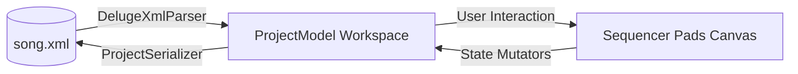
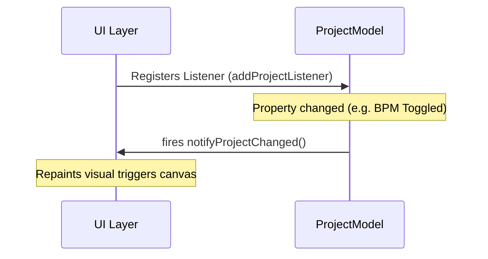

# Deluge Object Model Architecture

This document provides a structural overview of the Deluge project lifecycle spanning disk serialization, memory instantiation, and visual state synchronization.

---

## 1. The XML to Java State Machine Lifecycle

1. **DESERIALIZATION (Read Phase)**:
   - Invoking `DelugeXmlParser.parseSong()` ingests absolute nested configuration scopes (e.g., BPM ratios, transport key scales).
   - Traces child instruments elements parsing XML presets and sequence string lines encoded in contiguous hexadecimal matrix streams.
2. **LIVE OPERATIONS (Mutation Phase)**:
   - Grid timeline canvas renders pad timelines mapping node triggers corresponding back to the in-memory structure layer.
3. **SERIALIZATION (Write Phase)**:
   - `ProjectSerializer.save()` drives the structure conversion chain backwards assembling the XML DOM document tree from memory objects tree.

---

## 2. Memory Core Representation (Java Classes)

| Java Class | Representation Role | Bound Parameters Telemetry Scopes |
| :--- | :--- | :--- |
| **[ProjectModel](file:///usr/local/google/home/ludo/a/chuckjava/deluge/src/main/java/org/chuck/deluge/model/ProjectModel.java)** | Master root configuration file mapping node | Houses master compositions `BPM`, base scale `key` transposition bounds, and holds sequential pointer arrays to tracks. |
| **[TrackModel](file:///usr/local/google/home/ludo/a/chuckjava/deluge/src/main/java/org/chuck/deluge/model/TrackModel.java)** | Abstract base instrument layer chassis | Serves foundational pointers inheritance for hardware modules specialization setups tracks (`KitTrackModel`, `SynthTrackModel`). *Holds track playback configuration properties (e.g. `isMuted`).* |

| **[ClipModel](file:///usr/local/google/home/ludo/a/chuckjava/deluge/src/main/java/org/chuck/deluge/model/ClipModel.java)** | Isolated performance matrix sequence timeline lane | Houses 2D matrix grids table mapping individual trigger pads allocations map limits boundaries. |
| **[StepData](file:///usr/local/google/home/ludo/a/chuckjava/deluge/src/main/java/org/chuck/deluge/model/StepData.java)** | Basic discrete grid cell payload packet | Maps timeline node active triggers payloads parameter constants (`active`, `velocity`, `pitch`, `gate duration`, `probability`). |

---

## 3. Persistence & Storage Policies Boundaries

Persistence operates across twin scopes to prevent composition files from being tied to hardware environments:

- **Project Song file (`.xml`)**: Serializes musical attributes (Note sequences grids, sound parameters synth envelopes) using the `ProjectSerializer` layer.
- **Workspace Environment profile (`.json`)**: Serializes session states configurations (MIDI CC input mappings, visual graphics boundaries scopes) backed by the `PreferencesManager` repository.

## 4. Proposed Business Rule Methods (UI Operations)

To support safe interface interactions, the following operations boundaries are introduced:

### ClipModel Scope
- `public void clearNotes()`: Erases all step sequence programming.

### TrackModel Scope
- `public void moveClip(int fromIndex, int toIndex)`: Transposes clip segment positions protecting bounds.
- `public void setClipOrder(List<ClipModel> orderedClips)`: Applies custom sequence array overlays.
- `public void queueMute(boolean state)`: Schedules armed playback mutes waiting loop cycle crossovers.
- `public void setOneShot(boolean once)`: Activates single pass loop lifespan restrictions.

### KitTrackModel Scope
- `public void muteKitSound(int soundIndex, boolean state)`: Limits designated drum sample triggers processing lines.

### ProjectModel Scope
- `public void moveTrack(int fromIndex, int toIndex)`: Swaps instrument lane vertical priorities stacked timeline decks.
- `public void setMasterEffects(float volume, float reverbAmt, float delayAmt)`: Stores macro acoustics attributes globally.
- `public void configureSidechain(float threshold, float attack, float release)`: Adjusts global ducking pulse attenuator.
- `public void mapMidiControl(String parameterId, int ccCode)`: Binds physical knob telemetry paths safely.
- `public void setViewportScroll(int stepOffset)`: Updates timeline screen tracking cursor location anchor.
- `public void setPlayState(boolean playing)`: Toggles master sequence timeline progression.
- `public void setRecordingArmed(boolean armed)`: Activates playback note-insertion timelines capture.

## 5. Factory Constructors (The `NEW` Lifecycle)

To satisfy deployment of blank arrangement states, the model utilizes factory initializers:

## 6. Model-View Synchronization (Observer Pattern)

To ensure decoupled user interfaces (Swing or JavaFX) stay in sync with state changes (regardless of whether triggered via hardware, file updates, or secondary controllers), the Object Model employs event notification interfaces:

- **UI View Layer Subscriptions**: Graphical modules connect by passing delegate callbacks mapping telemetry updates instantly.

### 6.1 Model Events Inventory

| Event Type | Broadcaster Node | Trigger Source Action | Subscribed UI Listener Panel |
| :--- | :--- | :--- | :--- |
| **`ClipSequenceEvent`** | `ClipModel` | Sequence Step Toggles (`setStep`), clearing whole notes (`clearNotes`). | **`SwingGridPanel`**: Repaints sequential trigger matrices visually. |
| **`TrackStateEvent`** | `TrackModel` | Toggling mute states (`setMuted`), jumping active clip indexes. | **`SwingSongModePanel`**: Flips launch/mute color state representations. |
| **`SongStructureEvent`** | `ProjectModel` | Adding/Removing tracks, re-ordering rows timelines. | **`SwingDelugeApp`**: re-constructs operational sidebar explorer folders list. |
| **`GlobalMixerEvent`** | `ProjectModel` | Tempo updates (`setBpm`), volume variations slider pushes. | **Top Panel components**: Updates graphical indicators dials. |

## 7. Swing Implementation Mapping

| UI Functional Region | Component Role / Title | Class Reference |
| :--- | :--- | :--- |
| **Root Frame Window** | Master application workspace boundary hub container | **[SwingDelugeApp](file:///usr/local/google/home/ludo/a/chuckjava/deluge/src/main/java/org/chuck/deluge/ui/SwingDelugeApp.java)** |
| **Timeline Matrix Deck** | Main sequencer workspace pads panel Canvas | **[SwingGridPanel](file:///usr/local/google/home/ludo/a/chuckjava/deluge/src/main/java/org/chuck/deluge/ui/SwingGridPanel.java)** |
| **Arrangement Dashboard** | Consolidated composition tracks clip grid | **[SwingSongModePanel](file:///usr/local/google/home/ludo/a/chuckjava/deluge/src/main/java/org/chuck/deluge/ui/SwingSongModePanel.java)** |
| **Files Explorer Drawer** | Navigates resources loading presets schemas | **[SwingProjectSidebarPanel](file:///usr/local/google/home/ludo/a/chuckjava/deluge/src/main/java/org/chuck/deluge/ui/SwingProjectSidebarPanel.java)** |

### Functional Allocations (The `swing2` specification)

- **`Swing2DelugeApp`**: Top-Level Window. 
  - *State*: `private ProjectModel model`, `private CardLayout cardLayout`, `private Swing2GridPanel clipPanel`.
  - *Setup*: `setLayout(new BorderLayout())`, docks `Swing2ProjectSidebarPanel` (WEST), `Swing2SongModePanel` (CENTER).
- **`Swing2GridPanel`**: 11-Row by 18-Column Matrix sequencer.
  - *State*: `private JButton[][] pads`, `private ClipModel activeClip`.
  - *Setup*: Observes `ClipModel.ClipListener`. Redraws backgrounds cyan when active.
- **`Swing2SongModePanel`**: Clip Arrangement deck.
  - *State*: Listens to `ProjectModel.ProjectListener`.
  - *Setup*: Renders dynamic instrument panels, binds MUTE pads triggers.

### 7.1 UI Action to Model Event Mapping

| Swing UI Element | User Action | Fired Model API Method | Resulting Event Notification |
| :--- | :--- | :--- | :--- |
| **Sequencer Pad Grid (`SwingGridPanel`)** | Single Click on Step Pad | `ClipModel.setStep(r, s, StepData)` | **`ClipSequenceEvent`** |
| **Sequencer Pad Grid (`SwingGridPanel`)** | Shift + Click on Mute Column | `ClipModel.clearNotes()` | **`ClipSequenceEvent`** |
| **Arrangement Timeline (`SwingSongModePanel`)** | Single Click Clip Launch pad | `TrackModel.setActiveClipIndex(i)` | **`TrackStateEvent`** |
| **Arrangement Timeline (`SwingSongModePanel`)** | Single Click Mute pad (col 17) | `TrackModel.setMuted(boolean)` | **`TrackStateEvent`** |
| **Arrangement Timeline (`SwingSongModePanel`)** | Shift + Click Mute pad (col 17) | `TrackModel.queueMute(boolean)` | **`TrackStateEvent`** |
| **Transport Header Ribbon (`SwingDelugeApp`)** | Slider Drag on BPM controller | `ProjectModel.setBpm(float)` | **`GlobalMixerEvent`** |
| **Transport Header Ribbon (`SwingDelugeApp`)** | Tapping PLAY / STOP buttons | `ProjectModel.setPlayState(boolean)` | **`GlobalMixerEvent`** |
| **Transport Header Ribbon (`SwingDelugeApp`)** | Clicking Load XML / Save XML | `DelugeXmlParser.parseSong()` / `ProjectSerializer.save()` | **`SongStructureEvent`** |

