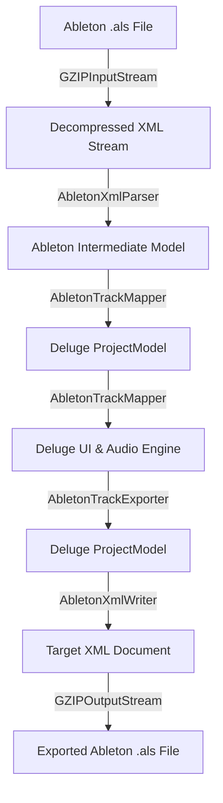
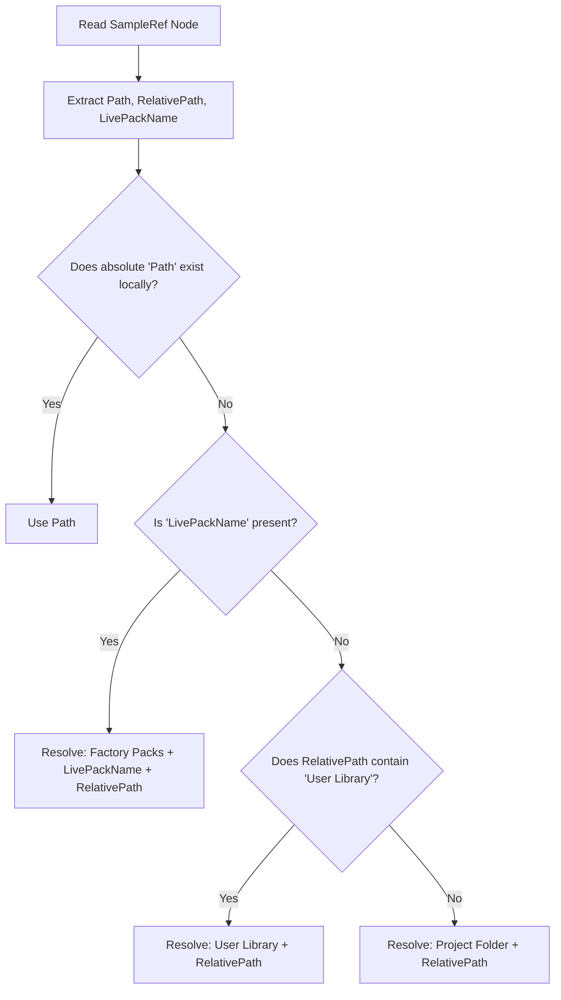
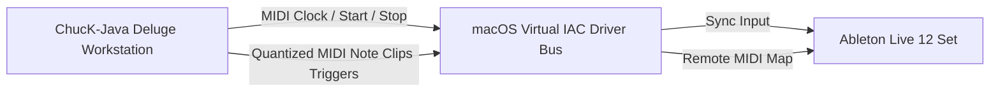

# Ableton Live Set (.als) Integration Blueprint

This document defines the software architecture, XML translation schemas, and asset resolution algorithms to import, export, and reuse Ableton Live Projects, Presets, and Library assets within the ChucK-Java Deluge Workstation.

---

## 1. High-Level Architecture

The integration layer bridges Ableton Live’s Gzip-compressed XML document model (`.als`) with the ChucK-Java Deluge data model (`ProjectModel`, `TrackModel`, `ClipModel`, `KitTrackModel`, `SynthTrackModel`).



---

## 2. File Handling & Decompression

Ableton Live Set (`.als`) files are standard XML documents compressed with the **Gzip** algorithm. The workstation will decompress and compress them on the fly using Java’s built-in stream wrappers:

```java
package org.chuck.deluge.ableton;

import java.io.*;
import java.util.zip.GZIPInputStream;
import java.util.zip.GZIPOutputStream;

public class AbletonProjectManager {
    
    /** Decompress an .als file into raw XML text. */
    public static String decompressAls(File alsFile) throws IOException {
        try (GZIPInputStream gis = new GZIPInputStream(new FileInputStream(alsFile));
             ByteArrayOutputStream baos = new ByteArrayOutputStream()) {
            byte[] buffer = new byte[8192];
            int len;
            while ((len = gis.read(buffer)) > 0) {
                baos.write(buffer, 0, len);
            }
            return baos.toString("UTF-8");
        }
    }

    /** Compress raw XML text into an .als file. */
    public static void compressAls(String xmlContent, File targetFile) throws IOException {
        try (GZIPOutputStream gos = new GZIPOutputStream(new FileOutputStream(targetFile))) {
            gos.write(xmlContent.getBytes("UTF-8"));
        }
    }
}
```

---

## 3. High-Fidelity Asset Path Resolver

Ableton projects store sample file paths inside `<SampleRef>` nodes, using relative paths and Live Pack associations to remain portable. The `AbletonAssetResolver` will dynamically resolve these paths on macOS:

### Default Ableton Directories on macOS:
*   **Factory Packs Directory**: `~/Music/Ableton/Factory Packs/` (or equivalent User Music folder)
*   **User Library Directory**: `~/Music/Ableton/User Library/`
*   **Core Library Directory**: `/Applications/Ableton Live.app/Contents/App-Resources/Core Library/` (dynamically resolved to the highest installed version, e.g. Ableton Live 12 Suite, Standard, Intro, etc.)

### Resolution Logic:


---

## 4. Track & Clip Translation Schema

The core translation maps XML nodes directly to ChucK-Java model components:

### 1. Track Mapping
*   **`<AudioTrack>`** $\rightarrow$ Maps to `AudioTrackModel` or audio sample tracks.
*   **`<MidiTrack>`** $\rightarrow$ Inspects the track’s `<DeviceChain>`.
    *   If the device chain contains a **`<DrumGroupDevice>`** (Drum Rack), it maps to a **`KitTrackModel`**.
    *   Otherwise, it maps to a **`SynthTrackModel`**.

### 2. MIDI Note & Step Translation
Ableton represents note events as absolute beat positions (as doubles) inside `<MidiNoteEvent>` nodes.

```xml
<KeyTrack Id="0">
    <Notes>
        <MidiNoteEvent Time="0" Duration="16.017" Velocity="95" NoteId="1" />
    </Notes>
    <MidiKey Value="60" /> <!-- MIDI Note 60 = Middle C -->
</KeyTrack>
```

#### Conversion Equations:
*   Let $T_{\text{beat}}$ be the Ableton note `Time` (start beat) and $D_{\text{beat}}$ be the `Duration` (length in beats).
*   Let $R$ be the grid resolution (e.g., $0.25$ beats per step for a 16th-note grid).
*   **Grid Column (Step Index)**:
    $$\text{Step Index} = \text{Math.round}\left(\frac{T_{\text{beat}}}{R}\right)$$
*   **Grid Note Duration (Steps)**:
    $$\text{Duration Steps} = \text{Math.round}\left(\frac{D_{\text{beat}}}{R}\right)$$
*   **Row Pitch Mapping**:
    *   For **`SynthTrackModel`**: The `MidiKey` value maps directly to the synthesizer oscillator pitch.
    *   For **`KitTrackModel`**: The `MidiKey` value maps to the corresponding drum slot (e.g. MIDI 36 = Kick, MIDI 38 = Snare).

---

## 5. Instrument Presets Translation

We map Ableton's built-in instruments to ChucK-Java’s high-fidelity audio engines:

### 1. Ableton Drum Racks (`<DrumGroupDevice>`)
*   **Structure**: Ableton stores Drum Racks as a collection of `<DrumBranch>` nodes, each containing a `<DrumCell>` (Drum Sampler) or `<OriginalSimpler>` (Simpler) device.
*   **Translation**:
    *   Each `<DrumBranch>` corresponds to one of the **16 drum kit rows** in `KitTrackModel`.
    *   We extract the sample path from the branch's `<UserSample>` node, resolve it using the `AbletonAssetResolver`, and load the wave sample into the ChucK-Java drum slot.
    *   This allows full playback of Ableton factory and user Drum Racks directly in the workstation!

### 2. Ableton Simpler & Sampler (`<OriginalSimpler>` / `<MultiSampler>`)
*   **Simpler**: We extract the single sample path and load it into the multi-voice JMem JNI sampler oscillator on a `SynthTrackModel`.
*   **Sampler**: We parse the keyzone mappings (`<MultiSampleMap>`) and load the respective sample zones into a multi-sampled ChucK oscillator.

### 3. Ableton Synthesizers (`<Operator>` / `<Analog>`)
*   If a track uses Ableton's Operator or Analog synth, we map their primary parameters:
    *   **Filter Cutoff** (`<FilterCutoff>`) $\rightarrow$ Track Filter Cutoff.
    *   **Resonance** (`<FilterResonance>`) $\rightarrow$ Track Filter Resonance.
    *   **Volume Envelope** (`<VolumeEnvelope>`) $\rightarrow$ Track Amplitude Envelope (ADSR).
    *   This preserves the basic tonal shape of the preset, falling back to a high-quality subtractive or FM voice.

---

## 6. Implementation Milestones

1.  **Milestone 1: File Decompressor & Gzip Stream Wrappers**
    *   Implement `AbletonProjectManager` for `.als` decompression/compression.
    *   Write tests to verify decompressing `opz.als` and `Sequencers Demo Set.als`.
2.  **Milestone 2: Asset Path Resolver**
    *   Implement `AbletonAssetResolver` to locate and load samples from the Factory Packs, Core Library, and User Library.
3.  **Milestone 3: MIDI Clip & Note Translator**
    *   Implement XML parser to extract tracks and clips.
    *   Convert note events (Time, Duration, MidiKey) into Deluge step matrices.
4.  **Milestone 4: Drum Rack Import (Kits & Samplers)**
    *   Parse `<DrumGroupDevice>` and load sample wavs into `KitTrackModel` slots.
5.  **Milestone 5: Exporting & Project Serialization**
    *   Build the XML writer to serialize Deluge `ProjectModel` back into a valid Ableton Live Set XML structure, gzip-compress it, and open it natively in Ableton Live!
6.  **Milestone 6: Real-Time Transport & Clip Session Sync**
    *   Implement virtual MIDI port clock transmission and clip trigger mapping to remote-control Ableton Live sets.

---

## 7. Real-Time Transport, Clip Playback & Session Recording Sync ("Hot Integration")

To bridge the performance gap between the Deluge's quantized loop workflow and Ableton Live’s Session View, the workstation provides a real-time JNI MIDI synchronization and control layer.



### 1. Low-Latency Transport & Tempo Synchronization
We utilize macOS's native **IAC Driver (Inter-Application Communication)** to establish a virtual MIDI port link:
*   **MIDI Clock Master**: The ChucK JNI audio engine transmits real-time **MIDI Clock (0xF8)** bytes at a rate of 24 PPQN (Parts Per Quarter Note) based on the active project BPM.
*   **System Real-Time Messages**: Clicking Play, Stop, or Pause transmits **Start (0xFA)**, **Stop (0xFC)**, and **Continue (0xFB)** bytes.
*   **Ableton Live Configuration**: In Ableton's Link/Tempo/MIDI preferences, the virtual IAC input port is configured with **`Sync = ON`**. When transport starts on the Deluge Workstation, Ableton's playhead immediately starts in sample-accurate, phase-locked synchronization.

### 2. Launch Quantization & Play Queueing Parity
The workstation’s internal clip launcher and its outgoing MIDI clip triggers strictly respect **Launch Quantization**:
*   **Quantization Grid**: Default is set to **`1 Bar`** (can be configured to 1/2, 1/4, etc.).
*   **Queuing State**: Clicking a pad to trigger a clip immediately places it in a **flashing "queued" state**.
*   **Downbeat Triggering**: The clip waits and launches exactly on the next downbeat bar boundary, aligning perfectly with Ableton's Global Launch Quantization.

### 3. Session Looping & Live Recording Sync
We map the Deluge's tactile recording workflow to Ableton's Session View, enabling seamless live-looping:
*   **Armed Looping**: Mapping a physical button or keyboard shortcut to Ableton's **Session Record** button.
*   **Quantized Live Recording**:
    1.  Clicking a blank clip slot pad on the Deluge workstation sends a MIDI Note trigger to Ableton.
    2.  Ableton arms the corresponding track and **starts recording a new clip on the next bar boundary** (respecting Launch Quantization).
    3.  Pressing the pad again **instantly stops recording and loops the clip on the next bar boundary**, creating a hands-free, tactile live-looping experience.
*   **Automatic Loop Length (Fixed Length)**: By leveraging Ableton's Clip parameters, the workstation can pre-define the recording length (e.g. 1 Bar, 2 Bars, 4 Bars) so it automatically stops recording and begins looping without needing a second press, mirroring the Deluge's "record-to-sequencer" workflow.
