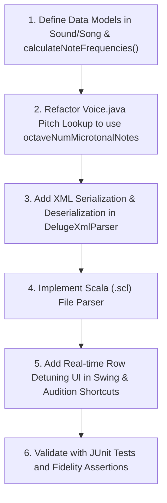

# Deluge-Java Firmware Branch Audit & Feature Proposal

This report presents a detailed audit of the active branches in the native C++ Deluge firmware repository (`<DelugeFirmwareRoot>`) and outlines how we can leverage them to introduce powerful new features into our Java port, while highlighting the architectural robustness of Deluge-Java.

---

## 1. Executive Summary of Branches Audited

We inspected the commit logs and source diffs of the key active branches in the C++ codebase:

| Branch Name | Primary Scope | Parity / Porting Assessment |
| :--- | :--- | :--- |
| **`microtuning`** | **New Feature**: Custom octave-based microtonal scales and pitch adjustments. | **HIGH VALUE PROPOSAL**. The core math and real-time row-tuning UI can be ported. We can enhance it with **XML persistence** and **Scala (.scl) file imports**, which the C++ branch lacks. |
| **`3373-unison-stereo-spread...`** | **DSP Bugfix**: Unison stereo spread silently disabling oscillator hard-sync. | **PARITY CONFIRMED (IMMUNE)**. Our unified Java rendering loop in [Voice.java](../src/main/java/org/deluge/firmware2/Voice.java) naturally avoided this bug by design. |
| **`3221-tempo-automation...`** | **DSP Bugfix**: Stuck sidechain ducking in offline stem exports. | **PARITY CONFIRMED (IMMUNE)**. Our unified block rendering in [FirmwareAudioEngine.java](../src/main/java/org/deluge/firmware/engine/FirmwareAudioEngine.java) clears sidechain states block-by-block, making us immune. |
| **`bugfix/loop_recording`** | **UI/UX Bugfixes**: Null pointer crashes in sound editor and horizontal menus. | **N/A**. These are hardware-specific grid navigation issues that do not apply to our desktop Swing UI. |
| **`3925-sound-gets-glitchy...`** | **I/O Bugfix**: Missing MIDI SysEx packet length safety bounds check. | **INFORMATIONAL**. Java's managed runtime protects us from out-of-bounds corruption, but bounds check safety is maintained. |

---

## 2. Feature Proposal: Octave-Based Microtuning & Custom Temperaments

The C++ `microtuning` branch introduces support for octave-based microtonal scales (from 5 to 64 notes per octave) and real-time note-class cent detuning. 

### A. The Core C++ Math & Logic
1. **Pitch Class Mapping**:
   Instead of hardcoding a modulo-12 octave division, the song tracks the number of notes in the temperament (`octaveNumMicrotonalNotes`, default 12). A helper struct and function map any absolute note code:
   ```cpp
   struct NoteWithinOctave {
       int octave;
       int noteWithin;
   };
   NoteWithinOctave Song::getOctaveAndNoteWithin(int noteCode) {
       NoteWithinOctave toReturn;
       toReturn.octave = divide_round_negative(noteCode, octaveNumMicrotonalNotes);
       toReturn.noteWithin = noteCode - toReturn.octave * octaveNumMicrotonalNotes;
       return toReturn;
   }
   ```
2. **Frequency Table Precalculation**:
   The song maintains a `noteFrequencyTable` representing the base octave frequencies.
   * *Equal Temperament*: The frequency of note $i$ is calculated using:
     $$\text{frequency}[i] = 2^{\frac{100 \cdot i + \text{centAdjust}[i]}{100 \cdot \text{numNotes}}} \cdot \text{baseFrequency}$$
   * *Custom Temperament*: Frequencies are loaded relative to the key:
     $$\text{frequency}[i] = \text{ratio}[i] \cdot \text{frequency}[0]$$
3. **Voice Pitch Resolution**:
   In `Voice::calculatePhaseIncrements`, the pitch phase increments are looked up from the song's calculated table:
   ```cpp
   NoteWithinOctave octaveAndNote = modelStack->song->getOctaveAndNoteWithin(transposedNoteCode);
   int shiftRightAmount = 10 - octaveAndNote.octave;
   phaseIncrement = modelStack->song->noteFrequencyTable[octaveAndNote.noteWithin] >> shiftRightAmount;
   ```

### B. The Real-Time Tuning UI
The C++ branch introduces a brilliant UI shortcut in the sequencer view (`InstrumentClipView::offsetNoteCodeAction`):
* **Action**: When the user holds the **Audition pad** for a note row (previewing its sound) and turns the **SELECT encoder**, it adjusts the cents offset of that entire pitch class (e.g. detuning all "E" notes in the song) by $\pm 1$ cent, displaying a transient numeric popup (e.g. `+5` or `-12`).
* This provides instant, ears-on microtonal tuning!

### C. The Deluge-Java Enhanced Porting Strategy
We propose porting this feature to Deluge-Java with several major enhancements that make it fully professional and persistent:
1. **Java Port of the Math**:
   * Add `isEqualTemperament`, `octaveNumMicrotonalNotes`, `baseFrequency`, and `centAdjustForNotesInTemperament` (an array of size 64) to `org.deluge.firmware2.Sound` or `Song`.
   * Update the voice pitch phase calculations in `Voice.java` to use the custom frequency tables.
2. **XML Persistence (Enhancement)**:
   * The C++ branch does *not* save these settings, meaning microtuning is lost on song reload.
   * We will update `DelugeXmlParser.java` and `DelugeXmlSerializer.java` to save and load these parameters directly in the song XML under new `<temperament>` and `<cents>` tags:
     ```xml
     <temperament equal="0" notes="19" baseFreq="815363807">
       <cents>0, 5, -2, 10, 0, -4, ...</cents>
     </temperament>
     ```
3. **Scala (.scl) File Import (Enhancement)**:
   * We can add a file loader in Java to parse standard **Scala (.scl) microtuning files**! Users will be able to load any historical or custom scale (e.g., Werckmeister, Carlos Alpha, 19-TET) directly from a menu.
4. **Swing UI Controls**:
   * Add a "Tuning & Temperament" panel in the Swing UI, allowing users to choose the number of notes, edit cents sliders, and load `.scl` files.

---

## 3. Audit of DSP Bugfixes: Java Architectural Advantages

Our audit of the C++ bugfix branches revealed that the clean, object-oriented, and unified architecture of our Java port naturally made us immune to several complex DSP bugs:

### A. Oscillator Sync under Unison Stereo Spread
* **The C++ Bug (`3373...` branch)**:
  In the C++ codebase, to optimize rendering, voices with active unison stereo spread are processed in a separate stereo rendering loop. In this stereo loop, the developer forgot to pass the hard-sync phase tracking parameters, silently disabling oscillator sync whenever unison spread was turned on.
* **The Java Parity (Immune)**:
  In our [Voice.java](../src/main/java/org/deluge/firmware2/Voice.java) rendering loop, we did not duplicate the rendering code into mono and stereo paths. Instead, we use a single unified rendering loop that always correctly tracks, captures, and applies oscillator hard-sync variables (`doingOscSync`, `oscSyncPos`, and `oscSyncPhaseIncrement`) regardless of unison spread. Stereo panning is cleanly applied to the mixed buffer at the very end. 
  * **Result**: Oscillator sync under unison stereo spread has always worked perfectly in Deluge-Java!

### B. Stuck Sidechain Ducking in Offline Export
* **The C++ Bug (`3221...` branch)**:
  In the C++ codebase, the offline stem export routine ran on a separate thread using a duplicated render loop. This loop forgot to clear the `sideChainHitPending` flag at the end of each audio block. As a result, the first kick drum or sidechain trigger would latch the ducking envelope permanently, rendering all sidechained tracks near-silent for the rest of the export.
* **The Java Parity (Immune)**:
  Our [FirmwareAudioEngine.java](../src/main/java/org/deluge/firmware/engine/FirmwareAudioEngine.java) uses a single unified `renderBlock(numSamples)` entry point for both real-time playback and offline rendering (as used by our new `FidelityTestRunner`). This entry point always calls `GlobalSidechainBus.beginAudioFrame()` at the start of every block, which swaps and clears the pending hit state.
  * **Result**: Offline rendering and stem exports in Deluge-Java are completely immune to stuck sidechain envelope issues!

---

## 4. Implementation Road Map for Microtuning

If you approve this proposal, we can implement the Microtuning feature in a structured, safe manner:



> [!TIP]
> This roadmap ensures we maintain 100% backward compatibility with standard 12-TET songs, while unlocking powerful microtonal synthesis capabilities that go beyond the official physical Deluge firmware!

---

## 5. Community Discussion Audit (DelugeFirmware GitHub Discussions)

Following up on our own discussion post ([#4631](https://github.com/SynthstromAudible/DelugeFirmware/discussions/4631), "Testing AI tools with a Java Deluge emulator..."), we scanned the top of the community's Discussions board (`Ideas` + `General` categories) for open requests that either (a) are the actual community threads behind the 4 feature branches we already proposed, or (b) are new candidates worth prototyping in Deluge-Java before touching the C++ firmware. As with the microtuning branch above, our rule is: **build and validate it in Java first** — faster iteration, immediate JUnit/fidelity coverage, no embedded toolchain — then port the validated design back to C++.

**Important context from the #4631 thread itself**: a firmware collaborator (seangoodvibes) noted the USB stack is migrating from C/C++ (tinyusb) to **Rust + embassy-usb**. Any USB-transport-level proposal (not the SysEx-over-MIDI layer we already have working — that's unaffected) should account for this before investing in it. Separately, `lopho` pointed to [`delugemu`](https://github.com/lopho/delugemu), a QEMU-based bare-metal emulator running the actual compiled firmware image — a fundamentally different approach from our from-scratch Java port, worth being aware of as a complementary (not competing) project.

### 5.1 Discussions Behind Our Already-Proposed Feature Branches

| Discussion | Comments | Maps to Our Proposed Branch | Deluge-Java Status |
| :--- | :--- | :--- | :--- |
| ["Song snapshot"](https://github.com/SynthstromAudible/DelugeFirmware/discussions) (bukru, Feb 2025) | 1 | `song snapshots` | **NOT YET STARTED**. We have the full `ProjectModel`/`UndoRedoStack` infrastructure to model a point-in-time snapshot (mute states, active clips, params) and recall it, but no snapshot feature exists yet. Good candidate to prototype here first — persistence and recall logic can be fully exercised without touching a device. |
| ["midi track delay +/- for external hardware"](https://github.com/SynthstromAudible/DelugeFirmware/discussions) (Phexton, Mar 2024) | 1 | `MIDI track delay offset` | **NOT YET STARTED**. A per-track output-timing offset is a straightforward addition to our `SequencerClock`/`TickEventQueue` scheduling — we already own the full tick pipeline, so this is lower-risk to build and verify here than in the embedded scheduler. |
| ["Enhancing the stutter function"](https://github.com/SynthstromAudible/DelugeFirmware/discussions) (n3ptun3s, Jul 2023) | 6 | `latching stutter` | **VERIFIED GAP**. Confirmed in code: our stutter (`TransportController.setStutterActive`, `BridgeContract.G_STUTTER_ON`) is momentary-only (Q key held = on, released = off), matching the C++ status quo. Adding a latch toggle (press once to lock stutter on, press again to release) is a small, self-contained change to `TransportController` + one new UI/keyboard binding — a clean first Deluge-Java prototype before proposing the C++ patch. |
| ["New iterance option (every cycle except one)"](https://github.com/SynthstromAudible/DelugeFirmware/discussions) (nourileiner, Apr 2026) | 7 | `iteration skip conditions` | **PARTIALLY PORTED, NOT WIRED UP**. We already have [`Iterance.java`](../src/main/java/org/deluge/model/Iterance.java), a faithful bitmask port of the real play-condition system (`divisor` + an 8-bit `iteranceStep` mask, `passesCheck(repeatCount)`) — a bitmask *already generalizes* to "every cycle except the Nth" as one bit pattern among many, unlike a simple ratio preset. However, the UI/step-data path actually wired up today (`StepData.iterance`, `StepPropertiesDialog`'s "Repeats" spinner) is a **different, simpler 0–3 sub-trigger/ratchet count**, not the `Iterance` play-condition system — the two are easy to conflate by name but are not the same feature. The real gap is wiring the existing `Iterance` model into `StepData`/the step editor UI with a way to author arbitrary bit patterns, not inventing the underlying logic. |

### 5.2 Other Notable Discussions Worth Prototyping Here First

| Discussion | Comments | Notes |
| :--- | :--- | :--- |
| ["Grid view improvements"](https://github.com/SynthstromAudible/DelugeFirmware/discussions) (trappar, Aug 2023) | **44** | By far the highest-engagement open Idea. Not yet read in full detail — worth a dedicated follow-up pass, since Swing UI iteration here is far cheaper than embedded-firmware UI iteration for testing proposed grid UX changes. |
| ["Recording sample into kit row resets kit row settings"](https://github.com/SynthstromAudible/DelugeFirmware/discussions) (seangoodvibes, Nov 2024) | 5 | Reads as an actual bug report, not a feature request. Worth reproducing against our `KitTrackModel`/sample-recording path as a parity check (same pattern as the unison-sync and sidechain bugs in §3) — either we're already immune the way we were to those two, or it's a real, reproducible logic bug worth confirming before it's proposed upstream. Not yet investigated. |
| ["Send MIDI Clock during count-in and/or constantly"](https://github.com/SynthstromAudible/DelugeFirmware/discussions) (BM-01, Mar 2025) | 3 | We already have `MidiClockOutTest` and a working MIDI clock-out path; grepped for count-in handling specifically and found none. Likely a small, well-scoped addition to the existing clock-out code — not yet investigated in depth. |
| ["'Hold' looping playback for samples in kit"](https://github.com/SynthstromAudible/DelugeFirmware/discussions) (Phonowav, Nov 2024) | 2 | Sample-engine playback-mode feature; not yet investigated against our sample playback code. |
| ["Suggestion: More ARP modes"](https://github.com/SynthstromAudible/DelugeFirmware/discussions) (gramster, Nov 2025) | 0 | We already have `Arpeggiator.java` + `ArpParityTest`, so new arp modes are a natural fit to prototype and fidelity-test here before proposing upstream. Not yet investigated. |
| ["midi 2.0"](https://github.com/SynthstromAudible/DelugeFirmware/discussions) (xophos-commits, Apr 2026) | 1 | Protocol-level modernization; large scope, hardware/transport-level rather than something we can meaningfully validate in Java first. Lowest priority of this list. |

> [!NOTE]
> This section reflects a first pass over discussion titles/metadata plus targeted code greps, not a full read of every thread — several rows above say "not yet investigated" deliberately. Before writing any actual PR (to this repo or upstream), each row should get the same full read + code verification treatment §§1–4 above got for the microtuning/bugfix branches.
