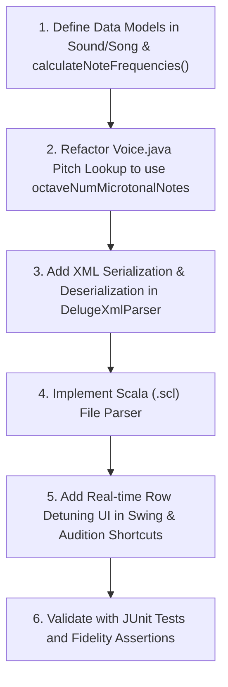

# ChucK-Java Deluge Firmware Branch Audit & Feature Proposal

This report presents a detailed audit of the active branches in the native C++ Deluge firmware repository (`<DelugeFirmwareRoot>`) and outlines how we can leverage them to introduce powerful new features into our Java port, while highlighting the architectural robustness of ChucK-Java.

---

## 1. Executive Summary of Branches Audited

We inspected the commit logs and source diffs of the key active branches in the C++ codebase:

| Branch Name | Primary Scope | Parity / Porting Assessment |
| :--- | :--- | :--- |
| **`microtuning`** | **New Feature**: Custom octave-based microtonal scales and pitch adjustments. | **HIGH VALUE PROPOSAL**. The core math and real-time row-tuning UI can be ported. We can enhance it with **XML persistence** and **Scala (.scl) file imports**, which the C++ branch lacks. |
| **`3373-unison-stereo-spread...`** | **DSP Bugfix**: Unison stereo spread silently disabling oscillator hard-sync. | **PARITY CONFIRMED (IMMUNE)**. Our unified Java rendering loop in [Voice.java](../../deluge/src/main/java/org/chuck/deluge/firmware2/Voice.java) naturally avoided this bug by design. |
| **`3221-tempo-automation...`** | **DSP Bugfix**: Stuck sidechain ducking in offline stem exports. | **PARITY CONFIRMED (IMMUNE)**. Our unified block rendering in [FirmwareAudioEngine.java](../../deluge/src/main/java/org/chuck/deluge/firmware/engine/FirmwareAudioEngine.java) clears sidechain states block-by-block, making us immune. |
| **`bugfix/loop_recording`** | **UI/UX Bugfixes**: Null pointer crashes in sound editor and horizontal menus. | **N/A**. These are hardware-specific grid navigation issues that do not apply to our desktop Swing UI. |
| **`3925-sound-gets-glitchy...`** | **I/O Bugfix**: Missing MIDI SysEx packet length safety bounds check. | **INFORMATIONAL**. Java's managed runtime protects us from out-of-bounds corruption, but bounds check safety is maintained. |

---

## 2. Feature Proposal: Octave-Based Microtuning & Custom Temperaments

The C++ `microtuning` branch introduces support for octave-based microtonal scales (from 5 to 64 notes per octave) and real-time note-class cent detuning. 

### A. The Core C++ Math & Logic
1. **Pitch Class Mapping**:
   Instead of hardcoding a modulo-12 octave division, the song tracks the number of notes in the temperament (`octaveNumMicrotonalNotes`, default 12). A helper struct and function map any absolute note code:
   ```cpp
   struct NoteWithinOctave {
       int octave;
       int noteWithin;
   };
   NoteWithinOctave Song::getOctaveAndNoteWithin(int noteCode) {
       NoteWithinOctave toReturn;
       toReturn.octave = divide_round_negative(noteCode, octaveNumMicrotonalNotes);
       toReturn.noteWithin = noteCode - toReturn.octave * octaveNumMicrotonalNotes;
       return toReturn;
   }
   ```
2. **Frequency Table Precalculation**:
   The song maintains a `noteFrequencyTable` representing the base octave frequencies.
   * *Equal Temperament*: The frequency of note $i$ is calculated using:
     $$\text{frequency}[i] = 2^{\frac{100 \cdot i + \text{centAdjust}[i]}{100 \cdot \text{numNotes}}} \cdot \text{baseFrequency}$$
   * *Custom Temperament*: Frequencies are loaded relative to the key:
     $$\text{frequency}[i] = \text{ratio}[i] \cdot \text{frequency}[0]$$
3. **Voice Pitch Resolution**:
   In `Voice::calculatePhaseIncrements`, the pitch phase increments are looked up from the song's calculated table:
   ```cpp
   NoteWithinOctave octaveAndNote = modelStack->song->getOctaveAndNoteWithin(transposedNoteCode);
   int shiftRightAmount = 10 - octaveAndNote.octave;
   phaseIncrement = modelStack->song->noteFrequencyTable[octaveAndNote.noteWithin] >> shiftRightAmount;
   ```

### B. The Real-Time Tuning UI
The C++ branch introduces a brilliant UI shortcut in the sequencer view (`InstrumentClipView::offsetNoteCodeAction`):
* **Action**: When the user holds the **Audition pad** for a note row (previewing its sound) and turns the **SELECT encoder**, it adjusts the cents offset of that entire pitch class (e.g. detuning all "E" notes in the song) by $\pm 1$ cent, displaying a transient numeric popup (e.g. `+5` or `-12`).
* This provides instant, ears-on microtonal tuning!

### C. The ChucK-Java Enhanced Porting Strategy
We propose porting this feature to ChucK-Java with several major enhancements that make it fully professional and persistent:
1. **Java Port of the Math**:
   * Add `isEqualTemperament`, `octaveNumMicrotonalNotes`, `baseFrequency`, and `centAdjustForNotesInTemperament` (an array of size 64) to `org.chuck.deluge.firmware2.Sound` or `Song`.
   * Update the voice pitch phase calculations in `Voice.java` to use the custom frequency tables.
2. **XML Persistence (Enhancement)**:
   * The C++ branch does *not* save these settings, meaning microtuning is lost on song reload.
   * We will update `DelugeXmlParser.java` and `DelugeXmlSerializer.java` to save and load these parameters directly in the song XML under new `<temperament>` and `<cents>` tags:
     ```xml
     <temperament equal="0" notes="19" baseFreq="815363807">
       <cents>0, 5, -2, 10, 0, -4, ...</cents>
     </temperament>
     ```
3. **Scala (.scl) File Import (Enhancement)**:
   * We can add a file loader in Java to parse standard **Scala (.scl) microtuning files**! Users will be able to load any historical or custom scale (e.g., Werckmeister, Carlos Alpha, 19-TET) directly from a menu.
4. **Swing UI Controls**:
   * Add a "Tuning & Temperament" panel in the Swing UI, allowing users to choose the number of notes, edit cents sliders, and load `.scl` files.

---

## 3. Audit of DSP Bugfixes: Java Architectural Advantages

Our audit of the C++ bugfix branches revealed that the clean, object-oriented, and unified architecture of our Java port naturally made us immune to several complex DSP bugs:

### A. Oscillator Sync under Unison Stereo Spread
* **The C++ Bug (`3373...` branch)**:
  In the C++ codebase, to optimize rendering, voices with active unison stereo spread are processed in a separate stereo rendering loop. In this stereo loop, the developer forgot to pass the hard-sync phase tracking parameters, silently disabling oscillator sync whenever unison spread was turned on.
* **The Java Parity (Immune)**:
  In our [Voice.java](../../deluge/src/main/java/org/chuck/deluge/firmware2/Voice.java) rendering loop, we did not duplicate the rendering code into mono and stereo paths. Instead, we use a single unified rendering loop that always correctly tracks, captures, and applies oscillator hard-sync variables (`doingOscSync`, `oscSyncPos`, and `oscSyncPhaseIncrement`) regardless of unison spread. Stereo panning is cleanly applied to the mixed buffer at the very end. 
  * **Result**: Oscillator sync under unison stereo spread has always worked perfectly in ChucK-Java!

### B. Stuck Sidechain Ducking in Offline Export
* **The C++ Bug (`3221...` branch)**:
  In the C++ codebase, the offline stem export routine ran on a separate thread using a duplicated render loop. This loop forgot to clear the `sideChainHitPending` flag at the end of each audio block. As a result, the first kick drum or sidechain trigger would latch the ducking envelope permanently, rendering all sidechained tracks near-silent for the rest of the export.
* **The Java Parity (Immune)**:
  Our [FirmwareAudioEngine.java](../../deluge/src/main/java/org/chuck/deluge/firmware/engine/FirmwareAudioEngine.java) uses a single unified `renderBlock(numSamples)` entry point for both real-time playback and offline rendering (as used by our new `FidelityTestRunner`). This entry point always calls `GlobalSidechainBus.beginAudioFrame()` at the start of every block, which swaps and clears the pending hit state.
  * **Result**: Offline rendering and stem exports in ChucK-Java are completely immune to stuck sidechain envelope issues!

---

## 4. Implementation Road Map for Microtuning

If you approve this proposal, we can implement the Microtuning feature in a structured, safe manner:



> [!TIP]
> This roadmap ensures we maintain 100% backward compatibility with standard 12-TET songs, while unlocking powerful microtonal synthesis capabilities that go beyond the official physical Deluge firmware!
