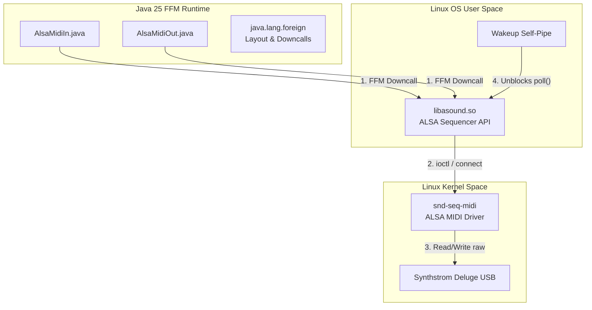

# Deluge-Java: Linux MIDI & ALSA Driver Architectural Integration Guide

This document details the low-level architectural integration, native system configurations, and kernel-level fixes required to run the Deluge-Java pro-audio workstation stably under **Linux** using the pure Java **Foreign Function & Memory (FFM) API** (Project Panama) binding to **RtMidi** via [rtmidijava](https://github.com/ludoch/rtmidijava).



---

## 1. Core Architectural Pillars of `rtmidijava` on Linux

Deluge-Java utilizes the modern **Java 25 Foreign Function & Memory (FFM) API** to bind directly to the native ALSA library (`libasound.so`). This replaces high-overhead JNI wrappers with zero-dependency, type-safe native memory calls.

### 1.1. Zero-GC High-Performance Fast Path
Traditional Java MIDI libraries allocate heap objects (e.g. `byte[]` and timestamp wrappers) for every incoming MIDI event. Under rapid MIDI streams (like the Deluge's 60 FPS OLED frames or 14-bit pitch bend sweeps), this floods the JVM garbage collector, introducing micro-stutters and audio dropouts on the real-time DSP thread.
*   **The FFM Solution**: `rtmidijava` utilizes Java's `MemorySegment` and `FastCallback` interfaces. Incoming MIDI event structures are read and processed **directly in native memory off-heap**. 
*   **Zero Heap Allocation**: No Java objects are created during packet parsing, keeping the critical audio thread 100% free of garbage collection pauses!

### 1.2. Real-Time Thread Scheduling (`SCHED_RR`)
To prevent the OS from pre-empting the MIDI reader thread during heavy CPU usage, the driver elevates the thread priority to real-time round-robin scheduling (`SCHED_RR` priority 99).
*   **Implementation**: FFM makes a downcall to the native POSIX function:
    ```c
    pthread_setschedparam(pthread_self(), SCHED_RR, &param);
    ```
*   **Privilege Requirement**: Elevating thread priority requires the `CAP_SYS_NICE` capability or root/sudo privileges on Linux. If the user lacks these capabilities, **the driver fails silently and falls back gracefully to standard scheduling**, printing a warning without crashing.

### 1.3. ALSA Shutdown Wakeup Self-Pipe
Background MIDI reader threads block on native ALSA `poll()` or `snd_seq_event_input()` system calls waiting for hardware events. During application shutdown, if no MIDI events are arriving, the thread remains blocked in native code, causing the JVM to hang or fail to terminate cleanly.
*   **The Solution**: The ALSA driver implements a **POSIX self-pipe wakeup mechanism**. During shutdown, the main Java thread writes a byte to a native pipe descriptor. The background reader's `poll()` call is configured to monitor both the ALSA sequencer file descriptor and this pipe. The write immediately wakes up the polling thread, allowing it to clean up native resources and exit gracefully!

---

## 2. Low-Level Kernel & FFM Fixes in Version 1.0.4

Version **`1.0.4`** resolved four critical bugs that previously prevented MIDI from functioning reliably on Linux.

### 2.1. Input Subscription Direction Fix (`snd_seq_connect_from`)
*   **Class**: [AlsaMidiIn.java](../../deluge/src/main/java/org/rtmidijava/linux/AlsaMidiIn.java#L73-L81)
*   **The Bug**: The input port subscribed to incoming hardware events using `snd_seq_connect_to`. In ALSA, `connect_to` is for output routing (connecting a write port to an external destination). 
*   **The Fix**: Switched to `snd_seq_connect_from(seqHandle, vPort, src.client, src.port)`. This correctly establishes the read subscription, routing events from the external hardware transmitter to the Java client's read port. Previously, **absolutely zero MIDI input events were received on Linux.**

### 2.2. Packed C Struct Alignment Crash (`withByteAlignment(4)`)
*   **Classes**: [AlsaMidiIn.java](../../org/rtmidijava/linux/AlsaMidiIn.java#L101-L103) and [AlsaMidiOut.java](../../org/rtmidijava/linux/AlsaMidiOut.java#L161-L163)
*   **The Bug**: The ALSA sequencer event structure `snd_seq_event_t` is a packed C struct of exactly 28 bytes. The pointer field `data.ext.ptr` (which holds the address of a SysEx payload) sits at a **4-byte aligned offset** within the struct. However, the JVM's default FFM `ValueLayout.ADDRESS` layout enforces strict **8-byte byte alignment** (the native pointer size of 64-bit systems). Attempting to read or write the 4-aligned pointer with an 8-aligned layout caused the JVM to throw an `IllegalArgumentException`, crashing the MIDI event loop!
*   **The Fix**: Overrode the pointer alignment constraint:
    ```java
    ValueLayout.ADDRESS.withByteAlignment(4)
    ```
    This allows the FFM API to read and write the 4-aligned pointer safely, eliminating the alignment validation crash.

### 2.3. SysEx Variable-Length Event Flag (`SND_SEQ_EVENT_LENGTH_VARIABLE`)
*   **Class**: [AlsaMidiOut.java](../../org/rtmidijava/linux/AlsaMidiOut.java#L156-L159)
*   **The Bug**: When sending a SysEx event, it was marked as type `SND_SEQ_EVENT_SYSEX`, but the event flags were left blank. In ALSA, variable-length events (such as SysEx payloads) **must** explicitly set the flag `SND_SEQ_EVENT_LENGTH_VARIABLE` in the `flags` field. Without this, `snd_seq_event_output_direct()` fails kernel-level validation and returns `-EINVAL` (`-22`), silently dropping the SysEx message.
*   **The Fix**: Declared the length flags and set them during SysEx compilation:
    ```java
    eventTemplate.set(ValueLayout.JAVA_BYTE, flagsOffset, SND_SEQ_EVENT_LENGTH_VARIABLE);
    ```

### 2.4. Robust SysEx Fragment Resync & Buffer Guard
*   **Class**: [AlsaMidiIn.java](../../org/rtmidijava/linux/AlsaMidiIn.java#L108-L120)
*   **The Bug**: Under heavy MIDI traffic (like 60 FPS OLED streaming), input buffer overruns can cause ALSA to drop packets. If a new SysEx message begins (starting with `0xF0`) while the receiver is still holding a partial, uncompleted SysEx message, splicing them together would corrupt both messages.
*   **The Fix**:
    *   **Resync**: Added a check—if `sysexOffset != 0` and the incoming chunk's first byte is `0xF0` (start of a new SysEx), the receiver automatically discards the orphaned partial by resetting `sysexOffset = 0`.
    *   **Bounds Guard**: Added an explicit size check against the native accumulator buffer size to prevent buffer overflow from a corrupted, runaway stream.

---

## 3. Linux Deployment & System Configuration Guidelines

To run the Deluge-Java workstation with native MIDI support stably on Linux, ensure your system is configured according to the following guidelines.

### 3.1. Install ALSA Sequencer Libraries
Ensure that the ALSA development headers and shared libraries are installed on your system:
```bash
# Debian/Ubuntu
sudo apt-get install libasound2-dev

# Fedora/RHEL
sudo dnf install alsa-lib-devel
```

### 3.2. Enable Real-Time Thread Capabilities (`CAP_SYS_NICE`)
To allow `rtmidijava` to elevate the MIDI thread priority to real-time (`SCHED_RR` 99) without running the entire JVM as root (highly discouraged for security), grant the Java binary the `CAP_SYS_NICE` capability:
```bash
sudo setcap cap_sys_nice=eip /path/to/graalvm-jdk-25/bin/java
```

### 3.3. JVM Runtime Flags
Because this workstation utilizes the Foreign Function & Memory API and JVM preview features, you **must** run the application with the following command-line flags:
```bash
java --enable-preview --enable-native-access=ALL-UNNAMED -jar chuck-ide.jar
```
*   `--enable-preview`: Activates Java 25 preview features (virtual threads, FFM enhancements).
*   `--enable-native-access=ALL-UNNAMED`: Permits the FFM API to perform native downcalls to `libasound.so` and access off-heap memory.
