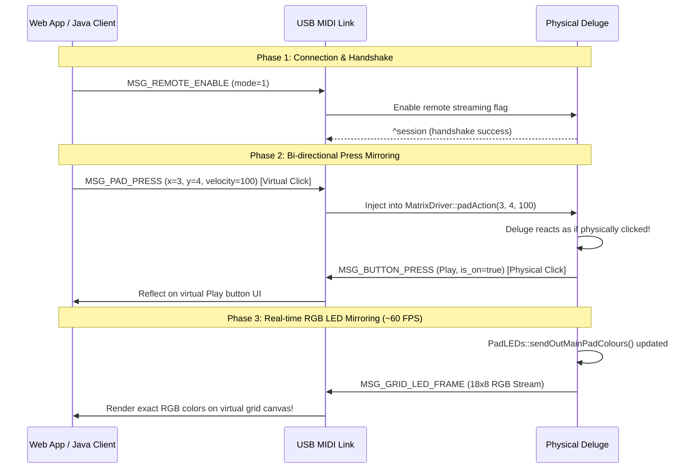

# deluge-extensions: Bi-directional Remote Control & Grid Mirroring Blueprint

This document details the architectural design and implementation specification to establish a complete, real-time, bi-directional remote control and pad grid mirroring system between the physical Synthstrom Deluge hardware and host clients (Web Application / Java Workstation) over USB MIDI SysEx.



---

## 1. MIDI SysEx Protocol Specification

We will introduce a new set of command IDs in the Synthstrom SysEx namespace. The standard Synthstrom SysEx header is:
`[0xF0, 0x00, 0x21, 0x7B, 0x01, <DeviceID>, <CommandID>, ... payload ..., 0xF7]`

We will dedicate **Command ID `0x50`** to **Human Interface Device (HID) Remote Control**.

### 1.1. Host to Deluge: Remote Control Enable (`0x01`)
Turns remote control streaming on or off in the firmware.
*   **Payload**: `[0x01, <State>]`
    *   `<State>`: `0x00` (Disable), `0x01` (Enable)

### 1.2. Bi-directional: Button Event (`0x02`)
Sent by Deluge when a physical button changes state, or sent by Host to inject a virtual button press.
*   **Payload**: `[0x02, <ButtonID>, <State>]`
    *   `<ButtonID>`: 8-bit index mapping to `deluge::hid::button::KnownButtons` (e.g., Play, Record, Shift, Load, Save, etc.).
    *   `<State>`: `0x00` (Released / Off), `0x7F` (Pressed / On).

### 1.3. Bi-directional: Pad Grid Event (`0x03`)
Sent by Deluge when a physical grid pad changes state, or sent by Host to inject a virtual pad press.
*   **Payload**: `[0x03, <X>, <Y>, <Velocity>]`
    *   `<X>`: Column index (`0` to `17` - includes left/right sidebars).
    *   `<Y>`: Row index (`0` to `7`).
    *   `<Velocity>`: `0x00` (Released), `0x01` to `0x7F` (Strike velocity).

### 1.4. Deluge to Host: RGB LED Grid Frame (`0x04`)
Broadcast by the Deluge whenever its pad LEDs update, streaming the exact colors to render on the virtual grid.
*   Since $18 \text{ columns} \times 8 \text{ rows} \times 3 \text{ bytes (RGB)} = 432 \text{ bytes}$ of raw data, we can pack this efficiently:
    *   **Option A (Raw 7-bit packing)**: Pack 432 bytes of 8-bit RGB data into 494 bytes of 7-bit MIDI bytes using `pack_8bit_to_7bit` (takes ~0.5ms transmission time).
    *   **Option B (Delta Run-Length-Encoding)**: Only send pads that changed color since the last frame, matching the OLED delta compression in `HIDSysex::sendOLEDDataDelta`.
*   **Payload (Raw 7-bit)**: `[0x04, ... packed_rgb_payload ...]`

---

## 2. Deluge Firmware (C++) Implementation Plan

All native firmware modifications are designed to be surgical, high-performance, and completely safe for the real-time DSP audio threads.

### 2.1. Enable/Disable Hook
In `hid_sysex.cpp`, we add a case in the dispatcher to toggle a global flag:
```cpp
bool remoteControlStreamingActive = false;

// Inside HIDSysex::sysexReceived
case 3: // remote control control
    remoteControlStreamingActive = (data[2] == 1);
    break;
```

### 2.2. Button Streaming & Injection
1.  **Streaming Out**: In `buttons.cpp` -> `buttonAction`:
    ```cpp
    ActionResult buttonAction(deluge::hid::Button b, bool on, bool inCardRoutine) {
        // ... state updates ...
        
        if (remoteControlStreamingActive) {
            sendButtonEventSysEx(b, on);
        }
        
        // ... dispatch to UI ...
    }
    ```
2.  **Injection In**: In `hid_sysex.cpp`, when receiving a virtual button event SysEx:
    ```cpp
    void HIDSysex::injectButton(uint8_t buttonId, bool on) {
        Buttons::buttonAction(static_cast<deluge::hid::Button>(buttonId), on, false);
    }
    ```

### 2.3. Pad Streaming & Injection
1.  **Streaming Out**: In `matrix_driver.cpp` -> `padAction`:
    ```cpp
    ActionResult MatrixDriver::padAction(int32_t x, int32_t y, int32_t velocity) {
        // ... state updates ...
        
        if (remoteControlStreamingActive) {
            sendPadEventSysEx(x, y, velocity);
        }
        
        // ... dispatch to UI ...
    }
    ```
2.  **Injection In**: In `hid_sysex.cpp`, when receiving a virtual pad event SysEx:
    ```cpp
    void HIDSysex::injectPad(uint8_t x, uint8_t y, uint8_t velocity) {
        matrixDriver.padAction(x, y, velocity);
    }
    ```

### 2.4. Pad LED Frame Buffer Streaming
In `pad_leds.cpp` -> `sendOutMainPadColours()`, which writes the calculated frame buffer to the physical SPI shift registers:
```cpp
void sendOutMainPadColours() {
    // ... physical SPI write ...
    
    if (remoteControlStreamingActive) {
        // Read the global PadLEDs::image RGB buffer and broadcast it over SysEx
        sendPadLedFrameSysEx(PadLEDs::image);
    }
}
```

---

## 3. Host Client Implementation Plan (Web & Java)

### 3.1. User Interface Additions
*   **Virtual Grid Display**: Render an interactive 18x8 grid of pads on the computer screen.
    *   In the web app, this can be a beautiful CSS Grid of round-rect buttons styled with CSS glassmorphism, using Preact signals for instant, hardware-accelerated color updates.
    *   In the Java Workstation, we can render this as a custom double-buffered Swing panel (`SwingGridPanel.java` / `SwingMatrixPanel.java` already exist as starting points!).
*   **Virtual Control Buttons**: Render virtual play, record, shift, load, and save buttons that mirror the Deluge's physical control strip.

### 3.2. Processing Incoming SysEx Streams
*   **Pad LED Frames**: When the client receives `MSG_GRID_LED_FRAME`, unpack the 7-bit payload back to 8-bit RGB values. Map the 144 RGB colors to the background color of the virtual grid buttons in real time.
*   **Button/Pad Presses**: When a physical press is received, trigger a micro-animation on the corresponding virtual pad (e.g. a subtle scale-down and glow effect) to show that the host is mirroring the user's hand movements.

### 3.3. Transmitting Virtual Click Interactions
*   Add mouse-down / mouse-up and touch-start / touch-end event listeners to the virtual pads and control buttons.
*   Clicking a virtual pad sends `MSG_PAD_PRESS` with velocity 127 (on mouse-down) and velocity 0 (on mouse-up).
*   Clicking a virtual button sends `MSG_BUTTON_PRESS` with state `0x7F` (mouse-down) and `0x00` (mouse-up).

---

## 4. Why This is the Ultimate Setup
*   **Zero-latency visual mirroring**: Because the LED streaming is event-driven and runs at high-speed USB speeds, the virtual grid changes color in perfect sync with the physical device.
*   **Remote Sound Designing**: You can sit at your computer with your Deluge across the room, click the virtual pads in the web explorer, hear the audio engine play, and see the exact LED feedback on your screen.
*   **Automation & Scripting**: The host client can script button presses, creating a macro recorder or generative sequencer that drives the physical Deluge automatically!
