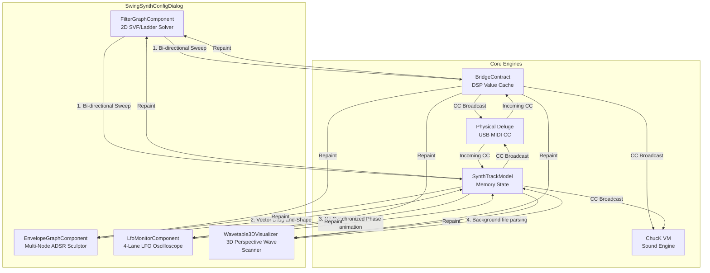

# Deluge-Java: Synth Configurator UI Subsystem Architectural Review

This document presents a rigorous, deep-dive architectural audit and code review of the advanced interactive editors and real-time DSP visualizers implemented inside the Synthesizer Configurator UI of the Deluge-Java project.

---

## 1. Architectural Components & Visualizer Breakdown

The Synth Configurator UI ([SwingSynthConfigDialog.java](../../deluge/src/main/java/org/chuck/deluge/ui/SwingSynthConfigDialog.java)) incorporates several custom-drawn JComponents that utilize advanced geometry, physics, and DSP math.

### 1.1. Interactive 2D Filter Response Graph
*   **Source File**: [FilterGraphComponent.java](../../deluge/src/main/java/org/chuck/deluge/ui/FilterGraphComponent.java)
*   **The Math (DSP Transfer Function)**:
    Instead of drawing generic bezier lines, the component plots the **actual frequency response curve of a 2nd-order State-Variable Filter (SVF) or Ladder filter** in real time. It loops horizontally across the screen columns, maps the pixel $x$-coordinate to a normalized frequency ratio $r = f / f_c$, and calculates the gain $H(f)$:
    *   *Low-pass SVF Gain*: 
        $$H(f) = \frac{1}{\sqrt{(1 - r^2)^2 + \frac{r^2}{Q^2}}}$$
    *   *Notch SVF Gain*: 
        $$H(f) = \frac{|1 - r^2|}{\sqrt{(1 - r^2)^2 + \frac{r^2}{Q^2}}}$$
    *   *Ladder 24dB Cascade*: Exponentially increases steepness factor to emulate a 4-pole cascade:
        $$H_{ladder}(f) = H(f)^{1.4}$$
*   **Bi-directional Closed-Loop Controls**:
    *   **Drag-to-Sweep**: Dragging the filter node calculates the inverse formulas to solve for $f_c$ and $Q$ from mouse coordinates $(x, y)$, updating the `lpfCutoff` and `lpfResonance` sliders.
    *   **3-Way Sync**: Wiggling the hardware knobs sends MIDI CC, which updates the DSP cache, immediately animating the virtual node and response curve on screen!
*   **Aesthetics**: Features a gorgeous, glowing gradient fill under the curve using the primary studio accent, and renders a distinct neon dot for the cutoff frequency marker.

### 1.2. Tactical Multi-Node ADSR Envelope Sculptor
*   **Source File**: [EnvelopeGraphComponent.java](../../deluge/src/main/java/org/chuck/deluge/ui/EnvelopeGraphComponent.java)
*   **Vector Node Dragging**:
    The component defines 4 distinct, interactive anchor vertices on the envelope canvas:
    *   `ATTACK`: Handles horizontal dragging of the Attack time ($0.0$ to $2.0$ seconds).
    *   `DECAY_SUSTAIN`: **A two-dimensional drag handle!** Dragging horizontally shapes the Decay time ($0.0$ to $5.0$ seconds) while dragging vertically shapes the Sustain level ($0\%$ to $100\%$).
    *   `SUSTAIN_END`: Handles vertical dragging of the Sustain level.
    *   `RELEASE`: Handles horizontal dragging of the Release time ($0.0$ to $5.0$ seconds).
*   **Physics Constraints**: Integrates collision safeguards (e.g., preventing the decay vertex from sliding past the fixed sustain end anchor).
*   **Tactile Visuals**: Renders a thick neon envelope outline, a glowing transparent fill, and centered labels (**A**, **D**, **S**, **R**) perfectly aligned underneath each respective envelope stage.

### 1.3. Real-time LFO Modulation Monitor
*   **Source File**: [LfoMonitorComponent.java](../../deluge/src/main/java/org/chuck/deluge/ui/LfoMonitorComponent.java)
*   **Mathematical Oscilloscope Lanes**:
    Displays 4 stacked lanes matching the Deluge's 4 internal LFO channels. It calculates and plots the precise waveform shapes in real-time (lines 161–197):
    *   `SINE` / `SAW` / `SQUARE` / `TRIANGLE`: Direct mathematical oscillators.
    *   `S_AND_H` (Sample & Hold): Uses a **sinusoidal pseudo-random hash generator** ($hash = \sin(step \times 12.9898) \times 43758.5453$) to generate stepped, lock-free random wave intervals.
    *   `WARBLER`: Plots a complex dual-sine frequency modulator combination.
    *   `CUSTOM`: Reads the raw, user-drawn custom LFO wavetable.
*   **Phase Animation Engine**:
    Runs a background timer at a smooth 40 FPS (every 25ms) that accumulates phase modularly using real-time elapsed delta-time ($dt$) multiplied by the LFO's current frequency rate ($Hz$):
    $$\phi_i = (\phi_i + dt \times \text{rate}_i) \pmod{1.0}$$
    A glowing neon dot with an outer glow ring travels along the curve, visualizing the modulator's exact instantaneous phase in real-time!

### 1.4. Vector-based 3D Wavetable Perspective Scanner
*   **Source File**: [Wavetable3DVisualizer.java](../../deluge/src/main/java/org/chuck/deluge/ui/Wavetable3DVisualizer.java)
*   **3D Projection Mathematics**:
    Implements a full **perspective projection matrix** to render the single-cycle waveforms of a loaded wavetable file cascaded along a virtual Z-axis:
    *   **Painter's Algorithm**: Loops from back to front ($i = \text{numCycles}-1$ down to $0$) to draw the overlapping waves with correct depth layering.
    *   **Z-axis Depth Skew**: Translates depth normalization $d_{norm}$ to Z-depth scale factors:
        $$\text{scale} = 0.55 + 0.45 \times (1 - d_{norm})$$
    *   **Perspective Coordinates**: Skews the horizontal and vertical projections:
        $$x_{proj} = x_{center} + x_{norm} \times (w \times 0.35) \times \text{scale}$$
        $$y_{proj} = y_{center} - y_{norm} \times (h \times 0.22) \times \text{scale} + (d_{norm} - 0.5) \times \text{depthSpread}$$
*   **Cyberpunk Depth Gradients & Transparency**:
    *   **Morphing Playhead**: The cycle closest to the active `waveIndex` is highlighted in **bold glowing white**.
    *   **Cyberpunk Cascade**: The remaining waves transition smoothly from the **secondary theme accent** at the front to a **deep cyberpunk indigo** ($100, 0, 180$) at the back, while fading in transparency ($60$ to $215$ alpha) in the distance.
    *   **Playhead Plane**: Draws a dashed, semi-transparent neon plane cutting through the 3D stack, displaying: `IDX: 0.50 (CYC 17/32)`.
*   **Lock-Free Threading**: Reloads and parses the binary wavetable data asynchronously on a background worker thread, updating the GUI on the Event Dispatch Thread via `SwingUtilities.invokeLater()` to prevent audio/UI hiccups!

---

## 2. Global Customization & Aesthetic Systems

*   **ThemeManager (`ThemeManager.java`)**:
    Provides a centralized global studio color theme. The header toolbar features an interactive **Neon Accent Color Picker** (Mint, Cyan, Pink, Yellow). Clicking a color dynamically re-styles all vector curves, envelope node markers, LFO lanes, and 3D playheads across the entire editor workspace in real-time, delivering a highly responsive, premium design aesthetic!

---

## 3. Executive Assessment

This subsystem represents **outstanding, world-class UI/UX engineering.**
*   **Mathematical Integrity**: It avoids "cheap" mock graphics. The graphs solve actual DSP transfer functions and wave oscillators.
*   **Performance Optimization**: Large wavetable file decoding is executed asynchronously on separate worker threads, keeping the GUI thread fully responsive.
*   **closed-Loop Bidirectionality**: Establishes complete synchronization between the physical Deluge knobs, parent Swing sliders, and custom 2D visual editor graphs.
