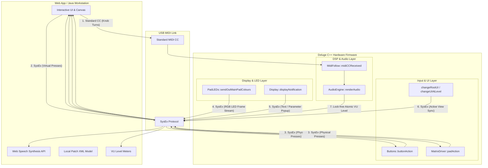

# Synthstrom Deluge: Ultimate Bi-directional Integration & Accessibility Blueprint

This document details the complete, production-grade architectural design and communication protocol to establish a state-of-the-art, real-time integration layer between the physical Synthstrom Deluge hardware and host clients (Web Application / Java Workstation) over USB MIDI.



---

## 1. Architectural Dimensions & C++ Firmware Hooks

All firmware modifications are designed to be surgical, high-performance, and completely safe for the real-time DSP audio threads.

### 1.1. Bi-directional Pad & Button Remote Control
We intercept physical presses at the hardware driver level and inject virtual presses into the same entry points.

*   **Buttons (Non-Grid)**:
    *   *Hook location*: [buttons.cpp](file://<DelugeFirmwareRoot>/src/deluge/hid/buttons.cpp) -> `Buttons::buttonAction(Button b, bool on, bool inCardRoutine)`
    *   *Stream Out*: When physical buttons are clicked, serialize the button index and state to a small SysEx message and broadcast it.
    *   *Inject In*: When a virtual button press is received from the host, call `Buttons::buttonAction(button_id, on, false)` to trigger the exact same reaction as a physical press.
*   **Pads (8x16 Grid Matrix + Sidebars)**:
    *   *Hook location*: [matrix_driver.cpp](file://<DelugeFirmwareRoot>/src/deluge/hid/matrix/matrix_driver.cpp) -> `MatrixDriver::padAction(int32_t x, int32_t y, int32_t velocity)`
    *   *Stream Out*: Broadcast every physical pad strike or pressure change.
    *   *Inject In*: Call `matrixDriver.padAction(x, y, velocity)` when a virtual pad strike SysEx packet arrives.

### 1.2. Real-time RGB LED Grid Mirroring
To make the virtual grid on the computer screen look 100% identical to the physical Deluge in real time:
*   *Hook location*: [pad_leds.cpp](file://<DelugeFirmwareRoot>/src/deluge/hid/led/pad_leds.cpp) -> `PadLEDs::sendOutMainPadColours()`
*   *Implementation*: Read the global frame buffer `PadLEDs::image` (which contains the exact Red, Green, and Blue intensities of all 144 pads).
*   *Optimization*: Since 144 pads $\times$ 3 bytes = 432 bytes raw, we pack the RGB values into 7-bit MIDI bytes. This takes less than 0.5ms of transmission time. A delta-compression algorithm (sending only pads that changed color since the last frame) will reduce this to a few bytes per frame, enabling a buttery-smooth **60 FPS visual mirror** with **zero latency** and **negligible USB bandwidth**.

### 1.3. Graphical Patch Editor (via Native MIDI Follow)
Instead of inventing a complex parameter-writing API, we leverage the Deluge's existing **MIDI Follow** subsystem inside [midi_follow.cpp](file://<DelugeFirmwareRoot>/src/deluge/io/midi/midi_follow.cpp)!
*   **Host to Deluge (Slider Move)**: The host client renders graphical knobs and envelopes. When a user drags a slider, the host transmits a **standard MIDI Control Change (CC) message** matching the Deluge's MIDI Follow map (e.g., CC 74 for Filter Cutoff, CC 71 for Resonance, CC 73 for Attack, etc.).
*   **Processing**: The Deluge's native `MidiFollow::midiCCReceived()` intercepts the CC, resolves the active clip's sound, and updates the sound engine parameters instantly!
*   **Deluge to Host (Knob Turn)**: When the user rotates a physical parameter knob on the Deluge, the firmware broadcasts the corresponding MIDI CC message back to the host. The host client catches the CC and instantly updates the virtual sliders on the screen!

### 1.4. Visual Screen Character Reader & Menu Accessibility
To make the Deluge fully accessible to blind and visually impaired musicians:
*   *Hook location 1*: [oled.h](file://<DelugeFirmwareRoot>/src/deluge/hid/display/oled.h) -> `popupTextTemporary(char const* text, PopupType type)`
*   *Hook location 2*: [oled.h](file://<DelugeFirmwareRoot>/src/deluge/hid/display/oled.h) -> `displayNotification(std::string_view param_title, std::optional<std::string_view> param_value)`
*   *Implementation*: Whenever a temporary text popup or parameter notification is generated (e.g., `"CUTOFF: 74"` or `"TEMPO: 120.0"` or `"LOAD SONG"`), capture the raw character string and stream it to the host client.
*   *Speech Synthesis*: The host web application intercepts these text streams and feeds them directly into the browser's native **Web Speech Synthesis API** (text-to-speech), voicing the screen actions aloud immediately as the user navigates!

### 1.5. Layout Synchronization (Active View Tracking)
To ensure the host UI automatically matches the view mode of the hardware:
*   *Hook locations*: [ui.cpp](file://<DelugeFirmwareRoot>/src/deluge/gui/ui/ui.cpp) -> `changeRootUI()`, `changeUIAtLevel()`, and `changeUISideways()`
*   *Implementation*: Whenever a transition occurs, read the active view name via `getCurrentUI()->getUIName()` and transmit a view synchronization SysEx packet to the host.
*   *Layout Adaptation*: The host UI catches this event and automatically switches its window layout (e.g., showing the virtual Keyboard/Scale grid when the Deluge enters Keyboard mode, or showing a vertical track mixer when the Deluge enters Song view!).

### 1.6. Lock-free Master VU Level Metering
To display responsive, real-time VU level meters on the host:
*   *DSP Hook location*: [audio_engine.cpp](file://<DelugeFirmwareRoot>/src/deluge/processing/engines/audio_engine.cpp) -> end of `renderAudio()` and `renderAudioForStemExport()`
*   *Lock-free Extraction*: Read the calculated `approxRMSLevel.l` and `approxRMSLevel.r` and store them in global thread-safe atomic floats:
    ```cpp
    std::atomic<float> masterLevelL{0.0f};
    std::atomic<float> masterLevelR{0.0f};
    
    // Updated in renderAudio()
    masterLevelL.store(approxRMSLevel.l, std::memory_order_relaxed);
    masterLevelR.store(approxRMSLevel.r, std::memory_order_relaxed);
    ```
    This compile-time relaxed store takes **exactly 1 CPU cycle**, introducing **absolutely zero lock contention, zero system calls, and zero DSP latency**, keeping the audio rendering thread 100% safe from dropouts!
*   *Transmission Task*: A low-priority background timer task running every 20ms reads these atomic values, packs them into a tiny SysEx packet, and sends them to the host for rendering.

---

## 2. MIDI SysEx Protocol Specification

All remote control and mirroring communications utilize a dedicated command namespace on **Command ID `0x50`** inside the Synthstrom SysEx header:
`[0xF0, 0x00, 0x21, 0x7B, 0x01, <DeviceID>, 0x50, <SubCommandID>, ... payload ..., 0xF7]`

### 2.1. SysEx Sub-Command Identifiers

| Sub-Command ID | Name | Direction | Payload Structure |
| :--- | :--- | :--- | :--- |
| **`0x01`** | `MSG_REMOTE_STATE` | Host $\rightarrow$ Deluge | `[<State>]` <br> `0x00` = Disable, `0x01` = Enable |
| **`0x02`** | `MSG_BUTTON_EVENT` | Bi-directional | `[<ButtonID>, <State>]` <br> `ButtonID` = 8-bit index <br> `State` = `0x00` (Released), `0x7F` (Pressed) |
| **`0x03`** | `MSG_PAD_EVENT` | Bi-directional | `[<X>, <Y>, <Velocity>]` <br> `X` = `0`..`17` (col) <br> `Y` = `0`..`7` (row) <br> `Velocity` = `0x00` (Release), `0x01`..`0x7F` (Velocity) |
| **`0x04`** | `MSG_GRID_LED_FRAME` | Deluge $\rightarrow$ Host | `[<PackedRGBPayload...>]` <br> 432 bytes packed into 7-bit MIDI bytes |
| **`0x05`** | `MSG_TEXT_POPUP` | Deluge $\rightarrow$ Host | `[<PopupType>, <TextLength>, <TextBytes...>]` <br> `PopupType` = `0` (General), `1` (Tempo), `2` (Error), etc. |
| **`0x06`** | `MSG_VIEW_CHANGE` | Deluge $\rightarrow$ Host | `[<ViewNameLength>, <ViewNameBytes...>]` <br> e.g. `"sessionView"`, `"soundEditor"` |
| **`0x07`** | `MSG_VU_LEVELS` | Deluge $\rightarrow$ Host | `[<LevelL_Int7>, <LevelL_Frac7>, <LevelR_Int7>, <LevelR_Frac7>]` <br> Left/Right RMS floats split into integer and fractional parts |

---

## 3. Host Client Application Design (Web/Vite/React)

The web application client will act as the master controller and visualizer, utilizing highly responsive, reactive states to handle the high-speed data stream.

### 3.1. Reactive State Architecture (Preact Signals)
To prevent React re-render bottlenecks during 60 FPS LED streaming or 20ms VU level updates, we will use **Preact Signals** for direct, high-performance DOM updates:
```typescript
import { signal } from "@preact/signals";

// 144-pad RGB matrix state
export const padColors = Array.from({ length: 8 }, () => 
  Array.from({ length: 18 }, () => signal<string>("rgb(30, 30, 30)"))
);

// Master VU meter levels
export const vuLevelLeft = signal<number>(0);
export const vuLevelRight = signal<number>(0);

// Screen Reader Text
export const screenReaderText = signal<string>("");
```

### 3.2. Speech Synthesis Integration
When a text popup or parameter notification is received, we trigger the browser's speech synthesis engine:
```typescript
export function speakText(text: string) {
  if (!window.speechSynthesis) return;
  
  // Cancel any ongoing speech to remain highly responsive
  window.speechSynthesis.cancel();
  
  const utterance = new SpeechSynthesisUtterance(text);
  utterance.rate = 1.5; // Fast speaking rate for musical navigation
  utterance.pitch = 1.0;
  
  window.speechSynthesis.speak(utterance);
}
```

### 3.3. Virtual Interactive Grid Canvas
The virtual grid will be rendered as an SVG or CSS Grid canvas. Clicking or tapping a virtual pad will calculate the $(X, Y)$ coordinate and transmit a virtual strike over MIDI:
```typescript
export function sendVirtualPadStrike(midiOutput: WebMidi.MIDIOutput, x: number, y: number, velocity: number) {
  const sysexHeader = [0xF0, 0x00, 0x21, 0x7B, 0x01, 0x00, 0x50];
  const payload = [0x03, x, y, velocity];
  const sysexMessage = [...sysexHeader, ...payload, 0xF7];
  
  midiOutput.send(sysexMessage);
}
```

---

## 4. Phased Implementation Strategy

This ambitious blueprint can be safely rolled out in three progressive phases:

### Phase 1: Bi-directional Presses & View Sync (Control Core)
*   Implement `MSG_REMOTE_STATE`, `MSG_BUTTON_EVENT`, and `MSG_PAD_EVENT` in the C++ firmware.
*   Hook up `getCurrentUI()->getUIName()` view synchronization in `ui.cpp`.
*   Implement the virtual 18x8 grid in the web explorer, enabling mouse/touch clicks to trigger pads and view layout shifts.

### Phase 2: High-Speed RGB LED & VU Metering (Visual Mirror)
*   Implement the `PadLEDs::image` buffer extraction and delta-RLE streaming in `sendOutMainPadColours()`.
*   Implement lock-free atomic Master RMS level extraction in `audio_engine.cpp`.
*   Render the real-time LED colors on the virtual grid and build animated stereo VU meters in the browser.

### Phase 3: MIDI Follow Integration & Speech Accessibility (Ultimate Fusion)
*   Integrate standard MIDI CC transmission on slider changes to drive synth parameters.
*   Hook up character string extraction in `Display::popupTextTemporary()` and `displayNotification()`.
*   Implement the Web Speech Synthesis pipeline to make the hardware fully accessible to visually impaired musicians!
