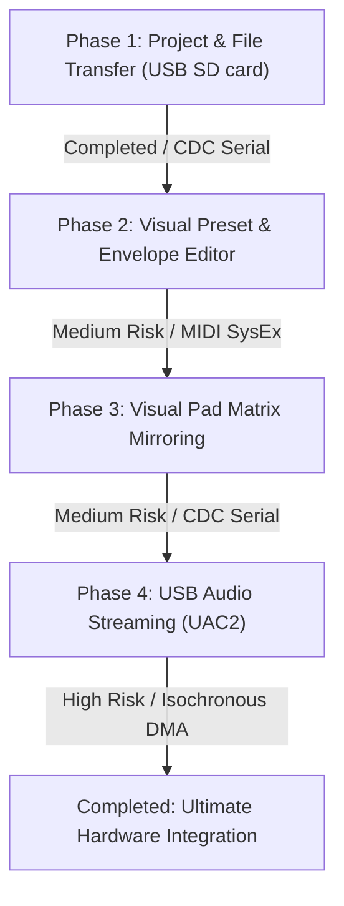

# USB Integration Roadmap: Deluge Firmware & Workstation Client

This document outlines the strategic roadmap for expanding the USB integration between the physical Deluge hardware and the Java Workstation client. With the core USB MIDI + CDC Serial layer now fully operational and sync-capable, we propose the following phases for future development.

---

## Technical Feasibility & Prioritization Analysis

### Option 4: USB Audio Streaming (UAC2)
* **Our Assessment**: **The Ultimate Community Request (Highest Value), but High Complexity.**
* **Why it's the holy grail**: Direct digital audio streaming from the Deluge into a DAW over USB (similar to Elektron's Overbridge) eliminates the need for external audio interfaces and analog cabling.
* **Technical Challenges & Worries**:
  * **Clock Drift**: The host computer's audio clock and the Deluge's internal DAC/codec clock will drift. To prevent audible pops, clicks, or dropouts, we must implement adaptive sample-rate conversion or asynchronous feedback endpoints (adjusting packet sizes based on SOF tokens).
  * **Isochronous DMA**: The custom Renesas RZ/A1 driver (`rusb1`) in the TinyUSB stack needs extension to support Isochronous endpoints. Isochronous transfers do not have hardware retransmissions, making buffer management and DMA alignment extremely sensitive.
  * **CPU Scheduling Jitter**: Streaming constant audio packets requires high-priority interrupts. This can clash with SD card read/write routines and synthesis loops, leading to buffer underruns.

### Alternative Option: Bidirectional Project/File Transfer
* **Our Assessment**: **Best Immediate Candidate (High Value, Low Complexity) - Phase 1 Completed.**
* **Why it's a great first step**: It completely removes the need for physical SD card ejection, which is a frequent workflow bottleneck for backup and song transfer.
* **Technical Simplicity**:
  * Uses the existing CDC Virtual Serial Port.
  * Low risk: Does not require real-time clock synchronization or high-priority interrupts (runs as a background task).

---

## Proposed Roadmap

### Phase 1: Bidirectional Project & File Transfer [COMPLETED]
* **Description**: Transfer XML song files, custom synth presets, and WAV samples directly to and from the Deluge SD card over USB CDC Serial.
* **Implementation Details**:
  * **C++**: Implemented `processIncomingCdcData` and `processOutgoingFileTransfer` in [usb_sync.cpp](file:///Users/ludo/a/DelugeFirmware/src/deluge/io/usb/usb_sync.cpp).
    * `0x02` (Request Directory Listing) $\rightarrow$ Returns `0x03` with entries list.
    * `0x04` (Request File Read) $\rightarrow$ Streams file chunks in `0x05` (512-byte blocks) sequentially, yielding to other threads to avoid blocking CPU/audio.
  * **Java**: Implemented response parsing and listeners in [DelugeUsbSyncService.java](file:///Users/ludo/a/deluje/src/main/java/org/deluge/usb/DelugeUsbSyncService.java).
* **How to run the Diagnostic Utility**:
  1. Flash the updated firmware on the Deluge. Ensure `USBS` settings option is `ON`.
  2. Connect the Deluge via USB.
  3. Run the Java class **[HardwareUsbFileTransferDiagnostic.java](file:///Users/ludo/a/deluje/src/test/java/org/deluge/usb/HardwareUsbFileTransferDiagnostic.java)**.
  4. The tool will connect, request the `"/SONGS"` folder, print the list of song files, and automatically download the first XML song file, saving it as `downloaded_song.xml` locally.

### Phase 2: Interactive Preset & Envelope Editor
* **Description**: A visual editor on the computer screen to configure FM operator algorithms, filters, envelopes, and patch modulation slots.
* **Implementation Plan**:
  * **C++**: Expand the existing MIDI SysEx handler to dump and accept parameter adjustments.
  * **Java**: Build a beautiful Swing/JavaFX panel displaying interactive envelope curves (ADSR) and modulation routings that reflect and control the physical unit in real-time.

### Phase 3: Visual Pad Matrix Mirroring & Remote Control
* **Description**: Render an exact 8x16 grid interactive mirror of the Deluge pads in the Workstation UI. Clicking virtual pads triggers launch/mute states on hardware, and physical pad presses illuminate the UI in real-time.
* **Implementation Plan**:
  * **C++**: Stream coordinate and RGB color data whenever matrix states change.
  * **Java**: Draw the grid canvas and send click coordinates back to hardware.

### Phase 4: USB Audio Streaming (UAC2)
* **Description**: Expose the Deluge as a class-compliant USB Audio Interface.
* **Implementation Plan**:
  * **C++**: Update `usb_descriptors.cpp` to declare a USB Audio Class 2.0 interface. Stream the final stereo render buffer over asynchronous ISO endpoints, matching host sample rate.
  * **Java/Host**: The workstation client (or any DAW) can select "Deluge Audio" as a digital input source.

