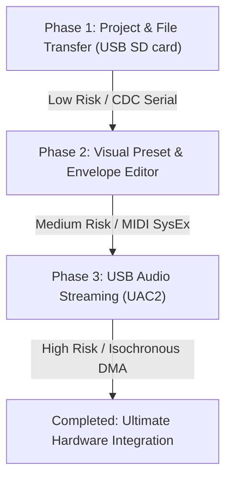

# USB Integration Roadmap: Deluge Firmware & Workstation Client

This document outlines the strategic roadmap for expanding the USB integration between the physical Deluge hardware and the Java Workstation client. With the core USB MIDI + CDC Serial layer now fully operational and sync-capable, we propose the following phases for future development.

---

## Technical Feasibility & Prioritization Analysis

### Option 4: USB Audio Streaming (UAC2)
* **Our Assessment**: **The Ultimate Community Request (Highest Value), but High Complexity.**
* **Why it's the holy grail**: Direct digital audio streaming from the Deluge into a DAW over USB (similar to Elektron's Overbridge) eliminates the need for external audio interfaces and analog cabling.
* **Technical Challenges**:
  * **Isochronous Endpoints**: Requires extending the custom Renesas RZ/A1 driver (`rusb1`) in the TinyUSB stack to support low-latency Isochronous USB transfers.
  * **Clock Synchronization**: The host computer's audio clock and the Deluge's internal DAC/codec clock will drift. To prevent audible pops, clicks, or dropouts, we must implement adaptive sample-rate conversion or asynchronous feedback endpoints (adjusting packet sizes based on SOF tokens).
  * **Real-time Interrupt Constraints**: Audio packetization must run at extremely high priority without blocking the core rendering loop or SD card read threads.

### Alternative Option: Bidirectional Project/File Transfer
* **Our Assessment**: **Best Immediate Candidate (High Value, Low Complexity).**
* **Why it's a great first step**: It completely removes the need for physical SD card ejection, which is a frequent workflow bottleneck for backup and song transfer.
* **Technical Simplicity**:
  * Uses the existing CDC Virtual Serial Port we just verified.
  * Low risk: Does not require real-time clock synchronization or high-priority interrupts (can run as a background task).
  * Safe: Easy to implement using a packetized file chunking protocol with CRC validation.

---

## Proposed Roadmap

### Phase 1: Bidirectional Project & File Transfer
* **Description**: Transfer XML song files, custom synth presets, and WAV samples directly to and from the Deluge SD card over USB.
* **Implementation Plan**:
  * **C++**: Define file-transfer commands (`0x04`: Get File, `0x05`: Write File) over the CDC serial port. Implement a background file reader/writer that reads from FATFS.
  * **Java**: Build a "File Manager" pane showing local files side-by-side with Deluge SD card files, enabling drag-and-drop transfers.

### Phase 2: Interactive Preset & Envelope Editor
* **Description**: A visual editor on the computer screen to configure FM operator algorithms, filters, envelopes, and patch modulation slots.
* **Implementation Plan**:
  * **C++**: Expand the existing MIDI SysEx handler to dump and accept parameter adjustments.
  * **Java**: Build a beautiful Swing/JavaFX panel displaying interactive envelope curves (ADSR) and modulation routings that reflect and control the physical unit in real-time.

### Phase 3: USB Audio Streaming (UAC2)
* **Description**: Expose the Deluge as a class-compliant USB Audio Interface.
* **Implementation Plan**:
  * **C++**: Update `usb_descriptors.cpp` to declare a USB Audio Class 2.0 interface. Stream the final stereo render buffer over asynchronous ISO endpoints, matching host sample rate.
  * **Java/Host**: The workstation client (or any DAW) can select "Deluge Audio" as a digital input source.
