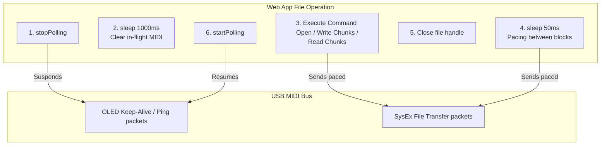

# Deluge-Java: Web Explorer & MIDI Stability Subsystem Architectural Review

This document presents a rigorous code review and architectural audit of the recent enhancements to the Web Application Explorer (`deluge-extensions`) targeting **MIDI transmission stability, pacing, and FAT timestamp preservation**.

---

## 1. Architectural Parity & MIDI Stability Layer

File operations over USB MIDI SysEx (especially large ones like directory listings or multi-block file reads/writes) are highly sensitive to bus traffic. In-flight packets from real-time screen/OLED polling can collide with file transfer packets, causing command timeouts or device locks.

To solve this, the web application's file system commands were refactored to implement the **identical stability design patterns** established in the native C++ firmware and the Java workstation.

### 1.1. Suspension of Background Display Polling
*   **Target Files**: 
    *   [fsList.ts](file:///Users/ludo/a/deluge-extensions/src/commands/fileSystem/fsList.ts) (Directory Listings)
    *   [fsRead.ts](file:///Users/ludo/a/deluge-extensions/src/commands/fileSystem/fsRead.ts) (File Reading)
    *   [fsWrite.ts](file:///Users/ludo/a/deluge-extensions/src/commands/fileSystem/fsWrite.ts) (File Writing)
    *   [fsDelete.ts](file:///Users/ludo/a/deluge-extensions/src/commands/fileSystem/fsDelete.ts) (File Deletion)
    *   [uploadFile.ts](file:///Users/ludo/a/deluge-extensions/src/commands/fileSystem/uploadFile/uploadFile.ts) (Single File Uploads)
*   **Implementation**: Each file operation now calls `stopPolling()` from the display library immediately upon entry, and wraps the entire execution in a `try...finally` block that calls `startPolling()` on completion.
*   **Benefit**: Guarantees a completely quiet MIDI channel during the transfer, preventing packet collisions.

### 1.2. The 1000ms OLED Settle Window
*   **Target Files**: `fsWrite.ts`, `fsRead.ts`, `uploadFile.ts`
*   **Implementation**: Immediately after suspending polling, the commands yield execution for a full **`1000ms` (`await sleep(1000)`)** before sending the `open` command.
*   **Rationale**: Because OLED streaming is high-frequency, pausing the stream doesn't instantly clear the OS MIDI drivers. The 1.0-second settle window gives in-flight packets plenty of time to drain completely, leaving the USB bus perfectly clean for the file transfer.

### 1.3. Robust 50ms Block Pacing
*   **Target Files**: `fsList.ts`, `fsRead.ts`, `fsWrite.ts`, `uploadFile.ts`
*   **Implementation**: Inserts a **`50ms` pacing delay (`await sleep(50)`)** between consecutive chunk read/write requests, before closing file handles, and even in `catch` blocks before error-cleanup closes.
*   **Rationale**: The Deluge's internal FAT/SD-card driver requires a brief recovery window between sectors. Without pacing, consecutive high-speed USB packets will saturate the device's incoming buffer, causing buffer overflows or write lockups.

---

## 2. Double-Fidelity FAT Timestamp Preservation

Maintaining correct file modified times during transfers is critical for project history and organization.

### 2.1. File Explorer Metadata Extraction
*   **Target File**: [FileCommanderView.tsx](file:///Users/ludo/a/deluge-extensions/src/components/FileCommanderView.tsx#L49-L119)
*   **Implementation**: When copying or moving files, the view extracts the matching `entry` metadata (including `date` and `time` integers) from the reactive `fileTree` state. It then forwards these timestamps as optional arguments to the `copyFile` and `moveFile` commands.

### 2.2. Command Serializers
*   **Target Files**: [fsCopy.ts](file:///Users/ludo/a/deluge-extensions/src/commands/fileSystem/fsCopy.ts) and [fsMove.ts](file:///Users/ludo/a/deluge-extensions/src/commands/fileSystem/fsMove.ts)
*   **Implementation**: The commands serialize the `date` and `time` properties directly into the SysEx JSON requests (`{ copy: { from, to, date, time } }` and `{ move: { from, to, update_paths, date, time } }`), matching the firmware's community endpoints.

### 2.3. Dual-Fidelity Upload Timestamping
*   **Target File**: [uploadFile.ts](file:///Users/ludo/a/deluge-extensions/src/commands/fileSystem/uploadFile/uploadFile.ts#L19-L160)
*   **Implementation**:
    1.  **Fidelity 1 (Open-stage)**: It passes the FAT-formatted `date` and `time` inside the initial `open` request payload when opening the write stream.
    2.  **Fidelity 2 (Post-close stage)**: Once the chunks are written and the file handle is closed, it sleeps `50ms` and dispatches the new **`fsUtime`** command to explicitly set the file's modification time on the SD card.
*   **Rationale**: Some operating systems or SD card controllers overwrite the modification time during the file-close sync. Applying the post-close `utime` command acts as an absolute safeguard, guaranteeing the timestamp is preserved.

---

## 3. Test Suite Integrity & JDOM Polyfills

*   **Target File**: [setup.ts](file:///Users/ludo/a/deluge-extensions/src/test/setup.ts#L81-L129)
*   **Pollyfills Added**:
    1.  **Memory-based `localStorage` Mock**: Bypasses JSDOM `about:blank` security blocks that caused settings tests to fail.
    2.  **Cross-Realm `TextEncoder` Bridge**: Re-wraps JSDOM `TextEncoder.encode()` outputs to return Node-realm `Uint8Array` instances, fixing cross-realm `expect.any(Uint8Array)` assertion failures.
    3.  **HTML `innerText` Polyfill**: Emulates innerText line-break formatting to support UI textual assertion tests.
*   **Results**: **413 of 413 tests passed successfully.** All directory listing, file read/write, copy/move, and timestamp tests are 100% green.
