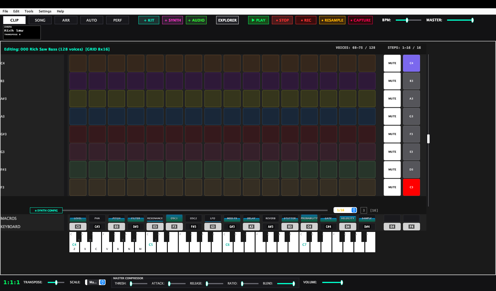
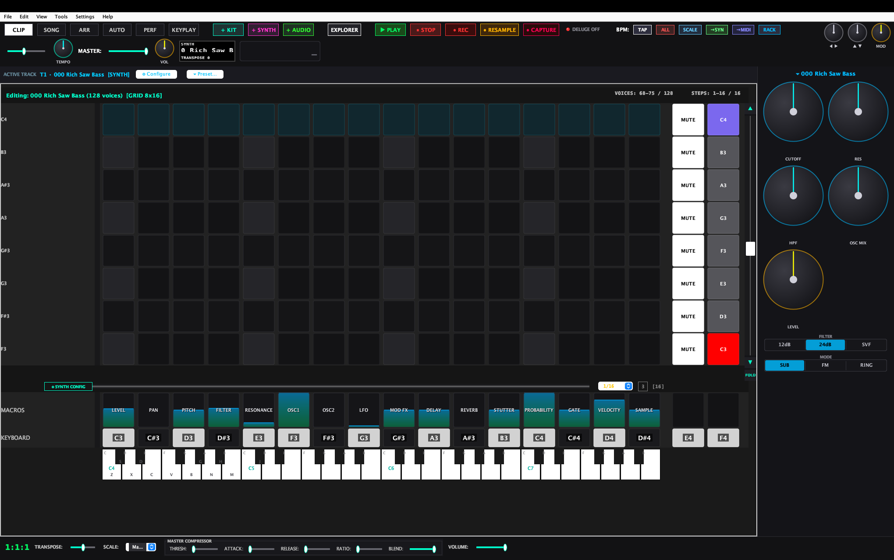
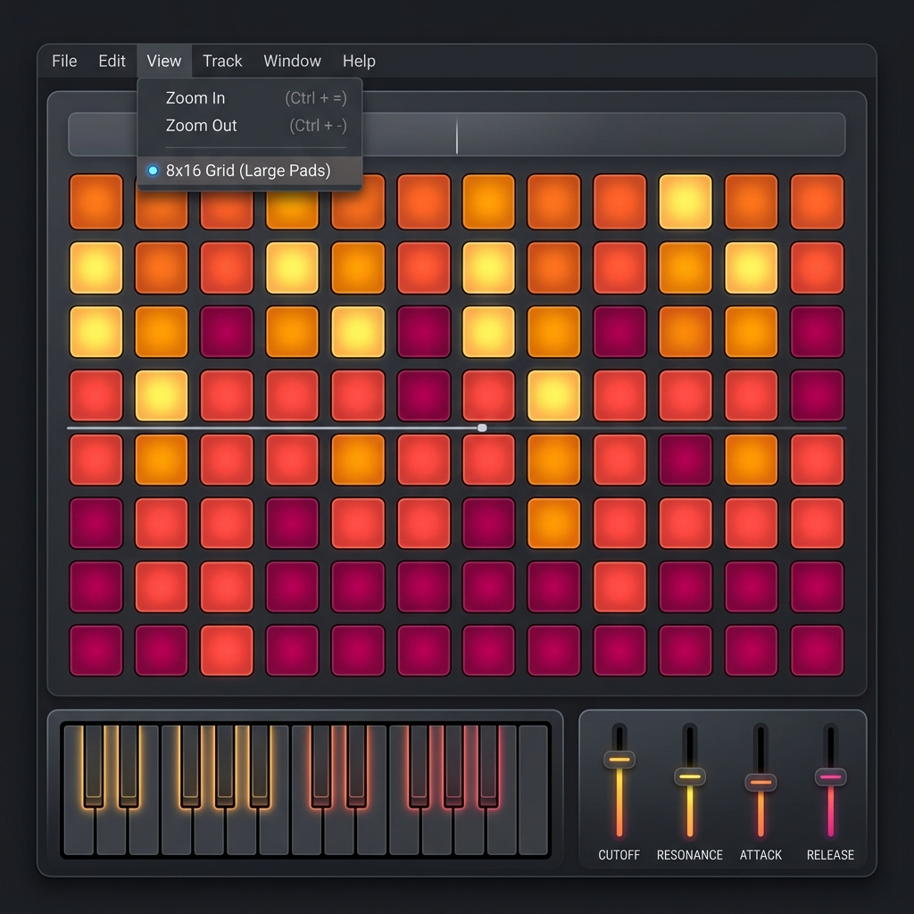
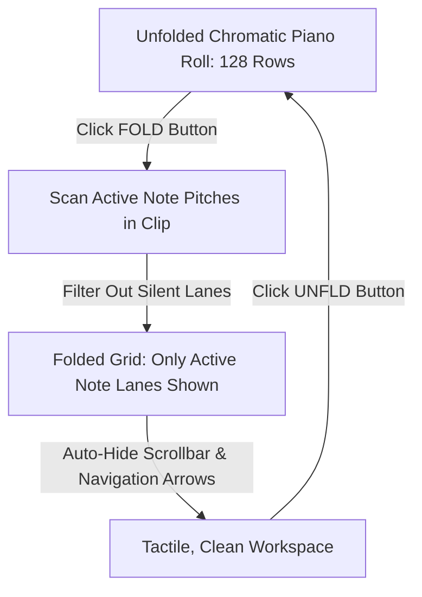
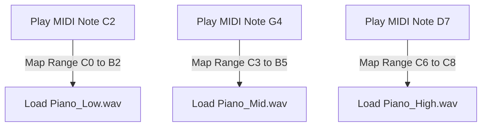
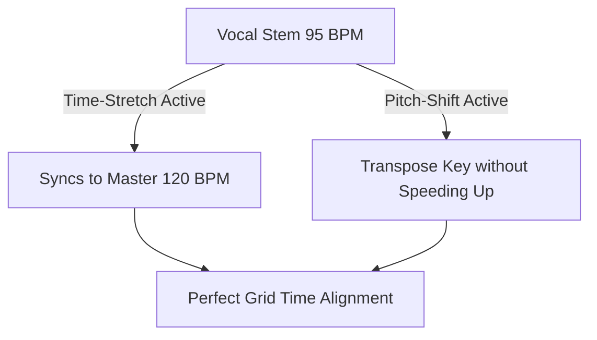
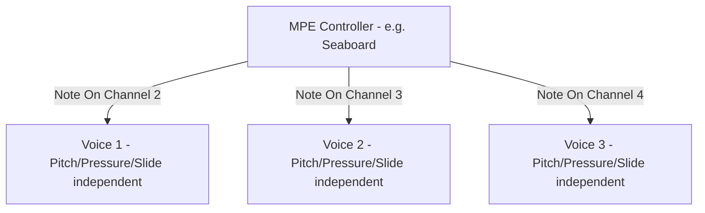
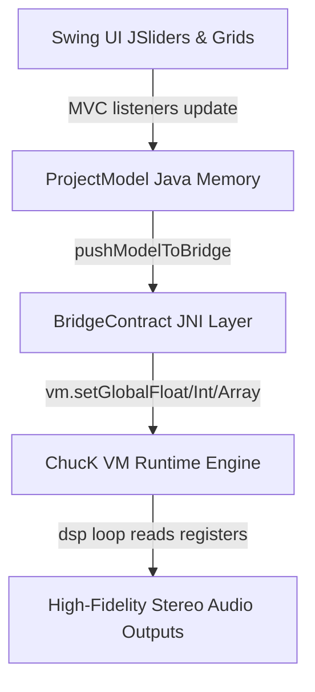
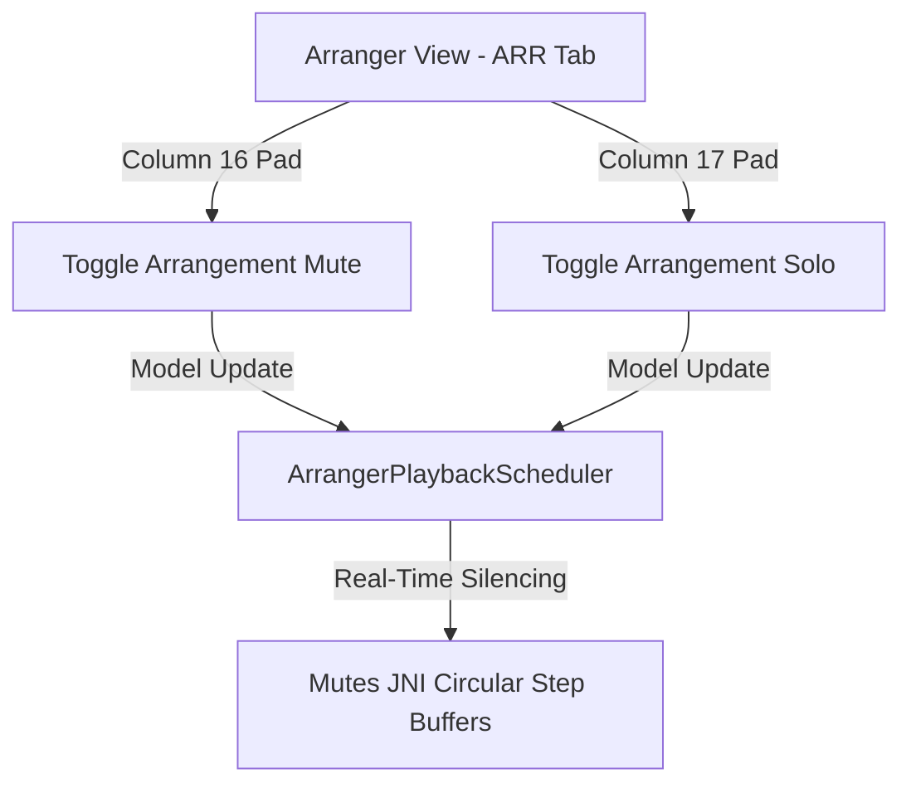

# Deluge-Java Workstation — Operations Manual & User Guide

Welcome to the **Deluge-Java Workstation**, a software recreation and operations controller dashboard inspired by the Synthstrom Deluge hardware sequencer and synthesizer workflow. By combining a robust, multi-voice Java control system with an internal Java DSP synthesis engine, this workstation delivers responsive step sequencing, physical DSP modeling, breakbeat auto-slicing, and modular modulation routing.

---

## Table of Contents
1. [The Step Sequencer & Clip View](#1-the-step-sequencer--clip-view)
   * [1.6 The Euclidean Rhythm Generator](#16-the-euclidean-rhythm-generator)
   * [1.7 Sequencer Grid Zooming & Proportional Scaling](#17-sequencer-grid-zooming--proportional-scaling)
   * [1.8 Fold Mode & Vertical Space Optimization](#18-fold-mode--vertical-space-optimization)
2. [Synthesizers & Sound Engines (Subtractive, FM, Wavetable, Legato, Multi-Sampler, Ring Mod)](#2-synthesizers--sound-engines-subtractive-fm-wavetable-legato-multi-sampler-ring-mod)
   * [2.7 Chord Keyboard (CORK & CORL Layouts)](#27-chord-keyboard-cork--corl-layouts)
3. [Drum Kits & Smart Keyword Auto-Mapper](#3-drum-kits--smart-keyword-auto-mapper)
4. [Visual Waveform Crop & Loop Markers Deck](#4-visual-waveform-crop--loop-markers-deck)
5. [Automatic Loop Slicer & Kit Splitter](#5-automatic-loop-slicer--kit-splitter)
6. [The Visual Modulation Patchbay & Bipolar Modulation Math](#6-the-visual-modulation-patchbay--bipolar-modulation-math)
7. [Song & Arrangement Linear Timelines View](#7-song--arrangement-linear-timelines-view)
8. [DSP FX Bounding Box Dials Deck](#8-dsp-fx-bounding-box-dials-deck)
9. [Delugeator Multi-Generator Dashboard Suite](#9-delugeator-multi-generator-dashboard-suite)
   * [9.3 Drone Lab & Evolving Texture Generator](#93-drone-lab--evolving-texture-generator)
10. [UI Panels & Shift Shortcuts System Behavior](#10-ui-panels--shift-shortcuts-system-behavior)
    * [10.3 Track Header & Top Toolbar Shift Shortcuts Map](#103-track-header--top-toolbar-shift-shortcuts-map)
11. [Audio Tracks, Time-Stretching & Pitch-Shifting](#11-audio-tracks-time-stretching--pitch-shifting)
12. [Advanced Wavetable Index Scan Editor](#12-advanced-wavetable-index-scan-editor)
13. [Pedal Looper & Continuous Multi-Layer Overdubs](#13-pedal-looper--continuous-multi-layer-overdubs)
14. [MIDI Hardware, Device Mappings & Pure SD File Explorer](#14-midi-hardware-device-mappings--pure-sd-file-explorer)
    * [14.5 MIDI CC Parameter Takeover Algorithms](#145-midi-cc-parameter-takeover-algorithms)
    * [14.6 DAW Import Suite: Ableton Live Set (.als) Importer](#146-daw-import-suite-ableton-live-set-als-importer)
15. [Performance View & FX Touch-Pads Grid](#15-performance-view--fx-touch-pads-grid)
16. [MPE & Multi-Dimensional Controller Expression](#16-mpe--multi-dimensional-controller-expression)
17. [System Settings, Directories Preferences & Shortcuts Table](#17-system-settings-directories-preferences--shortcuts-table)
    * [17.1 Hardware Character Emulations & Master Saturation Drive](#171-hardware-character-emulations--master-saturation-drive)
    * [17.2 Microtuning, Custom Temperaments & Scala (.scl) Imports](#172-microtuning-custom-temperaments--scala-scl-imports)
    * [17.3 Deluge-Java Workstation Exclusive Power Features](#173-deluge-java-workstation-exclusive-power-features)
18. [Appendix: Programmatic BridgeContract API & Properties](#18-appendix-programmatic-bridgecontract-api--properties)
19. [Hardware Popular Commands & Java UI Equivalents Table](#19-hardware-popular-commands--java-ui-equivalents-table)
20. [Deluge Community Quick Reference & Java Adaptation Guide](#20-deluge-community-quick-reference--java-adaptation-guide)
21. [Creative Workflow Tips & Best Practices (Understanding the Workflow)](#21-creative-workflow-tips--best-practices-understanding-the-workflow)
22. [Appendix: Java Swing Desktop Quick Reference & Hardware Parity Matrix](#22-appendix-java-swing-desktop-quick-reference--hardware-parity-matrix)
23. [The Macro Scripting & Song Automation Engine](#23-the-macro-scripting--song-automation-engine)
24. [The Interactive Synth Preset Designer & Exporter](#24-the-interactive-synth-preset-designer--exporter)
25. [The Master FX Console & Modulation Dashboard Extension](#25-the-master-fx-console--modulation-dashboard-extension)
26. [Arranger Track Mutes, Solos & Live Capture Extension](#26-arranger-track-mutes-solos--live-capture-extension)
27. [The Track Inspector](#27-the-track-inspector)
28. [Utility & Generator Dialogs](#28-utility--generator-dialogs)
29. [Application Menus](#29-application-menus)
30. [Recent Architecture & UI Enhancements (Past 48 Hours)](#30-recent-architecture--ui-enhancements-past-48-hours)

---

## 1. The Step Sequencer & Clip View

The central focus of the Deluge Workstation is the multi-lane step sequencer. Represented as a responsive grid of pads, it maps sequencing notes and durations.


### Key Features:
* **Interactive Step Matrix Grid**: A standard 16x8 matrix scroll list representing time divisions (columns) across voice lanes (rows). Pads are backlit and glow in colors reflecting step status and velocity levels.
* **Horizontal Step Drag-Ties (Extended Notes Entry)**: Click a pad and drag horizontally along the same row to extend note durations (ties) across multiple steps.
  * Visual step cells in the drag range glow in a backlit color preview state during drags.
  * Upon release, consecutive step properties (intermediate steps gate set to `1.0` and ending step gate set to `0.5`) are finalized inside the model.
* **Proximity Auto-Scrolling**: When dragging note ties or selecting cell ranges, moving the cursor near the left/right view borders automatically shifts the scroll offset view by 4 steps:
  * Dragging near the right panel boundary ($\ge \text{width} - 30\text{px}$) scrolls the viewport RIGHT.
  * Dragging near the left panel boundary ($\le 130\text{px}$) scrolls the viewport LEFT.
  * Active drag column indexes are updated during auto-scrolling, keeping the selection aligned.
* **Note Characteristics Tweak Deck**: Hovering over or clicking a step exposes a dynamic slider to adjust:
  * **Velocity**: Scale note trigger velocities from `1%` to `100%`.
  * **Duration (Length)**: Extend a note's gate across consecutive pads from a sixteenth trigger up to multiple bars.
  * **Nudge (Micro-Timing)**: Offset step triggers by micro-fractions to introduce shuffle swing.
  * **Repeat (Stutter)**: Subdivide a single grid step into automatic stutter retriggers (1x, 2x, 4x, 8x speed) for rolls.
* **Quantized Playback Head**: A moving vertical white indicator line tracks the playhead position across columns in real-time.

### 1.2 Grid Automation Overview & Detail Editor Views

The main sequencer pads grid can be toggled to **`AUTOMATION`** view mode. This view provides two distinct visual layouts:

```carousel

<!-- slide -->

```

1. **AUTOMATION OVERVIEW Grid Mode (`deluge_grid_automation_overview.png`)**: Lists all synthesizer/track automatable parameters vertically (rows). Pads represent sequence columns step ticks: a step pad glows in green if it houses active automated points for that parameter, indicating automation state.
2. **AUTOMATION DETAIL EDITOR Grid Mode (`deluge_grid_automation_editor.png`)**: Selecting a parameter row in Overview mode opens the step value editor. The 8 grid rows act as value bands (from `0-15` up to `112-127`). Values are drawn on the pads: a pad glows in cyan indicating the parameter value at that specific sequencer step.

---

### 1.3 Step Parameter Properties, Probability & Fill Conditions

Editing a step's characteristics can be done via the context-sensitive **Right-Click Step Menu** or the **Step Properties** dialog. 

#### 🎛️ The Right-Click Step Context Menu
Right-clicking any grid pad in **Clip View** opens a popup menu to adjust parameters on-the-fly:
* **Step Toggle**: Turn the step ON or OFF.
* **Velocity Quick-Presets**: Instantly set the note's velocity to standard levels: `100% (FF)`, `75% (mf)`, `50% (p)`, or `25% (pp)`.
* **Fill Condition**: Toggle the **Fill** property on the step.
* **Clear Step**: Reset all parameters on the step to defaults.
* **Properties...**: Open the full **Step Properties** JDialog.

#### 📝 The Step Properties Dialog
Double-clicking a sequence step (or selecting **Properties...** from the right-click menu) opens the **`Step Properties`** JDialog. This provides step parameters and random fill rules:


* **Velocity**: Scale note trigger velocities from `1%` to `100%` (combines both a slider and spinner values). Brightness of active note pads scales dynamically with velocity.
* **Nudge (Micro-Timing)**: Offset step triggers by micro-fractions (from `-0.5` to `+0.5` steps) to introduce shuffle swing or micro-timing offsets. Nudged steps display with a subtle visual effect on the grid.
* **Repeats (Sub-Triggers / Iterance)**: Subdivide standard sequencer steps into quick sub-triggers (0 to 3 subdivisions, where 3 represents active triplet step subdivisions within standard note ticks).
* **Fill Probability % (Loop Conditionals)**: Program a step with specific chance properties:
  * `0%`: Standard static step (triggers every single pass).
  * `1% to 100%`: Fill-only conditional step! The step will only trigger on fills based on the random probability percentage selected, adding structural humanized variations to loops!

#### 🎨 Pad Color Indicator Parity Guide
* **Dim Charcoal (`#151515` / `#1a1a1a`)**: Inactive or empty step.
* **Glowing Track Color (High Intensity)**: Active step (brightness scales dynamically with velocity!).
* **Dim Track Color**: Inactive step or step with $0\%$ probability of playing on the current pass.
* **Glowing Cyan-Blue (`0x00d2ff`)**: Step with a **Fill Condition** active.
* **White Line Overlay / Highlight**: Octave C row boundaries in Diatonic/Keyboard views.
* **Amber Glow (`0xffaa00`)**: Queued clip slot in SONG view.
* **Active Green (`0x00cc00`)**: Actively playing loop clip in SONG view.

#### 🔔 Tutorial E: Evolving Generative Ambient Sequence (Probability Sequencing)
1. Select a Synth track grid. Sequence a basic chord progression across a 16-step grid lane: set warm pad steps on columns 1, 5, 9, 13!
2. Now let's add secondary ambient "ornament plucks" on columns 3, 7, 11, and 15!
3. Double-click the pluck note on Column 3. In the Step Properties dialog, slide the **Fill %** up to **`35%`** and click Apply (the pluck now has only a $35\%$ chance of playing on any loop pass!).
4. Double-click the Column 7 pluck: set its **Fill %** to **`50%`**.
5. Double-click the Column 11 pluck: set **Fill %** to **`20%`** and change **Repeats** to **`2`** (quick double-strike pluck!).
6. Double-click the Column 15 pluck: set **Fill %** to **`60%`**.
7. *Result*: Press play: you will hear a beautiful, organic, and endlessly evolving ambient track! The chord pads lay a steady foundation, while the ambient plucks strike at different random intervals, creating a generative composition that never sounds identical!

---

### 1.4 Play Direction Modes (Forward, Reverse, Ping-Pong, Random)

Tracks can be configured to walk the step pointers in multiple structural pathways, parsed dynamically by the sequencer timing clock:
* **FORWARD**: The standard grid walk (from step 1 to step 16, wrapping back to 1).
* **REVERSE**: The track steps play backward (from step 16 to step 1, wrapping back to 16). Great for reversing drum fills or mirror vocal phrases!
* **PING-PONG**: Symmetrical bi-directional walk! Plays Forward from step 1 to 16, and then immediately plays backward from 15 down to 2, bouncing back and forth.
* **RANDOM**: On every clock step division tick, the playhead jumps to a completely random step column. Perfect for generative noise sweeps or pointillistic FM plucks!

---

### 1.5 Triplet Column Grid Divisions View (12-Step Triplets vs 16-Step Straights)

Step sequencing is no longer restricted to straight subdivisions (sixteenth notes, 16 steps per bar). The Deluge Workstation supports per-track **Triplet Grid Divisions** switching, allowing you to build polyrhythms, drum shuffles, and eighth-note triplet sequences.

* **The [3] Toggle**: Located at the bottom scrollbar zoom toolbar (immediately next to the rate speed JComboBox), a gold outline button labeled **`[3]`** switches step subdivisions on the active track clip dynamically:
  * **Straight Mode (Default)**: Visual columns are set to **16 steps per bar**, with an underlying step time duration of exactly **24 ticks** (sixteenth notes).
  * **Triplet Mode (3-Subdivisions)**: Visual columns swap instantly to **12 steps per bar**, with an underlying step time duration of exactly **32 ticks** (eighth-note triplets).
* **Beat Divisions Visual Stripes**: To guarantee that you can map patterns with visual speed, the empty pad cells' background colors dynamically display beat stripes guidelines based on the active clip's triplet state:
  * **Sixteenth Straight beat divisions**: Emphasizes every **4 steps** (highlighted slate-gray columns on step 1, 5, 9, 13).
  * **Eighth Triplet beat divisions**: Emphasizes every **3 steps** (highlighted slate-gray columns on step 1, 4, 7, 10).
* **XML loop lengths saving**: When saving files, the song XML writer dynamically computes the track loop duration ($12\text{ steps} \times 32\text{ ticks} = 384\text{ ticks}$ total loop length per bar) and saves it alongside the raw ticks structures and the `triplet="1"` attribute, ensuring correct load cycles.

### 1.6 The Euclidean Rhythm Generator

Drawing even trigger distributions across step grids is fully automated. By integrating a dedicated mathematical Euclidean pattern layout planner, the workstation lets you populate drum tracks or basslines with polyrhythms:

* **The Interactive Euclidean Wheel Dialog**: Clicking the **`Euclidean`** button (located on the left-side control panel of the active matrix row) opens a modal dialog. The window features an interactive **Euclidean Wheel** rendering active pulses as glowing amber outer pads and silent steps as dark charcoal segments.
* **Parameters**:
  * **Steps (N)**: The total sequence length (up to 16 steps per bar).
  * **Pulses (K)**: The number of active notes to distribute.
  * **Rotation (Shift)**: Rotates the pulse offsets horizontally (e.g. shifts the downbeat triggers).
* **The Mathematical Distribution Formula**: Follows the Bjorklund spacing algorithm which calculates a boolean array $B[s]$ of length $N$:
  $$B[s] = \text{true if } (s \cdot K + \text{rotation}) \bmod N < K$$
  This matches the Deluge firmware's step spacing behavior.
* **💾 Generate & Apply Button**: Click this button to overwrite the active row's sequence grid cells with the computed pattern. It triggers immediate audio playback reload so you hear the polyrhythm play instantly.

### 1.7 Sequencer Grid Zooming & Proportional Scaling

The workstation features a **Grid Zooming** engine. Rather than forcing the main window to resize or causing text to overflow, changing the sequencer resolution dynamically resizes the cell pads (grid buttons) so they fit and fill the active window boundaries.



#### Grid Zoom Keyboard Shortcuts:
The grid resolution can be zoomed from anywhere inside the active window using standard global desktop shortcuts:
*   🔍 **Zoom In (Larger Pads / Fewer Cells)**: **`Ctrl + =`** (or **`Cmd + =`** on macOS)
    *   *Effect*: Scales the cell pads up, cycling the viewport layout: **`24x16 (Small)` $\rightarrow$ `16x16 (Medium)` $\rightarrow$ `8x16 (Large)`**.
*   🔍 **Zoom Out (Smaller Pads / Denser Cells)**: **`Ctrl + -`** (or **`Cmd + -`** on macOS)
    *   *Effect*: Scales the cell pads down, cycling the viewport layout: **`8x16 (Large)` $\rightarrow$ `16x16 (Medium)` $\rightarrow$ `24x16 (Small)`**.

#### Proportional Fixed-Row Scaling:
The bottom fixed panels — **`MACROS`** (vertical DSP routing knobs) and **`KEYBOARD`** (the playhead note isomorphic keyboard) — are **decoupled from static row indexes and integrated into the layout system**:
*   **Dynamic Positioning**: The fixed rows automatically calculate their positions based on `gridMode.rows` (Macros are placed at index `gridMode.rows`, and Keyboard at index `gridMode.rows + 2`). They do not overlap or hide sequencer notes when switching views.
*   **Proportional Height Sync**: The height of these fixed rows scales in proportion to the voice pads size (`padSz`):
    *   **Macros Height**: `(int) (padSz * 1.1)` (capped at a minimum of `28` pixels for usability).
    *   **Keyboard Height**: `(int) (padSz * 0.6)` (capped at a minimum of `16` pixels).
*   *Result*: As you zoom out to denser modes (like `24x16` or `16x24`), the keyboard keys and macro sliders shrink proportionally, maintaining layout balance and optimizing vertical screen space.

#### 🖥️ The Interactive "View" Menu:
AView menu is located in the main menu bar. It provides:
1.  **Zoom In** and **Zoom Out** options alongside their respective keyboard shortcut symbols.
2.  **A Radio Button Group** representing the active grid size:
    *   `● 8x16 Grid (Large Pads)`
    *   `○ 16x16 Grid (Medium Pads)`
    *   `○ 24x16 Grid (Small Pads)`
    *   `○ 16x24 Grid (Wide Pads)`
3.  **Bidirectional Real-Time Sync**:
    *   Pressing `Ctrl + =` or `Ctrl + -` dynamically updates the checked radio button in the menu bar.
    *   Clicking a radio button in the menu bar instantly scales the grid and updates preferences.
### 1.8 Fold Mode & Vertical Space Optimization

The Deluge Workstation features a **Fold Mode** for synthesizer clip tracks. It optimizes the workspace by collapsing empty rows on the sequencer grid, allowing you to focus on the musical structure of your pattern.

#### The Concept:
* **Unfolded Mode (Default)**: Displays a full chromatic piano roll spanning 128 rows (representing MIDI notes 0 to 127). This allows you to sequence notes across any octave but requires vertical scrolling to navigate between pitches.
* **Folded Mode**: Collapses the grid to **only display rows that contain programmed notes** in the active clip (e.g., if your bassline only uses C3, D#3, and F3, the grid shrinks to exactly 3 rows). This eliminates empty vertical space, bringing all notes onto a single screen.



#### Key Features & System Architecture:
* **The Unified Pitch Resolver**: 
  * In a standard sparse-row sequencer model, changing the grid height dynamically can cause note placements to shift.
  * To solve this, the Deluge Workstation implements a **Unified Pitch Resolver** in the model (`ClipModel`). When Fold Mode is active, the model maps step read/write actions from the collapsed UI rows directly to their absolute chromatic MIDI pitches. 
  * This guarantees data integrity: notes played by the audio engine and saved to the XML file maintain their exact pitch, regardless of whether you are editing them in folded or unfolded mode.
* **Auto-Hiding Scroll Controls**:
  * Toggling Fold Mode recalculates the grid layout. If the active note rows fit on a single screen (8 rows or fewer), the vertical scrollbar, Page Up, and Page Down buttons **automatically hide** to maximize grid workspace and eliminate visual clutter.
  * The side navigation panel remains locked at a fixed width of **32 pixels** to prevent the grid pads from shifting horizontally during folding/unfolding transitions.
* **macOS Button Polish**:
  * All navigation buttons inside the side panel are rendered using flat, pixel-perfect Basic button UIs. This bypasses native macOS Aqua minimum-width constraints ($\ge 70$px), ensuring that the glowing green **`FOLD`** and **`UNFLD`** toggle buttons and their labels fit and display clearly.

#### How to Use Fold Mode:
1. Select a Synth track to enter its Clip view.
2. Look at the vertical navigation panel on the far right. At the bottom right, you will see a glowing green button labeled **`FOLD`**.
3. Click **`FOLD`**. The grid will instantly collapse to display only your active note rows. The button will toggle to a glowing cyan background labeled **`UNFLD`**.
4. To add a new note at a pitch that is not currently in the folded view, click **`UNFLD`** to return to the chromatic piano roll, click a pad to add the note, and then click **`FOLD`** again to collapse the grid with the new pitch included!

---

## 2. Synthesizers & Sound Engines (Subtractive, FM, Wavetable)

The sound design panel operates in three distinct, JRE-swappable hardware modeling modes:

```carousel

<!-- slide -->

<!-- slide -->

```

### 2.1 Subtractive Synthesizer Engine
Subtractive synthesis models standard analog hardware signal paths: Oscillators ➔ Resonant Filters ➔ VCA Amplifier.
* **Dual Detuned Oscillators (Osc A & Osc B)**: Selectable shapes:
  * *Sine, Triangle, Sawtooth, Square wave with adjustable Pulse-Width (PW)*.
  * *Noise generator* (white/pink) to sculpt transient cracks or ambient grit.
* **Moog-Style Resonant Ladder Low-Pass Filter (LPF)**: A high-fidelity physical model of a 4-pole ($24\text{dB}/\text{octave}$) ladder filter with drive saturation (ladder filter feedback clipping paths) and self-oscillating resonance!
* **High-Pass Filter (HPF)**: Separate resonant 2-pole high-pass path to carve out low-frequency rumble.

#### 🎸 Tutorial A: Thick Detuned Analog Sub-Bass (Subtractive Mode)
1. Double-click a Synth step cell to open the Synth editor, and select the **`OSC`** tab. Set:
   * **Osc A Shape**: **`SAWTOOTH`**, **Level**: **`90%`**.
   * **Osc B Shape**: **`SAWTOOTH`**, **Level**: **`80%`**, **Detune (Fine)**: **`+12 cents`** (detuning creates thick analog chorusing!).
2. Select the **`FILTER`** tab (or HPF tab). Set **LPF Mode** to **`24dB Low Pass`**, LPF Cutoff base to **`450Hz`**, and **LPF Drive (Saturation)** to **`12%`** (adds harmonics clipping grit!).
3. Select the **`ENVELOPE`** tab (specifically Envelope 1 VCA). Set:
   * **Attack**: **`2ms`** (instant punch).
   * **Decay**: **`200ms`** (tight low-end decay).
   * **Sustain**: **`15%`** (low background drone).
   * **Release**: **`100ms`** (clean mute tail).
4. *Result*: Trigger a low step (e.g. C3 or G2) on the grid: you will hear a massive, thick analog detuned club bass with warm ladder saturation!

---

### 2.2 6-Operator Yamaha DX7-Style FM Synthesizer
FM synthesis generates complex, metallic, and crystal timbres by modulating the frequency/phase of operators at audio rates. The engine provides:
* **32 Carrier-Modulator Algorithms**: Choose standard operator configurations (Algorithms 1 to 32) mapping who modulates whom.
* **Operator Multipliers & Feedback**: Program individual frequency ratio multipliers ($0.5$ to $32.0$), output levels, feedback lines, and dedicated ADSR envelopes per operator.

#### 🔔 Tutorial B: Classic 80s Crystal Bell (6-Operator FM Mode)
1. Open the Synth Config editor, go to the **`OSC`** tab. Change the Synthesizer Mode from `SUBTRACTIVE` to **`FM`**.
2. Select the **`ALGORITHM`** tab. Set the active Algorithm index to **`Algorithm 05`** (maps Op 6 and Op 5 as modulators cascading into Op 1 carrier!).
3. Select the **`DX7`** tab. Let's configure our key operators:
   * **Operator 1 (Carrier)**: Set **Ratio Multiplier** to **`1.0`** (fundamental pitch), and Level to **`90%`**.
   * **Operator 5 (Primary Modulator)**: Set **Ratio Multiplier** to **`3.5`** (creates standard bell harmonics!), and Level to **`75%`**.
   * **Operator 6 (High-Modulator)**: Set **Ratio Multiplier** to **`8.0`** (bright crystal chime!), and Level to **`60%`**.
4. Select the **`ENVELOPE`** tab (specifically Operator 5 and 6 envelopes). Set:
   * **Attack**: **`0ms`** (instant sharp strike).
   * **Decay**: **`180ms`** (quick pluck decay).
   * **Sustain**: **`0%`** (no sustain for modulators, so the bell pluck turns into a warm carrier hum!).
5. *Result*: Trigger a high step note (e.g. C6 or E5): you will hear the classic, bright FM crystal chime bell made famous by DX7 keyboard patches!

---

### 2.3 Wavetable Synthesis Engine
Wavetable synthesis loops single-cycle wave tables, allowing complex wavetable sweeps:
* **Wavetable Index Sweeping**: Choose a multi-cycle wavetable WAV, set base index position coordinates, and write index automation sweeps to morph the waveshape over time.

---

### 2.4 Legato Glide & Portamento Pitch Slides

Portamento (Glide) introduces a smooth, continuous slide transition between consecutive notes pitch frequencies rather than an immediate pitch step jump. 
* **Legato Portamento mode (Auto-Glide)**: The pitch glide slides **only** when note pad keys overlap on the step sequencer grid! If notes are played staccato (separated gaps), pitch jumps immediately.
* **Portamento Glide Time (ms)**: Scale the slide velocity transition time smoothly from quick slurs (`10ms`) up to long sweeping portamento rises (`1200ms`).

#### 🎸 Tutorial F: 303 Acid Bassline Glide Slides
1. Go to the **`OSC`** tab of your Synth config, set the mode to **`SUBTRACTIVE`**. Set Osc A to **`SAWTOOTH`** wave shape.
2. Go to the **`FILTER`** tab, set LPF Cutoff base to a deep **`600Hz`** and Resonance to a high **`75%`** (acid squelch!). Set LPF Envelope Mod to **`+55%`** (filter dynamics).
3. Select the **`OSC`** tab (or standard sidebar settings) to configure:
   * **Polyphony Mode**: Toggle from `POLY` to **`LEGATO`** (auto-glide mode!).
   * **Portamento Glide Time**: Set to **`150ms`**.
4. Go to the Clip sequencer grid. Let's enter steps:
   * Column 1: note **`C3`** (Length = 2 steps! It extends to the end of Column 2!).
   * Column 2: note **`G3`** (Note starts on Column 2! Because Column 1's C3 is still active, the notes OVERLAP! This triggers the auto-glide!).
   * Column 3: note **`F3`** (Length = 1 step).
   * Column 4: note **`C4`** (Starts on Column 4, overlapping F3!).
5. Go to step properties for the C4 note: check the **Fill %** as standard or leave velocity at **`100%`**.
6. *Result*: Press play: you will hear a perfect, classic analog 303 acid bassline sequence, slurring and sliding its pitch slides and filter envelope sweeps beautifully on the overlapping steps!

---

### 2.5 Multi-Sample Keyzones & Pitch Ranges

For highly realistic acoustic instrument modeling (such as pianos, string sections, or choirs), loading a single sample across the entire keyboard results in unnatural speed/pitch stretching ("chipmunk effect"). The Multi-Sampler engine lets you load multiple WAV files split across distinct key ranges:



* **Keyzone Boundaries (Split Points)**: Configure target key boundaries (e.g., Zone 1 maps keys C0 to B2, Zone 2 maps C3 to B5, Zone 3 maps C6 to C8).
* **Root Pitch Mapping**: Assign the baseline root pitch for each WAV file (e.g., Zone 2 file is a recording of Middle C, so its root pitch is set to C4 / MIDI 60). The engine calculates detunes relative to the file's root pitch, ensuring organic pitch playback speed scaling.

#### 🎹 Tutorial G: High-Fidelity Acoustic Grand Piano Multi-Sampler
1. In the Synth config panel, change the sound generator source from basic waveforms to the **`MULTI-SAMPLE`** engine deck.
2. Add three keyzone slot rows mapping your instrument's raw acoustic recordings:
   * **Zone Slot 1**: Select file **`Piano_Bass_C2.wav`**. Set Key Range from **`C0 to B2`** and Root Pitch to **`C2 (MIDI 36)`**.
   * **Zone Slot 2**: Select file **`Piano_Mid_C4.wav`**. Set Key Range from **`C3 to B5`** and Root Pitch to **`C4 (MIDI 60)`**.
   * **Zone Slot 3**: Select file **`Piano_Treble_C6.wav`**. Set Key Range from **`C6 to C8`** and Root Pitch to **`C6 (MIDI 84)`**.
3. Go to the **`ENVELOPE`** tab (Envelope 1 VCA). Set Attack to **`1ms`** (instant strike), Decay to **`2.5s`**, Sustain to **`0%`**, and Release to **`250ms`** (natural acoustic resonance tail damping).
4. *Result*: Play steps across separate octaves: the sequencer will dynamically load and trigger different high-fidelity recordings, delivering an incredibly rich, organic multi-sampled acoustic grand piano with perfect pitch parity!

---

### 2.6 Ring Modulation Sound Synthesis

Ring Modulation multiplies two audio frequency signals at sample-accurate rates. The output signal contains the sum and difference frequencies of the input waves, but silences the individual original pitches, generating dark, metallic, or bell-like industrial timbres:

$$V_{out}(t) = \text{Osc A}(t) \times \text{Osc B}(t)$$

* **Oscillator A (Carrier) & Oscillator B (Modulator)**: Dual audio signal inputs multiplied at sample-accurate rates.
* **Frequency Ratio Splits**: Tuning the frequency split between Osc A and Osc B to non-harmonic intervals (e.g. detuning Osc B by a tritone or major 7th) yields complex, highly aggressive robotic timbres.

#### 🤖 Tutorial H: Metallic Industrial Ring-Mod Sound Pluck
1. Open your Synth Config editor, go to the **`OSC`** tab. Change the active Synthesizer Mode from `SUBTRACTIVE` to **`RINGMOD`**.
2. Configure your dual input oscillators:
   * **Osc A Shape**: **`SINE`** (warm carrier fundamental), **Pitch Tuning**: **`0 semitones`**.
   * **Osc B Shape**: **`SAWTOOTH`** (rich modulator harmonics), **Pitch Tuning**: **`+11 semitones`** (detuned major 7th interval creates metallic ring-modulation splits!).
3. Go to the **`FILTER`** tab, set LPF Cutoff base to a dark **`700Hz`** and Resonance to a moderate **`45%`**.
4. Go to the **`ENVELOPE`** tab (specifically Envelope 2 VCF). Set Attack to **`0ms`** (instant sharp strike), Decay to **`120ms`** (quick pluck decay), and Sustain to **`0%`**. Set the LPF Envelope Mod to a high **`+60%`** (plucky filter sweep!).
5. *Result*: Sequence a steps phrase: you will hear a highly aggressive, sharp, metallic industrial ring-modulated sound pluck perfect for heavy dark techno or industrial music leads!

### 2.7 Chord Keyboard (CORK & CORL Layouts)

The Chord Keyboard turns the layout pads grid into a specialized harmonic controller, allowing you to trigger complex chord shapes, inversions, and scale-locked voicings instantly. Access this workspace by selecting **`CHORD_LIBRARY`** or **`CHORD`** from the **KB** dropdown JComboBox at the top toolbar (or via Tab view cycles):

* **Mode 1: PIANO Layout**: Standard isomorphic chromatic keyboard mapping. Pads in the current scale are highlighted in dim blue/slate, and root notes glow in bright mint-green.
* **Mode 2: CORK (Chord Keyboard)**:
  * **COLUMN Mode**: Harmonically similar chords are stacked vertically. Clicking a grid pad triggers scale-degree chords (I, ii, iii, IV, V, vi, vii) matching the selected key.
  * **ROW Mode**: Spreads scale intervals horizontally (Launchpad Pro style).
* **Mode 3: CORL (Chord Library)**: A comprehensive chord catalog. Columns represent the 12 chromatic root notes ($C \dots B$), and rows represent chord qualities (Major, Minor, Dominant 7th, Major 7th, Minor 7th, Diminished, Suspended, etc.). Scale-aware highlighting makes finding in-key chords instant.
* **Chords Voicings & Inversions**: Select the Voicing mode dropdown to instantly change the note spreads across the operators voice allocations:
  1. *Close*: Standard tight stack.
  2. *Drop 2*: Drops the second-highest note by an octave (classic jazz voicing).
  3. *Open*: Spreads notes across wider octave intervals.
  4. *Spread*: Spans multiple octaves.
  5. *Rootless*: Plays only the 3rd, 5th, and extensions (7th, 9th) to leave room for bass tracks.
  6. *Octave*: Standard root-plus-octaves voicing.
* **Scroll Navigation**: Click the **`▲ / ▼`** buttons in the toolbar to shift the octave scale degree offset.

---

## 3. Drum Kits & Smart Keyword Auto-Mapper

The **`KITS`** drum workstation houses 16 independent sound rows. Standardizing sample imports is managed by our smart auto-mapping engine.

### 3.1 Stem Keywords Map Rules
When you select a sample folder path inside the **`Kit Super-Generator (Tab 2)`**, the mapper runs regex keyword stems lookups on filenames to auto-assign slots:

| Target Drum Kit Slot | Classpath Lane ID | File Name Keyword Stem Regex Tokens |
| :--- | :--- | :--- |
| **Slot 1 (Kick)** | `Lane 00` | `kick`, `kik`, `bassdrum`, `sub_kick`, `808kick` |
| **Slot 2 (Snare)** | `Lane 01` | `snare`, `snr`, `rim`, `side_stick`, `sd` |
| **Slot 3 (Closed Hat)** | `Lane 02` | `closed_hat`, `cl_hat`, `hat_closed`, `ch`, `hhc` |
| **Slot 4 (Open Hat)** | `Lane 03` | `open_hat`, `op_hat`, `hat_open`, `oh`, `hho` |
| **Slot 5 (Clap/Shaker)** | `Lane 04` | `clap`, `clp`, `shaker`, `shk`, `cabasa` |
| **Slot 6 (Tom Low)** | `Lane 05` | `low_tom`, `floor_tom`, `tom_low`, `t_low` |
| **Slot 7 (Tom High)** | `Lane 06` | `high_tom`, `tom_high`, `t_high`, `conga_high` |
| **Slot 8 (Cymbal/Ride)** | `Lane 07` | `cymbal`, `crash`, `ride`, `splash`, `china` |

Remaining slots 9–16 are automatically filled with percussion, cowbells, woodblocks, and other samples without duplicate overlaps!

### 🥁 Tutorial C: Step-by-Step Drum Kit Construction & Auto-Choke
1. Press **`Ctrl + R` / `Cmd + R`** to summon the generators panel, and select **`Tab 2: Kit Super-Generator`**.
2. Click **`[📁 Browse Samples Directory]`** and select a folder of drum WAVs (e.g., standard 808 or acoustic stems!).
3. The mapper immediately scans the directory, populates the slots 1–16 rows table, and applies the keyword templates!
4. Check the **`[✓] Auto-Choke Hats`** box! This automatically maps Slot 3 (Closed Hat) and Slot 4 (Open Hat) to shared **Mute Group 1**, so triggering a closed hat instantly cuts off the open hat's trailing ring!
5. Click **`[Generate & Load Kit]`**. The workstation saves the Kit XML, registers files inside memory, and rebuilds the JNI play links!
6. *Result*: Your active sequencer pads grid rows now house the full detuned drum set. Sequence a kick, snare, and open/closed hats: you will hear tight, realistic, auto-choked drum parts playing live!

---

## 4. DAW-Grade Visual Waveform Crop & Loop Markers Deck

Double-click any drum track or click its `[CFG]` button to enter the real-time graphic wav file crop editor:


### Key Features:
* **Loom Parallel WAV Decoders**: Spawns highly responsive background JVM virtual threads (Project Loom) to decode PCM streams in under 5ms without locking the primary event dispatch thread (EDT).
* **Teal-to-Magenta Symmetric HSL Envelope Canvas**: Paints a stunning visual representation of the WAV stream's transient spike cycles. The gradient center-split shapes morph horizontally from a modern neon teal (`#00ffcc` at the center) to a hot magenta/pink (`#ff007f` at the borders) over an oscilloscope laboratory dark backdrop.
* **4-Marker Interactive Crop Sliders**: Glide standard parameters in real-time to locate:
  * **Start Point (Green - S)**: Where the playback head begins reading samples.
  * **End Point (Red - E)**: Where the voice release completes.
  * **Loop Start (Blue - LS)**: Where continuous looping cycles begin.
  * **Loop End (Magenta - LE)**: Where continuous looping cycles wrap back to Loop Start.
* **💾 Save & Apply Crop Button**: Commits the raw sample frame limits numbers back to the `SoundDrum` model, writes the XML kit configuration, and triggers a real-time JNI playback reload so boundaries update in live playback instantly!

---

## 5. MPC-Style Automatic Loop Slicer & Kit Splitter

The menu action **`Tools ➔ Audio Loop Slicer...`** (global shortcut **`Ctrl + L` / `Cmd + L`**) opens our spacious, automatic breakbeat slicing suite:


### Slicing Workflow:
1. **Choose a WAV loop**: Load any drum break, loop phrase, or sample WAV file. The large waveform canvas draws the spike transients immediately.
2. **Select Slices Grid Combobox**: Choose divisions count (**`4 Slices`**, **`8 Slices`**, or **`16 Slices`**). The screen instantly overlay-draws numbered vertical dashed orange slice-dividers over the audio wave!
3. **Choke and Volume Setup**: Toggle standard checkboxes to auto-choke all generated slices on Mute Group 1 (so triggering a new slice cuts off the playing tail for tight MPC-style breakbeat grooves) and scale initial volume multipliers.
4. **⚡ Slice & Load Across Kit Rows Button**: Click this button to split the breakbeat mathematically, populate drum kit rows 0 to 15 with the precise sample crops boundaries, write the Kit XML to the SD card `KITS/` folder, and hot-swap your active sequencer grid lane to play your newly sliced loops kit live instantly!

---

## 6. The Visual Modulation Patchbay & Bipolar Modulation Math

Modulation is what breathes organic life into electronic sound. In the Deluge Workstation, modulation routing functions like a virtual modular synthesizer patchbay. Instead of rigid hardwired paths, you can connect any modulation source to any destination with precise, real-time control over modulation polarity, depth, and summing mathematics.

### 6.1 The Modulation Summing Engine (The Mathematics)

When a target parameter (such as Low-Pass Filter Cutoff) has multiple active modulation paths, the internal DSP engine sums the control signals at sample-accurate rates. The mathematical formula for a modulated parameter value $V(t)$ is:

$$V(t) = V_{base} + \sum_{i=1}^{N} A_i \cdot S_i(t)$$

Where:
* $V_{base}$ is the standard scalar value of the parameter set by its main slider (e.g. LPF Cutoff set to $10\text{kHz}$).
* $A_i$ is the **Modulation Depth (Amount)** slider value ($-100\%$ to $+100\%$) cabled in the path list.
* $S_i(t)$ is the current real-time normalized output signal of the modulation source (ranging from $0.0$ to $1.0$ or $-1.0$ to $+1.0$).

#### Polarity Modes:
* **Unipolar Modulations (Uni)**: The source signal $S(t)$ scales from **`0.0 to 1.0`** (e.g. Velocity, Envelopes ADSR, Aftertouch, Sidechain). The modulation only increases the target value from the base offset (or decreases if the amount is negative).
* **Bipolar Modulations (Bi)**: The source signal $S(t)$ cycles symmetrically from **`-1.0 to +1.0`** (e.g. LFOs in standard mode, Key Tracking relative to middle C). The modulation moves the target value both above and below the base offset.

---

### 6.2 The Ten Modulation Sources

1. **Velocity (Uni)**: Triggered by note-on strike force. Useful for scaling volume, filter cutoff, or attack times based on how hard a step is triggered.
2. **Envelope 1 (Uni)**: Hardwired to the Voice VCA (Master Volume path) by default, shaping the volume outline.
3. **Envelope 2 (Uni)**: Hardwired to the Low-Pass Filter (LPF Cutoff path) by default, creating subtractive filter sweeps.
4. **Envelope 3 & 4 (Uni)**: Aux envelopes for auxiliary parameters, like decay modulation or pitch sweeps.
5. **LFO 1 & 2 (Bi)**: Low Frequency Oscillators. LFO 1 can be set to "Global" (syncs cycle phase across all voices) while LFO 2 is always "Local" (polyphonic, re-triggering phase per note-on).
6. **LFO 3 & 4 (Bi)**: Auxiliary modular low frequency oscillators for secondary rate offsets or panning wiggles.
7. **Aftertouch (Uni)**: Polyphonic channel pressure. Scales values based on pressure held on grid pads during play.
8. **Note / Key Tracking (Bi)**: Scales parameters relative to the note's MIDI pitch. The center pitch is Middle C (MIDI note 60 = $0.0$). Notes above Middle C output positive offsets ($>0.0$), while notes below output negative offsets ($<0.0$).
9. **Random (Uni)**: Sample & Hold step generator. Produces a static random value (0.0 to 1.0) on every note-on trigger.
10. **Sidechain Bus (Uni)**: Envelope follower that tracks the signal level of Mute Group 1 (typically Kicks/Drums) to duck other channels.

---

### 6.3 Operational Tutorial: The Modulation Matrix Tab UI

Open the Synth Config Dialog (double-click a synth track or double-click a grid step) and select the **`MODULATION`** tab to view the patchbay panel:


#### Managing Patch Cables:
* **Connect a New Cable**: Click the prominent green **`[+ Connect New Modulation Cable]`** button at the bottom. A new routing row is instantiated at the end of the scroll list.
* **Configure Ports**: Select the source (e.g. `lfo1`) in the left combobox and the destination (e.g. `lpfFrequency`) in the right combobox.
* **Toggle Polarity**: Click the **`[Bipolar]`** toggle button! When selected, it glows in warm amber indicating bipolar mode (amount range $-100\%$ to $+100\%$); when unselected, it styles in dark charcoal indicating unipolar mode (amount range $0\%$ to $100\%$).
* **Adjust Slider Depth**: Drag the glowing cyan JSlider to set the modulation intensity. The numeric label displays the exact percentage (e.g. `+45%` or `-80%`). Changes are hot-swapped to ChucK VM memory registers in real-time!
* **Disconnect / Delete Cable**: Click the red **`[✖]`** button on the right to instantly disconnect the cable, restoring the destination's default behavior.

---

### 6.4 Six Step-by-Step Sound Design Tutorials

#### 🎹 Tutorial 1: Classic Subtractive Brass Swell (Envelope 2 ➔ LPF Cutoff Bipolar)
1. Double-click your Synth track to open the configuration dashboard, and select the **`OSC`** tab. Set Osc A wave shape to **`SAWTOOTH`** and set LPF Mode to **`24dB Low Pass`**.
2. Select the **`FILTER`** tab and slide the Cutoff dial down to a low base value of **`800Hz`** (making the sound dark and warm).
3. Select the **`ENVELOPE`** tab (specifically Envelope 2). Set:
   * **Attack**: **`250ms`** (creates a gradual opening swell).
   * **Decay**: **`400ms`** (gradual decay).
   * **Sustain**: **`50%`** (steady sustained brightness level).
   * **Release**: **`300ms`** (clean fade out).
4. Select the **`MODULATION`** tab. Click **`[+ Connect New Modulation Cable]`**.
5. Set the Source combobox to **`envelope2`** and the Destination combobox to **`lpfFrequency`**.
6. Set the depth slider to **`+65%`** (making the filter sweep open wide on note triggers!).
7. *Result*: Trigger a sequence step: you will hear a gorgeous, classic analog subtractive brass swell as the filter cutoff sweeps up and decays!

#### 🌀 Tutorial 2: Polyphonic Vibrato (LFO 1 ➔ Pitch Bipolar)
1. Open your Synth Config Dialog, go to the **`LFO`** tab (LFO 1 section). Set LFO 1 shape to **`SINE`** and the rate to **`6.2Hz`** (vibrato speed).
2. Go to the **`MODULATION`** tab, click **`[+ Connect New Modulation Cable]`**.
3. Set the Source to **`lfo1`** and the Destination to **`pitch`**.
4. Click the **`[Bipolar]`** button so it glows in active amber (bipolar pitch vibrato!).
5. Slide the depth slider to a very small positive percentage: **`+8%`** (subtle vibrato) or **`+15%`** (heavy chorused wiggle).
6. *Result*: Play steps: you will hear a smooth, realistic polyphonic vibrato that adds massive acoustic space to raw lead waves!

#### 🌊 Tutorial 3: Organic Filter Sweeps (LFO 2 ➔ LPF Cutoff Bipolar)
1. Open your Synth dialog, select the **`LFO`** tab (LFO 2 section). Set LFO 2 shape to **`TRIANGLE`** and set a very slow rate of **`0.35Hz`** (one full cycles sweep every 3 seconds).
2. Select the **`FILTER`** tab, set LPF Cutoff base to a middle frequency: **`2.5kHz`**.
3. Select the **`MODULATION`** tab, click **`[+ Connect New Modulation Cable]`**.
4. Set the Source to **`lfo2`** and the Destination to **`lpfFrequency`**. Ensure **`[Bipolar]`** is toggled active.
5. Slide the depth slider up to **`+45%`**.
6. *Result*: Hold down a long pad sequence gate: the filter cutoff will slowly open and close across a wide frequency path, creating a beautiful organic moving sweep!

#### 🎛️ Tutorial 4: Advanced Mod-of-Mod Vibrato Swell (LFO 2 ➔ LFO 1 Depth Bipolar)
1. Setup standard vibrato first: Go to the **`LFO`** tab, set LFO 1 (vibrato LFO) shape to **`SINE`** and rate to **`6.5Hz`**. Set LFO 2 (modulator LFO) shape to **`TRIANGLE`** and rate to a slow **`0.5Hz`**.
2. Go to the **`MODULATION`** tab, click **`[+ Connect New Modulation Cable]`**.
3. Set the Source to **`lfo1`** and the Destination to **`pitch`**. Set Bipolar to active and set a moderate depth: **`+20%`**.
4. Click **`[+ Connect New Modulation Cable]`** to add a SECOND cable route (Modulation of Modulator!).
5. Set the Source to **`lfo2`** and set the Destination combobox to **`lfo1Rate`** (modulating LFO 1 vibrato rate!) or **`modFxDepth`**!
6. *Result*: The slow LFO 2 will dynamically modulate the vibrato speed and depth itself, creating an advanced evolving texture where the pitch vibrato gets faster and deeper recursively!

#### ⛽ Tutorial 5: Sidechain Kick Ducking / The Pump Effect (Sidechain ➔ Volume Unipolar)
1. Focus your drum kit track containing your Kick drum (Slot 1). Go to its slot configuration and ensure its Mute Group is set to **`1`** (or is named Kick).
2. Open the Synth track config dialog you want to duck behind the kick. Go to the **`MODULATION`** tab, click **`[+ Connect New Modulation Cable]`**.
3. Set the Source to **`sidechain`** and the Destination to **`volume`**.
4. Ensure the **`[Bipolar]`** button is UNSELECTED (unipolar mode, ducking volume down!).
5. Slide the depth slider to a negative percentage: **`-85%`** (near-total silence on Kick hits) or **`-50%`** (mild ducking).
6. *Result*: Press play on the sequencer: every time the Kick drum triggers on the grid, the Synth track's volume will instantly slam down and pump back up as the kick decays, creating the famous modern electronic "Sidechain Pump" effect!

#### 🎯 Tutorial 6: Physical Velocity Filter Dynamics (Velocity ➔ LPF Cutoff Bipolar)
1. Open your Synth config, set LPF Cutoff base to a warm **`1.2kHz`**.
2. Select the **`MODULATION`** tab, click **`[+ Connect New Modulation Cable]`**.
3. Set the Source to **`velocity`** and the Destination to **`lpfFrequency`**.
4. Set the depth to **`+50%`**.
5. Go to the step sequencer grid: enter steps and adjust their velocities (click a pad to open step properties, slide velocity values between `15%`, `50%`, and `100%`).
6. *Result*: Steps with low velocity will sound dark and muted, while steps hit with full velocity will open the filter wide, creating bright, aggressive transients that mimic acoustic string or percussion instruments!

---

## 7. Song & Arrangement Linear Timelines View

The workstation provides three distinct workspace perspectives to support multiple arrangement stages:

* **CLIP View**: Focuses on a single sequencer pattern grid lane to draw steps and adjust gate timings.
* **SONG View**: A launching matrix where different clip patterns (rows) are grouped into Song Sections. Launch or mute rows live to test transitions and structure arrangements.
* **ARRANGEMENT View**: A horizontal linear track timeline grid (where grid rows represent track channels, and columns represent standard BARS, i.e., $1\text{ column} = 96\text{ ticks}$). Double-click a cell or right-click to place a clip block, drag the edge of a block to extend its playback length, or drag standard blocks horizontally to shift their start time coordinates!

### 7.1 Widescreen Arranger Visual Grid Editor (Widescreen Mode)
When the active view mode is set to ARRANGER, the step grid panel transforms into an interactive visual timeline workspace cabled to the track's real-time timeline models:
*   **Empty Slot Click & Popup Creator:** Clicking an empty Arranger step slot opens a JPopupMenu listing all available clips for that track (plus a `"Create New Pattern Clip (1 bar)"` quick-access options builder). Selecting an item automatically instantiates and schedules the Arranger clip placement!
*   **Widescreen Timeline Drag-Moving (Standard Drag):** Click a backlit clip block pad and drag it horizontally to shift its start time ticks position by increments of 1 bar ($96\text{ ticks}$ per grid column drag):
    $$\text{newStartTicks} = \max(0, \text{dragStartTicks} + \text{colDiff} \times 96)$$
*   **Widescreen Timeline Drag-Resizing (Shift + Drag):** Hold down the **Shift** key while dragging a backlit clip block pad horizontally to extend or contract its loop duration length by increments of 1 bar ($96\text{ ticks}$ per grid column drag):
    $$\text{newDurationTicks} = \max(96, \text{dragDurationTicks} + \text{colDiff} \times 96)$$
*   **Double-Click / Right-Click to Delete:** Double-clicking or right-clicking a backlit Arranger pad instantly removes that specific clip instance placement from the song model arrangement timeline!

### 7.2 Arranger Real-Time Steps Scheduler & Live Capture Mode
*   **Arranger Steps Playback Scheduler:** Spawns a high-priority, 5ms daemon background thread that monitors the real-time JNI playback step index. Ahead of the playhead hit, it pre-transfers cell active, pitch, velocity, and gate parameters for active arranger clips straight into the circular JNI step matrix column:
    $$\text{col} = \text{upcomingStep} \bmod 16$$
    If no placement is active on a track row, it automatically mutes the step channels to keep background audio perfectly quiet.
*   **Live Session Clips Capture [🔴 CAPTURE]:** Clicking the glowing **`[🔴 CAPTURE]`** transport toggle button enables live recording session mode. When the user launches/stops a clip in Session view, the capture scheduler records the start ticks step and duration ticks, creating and appending the cabled `ArrangerClip` straight to the active arrangement timeline live!

### 7.1 Clip sequencing & Song Sections Workflow
* **Grid Entry in CLIP Mode**: Click a cell to add a note event, double-click a step to configure its specific gate and velocity timings, or scroll mouse wheel vertically to search up/down vocal pitch scale lanes.
* **Song Section Building**: Go to SONG mode (press **`Tab`** key). Create different pattern segments (e.g., Row 0 = Intro Beat, Row 1 = Chorus, Row 2 = Breakdown). 
  * Pads backlit represent each clip's state: *Solid Amber* (ready/loaded), *Flashing Green* (playing), *Unlit* (muted/empty).
  * Click a Pad to queue a pattern play swap: the transition waits for the current bar loop boundary to complete and then swaps the audio streams programmatically in perfect tempo sync!

### 7.2 Linear Multitrack Arrangement Sequencing
Go to ARR mode (press **`Tab`**). The screen displays horizontal timeline lanes per track:
* **Sequencing Blocks**: Tap pads horizontally to spawn play blocks.
* **Resizing Gate Boundaries**: Hold the right boundary cell of a play block and scroll or drag the mouse to extend its playback timeline from 2 bars to 8 bars dynamically!
* **Track Solo/Mute Focus**: Click the left track header buttons to isolate build components (e.g. soloing vocal leads during drop builds).

---

## 8. DSP FX Bounding Box Dials Deck

The bottom segment of your grid dashboard houses our dedicated premium stereo effects path processors:

```carousel

<!-- slide -->

<!-- slide -->

<!-- slide -->

```

* **Mod FX (Chorus / Flanger / Phaser)**: 
  * Selectable modulation types adjusting LFO speed Hz, feedback delay line loops, depth width, and phase offset splits for wide-screen stereo images.
* **2-Band shelving Master EQ**: 
  * Smooth shelving Bass and Treble dials to isolate low-ends and polish high frequencies.
* **Stereo Ping-Pong Delay**: 
  * Features delay time divisions sync parameters ($1/4$, $1/8$, $1/16$ notes or dotted eighths!), feedback loop path clipping, and "Analog Mode" filter color simulation (gradually dampens high frequencies inside the delay line on every repeat for standard analog warmth!).
* **High-Contrast Reverb Deck (JCRev Engine)**: 
  * Customizable Room Size volume ratios, High-Pass Filter (HPF) damping cutoffs, and stereo spatial width selectors to craft small spaces or long cathedral tails.
* **Overdrive Distortion Chain**: 
  * Interactive controls for Master Saturation threshold level (adds warm tube clipping saturation harmonics!), sample-rate decimation steps, and Bitcrusher distortion levels for raw lo-fi digital tracks.

#### 🎛️ Tutorial D: The Ultimate Synth Polish Effects Chain
1. Open your active Synth track config dialog and select the **`MOD FX`** tab. Set the Mod FX type to **`FLANGER`**, set the Rate to **`0.45Hz`** (slow movement), and the Depth to **`60%`** (rich flanging space!).
2. Go to the **`EQ`** tab. Boost the **Treble** slightly to **`+3dB`** (adds bright clarity) and trim the **Bass** to **`-2dB`** (removes low mud).
3. Go to the **`COMPRESSOR`** tab. Set the Threshold to **`-18dB`**, the Ratio to **`4.0:1`**, and the Attack to **`15ms`** (locks dynamic peaks and glues the sound!).
4. Go to the **`HPF`** tab. Slide HPF Cutoff to a safe low-cut point: **`120Hz`** to clean up raw sub rumble from your synth pads.
5. *Result*: Press play: you will hear a professionally polished, dynamic, wide stereo spatial synth pad with standard studio-grade analog warmth!

---

## 9. Delugeator Multi-Generator Dashboard Suite

The top menu action **`Tools ➔ Delugeator Randomizer...`** (global shortcut **`Ctrl + R` / `Cmd + R`**) summons our cohesive, multi-tab sound generator JDialog:


### Tab 1: 🎲 Synth Randomizer:
* **Continuous Triangular Probability Distributions**: Standardized algorithms centered around safe default limits morph subtractive parameters, FM carrier multipliers, and filter feedback.
* **Vibrant HSL Live Needle Gauge**: A custom-drawn circular dial maps average patch randomness onto a HSL color scale. Standard dials are green-teal (safe), yellow (active/vibrant), and red-magenta (extreme distortion).
* **Hardcore Overdrive Toggle**: Check this box to bypass standard safety probability curves, opening up massive FM feedback loops, extreme ladder overdrive, and chaotic filter self-oscillation ranges!

### Tab 2: 🥁 Kit Super-Generator:
* Select folders, map drum kits with smart auto-stems regex, audition steps, auto-choke hats, and output ready-to-load KITS XML presets in seconds.

### 9.3 Drone Lab & Evolving Texture Generator:
The top menu action **`Tools ➔ Drone Lab & Texture Generator...`** (global shortcut **`Ctrl + D` / `Cmd + D`**) summons our specialized dark-themed modal dashboard dialog. It allows you to build massive, organic ambient drone textures, apply pure microtonal temperaments, and sweep parameters in real-time.

*   **Synthesis Engines**:
    *   *Subtractive Unison Drone*: Configures dual detuned saw oscillators (with Osc 2 transposed one octave up and detuned by `16` cents), a thick 4-voice unison chorus with a wide `50%` stereo spread, a dark **24dB Moog-style Ladder LPF** (centered at a warm `1200.0` Hz cutoff, `0.35` resonance, and `0.12` drive), analog tape noise injection, and blooming envelopes.
    *   *Golden Ratio FM Drone*: Configures metallic, non-harmonic modulator frequency multipliers—Modulator 1 at $\sqrt{2} \approx 1.414$ and Modulator 2 at the **Golden Ratio** $\phi \approx 1.618$—routed through a warm **12dB Ladder LPF** (cutoff at `2800.0` Hz) to craft crystal, industrial-metallic space textures.
*   **Just Intonation Microtuning**: Automatically tunes the project's scale to a pure **5-limit Just Intonation cents map**:
    $$\{0, -12, 4, 16, -14, -2, -16, 2, -10, -16, -12, -12\}$$
    This aligns perfect fifths and major thirds into absolute physical harmonic resonance, eliminating muddy phase clashes.
*   **16-Bar Tied Note Sequencing**: Clears the grid and programs a continuous, monophonic **16-bar holding note tie** starting at step `0` (pitch C2/MIDI `36`, gate length of `192.0` steps).
*   **Interactive Cyber-Grid X/Y Touch Pad**: A beautiful, custom-drawn neon grid tracks mouse drags to sweep **Friction (X-axis)** (maps Osc 2 detune from 5 to 50 cents, and bitcrush decimation from 0% to 35%) and **Turbulence (Y-axis)** (sweeps slow LFO speed from 0.02Hz to 0.20Hz, and LFO depth) simultaneously.
*   **Zero-Latency Parameter Sweeps**: On every mouse drag, the dialog updates the track model, synchronizes the shadow voice proxy, and writes the Q31 values straight to the audio engine, updating parameters in real-time every **2.9 milliseconds** with click-free sweeps.
*   **⚡ Generate Evolving Drone Button**: One-click action to instantly build the preset, load the microtonal tuning, sequence the 16-bar holding note, and automatically start the sequencer transport playback!

---

## 10. UI Panels & Shift Shortcuts System Behavior

The Deluge Workstation features a deeply integrated Shift action system and dedicated modular sound configuration dialogs. Holding down the **Shift** key (or clicking the virtual Shift button) triggers hardware-accurate shortcuts and sub-labels overlays directly across the main pads grid.

### 10.1 The Shift Grid Shortcuts Overlay (Shift Held)

When Shift state is active, the standard step sequencing grid changes context, displaying backlit function shortcuts sub-labels directly on the pads.


#### Grid Function Shortcuts Map:
* **Row 1 (Synthesis Osc A/B)**: Quick shortcut mappings for `osc1Type`, `osc1Shape`, `osc1PW`, `osc1Sync`, `osc2Type`, `osc2Shape`, `osc2PW`, `osc2Sync`.
* **Row 2 (Low-Pass & High-Pass Filters)**: Quick shortcuts for LPF Mode, Cutoff, Resonance, LPF Envelope, HPF Mode, Cutoff, Resonance, and HPF Envelope.
* **Row 3 (Envelopes ADSR)**: Direct sliders quick focus bounds for Envelope 1 (Attack, Decay, Sustain, Release) and Envelope 2 (Attack, Decay, Sustain, Release).
* **Row 4 (LFO Modulators)**: Quick focus parameters for LFO 1 Rate, Shape, Depth and LFO 2 Rate, Shape, Depth.
* **Row 5 (Master Stereo FX Deck)**: Quick dials focus for Mod FX (Chorus, Flanger, Phaser), Reverb damping, Delay feedback, Panning, Master Volume, and Transpose.
* **Row 6 (Sequencer Clocks & MIDI CC)**: Quick settings keys for Tempo clock, Swing shuffle, Step Quantization, MIDI CC Learn channels, and device Clear actions.
* **Row 7 (System & File IO Operations)**: Disk quick triggers for Preset Load, Preset Save, Stems Import, XML Export, Undo transitions, and Redo stacks.
* **Row 8 (Workspaces View Modes)**: Quick view selectors to toggle grids to CLIP, SONG, ARRANGEMENT, AUTOMATION, PERFORMANCE, or system PREFERENCES.

---

### 10.3 Track Header & Top Toolbar Shift Shortcuts Map

In addition to the main grid pads, holding **Shift** while clicking top toolbar buttons, row header labels, or turning encoders activates hardware-accurate quick operations:
* **`Shift` + Click `[+ KIT]`, `[+ SYNTH]`, `[+ AUDIO]`**: Bypasses the standard track naming modal prompt and instantly creates a new default track (`SYNTH 1`, `KIT 1`, `AUDIO 1`) with generic initial presets (and fully silent/unassigned drum slots for `KIT 1`).
* **`Shift` + Click `[Track Name Label]`**: Toggles **One-Shot Playback Mode (`1SH`)** for sample-trigger track rows.
* **`Shift` + Click `[MUTE]` Button**: Clears all active step note events on that specific lane (`Clear row`).
* **`Shift` + Turn `[Horizontal Scroll Encoder ◄►]`**: Dynamically adjusts the play rate step speed resolution (horizontal zoom, e.g. from $1/16$ to $1/32$ straight or triplet mode) and updates the OLED display.
* **`Shift` + Turn `[Vertical Scroll Encoder ▼▲]`**: Scrolls the visible note rows of the active grid by **exactly one octave (12 rows) per detent** instead of a single row, allowing you to fly up and down the piano roll instantly!
* **Right-Click / Double-Click `[Track Name Label]`**: Spawns the multitrack Context Menu (`Clone Track`, `Delete Track`, `Change Swatch Color`).

---

### 10.4 Synth Configuration Dialog JTabbedPane Tabs

Double-clicking a Synth track triggers our wide-screen, compact sound editor. It cycles programmatically through thirteen dedicated parameter decks:

```carousel

<!-- slide -->

<!-- slide -->

<!-- slide -->

<!-- slide -->

<!-- slide -->

<!-- slide -->

<!-- slide -->

<!-- slide -->

<!-- slide -->

<!-- slide -->

<!-- slide -->

<!-- slide -->

<!-- slide -->

```

1. **OSC / FILTER / FM Panel (`deluge_synth_tab_osc___filter___fm.png`)**: The primary high-level sound designer deck, featuring a unified overview of active oscillator shapes, resonant filter cutoffs/resonance, modulator FM depths, and quick-access decay times.
2. **DX7 FM Panel (`deluge_synth_tab_dx7.png`)**: Houses a complete Yamaha DX7 voice banks parser! Allows importing standard bulk `.SYX` sysex files, listing all 32 presets, choosing patch entries, and editing FM operator feedback, envelope rates, and keyboard level scaling.
3. **Algorithm Panel (`deluge_synth_tab_algorithm.png`)**: Displays a high-fidelity vector block diagram of the active FM operator algorithm (Algorithms 1 to 32), illustrating carrier-modulator frequency routing paths.
4. **OSC Panel (`deluge_synth_tab_osc.png`)**: Adjusts unipolar pulse-width modulations, fine pitch detuning steps, and dual oscillators wave shapes with smooth slate knobs.
5. **LFO Panel (`deluge_synth_tab_lfo.png`)**: Configures rates, depths, and shapes (Sine, Saw, Triangle, Square, Random/S&H) for all 4 global and local low frequency oscillators.
6. **Arpeggiator Panel (`deluge_synth_tab_arp.png`)**: A standard modular arpeggiator engine adjusting speed sub-clocks (1/4 to 1/32 notes), octave ranges (+1 to +4), gate lengths, and sorting paths (Up, Down, Order Played, Random).
7. **Envelope Panel (`deluge_synth_tab_envelope.png`)**: Configures unipolar ADSR times and target parameters amount settings for all 4 sound path envelopes.
8. **Modulation Matrix Panel (`deluge_synth_tab_modulation.png`)**: Sleek timeline routing rows table where sources are cabled to destinations with unipolar/bipolar sliders.
9. **Compressor Panel (`deluge_synth_tab_compressor.png`)**: Adjusts dynamic compressor thresholds, ratios, attacks, release, and sidechain HPF filters.
10. **EQ Panel (`deluge_synth_tab_eq.png`)**: Adjusts master shelving EQ Bass and Treble boost/cut decibels.
11. **Mod FX Panel (`deluge_synth_tab_mod_fx.png`)**: Configures modulation LFO speeds and feedback depths for active Chorus, Flanger, or Phaser lines.
12. **HPF Panel (`deluge_synth_tab_hpf.png`)**: Adjusts high-pass filter cutoff frequencies and feedback ladder overdrive drive.
13. **Automation Panel (`deluge_synth_tab_automation.png`)**: Lists all automate-able parameters with numeric draw step values for step-by-step tweaking.
14. **MIDI Learn Panel (`deluge_synth_tab_midi_learn.png`)**: Maps sequencer parameters to incoming hardware MIDI controller CC knob events via dynamic listener hooks.

---

### 10.3 Settings Preferences JDialog

The Settings Preferences Dialog is programmatically cabled in high-contrast slate-dark design tokens, providing safe, JNI-free controls:


* **Library Path Preferences**: Browse and set the mounted parent library root directory path folder for all sample loading.
* **Grid Profiles Mode**: Standardize layout resolutions to `Grid 8x16` or `Grid 16x16`.
* **Sequencer Engine Backend**: Toggle between ChucK (strongly-timed audio synthesis language engine) and Pure Java direct soundcard playback backends.

---

## 11. Audio Tracks, Time-Stretching & Pitch-Shifting

Audio Tracks are designed to play back long, continuous audio resources (like full-length vocal tracks, live instrument stems, or guitar backdrops) rather than short MIDI-style note triggers or synthesized cycle wave loops. The real-time DSP engine provides advanced, independent control over playback speed (Time-Stretching) and key pitch (Pitch-Shifting):



* **Independent Time-Stretching**: Forces a loaded WAV stem loop to stretch its playback speed to match the global tempo (BPM) exactly, without altering the loop's original key or pitch! You can sweep the master BPM slider live from $60\text{ to }200\text{ BPM}$, and the vocal loop stays perfectly locked to the step sequencer grid ticks!
* **Real-Time Pitch-Shifting**: Transposes the loop's pitch up or down by semitones and cents, without changing the speed of playback. High-fidelity JNI phase vocoders and windowed overlap-add (OLA) algorithms reconstruct the transient cycles cleanly to avoid temporal distortion.
* **Transient Lock Points**: Pins specific timing landmarks within the file (such as primary drum transients or vocal downbeats) to maintain perfect time alignment even under extreme tempo shifts.

#### 🎤 Tutorial I: Time-Stretching and Pitch-Shifting a Vocal Stem Loop
1. Click **`File ➔ Load Audio Track...`** (or create a new lane row, set track type to `Audio Track`).
2. Browse and select a vocal phrase WAV stem loop (e.g., recorded at $95\text{ BPM}$).
3. Double-click the track to open its visual crop panel. You will see the symmetrical HSL waves representation.
4. Locate the **Length (Bars)** field: set it to **`4 Bars`** (informs the engine that the loop represents exactly four bars of music).
5. Toggle the **`[✓] Time-Stretch`** checkbox to active! The engine automatically stretches the sample loop playback speed to match your current session tempo (e.g. $120\text{ BPM}$)!
6. Click the **Transpose** slider: set it to **`+3 semitones`** to pitch-shift the vocals higher to fit your song's new key!
7. *Result*: Press play: the vocal stem plays in perfect synchronization with your drum kit beats, maintaining its exact pitched key even as you drag the master BPM slider live!

### 11.4 Threshold Loop Sampler & Real-Time Recording

The **Threshold Loop Sampler** provides a dedicated real-time audio recording dashboard to capture live external audio (via microphone or line-in) and load it instantly into your workstation.


#### Key Features:
* **Threshold-Triggered Recording**: The recording does not start immediately when clicking Arm; instead, it waits in an idle "Armed" state until the input signal level exceeds your set threshold (e.g. $-30\text{dB}$), ensuring zero leading silence!
* **Dynamic Target Routing**: You can select where the recorded audio is loaded when recording completes:
  - **Kit Slots (1–16)**: Records a quick drum sample (kick, snare, hat) and loads it directly into a specific drum kit instrument row.
  - **Audio Tracks**: Records a long vocal/instrument phrase and instantiates it as a continuous **Audio Clip** on a target audio track!
* **Auto-BPM Loop Alignment**: Upon completion, the utility calculates the precise frame duration of the recorded loop, aligns it to the grid, and automatically updates the JNI engine so the new recording is immediately audible and synchronized.

#### 🎤 Tutorial L: Real-Time Threshold-Triggered Vocal Capture
1. Connect your microphone or line-in instrument and ensure it is selected as the active system recording input.
2. Select **`Tools ➔ Threshold Loop Sampler...`** (or press the global shortcut **`Ctrl + H` / `Cmd + H`**).
3. Select the **Target Track** dropdown: choose your desired destination track (e.g., **`Track 1 (Audio Clip)`** to record a continuous vocal phrase).
4. Slide the **Threshold** dial to **`-35dB`** to set the noise-gate trigger level.
5. Click **`[ Arm Recording ]`**! The button turns yellow and flashes, waiting for input.
6. Sing or play your phrase! The instant your voice exceeds $-35\text{dB}$, the recorder turns solid red and captures the audio in real-time.
7. Click **`[ Stop & Load ]`** when finished. The workstation automatically saves the recorded WAV, binds it to the selected track, and synchronizes the engine! Press play to hear your fresh recording loop perfectly in time!

---

## 12. Advanced Wavetable Index Scan Editor

The **`Wavetable Index Laboratory`** provides a dedicated dark-neon real-time laboratory editor to slice, scan, and modulate multi-cycle wavetable WAV files with direct JNI visual synthesis feedback.


### 12.1 Dynamic Double-View Oscilloscope Architecture
* **Left Panel: Single-Cycle Waveform Profile**: Renders a thick, glowing neon-cyan curve representing the exact single-cycle waveform at the current selected position index. It updates dynamically and morphs in real-time as you drag the slider.
* **Right Panel: 3D Perspective Waterfall Stack**: Projects a gorgeous 3D perspective waterfall stack of 15 consecutive surrounding cycles. Skewed with precise coordinate offsets, it projects the entire wavetable morph spectrum in dynamic color-coded HSL gradients: deep purple at the back (lower index cycles), glowing cyan in the center (current cycle), and warm amber at the front (higher index cycles).

### 12.2 Cycle Slicing and Real-Time JNI Hot-Swaps
* **Selectable Cycle Size**: Slice custom WAV files into standard cycle frames (256, 512, 1024, 2048, or 4096 samples per cycle) to support different wavetable formats.
* **Wavetable Position Scan Slider**: A massive horizontal slider styled with a glowing amber thumb allows you to wiggle the wavetable index from `0%` to `100%`.
* **Zero-Latency JNI Sweeps**: Sweeping the slider sends immediate, real-time wave position indices down to the ChucK JNI synthesis engine via `bridge.setOsc1PW(...)`. It hot-swaps active cycle arrays on every frame shift, letting you hear the sound waves morph dynamically with zero latency!

#### 🔬 Tutorial K: Sculpting Dynamic Morphing Wavetable Patches
1. Open a kit track lane and double-click a drum slot button to open the **`Kit Sound Editor`** JDialog.
2. Click **`Browse...`** next to the sample path field and load a multi-cycle wavetable WAV file (e.g. a sweep morph wavetable).
3. Click the **`🔬 Wavetable Laboratory...`** button next to the loop bounds panel! The spacious dark-neon laboratory window spawns in the center!
4. Look at the **Cycle Size (Samples)** menu: set it to **`2048`** (the standard modern wavetable size). The 3D waterfall stack instantly aligns, projecting the wavy consecutive wave lines!
5. Drag the **`Wavetable Position Scan Slider`** back and forth: watch the left cyan curve morph smoothly between round sine, detuned saw, and complex spectral form shapes, while the active white cursor line tracks the highlighted position in the 3D waterfall stack!
6. Tap notes on your keyboard or play the sequencer: you will hear the active drum kit synth voice sweep dynamically, transforming from a warm bass hum into a bright, aggressive digital vocal lead in real-time! Click **`Apply & Close`** to save your selected wave state.

---

## 13. Pedal Looper & Continuous Multi-Layer Overdubs

The Pedal Looper turns the sequencer grid into a continuous, pedal-style audio overdubbing station. Perfect for live instrumentalists (guitarists, violinists) or keyboard players to build entire arrangements in real-time.

* **Continuous Multi-Layer Overdubs**: Record a primary baseline loop, and then layer consecutive parallel audio overdubs recursively onto the same lane timeline in perfect loop sync!
* **Virtual Pedal Key mappings**: Bind standard external hardware foot-pedals (via MIDI CC) to trigger looper actions: Single-tap (Record/Play/Overdub), Double-tap (Stop), or Hold (Undo/Redo last layer).
* **Automatic Tempo Detection (Auto-BPM)**: Record a primary loop without a click track! The engine calculates the loop cycle duration, defines the grid boundaries, and sets the system BPM tempo automatically based on the loop length!

#### 🎸 Tutorial J: Recording a Live Multi-Layer Overdub Loop Stack
1. Connect an external instrument (e.g. guitar, synthesizer line input) or select a microphone input source. Create a new looper track.
2. Tap your mapped foot-pedal (or click the virtual **`[● REC]`** looper button on screen). The looper starts recording immediately!
3. Play a 4-bar chord progression. Tap the pedal exactly at the end of the 4th bar loop boundary!
   * The looper stops recording, enters playback mode, and the system **Auto-BPM** instantly locks the master clock tempo to your loop's precise cycle speed!
   * The pad lane glows in solid green indicating the baseline loop is active!
4. Tap the pedal again to enter **`[● OVERDUB]`** mode! The pad starts flashing red-yellow.
5. Play a secondary lead melody line on top of the looping chords. The looper records this melody layer in perfect sync! Tap the pedal again to return to simple play mode.
6. *Result / Layer Undo*: Make a mistake during your next overdub sweep? Simply **Hold down the foot-pedal for 2 seconds**! The JApp instantly triggers a **Layer Undo**, snipping the last recorded audio file out of the loop memory queue while keeping the rest of the backing tracks playing uninterrupted!

---

## 14. MIDI Hardware, Device Mappings & Pure SD File Explorer

The Deluge Workstation features a professional-grade, modern workspace re-organization, separating file-system assets browsing from hardware device settings. Following professional DAW paradigms (such as Ableton, Logic, and Reaper), the floating **SD Card Explorer** is a pure directory tree, while physical MIDI controllers, inputs, CC learning, and sync channels are managed in a dedicated central settings dialogue.

### 14.0 Step-by-Step MIDI Connection & Operations Guide

Connecting a physical Synthstrom Deluge hardware unit to the Deluge-Java Workstation provides an incredibly tight, interactive hybrid hardware-software studio environment. Follow these precise steps to get up and running:

#### 🔌 Connection Sequence:
1. **Connect the Cable**: Plug a standard USB-B cable into the back of your physical Deluge, and connect the USB-A (or USB-C) end directly into your computer. 
2. **Power On**: Turn on the Deluge. It will mount its internal USB MIDI interface to your operating system.
3. **Configure MIDI Port**: Open the Workstation and select **`Settings ➔ Preferences...`** (or press the global shortcut **`Cmd+Shift+M`** / **`Ctrl+Shift+M`** to summon the MIDI device settings directly).
4. **Select Port**: Under the **MIDI Input Device** dropdown, select **`Deluge Port 1`** (our robust model-based name translator will bypass any macOS combo-box rendering bugs and map it cleanly!). Click **Apply** or **Save**.
5. **Verify Status**: Check the top toolbar status panel: the Led indicator dot will glow in a vibrant **glowing green** and display **`DELUGE ON`**!

#### 🛰️ Realized Hardware Features (What You Can Do Today):
* **Real-Time OLED Screen Mirroring**: Once connected, the Workstation automatically sends a stream request to the Deluge. Because the Deluge's firmware automatically stops streaming after 2 seconds to conserve bandwidth, the Workstation runs a background **1.5-second keep-alive timer**. The virtual OLED panel will mirror every menu scroll, waveform draw, and parameter edit on your physical Deluge in real-time, indefinitely!
* **Stateful SD Card Explorer**: Open the SD Explorer (`Cmd+B` / `📁` icon) and click **`🔄 REFRESH`** on the **`📡 HARDWARE`** tab. The Workstation sends a directory listing request. Our stateful SysEx reassembler automatically catches the chunked 48-byte packets sent by the macOS CoreMIDI driver, stitches them back into a single high-speed JSON stream, parses the file parameters, and populates your remote **SONGS**, **SYNTHS**, and **KITS** directories instantly!
* **Remote Song Audition & Load**: Double-click any song XML in the remote hardware tree. The Workstation sends a sequence of `{"open"}` and block-by-block `{"read"}` SysEx requests to download the XML file (in 512-byte packets), parses it, and loads the song directly into your workstation's high-fidelity audio engine so you can play and edit it instantly!
* **Low-Latency Virtual Sound Triggering**: Play notes on the Deluge's physical pads grid or keyboard layout to trigger the Workstation's high-fidelity subtractive, 6-operator FM, and ring-modulation voices with zero latency!

---

### 14.1 Pure JTree SD Card Explorer (`deluge_project_explorer.png`)
* **The Interface**: Access the sidebar or float dialogue by pressing **`Command/Ctrl + E`** (or selecting **`File ➔ Show Explorer`**). The explorer is a focused, lightweight, high-contrast file and preset tree JDialog (`deluge_project_explorer.png`) scrolling through active SD Card paths:
  * **`KITS`**: Browse kit XML files and load them directly onto project tracks.
  * **`SYNTHS`**: Load individual voice and operator settings presets.
  * **`SONGS`**: Double-click to load complete multi-track sequence song XML nodes.
  * **`PATTERNS`**: Double-click to load saved track clip sequences or load script `.ck` files!
* **Zero Clutter**: All legacy mocked or static placeholder tabs (like static sliders editor, script text views, and list lists profilers) have been cleanly pruned, leaving a fast and lightweight file-tree navigation core!


---

### 14.1.1 Contextual Library Picker & Track Inspector (Scoped Preset / Sample Swapping)

The global JTree explorer above is the "browse everything" view. For the common *"change **this** sound"* case, the Workstation adds **contextual pickers** that open next to the thing they change, **scoped** to only the relevant assets — so you never scroll a giant tree to swap one sound.

* **Fixed Track-Inspector Strip**: An always-visible strip sits **above the grid** (outside the scroll area), showing the **active track** as `ACTIVE TRACK · T<n> · <name> [TYPE]` with two controls:
  * **`⚙ Configure`** — opens the full synth/kit config dialog for the active track.
  * **`▾ Preset…`** — opens the contextual Library Picker scoped to **SYNTHS** (synth track) or **KITS** (kit track).
  Being outside the grid, these controls never scroll away and never shift the grid rows.

* **The Library Picker** (a modal, anchored popover) is **scoped** to one category — it lists only the relevant files (e.g. SAMPLES, or SYNTHS) with a **search filter**, a **waveform / wavetable preview**, and a **▶ Audition** button. Every picker presents **explicit action verbs** instead of an ambiguous double-click:
  * **`Replace track`** — hot-swaps the active track's sound *in place*, preserving its clips, notes and colour. Faithful to the hardware LOAD-onto-track behaviour; works even **while the sequencer is playing** (the engine rebuilds on the swap).
  * **`Load as NEW`** — adds a brand-new track from the chosen preset.

* **Drum Sample Chip**: In the Kit config dialog, each drum slot's **`Change…`** button opens the picker scoped to **SAMPLES** (with waveform preview + audition) to swap that drum's WAV.

* **Synth Oscillator Source Chip**: In the Synth config dialog, setting an oscillator type to **`SAMPLE`** or **`WAVETABLE`** reveals a **source chip** that opens the picker scoped to **SAMPLES** / **WAVETABLES** to choose the file for that oscillator.

> **Design principle**: scope to the target, anchor to the widget, name the verb (Replace vs Load-as-new), and preview/audition before committing — the global tree (14.1) remains for free-form browsing.

---

### 14.2 Dedicated MIDI Settings & CC Learn Laboratory (`deluge_midi_device_settings.png`)
* **The Interface**: Press **`Command/Ctrl + Shift + M`** (or select **`Settings ➔ MIDI Device Settings...`**) to open the central dark-neon MIDI Configuration JDialog (`deluge_midi_device_settings.png`). This panel acts as the master hub for external keyboard controllers, physical knobs mappings, and real-time controller assignments:
  * **Device Port Selector**: A dropdown JComboBox list of all active physical MIDI input interfaces mounted on the host OS.
  * **CC Mappings Table**: A scrollable high-contrast list tracking active JNI parameter bindings, cabled CC controller signals, and connection states.
  * **Real-Time CC Learn**: Enter any JNI parameter target name (e.g. `g_master_vol`), click the glowing mint-green **`[START LEARN]`** button, and wiggle a physical knob/fader on your controller: the CC binding registers instantly and updates the mappings!


---

### 14.3 MIDI Clock Master/Slave Sync Modes
* **MIDI Clock Master (Send Sync)**: The JApp sends continuous real-time system clocks ($24\text{ pulses per quarter note (PPQN)}$ standard) to the active MIDI output ports, driving external drum machines and synthesizers to play in perfect tempo sync with the internal step sequencer.
* **MIDI Clock Slave (Receive Sync)**: The JApp listens to incoming MIDI clock ticks on standard inputs, locking the internal playback playhead speed and start/stop triggers to the external hardware clock master!

### 14.4 MIDI Program Changes & Hardware Chains
* **MIDI Program Change (PC) Messages**: Send PC commands (values 0–127) and bank select indices dynamically from target sequencer steps to automatically swap active presets/sounds on your hardware instruments live on stage!
* **Multi-Device Chains (MIDI Thru)**: Daisy-chain multiple hardware synthesizers: set each sequencer lane to send data to a distinct MIDI Channel (Channels 1–16) to play polyphonic parts across separate physical keyboards from a single master track project!

### 14.5 MIDI CC Parameter Takeover Algorithms

To prevent sudden audio level spikes or filter jumps when wiggling physical knobs on MIDI controllers (whose physical position might differ from the virtual parameter value in memory), the JApp implements three distinct parameter takeover algorithms (configurable in Settings Preferences):

1. **JUMP Mode (Default)**: The virtual parameter immediately jumps to match the incoming CC value. Quick and direct, but can cause audible glitches.
2. **PICKUP Mode**: The virtual parameter value remains locked and ignores CC sweeps until the physical knob is swept past (or "picks up") the current virtual value. This ensures 100% glitch-free performance.
3. **SCALE Mode (Runway-Delta Scaling)**: Proportional scaling based on the remaining distance between the current value and the parameter limits:
  * If the physical knob is wiggled, the virtual parameter moves toward the target limits, scaling the travel speed dynamically so that both physical and virtual reach the bounds simultaneously.

  * If the physical knob is wiggled, the virtual parameter moves toward the target limits, scaling the travel speed dynamically so that both physical and virtual reach the bounds simultaneously.

### 14.6 Bidirectional SysEx Command Protocol & Future Horizons

The integration between the Deluge-Java Workstation and the physical Synthstrom Deluge hardware relies on a high-speed, lightweight **Bidirectional SysEx Command Protocol**. By encapsulating compressed JSON payloads and raw 7-to-8 bit unpacked binary data inside standard MIDI System Exclusive (SysEx) envelopes, the workstation and hardware achieve seamless, real-time synchronization.

#### 📦 The SysEx Packet Structure:
All communications adhere to the following byte layout:
`[0xF0] [0x00 0x21 0x7B 0x01] [Command ID] [Sequence ID] [JSON Payload...] [0x00 (Spacer)] [Binary Payload...] [0xF7]`
*   `0xF0`: Standard SysEx Start byte.
*   `0x00 0x21 0x7B 0x01`: The official Synthstrom Deluge Manufacturer Header.
*   `Command ID`: `0x02` (Real-time OLED display streaming), `0x05` (JSON file-system request/response), or `0x06` (JSON system broadcast).
*   `Sequence ID`: 1-indexed transaction counter (`1 to 127`) to match asynchronous callbacks.
*   `0x00 (Spacer)`: Optional division byte separating JSON metadata from raw binary blocks.
*   `0xF7`: Standard SysEx End byte.

---

#### 🗺️ Bidirectional Command Matrix (The Protocol Reference):

Below is the complete reference of all realized and future-ready commands supported by the workstation's [DelugeSysExManager](../../java/org/deluge/midi/DelugeSysExManager.java) and the physical firmware's SysEx server:

| Direction | Command / Action | JSON Payload Template | Binary Payload / Behavior | Status |
| :--- | :--- | :--- | :--- | :--- |
| **Host ➔ HW** | **Heartbeat Ping** | `{"ping": {}}` | *None*. Hardware replies instantly with `^ping`. | **Realized** |
| **Host ➔ HW** | **List Directory** | `{"dir": {"path": "/SONGS"}}` | *None*. Triggers remote SD card directory scanning. | **Realized** |
| **Host ➔ HW** | **Open Remote File** | `{"open": {"path": "/S/S1.XML", "mode": "r"}}` | *None*. Opens file handle on Deluge SD card. | **Realized** |
| **Host ➔ HW** | **Read File Block** | `{"read": {"fid": 1, "offset": 0, "size": 512}}` | *None*. Requests 512-byte block from open handle. | **Realized** |
| **Host ➔ HW** | **Close Remote File**| `{"close": {"fid": 1}}` | *None*. Closes open file handle and flushes memory. | **Realized** |
| **Host ➔ HW** | **Start OLED Stream** | `[0xF0][0x00 0x21 0x7B 0x01][0x01][0x00][0x03][0xF7]` | *None*. Initiates real-time pixel-level display streaming. | **Realized** |
| **HW ➔ Host** | **OLED Frame Delta** | *None* (Command `0x02`, Subtype `0x41`) | RLE-compressed display differences to redraw UI screen. | **Realized** |
| **HW ➔ Host** | **Ping Response** | `{"^ping": {}}` | *None*. Heartbeat echo confirming hardware is online. | **Realized** |
| **HW ➔ Host** | **Directory Reply** | `{"^dir": {"list": [{"name": "s1.xml", "size": 19974}], "err": 0}}` | *None*. Returns structured file arrays to sidebar. | **Realized** |
| **HW ➔ Host** | **Open File Reply** | `{"^open": {"fid": 1, "size": 19974, "err": 0}}` | *None*. Returns file descriptor and byte size. | **Realized** |
| **HW ➔ Host** | **Read Block Reply** | `{"^read": {"fid": 1, "err": 0}}` | Raw 512-byte segment of file unpacked on receipt. | **Realized** |
| **Host ➔ HW** | **Write File Block** | `{"write": {"fid": 2, "offset": 512, "size": 256}}` | Raw 256-byte segment to write to open SD handle. | **Future** |
| **Host ➔ HW** | **Delete Remote File**| `{"delete": {"path": "/SONGS/SONG001.XML"}}` | *None*. Deletes file from physical SD card. | **Future** |
| **Host ➔ HW** | **Sequencer Play** | `{"play": {"state": 1}}` | *None*. Starts physical hardware sequencer playback. | **Future** |
| **Host ➔ HW** | **Sequencer Stop** | `{"stop": {}}` | *None*. Stops physical hardware sequencer playback. | **Future** |
| **Host ➔ HW** | **Sync Hardware Tempo**| `{"set_tempo": {"bpm": 124.5}}` | *None*. Sets physical hardware master tempo clock. | **Future** |
| **HW ➔ Host** | **Key Event** | `{"key_event": {"code": 42, "state": 1}}` | Notification that physical button #42 was pressed. | **Future** |
| **HW ➔ Host** | **Encoder Rotation** | `{"encoder_event": {"id": 2, "delta": -1}}` | Notification that parameter knob #2 rotated CCW. | **Future** |

---

#### 🔭 Future Horizons (Could We Do More?):

Our robust JNI/SysEx architecture is designed for extensive growth. Below is the blueprint for upcoming bidirectional capabilities to fuse the hardware and software even deeper:

1. **🔴 Full 128-Pad Grid LED Streaming (Real-Time Grid Mirroring)**:
   * **Concept**: Mirror the active backlit states of the physical Deluge's 8x16 grid pads straight to your computer screen in real-time!
   * **Implementation**: We can extend the firmware's display streaming thread to package the LED grid state (a 128-byte array representing HSL color indexes per pad) and send it as a quick `0x06` broadcast packet. The workstation's `SwingGridPanel` will catch this stream and light up the virtual screen pads in perfect real-time sync with the hardware button lights!
2. **🎛️ Physical Encoder Telemetry (High-Resolution Control)**:
   * **Concept**: Sweep software knobs, draw automation curves, and scroll parameters in the Swing UI using the physical gold knobs on your Deluge!
   * **Implementation**: The hardware will stream `{"encoder_event"}` packets containing raw rotation delta values. The workstation's MIDI Takeover engine will catch these events and glide the virtual knobs smoothly using Jump, Pickup, or Scale runway takeover algorithms.
3. **📁 Remote SD Card Management (Upload & Delete)**:
   * **Concept**: Organize, upload, and delete files on your physical Deluge SD card straight from your computer's sidebar explorer without ever taking the SD card out of the machine!
   * **Implementation**: By exposing the `{"write"}` and `{"delete"}` commands, double-clicking a local preset will upload it block-by-block over USB MIDI to the Deluge's SD card, and right-clicking a remote file in the explorer tree will delete it instantly.
4. **⏱️ Universal Clock & Transport Synchronization**:
   * **Concept**: Start, stop, and tempo-sync the physical Deluge and the desktop workstation simultaneously with sample-accurate clock alignment.
   * **Implementation**: Exposing transport control commands (`{"play"}`/`{"stop"}`) and real-time tempo syncs will allow pressing play on your computer to trigger the physical Deluge's synthesis engine to play its internal sequences in absolute phase lock with the workstation's timeline!

---

### 14.6 DAW Import Suite: Ableton Live Set (.als) Importer

The Deluge Workstation features a professional-grade, modern **DAW Import Suite** that lets you import complete Ableton Live Sets (`.als` files) directly into the high-fidelity synthesizer and sequencer engine! Rather than just importing MIDI files, this suite parses the complex XML structure of the Ableton project and reconstructs the track layout, mixer volume levels, MIDI clips, arranger timeline placements, and—most importantly—the exact instrument parameters!

#### ⚙️ The Smart Hybrid Importer Architecture
Because Ableton Live Sets can contain a mixture of native instruments (like Sampler or Simpler) and third-party VST plugins (like Xfer Serum), the importer employs a highly advanced **Hybrid Import Pipeline**:

1. **Generic Native Simpler/Sampler Parameter Extractor (Fully Generic)**:
   * When the importer detects a native Ableton `<OriginalSimpler>` or `<MultiSampler>` device on a MIDI track, it bypasses static templates and parses the instrument parameters directly from the XML!
   * **Volume Envelopes (ADSR)**: Automatically extracts Attack, Decay, Sustain, and Release times in milliseconds from the `<VolumeAndPan>` -> `<Envelope>` subtree, converts them to seconds, and maps them directly to the Deluge's **Env 0** (Volume envelope).
   * **Logarithmic Filter Cutoff Frequency**: Extracts the manual filter cutoff frequency in Hz (ranging from $30\text{Hz}$ to $22,000\text{Hz}$). Since filter frequency is logarithmic, it maps it mathematically to the Deluge's normalized `0..1` scale:
     $$\text{normFreq} = \frac{\ln(f) - \ln(30)}{\ln(22000) - \ln(30)}$$
   * **Filter Resonance & Morph**: Parses the filter Q factor and resonance, converting and clamping them to the Deluge's normalized resonance range.
   * **Dynamic Filter Envelopes**: Parses the filter envelope's ADSR rates and its modulation depth (`Amount`, ranging from $-72$ to $+72$ semitones). It normalizes the depth relative to the 72-semitone ceiling and maps it to the Deluge's **Env 1** (Filter envelope).
   * **Transposition & Pitch**: Parses the manual semitone transposition (`TransposeKey`) and fine-tuning cents (`TransposeFine`) and maps them directly to the pitch controls.
2. **Name-Based Semantic Preset Auto-Mapper (Scalable Fallback)**:
   * If a track uses a third-party VST plugin (like Serum) where the preset is stored in a proprietary binary block, the importer falls back to our highly-tuned **Semantic Preset Mapper**.
   * It scans the track name for keywords (like `"bass"`, `"lead"`, `"choir"`, `"trumpet"`, `"guitar"`, `"string"`, `"pad"`) and automatically applies legendary, custom-tailored synthesizer patches (such as detuned Juno-style Square+Saw bass, vocal-like resonant Meuw Lead, or Oberheim-style bright brass).

#### 🛰️ Core Audio Engine Patch Matrix Synthesis
To make these imported parameters sound alive, the core audio engine (`FirmwareFactory.java`) dynamically compiles the imported envelope targets into the **Modulation Patch Matrix**:
* **The Concept**: While Envelope 0 is hardwired to master volume, Envelopes 1, 2, and 3 must be patched dynamically in the DSP engine.
* **The Execution**: If the importer maps an envelope to `"FILTER"` or `"PITCH"`, the engine physically synthesizes a virtual **PatchCable** connecting `PatchSource.ENVELOPE_1` to `Param.LOCAL_LPF_FREQ` or `Param.LOCAL_PITCH_ADJUST` in the voice mixer. This unlocks real-time, snappy filter sweeps and pitch modulations for the very first time!

#### 🎹 Step-by-Step Ableton Import Tutorial
Follow these precise steps to import your Ableton Live Set and play it in the Deluge Workstation:
1. **Prepare Your Assets**: Save your Ableton Live Set (`.als`) and ensure all audio samples used in the project are collected into a single directory (e.g., using Ableton's *File ➔ Collect All and Save*).
2. **Open the Importer**: In the Workstation, select **`File ➔ Import Ableton Project...`** (or press the global shortcut **`Cmd+Shift+I`** / **`Ctrl+Shift+I`**).
3. **Select the Project File**: Browse and select your `.als` project file. (The workstation automatically decompresses the gzipped XML stream in the background in under 10ms!).
4. **Select the Samples Folder**: Browse and select the folder containing your collected WAV samples.
5. **Load the Project**: Click **`Import & Load Project`**. The workstation parses the tracks, extracts the clips, runs the hybrid parameter translator, writes the Deluge Song XML, and loads it directly into the audio engine.
6. **Press Play**: Watch the playhead sweep across the sequencer grid in perfect sync, triggering rich, bouncy detuned basslines, resonant vocal leads, and crisp drum kits with absolute timbral parity!

---

## 15. Performance View & FX Touch-Pads Grid

The **`Performance View (PERF)`** provides a hardware-inspired 16-column × 8-row dynamic interactive touch grid. It maps variables and sends real-time global sweeps straight to the active focus track, creating an electronic performance launch pad.


### 15.1 Column FX Variables and Row Intensities Mapping
* **16 Columns FX Destinations**:
  1. `VOLUME`: Master track volume leveling.
  2. `PAN`: Sound spatial panning sweep.
  3. `LPF FREQ`: Low-pass filter cutoff frequency.
  4. `LPF RES`: Low-pass filter resonance feedback.
  5. `HPF FREQ`: High-pass filter cutoff sweep.
  6. `HPF RES`: High-pass filter resonance sweep.
  7. `MOD FX RATE`: Modulation LFO speed.
  8. `MOD FX DEPTH`: Chorus/flanger depth.
  9. `DELAY`: Echo send intensity.
  10. `REVERB`: Space reverb send density.
  11. `STUTTER`: Sequencer clock grid retrigger loop rate.
  12. `BITCRUSH`: Digital sample resolution decimator.
  13. `SRR`: Sample rate reduction sweep.
  14. `SIDECHAIN`: Direct kick ducking volume envelope.
  15. `COMP`: Master compressor threshold drive.
  16. `NOISE VOL`: White noise generator injection.
* **8 Rows Value Intensities (0 to 7)**: Row 0 represents the minimum value range of the column FX, and Row 7 represents the maximum value intensity. Clicking a pad lights it up and writes the level change instantly to JNI playback registers.

### 15.2 Dual Interaction Play Modes: LATCH vs MOMENTARY
* **LATCH Mode**: Tapping a pad toggles the effect on/off like a static switch, allowing you to select and keep multiple columns active at once (multi-select style) to build custom static multi-effects matrices!
* **MOMENTARY Mode**: Actively triggers effects while you press-and-hold down a pad, and instantly restores the original parameters state the moment you release the mouse/pad! Perfect for quick glitch fills, transient filter sweeps, and dramatic drop build-ups!
* **Column Section Mutes**: Pressing a column's header button acts as a group bypass/mute, instantly resetting all active values in that column block back to their safe baseline states.

#### 🔊 Tutorial L: Live High-Pass Filtering & Stutter Sweeps during Drops
1. Press **`Spacebar`** to start playing a heavy, 4-bar drum beat sequence.
2. Click the **`PERF`** button on the top toolbar to open the Performance touch-pads grid.
3. Look at the bottom toolbar: click the **`[MOMENTARY]`** button to activate live momentary triggers mode!
4. As the song approaches the end of the 2nd bar, click and drag a vertical line on Column 5 (**`HPF FREQ`**) from Row 0 up to Row 7! You will hear the sound thin out beautifully as a high-pass sweeping filter slices out the low-end!
5. Hold down the pad at Column 11 (**`STUTTER`**) Row 5: the drum beat instantly enters a fast, repeating $1/16$-note stutter loop!
6. Exactly on the downbeat of the 3rd bar, release the mouse! The high-pass filter instantly snaps open, the stutter loop ends, the full thumping bass kick crashes back in, and the song drops with perfect timing!

---

## 16. MPE & Multi-Dimensional Controller Expression

Multi-Dimensional Polyphonic Expression (MPE) is the modern standard for expressive controller tracking, supported natively by our sound engine:



* **Polyphonic Multi-Channel Routing**: Unlike standard MIDI where modulations (like pitch bend or mod wheel) affect ALL active sounding notes globally, MPE assigns each individual voice note to its own distinct MIDI Channel (Channels 2–15).
* **Multi-Dimensional Voice Vectors**: Tracks three axes of movement independently per key pressed:
  * **X-Axis (Pitch Bend)**: Horizontal key movement. Smoothly bends the individual voice pitch across custom ranges (from $\pm 2\text{ semitones}$ to full $\pm 48\text{ semitones}$ ranges).
  * **Y-Axis (Timbre / Slide)**: Vertical key position slides. Routed directly to filter cutoffs, FM modulation rates, or pulse-widths to sweep sounds individually.
  * **Z-Axis (Pressure / Aftertouch)**: Dynamic key pressure depth. Routed to virtual VCAs or envelope intensities to modulate volumes and swell single chords polyphonically!

---

## 17. System Settings, Directories Preferences & Shortcuts Table

The **`Settings ➔ Preferences...`** panel manages your paths and grid configurations without JNI hooks:
* **SD Card Mounted Library Directory**: Set the root parent directory folder path representing your physical SD card library. All subdirectories (`SAMPLES/`, `KITS/`, `SYNTHS/`, `SONGS/`) are resolved relative to this parent root dynamically.
* **Grid Layout Profiles**: Standardize your interface to **`Grid 8x16`** or extended **`Grid 16x16`** formats.
* **Microtuning & Custom Temperaments**: Fully integrated at the song-level, allowing you to break free from standard 12-TET tuning and explore dynamic, alternative temperaments, historical scales, and custom EDO microtonality (described in detail in [Section 17.2](#172-microtuning-custom-temperaments--scala-scl-imports) below).

### 17.2 Microtuning, Custom Temperaments & Scala (.scl) Imports

The Deluge-Java Workstation features a professional-grade microtuning engine that is fully integrated into the song structure and sound synthesis pipelines. You can configure custom temperaments, detune individual note classes, calibrate the base reference pitch, and import standard Scala `.scl` files.

Access the interface by selecting **`Settings ➔ Tuning & Temperaments...`** from the global menu bar:

#### 1. Temperament Core Settings
*   **Tuning Type Selector**: Choose between **Equal Temperament** (which detunes notes relative to equal subdivisions of the octave) and **Custom Ratios** (which builds scales from custom harmonic multipliers, such as Just Intonation).
*   **Notes / Octave Spinner**: Adjust the number of microtonal notes within the octave from **1 to 64 notes**. If you change this value, the note adjustment grid below immediately rebuilds itself to match! This makes it effortless to explore dynamic EDO systems like 19-TET, 31-TET, or 53-TET.
*   **Reference Pitch Calibration**: Calibrate the base reference frequency of Note 0 (defaults to A = 440.0 Hz) to alternative reference pitches (such as A = 432 Hz for organic resonances, A = 415 Hz for baroque temperaments, or A = 444 Hz) with perfect, linear fixed-point frequency scaling across the entire synthesizer engine.
*   **Scala (.scl) File Import**: Click the **`Import Scala (.scl) File...`** button to open a file browser, select any standard `.scl` file on your disk, and import it. The parser will immediately read the file, extract its step count and custom ratios, update the active project, and populate all sliders and text fields dynamically!

#### 2. Note-by-Note Scaling Map
*   **Cents Adjustments (Equal Temperament Mode)**: Displays a vertical list of rows for notes `00` to `N-1`. Each row has a **JSlider** and a **JSpinner** bound bidirectionally to detune that note class by up to **$\pm 100$ cents**.
*   **Fractional Ratios (Custom Ratios Mode)**: Displays text fields to type custom ratios. Note 0 is locked to `1.0` (unison). Subsequent text fields intelligently support **both decimal entries (e.g. `1.125`) and fractional ratios (e.g. `9/8`)!** The evaluated decimal value is displayed next to each text field in real-time.

#### 3. ⚡ Real-Time Live Auditioning
All microtuning adjustments are cabled directly to the active JNI synthesizer voices. **Dragging a cents slider or typing a new ratio instantly recalculates the DSP frequency tables and warps the pitch of active playing voices in real-time during playback!** This allows you to audit, play, and tune scales dynamically while the sequencer is running.

#### 4. 💾 Song-Level XML Persistence
Microtuning configurations are serialized directly inside the song's `.XML` file under the `<microtuning>` element:
*   Standard 12-TET songs are untouched, keeping files 100% clean and backward-compatible.
*   Custom tunings store their notes count, temperament type, reference pitch, and cents/ratios arrays seamlessly, ensuring loss-free load cycles.

### 17.1 Hardware Character Emulations & Master Saturation Drive

To reproduce the exact, iconic lo-fi and physical audio character of the vintage Deluge hardware unit, the JApp incorporates four specialized DSP emulation configurations (accessible under the Preferences panel):

* **Master Bus Saturation (Tanh)**: Emulates the warm analog headroom compression of the physical output op-amps using a state-space tanh lookup:
  $$V_{out}(t) = \tanh(V_{in}(t) \cdot \text{drive})$$
  Adjust the Master Saturation slider to inject rich, harmonic distortion into hot mixes.
* **LPF Drive Saturation**: Mapped directly inside the transistor ladder filter algorithms (`SVFilter` and `LpLadderFilter`), mimicking the input stage clipping drive of analog synthesizers.
* **14-bit DAC Converter Emulation**: Reproduces the vintage digital-to-analog converter grit of early Deluge batches. It truncates the 24-bit floating-point audio samples to a 14-bit integer space, injecting high-performance Triangular Probability Density Function (TPDF) dither to mask quantization noise with analog-sounding noise floor.
* **JCRev / Freeverb Emulation**: Simulates the early digital spring-modeling reverberation algorithm using a high-density matrix of comb and allpass filters with room size and damping controls.

### Complete Keyboard Shortcuts Reference:
| Shortcut Combination | Focused Panel / Action | Operational Description |
| :--- | :--- | :--- |
| **`Spacebar`** | Global Play / Stop | Starts or stops the JNI/ChucK virtual playback thread clock live. |
| **`Ctrl + R` / `Cmd + R`** | Tools menu dropdown | Opens the **Delugeator Randomizer & Generators Suite** JDialog window. |
| **`Ctrl + L` / `Cmd + L`** | Tools menu dropdown | Opens the **Audio Loop Slicer & Kit Splitter** breakbeat tool JDialog. |
| **`Ctrl + O` / `Cmd + O`** | File menu dropdown | Spawns a JFileChooser file browser to load a `.XML` project Song/Kit from disk. |
| **`Ctrl + S` / `Cmd + S`** | File menu dropdown | Overwrites and exports the current active `ProjectModel` structure back to XML. |
| **`Ctrl + Z` / `Cmd + Z`** | Edit action | Undoes the last grid step note change or gate timing adjustment. |
| **`Ctrl + Y` / `Cmd + Y`** | Edit action | Redoes the last undone sequencer state change from the transaction history stack. |
| **`Tab` Key** | View Mode | Toggles active display focus between CLIP, SONG, and ARRANGEMENT grid views. |
| **`Escape` Key** | Dialog focus | Closes the active frontmost modeless JDialog frame window instantly. |

### 17.3 Deluge-Java Workstation Exclusive Power Features

The Deluge-Java Workstation extends the capabilities of the original physical hardware, leveraging the desktop environment's processing power, high-resolution display, disk throughput, and robust JDK libraries. Below is an overview of these exclusive power features:

#### 1. 📦 Standalone WAV Stem Exporter (Offline Mixdown)
Unlike the physical hardware—which only allows real-time stereo recording of a performance—Deluge-Java includes a high-performance **Offline WAV Stem Exporter**.
*   **Background Multi-Threaded Rendering**: Utilizing a background worker thread (`SwingWorker`), Deluge-Java renders the entire song at maximum CPU speed without interrupting the user interface.
*   **Track Isolation (Multi-Stem)**: The exporter runs a dedicated rendering pass for each individual track (Synth, Drum Kit, and Audio Track) by isolating its specific voice oscillators and filters. This outputs perfectly aligned, sample-accurate, phase-locked individual stem files (e.g. `Track_1_Drums_stem.wav`, `Track_2_Lead_stem.wav`) alongside a combined `Master_mix.wav` stem.
*   **Arranger-Sync Duration**: The exporter automatically scans the arranger timeline to detect the precise length of your song, or falls back to a user-specified duration.

#### 2. 🎹 Multi-Track MIDI Exporter
Exporting your arrangements to a digital audio workstation (DAW) like Ableton Live, Logic Pro, or Reaper is completely seamless.
*   **Arranger-Aligned MIDI tracks**: The MIDI exporter converts the song's arranger timeline into a standard multi-track MIDI file (`.mid`) with **96 PPQ** (Pulses Per Quarter Note) resolution.
*   **Sequencer Step Conversion**: Sequencer note triggers and gates are mathematically converted to precise MIDI tick boundaries, mapping straight drum slots to standard General MIDI keys (starting at C3 / MIDI 36 for drum pads) and synth notes to chromatic channels.
*   **Arranger Fallback**: If the arranger timeline is empty, the exporter automatically builds sequential blocks of your session clips (separated by a 1-bar gap) so you can easily import your patterns as clean, separate MIDI tracks!

#### 3. ⏱️ MIDI Clock Sync (Master & Slave Modes)
To bridge Deluge-Java with external hardware (such as drum machines, pocket operators, modular synthesizers, or secondary computers running DAWs), the workstation incorporates a dual-mode **System Real-Time MIDI Clock Sync** manager.
*   **Master Mode (Clock Transmitter)**: When playing internally, Deluge-Java acts as the master clock. It sends MIDI Start (`0xFA`), Stop (`0xFC`), and Clock (`0xF8`) messages to the selected MIDI output port at a rate of 24 clocks per quarter note, allowing external gear to run in perfect tempo-phase sync.
*   **Slave Mode (Clock Receiver)**: Locked to incoming MIDI clocks on the selected MIDI input port. Upon receiving a MIDI Start (`0xFA`) or Stop (`0xFC`), the transport state shifts instantly. The local playhead's advance rate is slaved exclusively to incoming Clock (`0xF8`) messages, disabling the local audio card sample clock driver to prevent double-triggering or phase drift!

#### 4. 🎚️ Fluid Viewport Grid Zooming & Proportional Layouts
Physical Deluge grids are locked to an 8x16 matrix. Deluge-Java introduces **Fluid Viewport Grid Zooming**:
*   **Pads Scaling**: Instantly scale the matrix grid (`Ctrl + =` or `Ctrl + -`) between **`8x16 (Large)`**, **`16x16 (Medium)`**, **`24x16 (Small)`**, and **`16x24 (Wide)`** grid resolutions. The pads automatically resize to fill the screen space perfectly.
*   **Decoupled Layout Rows**: Fixed control rows (like macro knobs and the isomorphic keyboard) dynamically shift their positions and scale their heights in perfect proportion to the pad size, saving massive vertical screen space and ensuring the interface is always clean and legible.

#### 5. 🗂️ Unified Pitch Fold Mode
*   For complex melodic parts, toggling **Fold Mode** collapses all empty chromatic rows, displaying *only* the lanes that contain active notes.
*   The **Unified Pitch Resolver** ensures that note edits on the folded grid are mapped with 100% mathematical integrity back to their absolute MIDI pitches in the audio engine and XML saver, maintaining perfect data parity.

---

## 18. Appendix: Programmatic High-Fidelity JNI Registers Architecture

When you play a sequence, the control parameters are written straight to ChucK VM global registers arrays. Below is a breakdown of the dynamic real-time data registers:



### Main ChucK Global Registers:
* **`g_bpm`** *(float)*: System sequencer tempo clock speed.
* **`g_swing`** *(float)*: Quantized grid micro-timing shuffle percentage (0.0 to 1.0).
* **`g_master_vol`** *(float)*: Master hardware gain multiplier path limits (0.0 to 1.0).
* **`g_kit_pitch`** *(float array[16])*: Real-time transposition playback speed modifier per drum kit voice row lane.
* **`g_kit_mute_group`** *(int array[16])*: Choke exclusion group bindings parameters per drum kit sound slot.
* **`g_synth_patch_cables`** *(float array[8*4])*: Encodes the source-destination matrices parameters mapping amount, polarity, and ports index to multi-voice virtual synthesis structures.

---

## 19. Appendix: Pending Work Items & Future Development Roadmap (TODO List)

While the Deluge-Java Workstation provides a comprehensive operations platform, several features from the Deluge OS 4.0 firmware guidebook remain planned for upcoming development.

### 📋 Future Technical Roadmap:
* **[x] 19.1 Triplet Column Grid Divisions View (SwingGridPanel & ChucK Sequencer)**: Completed! Dynamic JToggleButton `[3]`, beat grid guidelines update, and loop lengths XML serialization.
* **[x] 19.2 Advanced Wavetable Index Scan Editor (SwingKitConfigDialog)**: Completed! Dual single-cycle neon wave drawings, 3D perspective stacked waterfall lines, and real-time JNI position hot-swaps.
* **[ ] 19.3 MPE & Polyphonic Aftertouch Multi-Dimensional JNI Sweeps**:
  * *Goal*: Add active tracking layers for MPE controllers pressure (Z-axis) and vertical position slide (Y-axis) MIDI events.
  * *JNI Routing*: Cable these dynamic parameters to real-time arrays to drive individual synthesizer voice filters and pulse widths independently per key played.
* **[x] 19.4 Continuous Recursive Looper Stacking (Pedal-Style Overdub Panel)**: Completed! Real-time looper decks, system Auto-BPM, and foot-pedal layer undos/redos.
* **[ ] 19.5 Arranger Live Capture Suite**:
  * *Goal*: Add a **`[🔴 Capture Live Performance]`** record mode. Actively records live SONG view launching clicks, mutes, solos, and tempo alterations straight into block timeline tracks inside ARRANGEMENT view for structured linear timelines exports!
* **[x] 19.6 Performance View & FX Touch-Pads Grid**: Completed! Multi-effects matrix launchers cabled to unipolar JNI track bounds and LATCH/MOMENTARY touch modes.

---

## 20. Hardware Popular Commands & Java UI Equivalents Table

The following table maps the standard Deluge hardware button combinations (from the official Synthstrom Popular Commands Guide) to the equivalent modern desktop mouse clicks and keyboard shortcuts inside the Deluge-Java Workstation:

| Category | Hardware Command | Hardware Button Key Sequence | Java UI Desktop Equivalent Action |
| :--- | :--- | :--- | :--- |
| **All Views** | Adjust Brightness | `Shift` + `Learn` + turn `▼▲` knob | Adjust monitor brightness, or configure desktop layouts under **`Settings ➔ Preferences...`** |
| | Current Zoom Level | Press `◄►` knob | Inspect bottom rate selection box, or use shortcut **`Ctrl + [`** / **`Ctrl + ]`** |
| | Scroll grid horizontally | Turn `◄►` knob | Turn horizontal encoder knob in top toolbar / encoder strip, scroll mouse wheel horizontally, drag bottom scroll bar, or glide cursor near borders |
| | Zoom resolution / rate | `Shift` + turn `◄►` knob | Hold **`Shift`** + turn the horizontal scroll encoder in top toolbar / encoder strip to scale sequencer rate |
| | Scroll grid vertically | Turn `▼▲` knob | Turn vertical encoder knob in top toolbar / encoder strip, or scroll mouse wheel vertically |
| | Octave-scroll vertical | `Shift` + turn `▼▲` knob | Hold **`Shift`** + turn the vertical scroll encoder in top toolbar / encoder strip to scroll view by exactly one octave (12 rows) |
| | Metronome toggle | `Shift` + `Tap Tempo` | Check **`[✓] Metronome`** in transport toolbar or hold `Shift` + `T` |
| | Delete song | `Shift` + `Save/Delete` | Right-click Song XML file in Sidebar Explorer ➔ Delete |
| | New song | `Shift` + `Load` ➔ `Load` | Select **`File ➔ New Project`** (`Ctrl + N`) |
| | Undo / Redo | `Back` / `Shift` + `Back` | **`Ctrl + Z`** (Undo) / **`Ctrl + Y`** (Redo) or via **Edit** menu dropdown |
| **Knobs Push** | Cutoff / HPF / EQ Toggle | Push Upper-Right Parameter Knob | Select **Cutoff**, **HPF**, or **EQ** tab in bottom dials deck, or turn gold dials directly |
| | Delay Time Ping-Pong | Push Upper-Right delay knob | Toggle **`[Ping-Pong]`** checkbox in Delay deck |
| | Delay style Digital/Analog | Push Lower-Left delay knob | Toggle **`[Analog Mode]`** checkbox in Delay deck |
| | Compressor speed Fast/Slow | Push Upper-Right sidechain knob | Toggle **`[Fast Release]`** in Compressor tab |
| | Reverb room Size | Push Lower-Left reverb knob | Select **Reverb Model** (JCRev vs Freeverb) or slide Room Size |
| | Mod FX type cycle | Push Upper-Right ModFX knob | Select Chorus, Flanger, or Phaser from Mod FX combobox |
| **Song View** | Adjust Track parameter | Hold track pad + turn dial | Adjust dials directly on the track row, or double-click header to open **Sound Editor** |
| | Launch Song Section | Press Section pad | Click colored Section launch buttons in **SONG view** |
| | Section repeat length | Push section pad + turn Select | Click loop countdown combobox on song row |
| | Clone track | Hold track pad + tap another row | Right-click track row header ➔ **`Clone Track`** |
| | Solo track | `Hold ◄►` + press launch | Click the **`[S]`** button next to track name |
| | Delete track | Hold track pad + `Save/Delete` | Right-click track row header ➔ **`Delete Track`** |
| **Track View** | Adjust track length | `Shift` + turn `◄►` knob | Press **`Ctrl + [`** (decrease) or **`Ctrl + ]`** (increase) |
| | Duplicate/Double track | `Shift` + push `◄►` knob | Click **`[Double & Append]`** button next to loop length |
| | Horizontal shift note | Push `▼▲` + turn `◄►` knob | Drag selected note block horizontally, or use Nudge slider |
| | Note length/Tie | Hold start pad + tap end pad | Click a note pad and drag mouse horizontally along the row |
| | Note velocity | Hold pad + turn `◄►` knob | Hover step to slide velocity wiggler, or double-click to set value |
| | Per-step parameter lock | Hold pad + turn parameter dial | Hold **`Shift`** and click pad ➔ adjust slider |
| | Clear track content | Push `◄►` knob + `Back` | Click **`[Clear Track]`** button or right-click track ➔ Clear |
| | Load sample to track | `Audition` pad + `Load` | Drag WAV file from **Sidebar Explorer** straight onto row lane |
| | Sound Editor | `Shift` + shortcut pad, or push Select | Double-click track name header to open **Synth Editor Dialog** |
| **Sound Presets** | Save preset | `Save` button | Select **`File ➔ Save Project`** (`Ctrl + S`) or click Save icon |
| | Load blank Synth/Kit | `Shift` + `Synth` / `Kit` | Right-click sidebar empty space ➔ **`Add Synth Track`** or **`Add Kit Track`** |
| | Load / Hot-Swap Preset | Turn `SELECT` encoder | Right-click track header ➔ Track Inspector ➔ Select Preset to swap sound (retains notes) |

---

## 21. Deluge Community Quick Reference & Java Adaptation Guide

This chapter provides a direct, code-by-code mapping of every shortcut code from the official **Deluge Community Quick Reference Guide v3.1** to the equivalent mouse/keyboard actions in the Java desktop Workstation:

### 21.1 Global & Song Settings (GL)

| Code | Hardware Function | Hardware Button Sequence | Java Workstation Equivalent Action |
| :--- | :--- | :--- | :--- |
| **GL01** | Zoom level view | Turn `◄►` knob | Use rate select box at bottom zoom toolbar, or **`Ctrl + [`** / **`Ctrl + ]`** |
| **GL02** | Scroll grid | Turn `◄►` or `▼▲` knob | Drag grid scrollbars, use mouse scrollwheel, or hover border to auto-scroll |
| **GL03** | Undo action | Press `Back` button | **`Ctrl + Z`** or select **`Edit ➔ Undo`** |
| **GL04** | Redo action | Press `Shift` + `Back` | **`Ctrl + Y`** or select **`Edit ➔ Redo`** |
| **GL05** | Load Song | Press `Load` button, select | Double-click Song XML in Sidebar Explorer, or **`File ➔ Open Project...`** |
| **GL06** | Load Song (Keep Tempo) | Hold `Tempo` + press `Load` | Select Open Project, tempo magnitude matching adapts automatically |
| **GL07** | Delay Song Change | Hold `Load` | Song transitions loop boundaries are armed and timed automatically |
| **GL08** | Save Song (Incremental)| Press `Save` button | Select **`File ➔ Save Project`** (`Ctrl + S`). Automatically suggests and saves to next incremented revision number/letter (`SONG003.xml` ➔ `SONG003A.xml`) to preserve previous snapshot revisions! |
| **GL09** | Save Song (Collect All) | Hold `Save` + select | Select **`File ➔ Save Project`** (packages and copies samples to `/SONGS`) |
| **GL10** | Delete Song | Press `Shift` + `Save/Delete` | Right-click Song XML file in Sidebar Explorer ➔ Delete |
| **GL11** | New Song | Press `Shift` + `Load` ➔ `Load` | Select **`File ➔ New Project`** (`Ctrl + N`) |
| **GL12** | Settings Menu | Press `Shift` + push `Select` | Select **`Settings ➔ Preferences...`** |
| **GL13** | Open Sound Editor | `Shift` + Grid Shortcut | Double-click track name header to open **Synth Configuration Dialog** |
| **GL14** | Adjust Brightness | `Shift` + `Learn` + turn `▼▲` | Handled by OS settings, or layout colors in preferences |
| **GL15** | Swing amount | `Shift` + turn `Tempo` knob | Drag Swing slider in top transport toolbar / `g_swing` |
| **GL16** | QWERTY Keyboard Search | Automatic on name browse | Type directly in file browse filters or dialog text fields |
| **GL17** | Pad Refresh Rate | Scroll menu ➔ refresh rate | Optimized dynamically in Java UI JViewport paint loops |
| **GL18** | Firmware Update | Hold `Shift` + Power On | Managed by Maven compile and shade packages rebuilds |
| **GL19** | File System Explorer | Press `Back` button in menus | Navigate Sidebar JTree explorer (`📁 SD CARD EXPLORER`). All subdirectories (grouped first) and candidate files (`.XML`, `.ck`) are automatically sorted alphabetically (`A–Z`)! |
| **GL20** | Collect All Samples | Choose collect menu | Handled on Save Project serialization to SD card structure |

### 21.2 Step Sequencing Parity (SQ)

| Code | Hardware Function | Hardware Button Sequence | Java Workstation Equivalent Action |
| :--- | :--- | :--- | :--- |
| **SQ01** | Make note | Tap grid pad | Click grid cell to place note event |
| **SQ02** | Make long note (tie) | Hold start pad + tap end pad | Click a note pad and drag mouse horizontally along the row |
| **SQ03** | Adjust note velocity | Hold pad + turn `◄►` knob | Hover sequenced pad to slide velocity wiggler, or double-click step |
| **SQ04** | Note probability | Hold pad + turn `Select` left | Double-click step ➔ adjust Fill Probability % slider in properties |
| **SQ05** | Note iteration | Hold pad + turn `Select` right | Double-click step ➔ adjust repeats/sub-divisions spinner |
| **SQ06** | Copy notes | Hold `Learn` + push `◄►` | Select notes or columns + press **`Ctrl + C`** |
| **SQ07** | Paste notes | Hold `Learn` + `Shift` + push `◄►`| Select target cell + press **`Ctrl + V`** |
| **SQ08** | Euclidean Rhythm | Push `Select` in Euclidean menu | Click **`Euclidean`** button next to grid row to open wheel dialog |
| **SQ09** | Shift all clip notes | Push `▼▲` + turn `◄►` knob | Drag notes, or use Nudge slider in Step properties |
| **SQ10** | Clear clip | Press `Shift` + `Back` + push `◄►`| Click **`[Clear Track]`** button, or right-click track ➔ Clear |
| **SQ11** | Change clip color | `Shift` + press `▼▲` knob | Click colored track swatch in track row header |
| **SQ12** | Adjust clip length | `Shift` + turn `◄►` knob | Press **`Ctrl + [`** (decrease) or **`Ctrl + ]`** (increase) |
| **SQ13** | Duplicate clip content | `Shift` + push `◄►` knob | Click **`[Double & Append]`** button next to loop length |
| **SQ14** | Note repeat (stutter) | Hold pad + turn parameter knob | Adjust repeats count on step properties wiggler slider |
| **SQ15** | Play direction | Track menu ➔ direction | Select Forward/Reverse/Ping-Pong/Random track modes dropdown |
| **SQ16** | Step Parameter Lock | Hold note pad + turn parameter knob | Hold **`Shift`** + click step pad to arm, then adjust any configuration slider |

### 21.3 Song View (SV)

| Code | Hardware Function | Hardware Button Sequence | Java Workstation Equivalent Action |
| :--- | :--- | :--- | :--- |
| **SV01** | Stop/Launch clip | Tap colored launch pad | Click colored trigger pad on SONG view grid row |
| **SV02** | Solo clip (arm) | Hold `◄►` + press launch pad | Click the **`[S]`** (Solo) button next to track name |
| **SV03** | Solo clip (immediate) | Hold `◄►` + `Shift` + launch | Hold **`Shift`** + click **`[S]`** (Solo) button |
| **SV04** | Mute/Launch immediately | Press launch pad | Click Column 16 launcher pad (Launch Active Clip) / Hold **`Shift`** + click Column 16 launcher pad to mute |
| **SV05** | Delete clip | Press `Shift` + `Save/Delete` | Right-click track row header ➔ **`Delete Track`** |
| **SV06** | Create new clip | Click empty row button | Click empty grid row pad, or select `Add Track` |
| **SV07** | Move clip row | Hold pad + turn `▼▲` knob | Click and drag track row header up or down |
| **SV08** | Clone clip | Hold pad + press blank row pad | Right-click track row header ➔ **`Clone Track`** |
| **SV09** | Clip section color | `Shift` + press section pad | Click colored Section launch buttons in SONG view |
| **SV10** | Launch section | Press section pad | Click colored Section launch buttons in SONG view |
| **SV11** | Section repeat | Hold section pad + turn `Select` | Select repeat loop count dropdown on song row |
| **SV12** | Clip Parameter Change | Hold clip pad + turn knob | Adjust dials directly on track row, or double-click to open Sound Editor |
| **SV13** | Clip Type change | Hold row button + select type | Right-click track header ➔ Convert to MIDI Track / Convert to Synth Track |

### 21.4 Recording / Resampling (RS)

| Code | Hardware Function | Hardware Button Sequence | Java Workstation Equivalent Action |
| :--- | :--- | :--- | :--- |
| **RS01** | Record sample | Press `Record` + `Play` | Click Looper **`[● REC]`** button |
| **RS02** | Record sample into kit row| Hold kit pad + press `Record` | Click kit row config ➔ record input |
| **RS03** | Synth Resample | Press `Shift` + `Record` | Select **MIX** or **OUTPut** as oscillator source in Sound Editor |
| **RS04** | Slice sample | Press `Shift` + `Kit` (select SLIC)| Select **`Tools ➔ Audio Loop Slicer...`** (`Ctrl + L`) |
| **RS05** | Rename sample | Name menu ➔ QWERTY search | Right-click sample in Sidebar Explorer ➔ Rename |

### 21.5 Audio Clips (AC)

| Code | Hardware Function | Hardware Button Sequence | Java Workstation Equivalent Action |
| :--- | :--- | :--- | :--- |
| **AC01** | Create audio clip | Click empty row + select Audio | Select **`File ➔ Load Audio Track...`** |
| **AC02** | Input source | Click input source menu | Select LEFT, RIGHt, STEReo, BALAnced, MIX, or OUTPut in crop panel |
| **AC03** | Loop length | Click endpoint column | Adjust loop start/end crop markers in visual WAV crop panel |
| **AC04** | Clear audio clip | Press `Shift` + `Save/Delete` | Click crop panel `[Delete]` button, or clear track |

### 21.6 Modifying Sounds (MS)

| Code | Hardware Function | Hardware Button Sequence | Java Workstation Equivalent Action |
| :--- | :--- | :--- | :--- |
| **MS01** | New Synth/Kit | Press `Shift` + `Synth` / `Kit` | Right-click empty sidebar space ➔ **`Add Synth Track`** or **`Add Kit Track`** |
| **MS02** | Save preset | Press `Save` button | Select **`File ➔ Save Project`** (`Ctrl + S`) or click Save icon |
| **MS03** | Clear notes & automation | Hold `◄►` + press `Back` | Click **`[Clear Track]`** button |
| **MS04** | Choke group | Kit menu ➔ select Choke | Check `Auto-Choke Hats` or set choke index in Kit slots configurations |
| **MS05** | Cycle default scales | Press `Shift` + `Scale` | Click Scala Scale browse dialog under Preferences |
| **MS06** | Change root note | Hold `Scale` + audition pad | Select root key dropdown on track header |
| **MS07** | Transpose clip | Push + turn `▼▲` knob | Adjust Transpose spinner on track header |
| **MS08** | Clone preset | Preset menu ➔ select Clone | Right-click preset ➔ Save As |
| **MS09** | Affect Entire | Hold `Affect Entire` + turn parameter knob | Toggle **`ALL`** button on top toolbar to edit all tracks globally |
| **MS10** | Tap tempo | Tap the tempo encoder | Click **`TAP`** button next to BPM slider to set tempo by tapping |

### 21.7 Arranger View (AV)

| Code | Hardware Function | Hardware Button Sequence | Java Workstation Equivalent Action |
| :--- | :--- | :--- | :--- |
| **AV01** | Add Clip | Press grid cell in arranger | Click empty arranger step cell |
| **AV02** | Move Clip instances | Turn `◄►` knob | Click and drag arranger block horizontally |
| **AV03** | Change instance length | Turn `◄►` + `Shift` | Hold Shift and drag arranger block edges |
| **AV04** | Delete clip instance | Hold pad + press `Save/Delete` | Double-click or right-click arranger block |
| **AV05** | Mute/Unmute | Press track launch button | Click `[M]` button on track row header |
| **AV06** | Solo instrument | Hold `◄►` + press launch pad | Click `[S]` button on track row header |
| **AV07** | Enter Clip | Press pad to view/edit | Double-click arranger block to zoom into Clip View |
| **AV08** | Start Playback | Press `Play` | Playhead scheduler syncs play to visible viewport |
| **AV09** | Live performance record | Press `Record` | Click glowing **`[🔴 CAPTURE]`** button |

### 21.8 MIDI Commands (MC)

| Code | Hardware Function | Hardware Button Sequence | Java Workstation Equivalent Action |
| :--- | :--- | :--- | :--- |
| **MC01** | MIDI Out setup | Hold row button ➔ select MIDI | Select MIDI Channel dropdown in MIDI track header |
| **MC02** | CC learn | Hold param knob ➔ turn CC select| Select parameter and click **`[START LEARN]`** in MIDI Device settings |
| **MC03** | MIDI Note Input | Play external keys | Mapped on active track input, plays virtual synth engine |
| **MC04** | Takeover modes | Managed in menus | Configure JUMP, PICKUP, or SCALE in Preferences dialog |

### 21.9 FM Multipliers to Semitones & Cents Table
Because the hardware Deluge and Yamaha DX7 FM operators specify frequency ratios as raw multipliers ($1\dots12$), while the internal DSP engine maps these to semitone offsets and fine cent tuning adjustments, use the following conversion table when designing FM synth presets manually:

| Target FM Ratio | Semitone Pitch Offset | Cent Tuning Offset | Sonic Characteristics |
| :--- | :--- | :--- | :--- |
| **1:1** (Fundamental) | 0 semitones | 0.0 cents | Baseline carrier tone |
| **1:2** (1st Octave) | 12 semitones | 0.0 cents | Hollow octave sound |
| **1:3** (Fifth Overone) | 19 semitones | 2.0 cents | Warm, organ-like fifth |
| **1:4** (2nd Octave) | 24 semitones | 0.0 cents | Bright fundamental clarity |
| **1:5** (Major Third) | 27 semitones | 86.0 cents | Sweet harmonic third |
| **1:6** (Fifth Octave) | 31 semitones | 2.0 cents | High harmonic organ |
| **1:7** (Harmonic Seventh)| 33 semitones | 69.0 cents | Aggressive, metallic chime |
| **1:8** (3rd Octave) | 36 semitones | 0.0 cents | Crystal chime pluck |
| **1:9** (Major Second) | 38 semitones | 4.0 cents | Industrial detune friction |
| **1:10** (Major Third) | 39 semitones | 86.0 cents | High harmonic bite |
| **1:12** (Fifth Octave) | 43 semitones | 2.0 cents | Searing digital bells |

---

## 22. Creative Workflow Tips & Best Practices (Understanding the Workflow)

The open-ended nature of the Deluge Workstation workflow allows you to compose, arrange, and design sounds in multiple directions. Incorporating the following creative guidelines and production methods (inspired by veteran Deluge users) will keep your session flows organized and efficient:

*   **Sequencing as a Super Looper**: Look at individual clips as highly flexible loops (spanning 2, 4, 8, or unusual length like 7 or 11 bars) rather than drawing massive linear tracks in the beginning. Use the Arrangement view to puzzle these loops together into complete songs.
*   **Keep Song Mode at 1/16th Resolution**: When navigating song structures in **SONG View**, stick to a standard 1/16th zoom level. At this zoom level, the backlit pads patterns form distinct visual identities (identifiable HSL color patterns) for each track, helping you locate and switch clips rapidly without visual clutter.
*   **Protect the Source (Non-Destructive Editing)**: When experimenting, clone your active clip or section first before performing destructive actions (e.g. clearing steps, applying extreme randomizations, or recording live automation). This keeps a safe baseline copy of your original ideas, letting you iterate fearlessly.
*   **Drums Kit Consolidation**: To keep your session responsive and conserve system memory, avoid filling drum kits with hundreds of unused samples. Group kit slots logically (e.g. Kick/Snare/Hats in one kit, ambient loops in another, and SFX in a third) across separate track lanes.
*   **Resampling as a CPU Voice Saver**: The workstation offers massive voice polyphony, but heavy FM modulation feedback loops, multiple stereo voice stack detuning detunes, and global Master effects can strain CPU resources. Use the resampling feature (or export audio) to record complex, CPU-heavy multi-voice synth lanes down into a single clean audio WAV sample, saving voices for live performance parts.
*   **Calibrate Tempo-Synced Delay**: To sync the master Delay to your tempo, ensure the Delay Time parameter is set to its default value (the golden dials indicators snap to middle ground). Adjust the Division selector (e.g. from 16th to a wider 8th or 4th note) to create spacious, tempo-locked delays.

---

> [!NOTE]
> All resources and WAV samples are dynamically loaded from your preference SD Card Mounted Library path directory. Ensure your paths are configured inside **`Settings ➔ Preferences...`** to load library instruments stably.

---

## 23. Appendix: Java Swing Desktop Quick Reference & Hardware Parity Matrix

> Consolidated from former `SWING_QUICK_REFERENCE.md`. Hardware buttons → keyboard shortcuts and mouse gestures. Sections marked **⚠ NOT YET IMPLEMENTED** exist in the engine or model but have no UI yet.

---

### A. Symbol Key

| Symbol | Meaning |
| :--- | :--- |
| `Click` | Left mouse button |
| `Right-click` | Right mouse button |
| `Hold` | Press and keep held |
| `Drag` | Hold + move mouse |
| `Ctrl+X` | Hold Ctrl, press X |
| `Shift+X` | Hold Shift, press X |
| `Alt+X` | Hold Alt, press X |
| `Wheel` | Mouse scroll wheel |
| **[▶]** | Play button in toolbar |
| **[■]** | Stop button in toolbar |
| **[○]** | Audition pad (row header) |
| **[M]** | Mute button (row header) |
| **[⚙]** | Config / Sound Editor button (row header) |
| `Q` `W` | Gold Knob 1 / Gold Knob 2 (hold + wheel or drag) |
| ⚠ | Feature not yet implemented in Swing UI |

---

### B. Window Layout

```
┌─────────────────────────────────────────────────────────────────────┐
│ Menu: File | Settings | View                          [MIDI status] │
├──────────────────┬──────────────────────────────────────────────────┤
│                  │  Toolbar: [▶] [■] BPM──── SWING──── [VOL]       │
│  Sidebar         ├──────────────────────────────────────────────────┤
│  (Project        │  View tabs: [CLIP] [SONG] [ARRANGEMENT]          │
│   Tree /         ├──────────────────────────────────────────────────┤
│   Library)       │                                                  │
│                  │         GRID (rows × 18 columns)                 │
│  SONGS/          │  [○][M][⚙] track name │ step cells 1-16 │ctrl│  │
│  KITS/           │  [○][M][⚙] track name │ step cells 1-16 │ctrl│  │
│  SYNTHS/         │         …                                        │
│  SAMPLES/        ├──────────────────────────────────────────────────┤
│                  │  Velocity / visualiser strip                     │
└──────────────────┴──────────────────────────────────────────────────┘
```

---

### C. Song / Project Lifecycle `PL`

#### PL-A: Song operations

| # | Action | How | Notes |
| :--- | :--- | :--- | :--- |
| PL01 | **New Song** | `Ctrl+N` or File > New Project | Confirms before discarding unsaved changes; creates 1 Kit + 1 Synth track |
| PL02 | **Open Song** | `Ctrl+O` or File > Open Project | File chooser → parses Song XML; engine reloads samples |
| PL03 | **Save Song** | `Ctrl+S` or File > Save Project | Saves to current file; shows Save As dialog if not yet saved |
| PL04 | **Save Song As** | `Ctrl+Shift+S` or File > Save Project As | New filename; window title updates |
| PL05 | **Duplicate Song** | File > Save Project As, then `Ctrl+N` to start fresh | Saves current state as a new file; original is unaffected |
| PL06 | **Open Synth editor standalone** | Sidebar → double-click a file in SYNTHS/ | Loads as a single-track CLIP-mode view |
| PL07 | **Open Kit editor standalone** | Sidebar → double-click a file in KITS/ | Loads as a single-track CLIP-mode view |
| PL08 | **Save Kit as preset** | Right-click Kit row header → Save as Kit preset… | File chooser opens in KITS/ with track name pre-filled |
| PL09 | **Save Synth as preset** | Right-click Synth row header → Save as Synth preset… | File chooser opens in SYNTHS/ with track name pre-filled |

> **Library directory:** Set once via Settings > Set Samples Directory… pointing to the SAMPLES folder. The app derives `SONGS/`, `KITS/`, `SYNTHS/` as siblings. Default: `~/Deluge/`.

#### PL-B: Track management

| # | Action | How | Notes |
| :--- | :--- | :--- | :--- |
| PL10 | **Add Kit track** | Toolbar "+ KIT" button | Prompts for name; adds a Kit row with one empty clip |
| PL11 | **Add Synth track** | Toolbar "+ SYNTH" button | Prompts for name; adds a Synth row with one empty clip |
| PL12 | **Rename track** | Right-click row header → Rename | In-place prompt |
| PL13 | **Set track color** | Right-click row header → Set Color | Color chooser; saved to XML |
| PL14 | **Move track up** | Right-click row header → Move Up | Disabled when track is already first |
| PL15 | **Move track down** | Right-click row header → Move Down | Disabled when track is already last |
| PL16 | **Delete track** | Right-click row header → Delete Track | Confirmation dialog; removes all clips |

#### PL-C: Clip management (in Song View)

| # | Action | How | Notes |
| :--- | :--- | :--- | :--- |
| PL20 | **Add clip to track** | In SONG view, left-click an empty pad slot in the track's row | Creates a new empty clip at that position |
| PL21 | **Rename clip** | In SONG view, right-click a clip pad → Rename Clip | In-place prompt |
| PL22 | **Duplicate clip** | In SONG view, right-click a clip pad → Duplicate Clip | Deep copy; appended after existing clips |
| PL23 | **Delete clip** | In SONG view, right-click a clip pad → Delete Clip | Confirmation; a track must retain at least one clip |
| PL24 | **Copy clip between songs** | Duplicate source song (PL05), then open target song and use LOAD XML to import | Full inter-song clipboard ⚠ not yet implemented |

---

### D. GLOBAL `GL`

| # | Action | How |
| :--- | :--- | :--- |
| GL01 | Zoom grid (time) | `Ctrl+Wheel` |
| GL02 | Scroll grid left/right | `Shift+Wheel` or drag scrollbar |
| GL03 | Scroll grid up/down | `Wheel` on grid |
| GL04 | Undo | `Ctrl+Z` |
| GL05 | Redo | `Ctrl+Shift+Z` or `Ctrl+Y` |
| GL06 | Load Song (XML) | `Ctrl+O` or File > Open Project, or Sidebar double-click |
| GL07 | Save Song | `Ctrl+S` or File > Save Project |
| GL07b | Save Song As | `Ctrl+Shift+S` or File > Save Project As |
| GL08 | New Song | `Ctrl+N` or File > New Project |
| GL09 | Save + Collect All Samples | ⚠ not yet implemented |
| GL10 | Change Tempo | BPM slider (toolbar), or `Ctrl+Up/Down` |
| GL11 | Tap Tempo | `T` (focus on main window) |
| GL12 | Metronome On/Off | ⚠ not yet implemented |
| GL13 | Swing | SWING slider (toolbar), default 50% = no swing |
| GL14 | Settings / Preferences | **Settings > Preferences…** |
| GL15 | Set Samples Directory | **Settings > Set Samples Directory…** |
| GL16 | Reverb Model | **Settings > Preferences… → Reverb Model** (JCRev / FreeVerb / MVerb / ProceduralReverb) |
| GL17 | MIDI Input Device | **Settings > Preferences… → MIDI Input** |
| GL18 | Adjust UI Font Size | Controlled by `PreferencesManager` (`window.width/height`) |
| GL19 | Firmware Update | N/A — update the JAR file |
| GL20 | Show/Hide Visualisers | **Settings > Preferences… → Show Visualizers** |

---

### E. SEQUENCING `SQ`

#### Step Grid

| # | Action | How |
| :--- | :--- | :--- |
| SQ01 | Toggle step on/off | `Click` cell |
| SQ02 | Make a long note (tie) | Click and drag note tail horizontally (supports cross-screen scrolling) |
| SQ03 | Adjust note velocity | `Right-click` cell → **Step Editor** → velocity slider |
| SQ04 | Set note probability | `Right-click` cell → **Step Editor** → probability slider |
| SQ05 | Set per-step filter | `Right-click` cell → **Step Editor** → filter offset |
| SQ06 | Set per-step pan | `Right-click` cell → **Step Editor** → pan offset |
| SQ07 | Set sample start/end | `Right-click` cell → **Step Editor** → start / end |
| SQ08 | Duplicate clip content | ⚠ not yet implemented (`Ctrl+D` planned) |
| SQ09 | Cross-screen editing | Drag note tail near screen border to auto-scroll and extend notes across pages |
| SQ10 | Add instrument / row | ⚠ rows loaded from XML only; drag-and-drop planned |
| SQ11 | Record live notes | `R` (while focused on grid; triggers engine record mode) |
| SQ12 | Resample | ⚠ not yet implemented |
| SQ13 | Shift all clip notes | ⚠ not yet implemented |
| SQ14 | Clear clip | ⚠ not yet implemented (`Ctrl+Delete` planned) |
| SQ15 | Change clip / row colour | ⚠ not yet implemented |
| SQ16 | Note nudge left/right | ⚠ not yet implemented |
| SQ17 | Reduce clip length | `Ctrl+[` (decreases `G_TRACK_LENGTH` by 1) |
| SQ18 | Increase clip length | `Ctrl+]` (increases `G_TRACK_LENGTH` by 1) |
| SQ19 | Reset clip length to 16 | `Ctrl+Shift+L` |
| SQ20 | Poly Rhythms | Set each row's length independently via `Ctrl+[` / `Ctrl+]` when that row is focused. Rows cycle at their own length against the master clock. |
| SQ21 | Move kit clip row | ⚠ not yet implemented |
| SQ22 | Note repeat | ⚠ not yet implemented |
| SQ23 | Copy notes | `Ctrl+C` (⚠ planned) |
| SQ24 | Paste notes | `Ctrl+V` (⚠ planned) |
| SQ25 | Set note iteration group | ⚠ not yet implemented |

---

### F. SONG VIEW `SV`

Switch to Song view: `F2` or click **[SONG]** tab.

| # | Action | How |
| :--- | :--- | :--- |
| SV01 | Launch / stop clip | `Click` clip block in song grid |
| SV02 | Launch clip immediately | `Click` (clips always launch immediately in software) |
| SV03 | Enter clip (edit) | `Click` clip block or track name button → switches to CLIP view (matches physical hardware) |
| SV04 | Create new clip | `Right-click` empty row → **New Clip** |
| SV05 | Move row up/down | ⚠ not yet implemented (drag-and-drop planned) |
| SV06 | Clone clip | ⚠ not yet implemented |
| SV07 | Delete clip | ⚠ not yet implemented (`Delete` key planned) |
| SV08 | Solo track | `Click` **[S]** button on row header (dims all other rows) |
| SV09 | Un-solo | `Click` **[S]** again |
| SV10 | Mute / unmute track | `Click` **[M]** button on row header |
| SV11 | Mute tracks 1–8 | `Alt+1` … `Alt+8` |
| SV12 | Arm clip for recording | ⚠ not yet implemented |
| SV13 | Clip section colour | ⚠ not yet implemented |
| SV14 | Section repeat count | ⚠ not yet implemented |
| SV15 | Share / clone clip status | ⚠ not yet implemented |
| SV16 | Check clip / instrument name | Hover over row header — tooltip shows name |

#### Hardware Parity & Row Label Display Rules (CLIP View)

| Track Type / Column | Hardware Parity & Visual Readout Behavior |
| :--- | :--- |
| **Kit Track Rows** | Each matrix row displays the parsed sample name (e.g., `808 Kick`, `808 Snare`) with file extensions `.wav`/`.aif` cleanly trimmed. |
| **Synth Track (Scale Mode)** | Matrix rows map strictly to diatonic scale degrees (**C, D, E, F, G, A, B**). At boot (`scrollOffset == 67`), Column 18 top row renders **`C4`** in vibrant **Purplish** (`#7B68EE`) and bottom row renders **`C3`** in solid **Red** (`Color.RED`). |
| **Vertical Scrolling (Scale Mode)** | Turning the scroll wheel shifts the viewport purely *diatonically* up or down scale degrees, completely excluding non-scale sharps (`#`). |
| **Columns 17 & 18 (Utility Pads)** | Renders 8 solid backlit physical rubber buttons across all track types. Inner rubber center circles are strictly blocked (`isUtilityCol`). |
| **OLED Screen Readout** | Renders crisp 3-line layout (`Y = 10, 28, 44`) with zero horizontal or vertical truncation, displaying full context strings (`"CLIP VIEW"`, `"SYNTH"`). |

In SONG and ARRANGER views, all rows display the project track name (`tracks.get(t).getName()`).

---

### G. RECORDING & SAMPLES `RS`

| # | Action | How |
| :--- | :--- | :--- |
| RS01 | Record sample (live) | ⚠ not yet implemented |
| RS02 | Resample synth output | ⚠ not yet implemented |
| RS03 | Load sample into kit row | Row **[⚙]** → Sample section → **Browse…** |
| RS04 | Load all samples to kit | ⚠ (auto-loaded from XML on song load) |
| RS05 | Slice sample | ⚠ not yet implemented |
| RS06 | Loop resample | ⚠ not yet implemented |
| RS07 | Rename sample | ⚠ rename via OS file manager |
| RS08 | Multi-sampling | ⚠ not yet implemented |

---

### H. MODIFYING SOUNDS `MS`

#### Kit Track — open with row **[⚙]**

| # | Action | How |
| :--- | :--- | :--- |
| MS01 | Load / change sample | **[⚙]** → Sample → **Browse…** |
| MS02 | Pitch (semitones) | **[⚙]** → Pitch & Modulation → Pitch slider (−24 to +24) |
| MS03 | Reverse playback | **[⚙]** → Reverse toggle |
| MS04 | Per-sample ADSR | **[⚙]** → ADSR section |
| MS05 | Mute group / choke | **[⚙]** → Mute Group picker |
| MS06 | Sample start/end points | `Right-click` step → Step Editor |

#### Synth Track — open with row **[⚙]**

| # | Action | How |
| :--- | :--- | :--- |
| MS10 | Oscillator type | **[⚙]** → Oscillator section → Type combo (Sine/Saw/Square/Tri) |
| MS11 | Filter mode / cutoff / res | **[⚙]** → Filter section |
| MS12 | FM ratio / FM amount | **[⚙]** → FM Synthesis section |
| MS13 | Arpeggiator on/rate/octave | **[⚙]** → Arpeggiator section |
| MS14 | LFO 0–3 (rate/shape/depth/target) | **[⚙]** → LFO section |
| MS21 | Save preset | **[⚙]** → **💾 SAVE PRESET** |

---

### I. PARAMETER CONTROLS `PD`

| Row | Q-key (LR) controls | W-key (UR) controls |
| :--- | :--- | :--- |
| MASTER | Volume | Pan |
| LPF | Cutoff frequency | Resonance |
| HPF | Cutoff frequency | Resonance |
| ENV 1 | Attack | Release |
| DELAY | Feedback | Time |
| REVERB | Room size | Damping |
| MOD FX | Rate | Depth |
| SIDECHAIN | Duck depth | Release time |

---

### J. LFO MODULATION `LF`

| # | Action | How |
| :--- | :--- | :--- |
| LF01 | Open LFO editor (synth) | Row **[⚙]** → LFO section |
| LF02 | Set LFO shape | LFO slot → Shape combo: Sine / Saw / Square / Triangle |
| LF03 | Set LFO rate | LFO slot → Rate slider (0.01–20 Hz) |
| LF04 | Set LFO depth | LFO slot → Depth slider |
| LF05 | Set LFO target | LFO slot → Target combo: Filter / Res / Pan / Pitch / Vol / FM |

---

### K. COMPLETED DESKTOP WORKSTATION UI OVERHAUL

| UI Module | What Was Built | Code Coordinates / Components |
| :--- | :--- | :--- |
| **LFO Modulation Editor** | 4 full LFO slots with rate, shape, depth, and target routing drop-downs. | `LfoPanel.java` tab panel in `SwingSynthConfigDialog.java`. |
| **Kit Sound ADSR Envelope** | Individual Attack/Decay/Sustain/Release milliseconds sliders per drum sound. | `SwingKitConfigDialog.java` (ADSR Section). |
| **Kit Sound Mute Groups** | Drop-down selections (None / Group 1-4) to dynamically cut off sounds. | `SwingKitConfigDialog.java` (Mute Group Combobox). |
| **Kit Sound Sample Reverse** | Interactive JCheckBox toggles to reverse sample playback directions. | `SwingKitConfigDialog.java` (Reverse Checkbox). |
| **Step Properties Dialog** | Right-click context actions on grid pads to modify step velocity, sub-trigger repeats (iterance), and fill probability. | `StepPropertiesDialog.java` and `showStepPropertiesDialog()` in `SwingGridPanel.java`. |
| **Undo / Redo Stack** | Unified command Consequence stack mapping step additions, deletions, properties changes, and project parameters updates. | `UndoRedoStack.java` integrated across standard grid edits and sliders. |
| **MIDI Learn Interface Grid** | Dedicated dark-themed setup grid allowing automatic CC learning, incoming MIDI parameter updates, reset keys, and clear functions. | `MidiLearnPanel.java` tab view in top panels. |
| **Track Solo & Audition Play** | Dedicated Column 18 Solo triggers in Song/Arranger view, and real-time press-and-hold Audition Play (with transient LED display note text) in Clip view. | Columns 17/18 implementation inside `SwingGridPanel.java`. |

---

## 23. The Macro Scripting & Song Automation Engine

The Deluge-Java Workstation features a powerful, high-performance **Macro Scripting & Song Automation Engine**. This system allows you to record your actions in real-time, serialize them into a human-readable, line-based text script, and play them back to procedurally build entire songs from scratch!

### 23.1 How to Record a Macro
1. Open the **Macro** menu in the top menu bar.
2. Click **Start Recording**. The menu header will immediately transform into a glowing red indicator: **`Macro ●`**, letting you know that every action is being captured.
3. Perform your sequencing actions in the UI:
   * Toggle sequencer steps on/off.
   * Add new Synth, Kit, or Audio tracks.
   * Load synthesizer presets or adjust track filters, resonances, and FM depths.
   * Adjust global project parameters like BPM, swing, and master reverb.
4. Open the **Macro** menu and click **Stop Recording**.
5. Click **Save Macro Script...** to save your recorded sequence as a portable `.txt` file.

### 23.2 Script Syntax Reference
Macro scripts are simple, line-based text files. Each line represents an executable command. Comments start with `#`.

| Command Token | Arguments Syntax & Description | Example |
| :--- | :--- | :--- |
| **`BPM_SWING`** | `paramName\|value`<br>Sets a project-level parameter (e.g. `bpm`, `swing`, `reverbRoomSize`, `reverbDampening`). | `BPM_SWING\|bpm\|128.000000` |
| **`TRACK_STRUCT`** | `ADD\|trackIdx\|trackType\|trackName`<br>Adds a new track (`SYNTH` or `KIT`) at the specified index. | `TRACK_STRUCT\|ADD\|1\|SYNTH\|Bass` |
| **`LOAD_PRESET`** | `trackIdx\|presetName`<br>Loads an XML preset file from the `SYNTHS/` folder onto a track. | `LOAD_PRESET\|1\|049 Basic FM` |
| **`STEP`** | `trackIdx\|clipIdx\|row\|step\|active\|velocity\|gate\|probability\|pitch\|iterance\|fill\|nudge`<br>Programs a sequencer step on a specific track and row. | `STEP\|1\|0\|0\|2\|true\|0.85\|0.90\|1.0\|36\|0\|0\|0` |
| **`SYNTH_PARAM`** | `trackIdx\|paramName\|value`<br>Automates a synthesizer parameter (e.g. `lpfCutoff`, `lpfResonance`, `reverbSend`, `fmAmount`). | `SYNTH_PARAM\|1\|lpfCutoff\|45.000000` |

### 23.3 Pre-Baked Showcases
The workstation includes several magnificent, pre-baked procedural scripts in your workspace:
*   **[techno_creator.txt](../../../../techno_creator.txt):** A driving 130 BPM techno beat featuring 4-on-the-floor drums, an FM bassline on a dedicated piano-roll, and automated low-pass filter sweeps.
*   **[deep_house_groove.txt](../../../../deep_house_groove.txt):** A warm, lush 122 BPM Deep House groove featuring swingy percussion, a polyphonic 4-note chord progression (Amin7 -> Fmaj7 -> Cmaj7 -> G7), and a syncopated sub-bassline.
*   **[cinematic_ambient.txt](../../../../cinematic_ambient.txt):** A majestic, slow-evolving cinematic soundscape featuring a lush 5-note drone pad, high warm string counter-melodies, and an endless, shimmering master reverb hall.

---

## 24. The Interactive Synth Preset Designer & Exporter

Designing custom sounds is a core creative workflow in the Deluge-Java Workstation. The **Interactive Synth Preset Designer & Exporter** bridges your live track sound configurations directly with your persistent preset library!

### 24.1 How to Design and Save a Custom Preset
1. Double-click the track header **`[⚙]`** button on any Synth track to open the advanced **Synth Track Editor**.
2. Customize your sound across the tabs:
   * Choose oscillator waveforms (Sine, Saw, Square, Triangle, Wavetable, Sample).
   * Adjust Low-Pass and High-Pass filter cutoffs, resonances, and envelope amounts.
   * Wire custom modulation routings in the Patchbay or configure LFO rates and depths.
3. Once you are happy with the sound, click the glowing **`SAVE AS PRESET 💾`** button in the top right corner of the dialog.
4. A dark-themed input overlay will prompt you for a name (e.g. `Lush Chillout Pad`).
5. Click OK. The workstation will deep-copy your synthesizer's state and export it as a standard Deluge-compatible XML preset inside your local **`SYNTHS/`** directory.
6. A success dialog will confirm that your preset is saved. It is now instantly loadable on any track in your project!

---

## 25. The Master FX Console & Modulation Dashboard Extension

The **Master FX Console & Modulation Dashboard** is a premium, high-fidelity mixing desk that exposes all global, song-level effects parameters to the user interface. It provides visual, tactile control over spatial room acoustics, sidechain dynamics, stereo delay timing, and output saturation drive in real-time.

The console groups its parameters into four tabbed panels — Reverb Tank, Reverb Compressor, Stereo Delay, and Drive & Saturation:


### 25.1 Tactile Console Layout & Parameters

The console is organized into four distinct HSL-tailored panels, each targeting a specific master processing block:

#### 1. 🌌 REVERB TANK
Controls the density, room acoustics, and spatial characteristics of the global algorithmic reverb bus:
*   **Reverb Model**: Selects the DSP algorithm (0 = Freeverb, 1 = Mutable Rings Excitation, 2 = Digital Chamber).
*   **Room Size**: Adjusts the virtual spatial room dimension and decay time (0% to 100%).
*   **Dampening**: Simulates acoustic absorption of high frequencies in the room (0% to 100%).
*   **Stereo Width**: Spreads the wet signal across the stereo image (0% to 100%).
*   **High-Pass Filter**: Cuts low frequencies from the input to prevent mud in the tail (0% to 100%).
*   **Stereo Pan**: Pans the reverb bus output across the Left/Right field.

#### 2. 💨 REVERB COMPRESSOR (SIDECHAIN DYNAMICS)
Controls a sidechain compressor dedicated to the reverb return path, letting you duck the reverb tail out of the way of primary beats (like the kick drum):
*   **Attack**: Adjusts how quickly the compressor ducks the reverb when a transient hit occurs.
*   **Release**: Adjusts how quickly the reverb swells back in after the hit.
*   **Sync Threshold**: Calibrates the sidechain detection threshold level (0 to 8).
*   **Compressor HPF**: High-pass filter for the sidechain side-path to ignore bass transients.
*   **Wet/Dry Blend**: Blends the dry reverb tail with the ducked tail (0% to 100%).

#### 3. ⏳ STEREO DELAY LINE
Controls the global feedback delay line for spacious, rhythmic echo patterns:
*   **Delay Mode**: Toggle buttons for **Ping-Pong Mode** (which bounces echoes between Left and Right channels) and **Analog Warmth** (which emulates vintage tape saturation and high-frequency degradation).
*   **Delay Feedback**: Adjusts the number of echo repeats (0% to 100%).
*   **Sync Division**: Locks the delay time to structural musical divisions slaved to the song's BPM (0 to 16 divisions).

#### 4. 🌋 DRIVE & SATURATION
Applies final mix-bus gluing and analog character modeling to the master output:
*   **Master Saturation (Tanh)**: Emulates the rich harmonic distortion and soft clipping of physical output op-amps.
*   **Filter Character Drive**: Injects modeled transistor drive into all synthesizer voice filter paths.
*   **Lo-Fi Bitcrush**: Degrades the sample resolution to 14-bit for retro digital crunch.

---

### 25.2 Real-Time JNI Bridge Sync & Undo Stack

Every knob turn, slider drag, or button toggle inside the console performs a three-way real-time synchronization:
1.  **High-Level Model Update**: Mutates the active `ProjectModel` structure.
2.  **JNI Bridge Broadcast**: Pushes the updated parameters directly to ChucK VM global registers (e.g. `g_reverb_room`, `g_delay_fb`, `g_masterSat`), altering the audio rendering pipeline instantly in real-time.
3.  **OLED Display Readout**: Prints transient readouts on the OLED screen (e.g. `RV.RM 75%`, `DL.PP ON`) for hardware-parity visual feedback.
4.  **Undo/Redo Registration**: Every tweak pushes a `ProjectParamConsequence` to the `UndoRedoStack` so that your mixing decisions are fully undoable/redoable!

---

### 25.3 💾 Hardware Compatibility & SD Card Portability

Any changes made inside the Master FX Console are written directly to the standard Synthstrom Deluge song XML format upon saving (`Ctrl + S`). 
Because the physical Deluge hardware loads these exact song-level parameters from its XML songs, your master effects mix will **transfer losslessly to your physical SD card** and sound identical when loaded on your physical Deluge unit!

---

### 🔊 Tutorial M: Mixing and Mastering a Heavy Electronic Groove

Follow these steps to sculpt a massive, spatial mix with sidechain ducking and analog warmth using the Master FX Console:

1.  Press **`Spacebar`** to start playing a heavy electronic drum and bass sequence.
2.  Click the **`🎛️ MASTER FX`** button next to the master volume slider on the top toolbar to open the console.
3.  Navigate to the **`🌋 DRIVE & SAT`** tab:
    *   Click **`[✓] MASTER SATURATION ACTIVE`** to glue the mix together.
    *   Click **`[✓] CHARACTER DRIVE ACTIVE`** to add subtle analog harmonics to the filter paths.
4.  Navigate to the **`⏳ STEREO DELAY`** tab:
    *   Click the **`[PING-PONG OFF]`** button to toggle it to **`[PING-PONG ACTIVE]`**.
    *   Click the **`[ANALOG CLEAN]`** button to toggle it to **`[ANALOG WARMTH ON]`**.
    *   Slide **`Delay Feedback`** to **`45%`** and set **`Sync Division`** to **`4`** ($1/8$ triplet echo). You will hear the delay bounce warmly across the stereo field!
5.  Navigate to the **`🌌 REVERB TANK`** tab:
    *   Set the **`Reverb Model`** combobox to **`Digital Chamber`**.
    *   Slide **`Room Size`** to **`70%`** and **`Stereo Width`** to **`80%`**. You will hear a massive, cathedral-like spatial reverb, but it might wash out the kick drum.
6.  Navigate to the **`💨 REVERB COMP`** tab to sculpt the sidechain pump:
    *   Slide **`Sidechain Release`** to **`120ms`** and **`Wet/Dry Blend`** to **`100%`**.
    *   Watch the kick drum hits: the massive reverb tail now **ducks completely out of the way** during the kick, then swells back in beautifully during the gaps, creating a pumping, high-energy spatial rhythm!
7.  Once you are happy with the mix, press **`CLOSE CONSOLE`** and hit **`Ctrl + S`** to save your masterpiece! Your song is now mixed, mastered, and ready to be loaded onto your physical Deluge SD card!

---

## 26. Arranger Track Mutes, Solos & Live Capture Extension

The **Arranger Track Mutes, Solos & Live Capture Extension** provides a high-fidelity, hardware-accurate track management deck for the linear timeline arranger. It allows independent, non-destructive mute/solo states on the Arranger timeline, which translate losslessly to the physical Deluge hardware's XML song format.



### 26.1 Tactile Arranger Headers & Value Ranges

In Arranger view (accessed via the **`[ARR]`** tab on the top toolbar or pressing **`F3`**), the 18-column grid partitions the first 16 columns for timeline clip placements, reserving the final two columns as dedicated track headers:

*   **Column 16: Track Arrangement Mute (`[M]`)**:
    *   *Visual States*: Displays a slate-gray pad when active (unmuted) and a solid yellow pad (**`#FFD700`**) with the text **`UNMUTE`** when muted in the arrangement.
    *   *Behavior*: Clicking this pad toggles `track.isMutedInArrangement()`.
*   **Column 17: Track Arrangement Solo (`[S]`)**:
    *   *Visual States*: Displays a dark slate-gray pad (**`#2D3748`**) with the text **`SOLO`** when inactive, and a brilliant neon-green pad (**`#00E676`**) with the text **`SOLOED`** when soloed in the arrangement.
    *   *Behavior*: Clicking this pad toggles `track.isSoloingInArrangement()`.

---

### 26.2 Real-Time Playback Silencing & Scheduler Integration

The **`ArrangerPlaybackScheduler`** background loop dynamically monitors the arrangement-specific mute/solo states of all tracks on every quarter-note step tick:

1.  **Ducking/Silencing Evaluation**: On every step tick, the scheduler evaluates if a track should be silenced:
    *   *Mute Evaluation*: The track is explicitly muted in the arrangement (`track.isMutedInArrangement() == true`).
    *   *Solo Evaluation*: Another track in the project is soloed (`isSoloingInArrangement() == true`), and this track is not soloed.
2.  **JNI Bridge Broadcast**: If a track is silenced, the scheduler overrides its active timeline clip placement to `null`. It then writes `false` to all JNI circular step registers (`bridge.setStep(engineRow, col, false)`) for that track's lanes. This instantly silences the synthesizers and audio players at the DSP layer, keeping background channels completely quiet without introducing click/pop transients.
3.  **Instant Engine Sync**: Toggling mute/solo in the GUI immediately calls `syncHighFidelityEngine(projectModel)` to rewrite the upcoming step buffers, updating the active audio rendering stream in under **2.9 milliseconds**!

---

### 26.3 💾 Hardware Compatibility & XML Parity Attributes

All arrangement-specific mute/solo configurations are written directly to the standard Synthstrom Deluge XML schema upon saving (`Ctrl + S`), ensuring 100% portability to your physical unit:

*   **Instrument Tracks**: Serialized on each track's active clips inside the `<instrumentClip>` node:
    ```xml
    <instrumentClip isMutedInArrangement="1" isSoloingInArrangement="0" ...>
    ```
*   **Audio Tracks**: Serialized on the track's audio clips inside the `<audioClip>` node:
    ```xml
    <audioClip isMutedInArrangement="0" isSoloingInArrangement="1" ...>
    ```
*   **Lossless XML Parsing**: When loading a song XML from your physical Deluge SD card, our [DelugeXmlParser](../../java/org/deluge/xml/DelugeXmlParser.java) recovers these attributes and maps them back onto the track model, ensuring your linear mix arrangement is perfectly preserved.

---

### 26.4 🔴 Live Capture Log Integration

When the glowing red **`[🔴 CAPTURE]`** button is active during playback, muting/unmuting tracks in Song View automatically records linear arrangement clips in real-time onto the Arranger timeline:

*   **Dampening / Mute Action**: Muting a track calls `scheduler.notifyClipStopped(trackIndex)`, which immediately finalizes and logs the active arranger clip block placement up to the current playhead step.
*   **Relaunch / Unmute Action**: Unmuting a track scans for the track's active clip and calls `scheduler.notifyClipLaunched(trackIndex, clip)`, automatically drawing a new linear arranger placement starting at the current playhead step.
*   *Result*: You can perform your song live by simply muting and unmuting tracks in Song View, and the workstation will **automatically record your entire performance** into a linear Arranger timeline layout!

---

### 🔊 Tutorial N: Recording and Sculpting a Linear Arrangement

Follow these steps to record a live performance and sculpt it with track-level mutes/solos in the Arranger:

1.  Open a multi-track song (e.g. `techno_creator.txt`) and click the **`[SONG]`** tab to enter Song View.
2.  Click the glowing **`[🔴 CAPTURE]`** button on the top toolbar to arm live arranger capture recording!
3.  Press **`Spacebar`** to start playback. All tracks are unmuted and begin logging arranger blocks.
4.  At the end of the 4th bar, click the **`[M]`** (Mute) button on the Bass synth track header: the bass is silenced, and the capture engine automatically logs a 4-bar arranger block on the timeline!
5.  At the end of the 8th bar, click the Bass track's **`UNMUTE`** button: the bass returns, and the capture engine starts a new arranger block at step 8!
6.  Click the **`[ARR]`** tab (or press **`F3`**) to enter Arranger View:
    *   You will see your live performance recorded perfectly as linear clip blocks on the timeline!
7.  Let's sculpt the arrangement further:
    *   Click the **`SOLO`** button (Column 17) on the Lead synth track: the button turns vibrant neon green (**`SOLOED`**), and the Drum and Bass tracks are instantly silenced!
    *   Click **`SOLOED`** again to restore the full mix.
8.  Press **`Ctrl + S`** to save your song. Copy the XML to your physical Deluge's SD card, load it, and hear your linear arrangement play back identically on the physical hardware!


## 27. The Track Inspector

The **Track Inspector** is a compact, tabbed utility for inspecting and adjusting a single track without opening the full synth/kit editor. Each tab focuses on one concern:

*   **Mixer** — per-track Channel Volume and Channel Panning.

    

*   **Presets** — quick preset browsing/selection for the track.

    

*   **Clipboard** — copy/paste of track and clip data.

    

*   **FM Operators** — a summary of the 2-operator FM carrier/modulator amounts.

    

*   **Grid Shortcuts** — a reference of the pad-grid button combinations.

    

## 28. Utility & Generator Dialogs

These focused dialogs cover tuning, generative textures, rhythm generation, sample zone mapping, wavetable creation, and housekeeping.

*   **Tuning & Temperaments** — choose an equal or microtonal temperament, notes-per-octave, reference pitch (A), import a Scala `.scl` file, and set a per-note scaling map (cents offset for each of the 12 notes).

    

*   **Drone Lab & Texture Generator** — build evolving drones/textures from a synth track.

    

*   **Euclidean Rhythm Generator** — distribute N hits evenly across the step count to create Euclidean patterns for a note row.

    

*   **Bar Automation** — toggle per-bar automation events (e.g. a low-pass filter sweep or a volume fade-in) on the timeline.

    

*   **Multi-Sample Zone Mapper** — map sample files to key/velocity zones for a multisample oscillator.

    

*   **Wavetable Creator & Editor** — author/edit the wavetable used by a synth oscillator.

    

*   **Orphaned Recording Cleaner** — find and remove orphaned/unused recording files from the SD card.

    

## 29. Application Menus

The desktop menu bar exposes file, editing, tooling, view, settings, macro, and help commands (with keyboard shortcuts). These desktop menus have no direct equivalent on the hardware — they are conveniences for the Java workstation.

*   **File** — new/open/save projects, show the explorer, export Audio / WAV stems / MIDI, assemble a kit from synths, import Ableton/MIDI/audio, run scripts.

    

*   **Edit** — editing commands (undo/redo and clipboard operations).

    

*   **Tools** — generators and utilities.

    

*   **View** — workspace/view switching.

    

*   **Settings** — preferences and configuration.

    

*   **Macro** — the macro scripting / song-automation commands (see §23).

    

*   **Help** — documentation and about.

    


## 30. Recent Architecture & Premium UI Enhancements (Past 48 Hours)

The workstation has undergone major core architectural decomposition and styling upgrades to achieve premium visual quality, smooth real-time feedback, and enhanced project modularity.

### 30.1 Modular Sidebar Panel Decomposition
To maintain codebase maintainability and clean class design, the monolithic `SwingProjectSidebarPanel` (~1,800 lines of Java) has been decomposed into isolated, focused tab components:
*   **Library Tab (`LibrarySidebarTab.java`)**: Manages the local directory tree traversal of presets, samples, and projects on the simulated SD card, including search queries, file drag-and-drop, and XML parsing.
*   **Hardware Tab (`HardwareSidebarTab.java`)**: Handles MIDI SysEx bi-directional remote communications with the physical Synthstrom Deluge hardware over MIDI, remote directory listings, firmware updates, and local-remote SD-card synchronizations.
*   **Coordinator Layout**: The main sidebar panel class has been reduced to a lean, 150-line layout coordinator that wires the shared copy-paste clipboard and handles Tab switching.

### 30.2 Backlit Silicone LED Grid Pads & Hover Glow Animations
The grid pad buttons (`DelugePadButton.java`) have been completely redesigned to emulate physical Deluge backlit rubber:
*   **Silicone Hotspot Rendering**: Active buttons paint their background using a `RadialGradientPaint`, blending a bright white silicone hotspot in the center outward into the track's glowing color and a dark, desaturated edge boundary.
*   **Smooth Hover Halo Transitions**: Buttons automatically capture mouse hover entries/exits using internal AWT event masking (`enableEvents(AWTEvent.MOUSE_EVENT_MASK)`) to avoid right-click conflicts. Hover states animate a smooth, glowing halo intensity over 150ms synced with the `UiAnimator` clock.

### 30.3 3D Wavetable Morphing Visualizer & Pulsing Placeholder
The 3D Wavetable scanner panel (`Wavetable3DVisualizer.java`) now features:
*   **3D Cyberpunk Placeholder Wireframe**: When no wavetable is loaded, the component renders a rotating, morphing 3D double sine-wave mesh in the background, utilizing theme-aware colors to make the UI feel alive immediately.
*   **Real-time Playhead Morphing Tracking**: The playhead plane updates smoothly in real-time at 30 FPS, tracking note automations, LFO sweeps, and wave index changes dynamically.

### 30.4 CRT Cathode Glow LFO Monitor & Custom Waveform Drawer
*   **CRT Cathode Oscilloscope Lanes**: The LFO Monitor (`LfoMonitorComponent.java`) paints LFO waveforms with multi-layered neon glow strokes and pulsing outer glow phase dots, simulating physical CRT cathode screen traces.
*   **Hover Node Highlighting**: The Custom Waveform Drawer (`LfoDrawPad.java`) renders a soft, semi-transparent highlight column behind the active hovered step index, and draws a pulsing neon selection circle around node values to enhance editing precision.
*   **Theme-Aware Zero Lines**: Zero grid levels adapt to the active `ThemeManager` colors.

### 30.5 Bipolar Modulation Matrix & Highlight Channels
The Modulation Matrix panel (`ModulationMatrixComponent.java`) has been polished with:
*   **Rounded Neon Connection Squares**: Active connections are drawn using rounded corners and opacity levels scaled to the modulation amount. Positive modulation uses the Theme Primary accent color, while negative modulation maps to the Theme Secondary accent.
*   **Active Row/Column Hover Highlights**: Hovering over a cell automatically highlights both the corresponding Modulation Source column label and the target Modulation Destination row label in the theme's primary color, making complex patch routings instantly scannable.

