# Deluge-Java Workstation — Operations Manual & User Guide

Welcome to the **Deluge-Java Workstation**, a software recreation and operations controller dashboard inspired by the Synthstrom Deluge hardware sequencer and synthesizer workflow. By combining a robust, multi-voice Java control system with an internal Java DSP synthesis engine, this workstation delivers responsive step sequencing, physical DSP modeling, breakbeat auto-slicing, and modular modulation routing.

---

## Table of Contents
1. [Track View & Sequence Editing Basics](#1-track-view--sequence-editing-basics)
   * [1.1 Sequence Editing Basics](#11-sequence-editing-basics)
   * [1.2 Kit Tracks & Muting Rows](#12-kit-tracks--muting-rows)
   * [1.3 Sound Parameters (Gold Dials & the Dials Deck)](#13-sound-parameters-gold-dials--the-dials-deck)
   * [1.4 Scrolling, Grid Zoom & Time Resolution](#14-scrolling-grid-zoom--time-resolution)
   * [1.5 Moving & Nudging Notes](#15-moving--nudging-notes)
   * [1.6 Triplet Timing & Beat Guides](#16-triplet-timing--beat-guides)
   * [1.7 Note Length, Extensions & Drones](#17-note-length-extensions--drones)
   * [1.8 Step Properties: Velocity, Probability & Iteration](#18-step-properties-velocity-probability--iteration)
   * [1.9 Editing Long Clips with the Piano Roll](#19-editing-long-clips-with-the-piano-roll)
   * [1.10 The Euclidean Rhythm Generator](#110-the-euclidean-rhythm-generator)
   * [1.11 Sequencer Grid Zooming & Proportional Scaling](#111-sequencer-grid-zooming--proportional-scaling)
   * [1.12 Fold Mode & Vertical Space Optimization](#112-fold-mode--vertical-space-optimization)
2. [Synthesizers & Sound Engines](#2-synthesizers--sound-engines)
   * [2.7 Chord Keyboard (CORK & CORL Layouts)](#27-chord-keyboard-cork--corl-layouts)
3. [Drum Kits & Smart Keyword Auto-Mapper](#3-drum-kits--smart-keyword-auto-mapper)
4. [Visual Waveform Crop & Loop Markers Deck](#4-visual-waveform-crop--loop-markers-deck)
5. [Automatic Loop Slicer & Kit Splitter](#5-automatic-loop-slicer--kit-splitter)
6. [The Visual Modulation Patchbay & Bipolar Modulation Math](#6-the-visual-modulation-patchbay--bipolar-modulation-math)
7. [Song & Arrangement Linear Timelines View](#7-song--arrangement-linear-timelines-view)
8. [Master FX Console & Bottom Master Panel](#8-master-fx-console--bottom-master-panel)
9. [Delugeator Multi-Generator Dashboard Suite](#9-delugeator-multi-generator-dashboard-suite)
   * [9.3 Drone Lab & Evolving Texture Generator](#93-drone-lab--evolving-texture-generator)
10. [UI Panels & Shift Shortcuts System Behavior](#10-ui-panels--shift-shortcuts-system-behavior)
    * [10.3 Track Header & Top Toolbar Shift Shortcuts Map](#103-track-header--top-toolbar-shift-shortcuts-map)
11. [Audio Tracks, Time-Stretching & Pitch-Shifting](#11-audio-tracks-time-stretching--pitch-shifting)
12. [Advanced Wavetable Index Scan Editor](#12-advanced-wavetable-index-scan-editor)
13. [Pedal Looper & Continuous Multi-Layer Overdubs](#13-pedal-looper--continuous-multi-layer-overdubs)
14. [MIDI Hardware, Device Mappings & Pure SD File Explorer](#14-midi-hardware-device-mappings--pure-sd-file-explorer)
    * [14.5 MIDI CC Parameter Takeover Algorithms](#145-midi-cc-parameter-takeover-algorithms)
    * [14.6 Bidirectional SysEx Command Protocol](#146-bidirectional-sysex-command-protocol)
    * [14.7 DAW Import Suite: Ableton Live Set (.als) Importer](#147-daw-import-suite-ableton-live-set-als-importer)
    * [14.8 Card Sync, Live DSP-Tap & Parity Calibration](#148-card-sync-live-dsp-tap--parity-calibration)
15. [Performance View & FX Touch-Pads Grid](#15-performance-view--fx-touch-pads-grid)
16. [MPE & Multi-Dimensional Controller Expression](#16-mpe--multi-dimensional-controller-expression)
17. [System Settings, Directories Preferences & Shortcuts Table](#17-system-settings-directories-preferences--shortcuts-table)
    * [17.1 Hardware Character Emulations & Master Saturation Drive](#171-hardware-character-emulations--master-saturation-drive)
    * [17.2 Microtuning, Custom Temperaments & Scala (.scl) Imports](#172-microtuning-custom-temperaments--scala-scl-imports)
    * [17.3 Deluge-Java Workstation Exclusive Power Features](#173-deluge-java-workstation-exclusive-power-features)
18. [Hardware Commands & UI Equivalents Reference](#18-hardware-commands--ui-equivalents-reference)
19. [Community Quick Reference & Adaptation Guide](#19-community-quick-reference--adaptation-guide)
20. [Creative Workflow Tips & Best Practices](#20-creative-workflow-tips--best-practices)
21. [Appendix: Keyboard Shortcuts & Hardware Parity Matrix](#21-appendix-keyboard-shortcuts--hardware-parity-matrix)
22. [Macro Scripting & Song Automation](#22-macro-scripting--song-automation)
23. [Interactive Synth Preset Designer](#23-interactive-synth-preset-designer)
24. [Master FX Console & Modulation Dashboard](#24-master-fx-console--modulation-dashboard)
25. [Arranger Track Mutes, Solos & Live Capture](#25-arranger-track-mutes-solos--live-capture)
26. [The Track Inspector](#26-the-track-inspector)
27. [Workstation Dialogs & Tools](#27-workstation-dialogs--tools)
28. [Application Menus](#28-application-menus)
29. [Premium User Interface & Interactive Displays](#29-premium-user-interface--interactive-displays)

---

## 1. Track View & Sequence Editing Basics

When you launch the Deluge-Java Workstation, it opens a blank song with a single synth track and drops you into **Track View** for that track. The main pad grid is a piano-roll view of the track's notes: each column is a moment in time and each row is a pitch. Unlike the hardware's fixed 16×8 pads, this grid is resizable — use the **View** menu or `Ctrl + =` / `Ctrl + -` to switch between the 8×16, 16×16, 24×16, and 16×24 layouts (see §1.11).

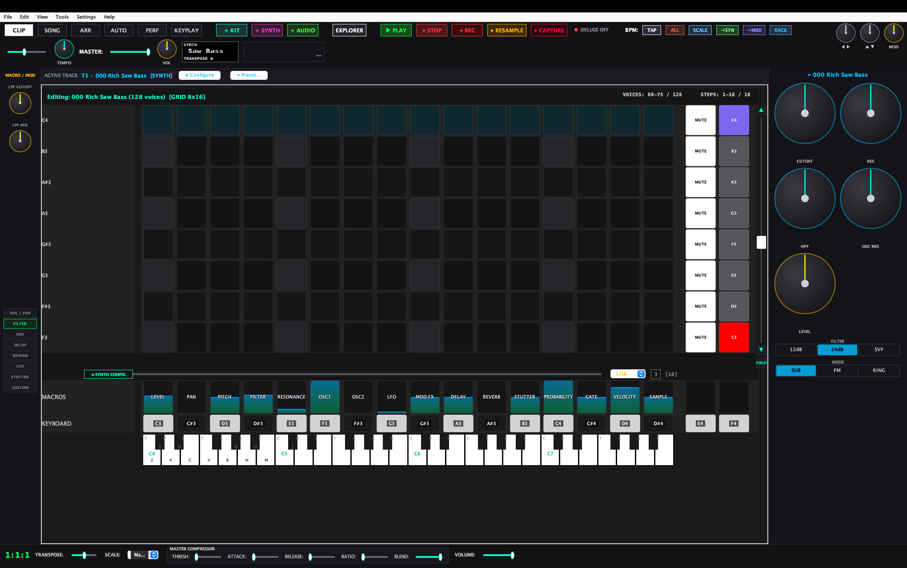

### 1.1 Sequence Editing Basics

*   **Create a Note**: Click any pad at the pitch (row) and moment (column) you want. The pad lights up to show a note is present.
*   **Audition a Pitch**: Each row is a pitch. Click the right-most pad in a row (the **audition pad**) to hear that pitch without adding a note.
*   **Audible Feedback**: When the transport is stopped, placing or auditioning a note sounds it immediately. While playing, that preview is suppressed so you don't hear stray notes during a performance.
*   **Delete a Note**: Click a pad that already holds a note to remove it.
*   **Change Track Color**: Click the colored swatch in the track's row header to recolor the track. (On the hardware this is `Shift` + the `▼▲` knob — see the mapping tables in §18–§19.)

> [!TIP] **Undo & Redo.** Most note, step, automation, parameter, and clip/track edits are undoable: press **`Ctrl + Z`** to undo and **`Ctrl + Y`** to redo (also under the **Edit** menu). A few operations aren't yet on the undo stack — see the note in §21.

---

### 1.2 Kit Tracks & Muting Rows

Instead of having a synth assigned, a track may have a "kit". For kit tracks, each row of pads represents an entirely different sound (e.g. Row 1 = Kick, Row 2 = Snare, Row 3 = Closed Hat).

*   **Convert to Kit Track**: Add a kit track from the sidebar (right-click ➔ **Add Kit Track**), or click the **[KIT]** button. Each row now triggers a different drum sound.
*   **Mute a Drum Row**: Click the row's mute pad (second from the right; green). It turns yellow to show the row is muted; click again to unmute.
*   **Re-order Kit Rows**: Drag the row's header up or down to move it. The row and its notes move together.
*   **Set Row Color**: Click the colored swatch on the drum row to recolor it.

---

### 1.3 Sound Parameters (Gold Dials & the Dials Deck)

The two **gold dials** at the top of the window control the parameters of the track's synth or sampler engine, and the row of function buttons/tabs beside them chooses *which* pair of parameters the dials adjust (Volume/Pan, Cutoff/Res, Attack/Release, and so on). Each dial shows its current value on the level meter to its left.

*   **Affect Entire Kit**: For a kit track, click **[AFFECT ENTIRE]** so it lights up. The gold dials now shape *every* drum in the kit at once instead of the selected row.
*   **Custom Parameters**: Three function slots are labelled "Custom 1–3". Custom 1 typically controls pitch (samples) or portamento (synths); Custom 2 and 3 control sample-rate reduction and bitcrushing for kits or for songs in Affect Entire mode.
*   **Filter, Delay & FX toggles**: Options that the hardware hides behind a *push* of a dial live as visible controls in this desktop build — the LPF/HPF/EQ tabs and 12/24 dB slope in the **DSP FX dials deck** (§8), the Ping-Pong and Analog checkboxes in the Delay deck, the Chorus/Flanger/Phaser selector in Mod FX, and the reverb model/size controls. See §8 (DSP FX) and §24 (Master FX Console) for the full layout.

---

### 1.4 Scrolling, Grid Zoom & Time Resolution

Two independent controls are easy to confuse, so it's worth separating them:

*   **Grid (pad) zoom** changes how *big* the pads are — how many rows and columns fill the window — without changing the music. Use the **View** menu or **`Ctrl + =`** / **`Ctrl + -`** to cycle the 8×16, 16×16, 24×16, and 16×24 layouts (see §1.11).
*   **Time resolution** changes how much time each column represents (16th, 32nd, 64th…). Pick it from the **rate selector** at the bottom of the clip grid. A finer resolution lets you place notes on smaller subdivisions.

Getting around the grid:

*   **Vertical scrolling**: Scroll the mouse wheel over the grid, or drag the vertical scrollbar. On synth/MIDI/CV tracks this moves through pitches (up = higher); on kit tracks it reveals more drum rows.
*   **Horizontal scrolling**: Scroll the wheel horizontally or drag the bottom scrollbar to move along longer sequences.
*   **Fine-detail indicator**: When you view a long clip at a coarse resolution, any column that hides finer notes than the current grid can show is drawn almost-white. Choose a finer rate to reveal and edit them.

---

### 1.5 Moving & Nudging Notes

*   **Move a note**: Drag a note pad along its row to slide it earlier or later in time, or up/down to change its pitch.
*   **Shift the whole clip sideways**: press **`Alt + →`** or **`Alt + ←`** to move *every* note in the clip one step later or earlier. Notes that fall off one end wrap around to the other. It's a single, undoable action (`Ctrl + Z`).
*   **Fine nudge**: Right-click a step ➔ **Edit Step Properties…** and use the **Nudge** slider to shift that note by a fine amount within its column — handy for humanizing timing without changing the grid resolution.

---

### 1.6 Triplet Timing & Beat Guides

*   **Triplet toggle**: Click the **triplet** toggle on the rate selector at the bottom of the clip grid. Time is now divided into threes rather than fours, so you can build triplet and shuffle rhythms.
*   **Beat guide stripes**: Empty grid cells are tinted to mark the strong beats so you can navigate at a glance:
    *   *Straight*: emphasis on steps 1, 5, 9, and 13.
    *   *Triplet*: emphasis on steps 1, 4, 7, and 10.

---

### 1.7 Note Length, Extensions & Drones

By default a note lasts until the start of the next column (for example, a 16th note at 16th resolution).

*   **Create a longer note**: Click the note's starting pad and drag right along the row (or hold the start pad and click a pad further right). The note extends to fill the pads in between.
*   **How extensions look**: Only the note's first pad is fully bright. The pads it extends over are dimly lit to show they're a *tail* of the same note, not new notes.
*   **Shorten a note**: Click any of the dim tail pads to trim the note back to that point.
*   **Create a drone**: Extend a note across the entire clip length. The workstation holds it continuously instead of retriggering it each time the clip loops.

---

### 1.8 Step Properties: Velocity, Probability & Iteration

Right-click any step and choose **Edit Step Properties…** to open the Step Properties dialog. Everything about how that step plays lives here:

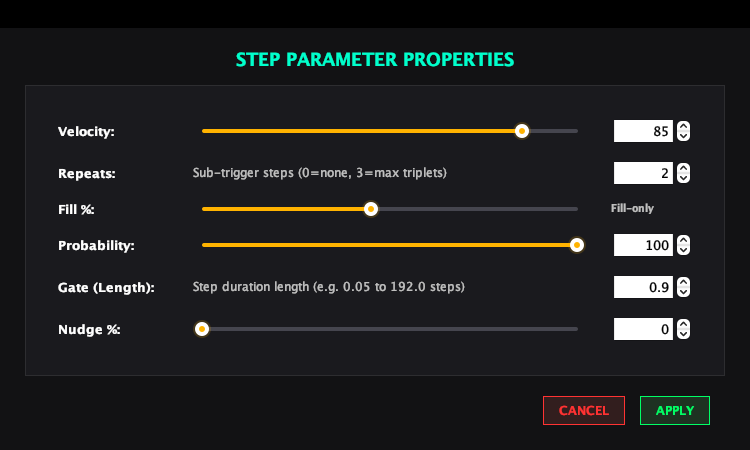

*   **Velocity** (1–127): how hard the note is struck. Drag the slider or type a value; louder notes are drawn brighter on the grid.
*   **Probability / Fill**: the chance the note fires on any given pass — great for evolving, non-repetitive patterns.
*   **Iteration**: play the note only on specific repeats of the loop (for example, "1 of 4").
*   **Gate**: the note's sounding length as a fraction of its step.
*   **Nudge**: fine timing offset within the column (see §1.5).

To edit several notes at once, use the **Piano Roll editor** (§1.9) — a scrollable, whole-clip view with freehand drag editing.

---

### 1.9 Editing Long Clips with the Piano Roll

The pad grid is perfect for building a pattern a step at a time, but for long, multi-bar phrases the **Piano Roll editor** gives you the whole clip at once — no paging between screens.

*   **Open it**: **`Tools ➔ Piano Roll Editor…`** (**`Ctrl + P`**), or right-click any step ➔ **Open Piano Roll Editor…**.
*   **What you get**: every note in the clip laid out on a scrollable pitch × time grid. Drag notes to move them, drag their ends to change length, and click to add or remove notes — across the full length of the clip, at any zoom.
*   **Grid alternative**: you can also **zoom out** (`Ctrl + -`, or pick a coarser rate) to fit the whole clip on the pad grid and edit any bar directly.

> [!NOTE] The desktop workstation doesn't need the hardware's *cross-screen* mode (which mirrors an edit across every screen of a long clip): the Piano Roll and grid zoom-out already show the entire clip on one screen, so you edit any bar directly.

---

### 1.10 The Euclidean Rhythm Generator

The Euclidean generator spreads a number of hits as evenly as possible across a row — a fast way to build drum patterns and polyrhythms.

*   **Open it**: right-click any step in the row you want to fill ➔ **Euclidean Fill Row…**. A dialog opens with an interactive **Euclidean Wheel** showing active pulses as glowing dots and silent steps as dim ones.
*   **Parameters**:
    *   **Steps (N)**: the number of steps to spread across (up to 16).
    *   **Pulses (K)**: the number of active hits to distribute.
    *   **Rotation**: shifts every hit forward by a number of steps (moves the downbeat).
*   **How the spacing is computed**: hit *n* lands on step `(n · N / K + rotation) mod N`, distributing the *K* pulses as evenly as the *N* steps allow — the same even-spacing the firmware uses.
*   **Apply**: click **Apply** to write the pattern onto that row. It replaces the row's existing steps, plays back immediately, and is a single **undoable** action (`Ctrl + Z`).

---

### 1.11 Sequencer Grid Zooming & Proportional Scaling

The workstation features a **Grid Zooming** engine. Changing the sequencer resolution dynamically resizes the cell pads (grid buttons) so they fit and fill the active window boundaries.

#### Grid Zoom Keyboard Shortcuts:
The grid resolution can be zoomed from anywhere inside the active window using standard global desktop shortcuts:
*   🔍 **Zoom In (Larger Pads / Fewer Cells)**: **`Ctrl + =`** (or **`Cmd + =`** on macOS)
    *   *Effect*: Scales the cell pads up, cycling the viewport layout: **`24x16 (Small)` $\rightarrow$ `16x16 (Medium)` $\rightarrow$ `8x16 (Large)`**.
*   🔍 **Zoom Out (Smaller Pads / Denser Cells)**: **`Ctrl + -`** (or **`Cmd + -`** on macOS)
    *   *Effect*: Scales the cell pads down, cycling the viewport layout: **`8x16 (Large)` $\rightarrow$ `16x16 (Medium)` $\rightarrow$ `24x16 (Small)`**.

#### Proportional Fixed-Row Scaling:
The bottom fixed panels — **`MACROS`** (vertical DSP routing knobs) and **`KEYBOARD`** (the playhead note isomorphic keyboard) — are **decoupled from static row indexes and integrated into the layout system**:
*   **Dynamic Positioning**: The fixed rows automatically calculate their positions based on `gridMode.rows` (Macros are placed at index `gridMode.rows`, and Keyboard at index `gridMode.rows + 2`). They do not overlap or hide sequencer notes when switching views.
*   **Proportional Height Sync**: The height of these fixed rows scales in proportion to the voice pads size (`padSz`):
    *   **Macros Height**: `(int) (padSz * 1.1)` (capped at a minimum of `28` pixels for usability).
    *   **Keyboard Height**: `(int) (padSz * 0.6)` (capped at a minimum of `16` pixels).
*   *Result*: As you zoom out to denser modes (like `24x16` or `16x24`), the keyboard keys and macro sliders shrink proportionally, maintaining layout balance and optimizing vertical screen space.

#### 🖥️ The Interactive "View" Menu:
A View menu is located in the main menu bar. It provides:
1.  **Zoom In** and **Zoom Out** options alongside their respective keyboard shortcut symbols.
2.  **A Radio Button Group** representing the active grid size:
    *   `● 8x16 Grid (Large Pads)`
    *   `○ 16x16 Grid (Medium Pads)`
    *   `○ 24x16 Grid (Small Pads)`
    *   `○ 16x24 Grid (Wide Pads)`
3.  **Bidirectional Real-Time Sync**:
    *   Pressing `Ctrl + =` or `Ctrl + -` dynamically updates the checked radio button in the menu bar.
    *   Clicking a radio button in the menu bar instantly scales the grid and updates preferences.

---

### 1.12 Fold Mode & Vertical Space Optimization

The Deluge Workstation features a **Fold Mode** for synthesizer clip tracks. It optimizes the workspace by collapsing empty rows on the sequencer grid, allowing you to focus on the musical structure of your pattern.

#### The Concept:
* **Unfolded Mode (Default)**: Displays a full chromatic piano roll spanning 128 rows (representing MIDI notes 0 to 127). This allows you to sequence notes across any octave but requires vertical scrolling to navigate between pitches.
* **Folded Mode**: Collapses the grid to **only display rows that contain programmed notes** in the active clip (e.g., if your bassline only uses C3, D#3, and F3, the grid shrinks to exactly 3 rows). This eliminates empty vertical space, bringing all notes onto a single screen.

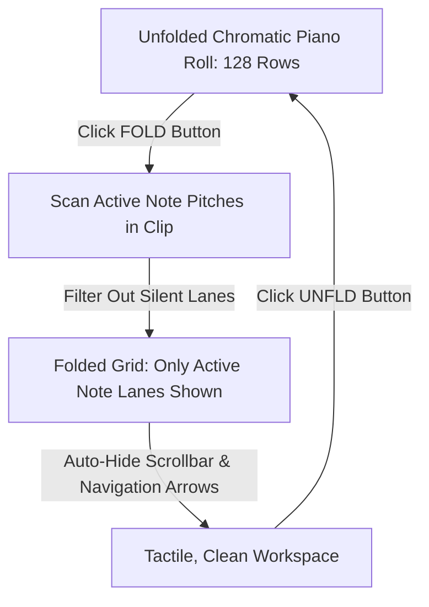
```mermaid
graph TD
    A[Unfolded Chromatic Piano Roll: 128 Rows] -->|Click FOLD Button| B[Scan Active Note Pitches in Clip]
    B -->|Filter Out Silent Lanes| C[Folded Grid: Only Active Note Lanes Shown]
    C -->|Auto-Hide Scrollbar & Navigation Arrows| D[Tactile, Clean Workspace]
    D -->|Click UNFLD Button| A
```

#### Key Features & System Architecture:
* **The Unified Pitch Resolver**: 
    * In a collapsed UI layout, note triggers must map back to their absolute pitches.
    * The workstation implements a pitch resolver that maps step clicks on the folded view back to their absolute chromatic MIDI pitches, ensuring perfect data integrity.
* **Auto-Hiding Scroll Controls**:
    * If the active note rows fit on a single screen (8 rows or fewer), the vertical scrollbar, Page Up, and Page Down buttons **automatically hide** to maximize grid workspace.
    * The side navigation panel remains locked at a fixed width of **32 pixels** to prevent horizontal pad shifting.

#### How to Use Fold Mode:
1. Select a Synth track to enter its Track View.
2. Look at the vertical navigation panel on the far right. At the bottom right, you will see a glowing green button labeled **`FOLD`**.
3. Click **`FOLD`**. The grid will instantly collapse to display only your active note rows. The button will toggle to a glowing cyan background labeled **`UNFLD`**.
4. To add a new note at a pitch that is not currently in the folded view, click **`UNFLD`** to return to the chromatic piano roll, click a pad to add the note, and then click **`FOLD`** again to collapse the grid with the new pitch included!

---

## 2. Synthesizers & Sound Engines

Open a synth's sound editor by **double-clicking the track's name** in its row header. The editor is organized into grouped tabs: **OSC / FILTER / FM** (the main page — oscillators, the LPF, and FM depth), **SOURCES** (OSC, ALGORITHM, DX7 operators), **HPF**, **ENVELOPE**, **LFO**, **MODULATION**, **ARP**, **FX** (Mod FX, EQ, Compressor), and **SETUP** (Automation, MIDI Learn).

At the top of the editor, the **Synth Mode** selector switches the core engine between three modes:

* **SUBTRACTIVE** — oscillators through a resonant filter (the classic analog path).
* **FM** — 6-operator frequency modulation (DX7-style).
* **RING MOD** — two oscillators multiplied together for metallic, bell-like tones.

Two things are often mistaken for separate modes: **wavetable** and **multi-sample** playback are *oscillator types* you pick as an oscillator's shape within Subtractive mode (§2.3, §2.5), and **glide/legato** is set by the **Polyphony** mode — POLY, MONO, LEGATO, AUTO, or CHOKE (§2.4).

```carousel
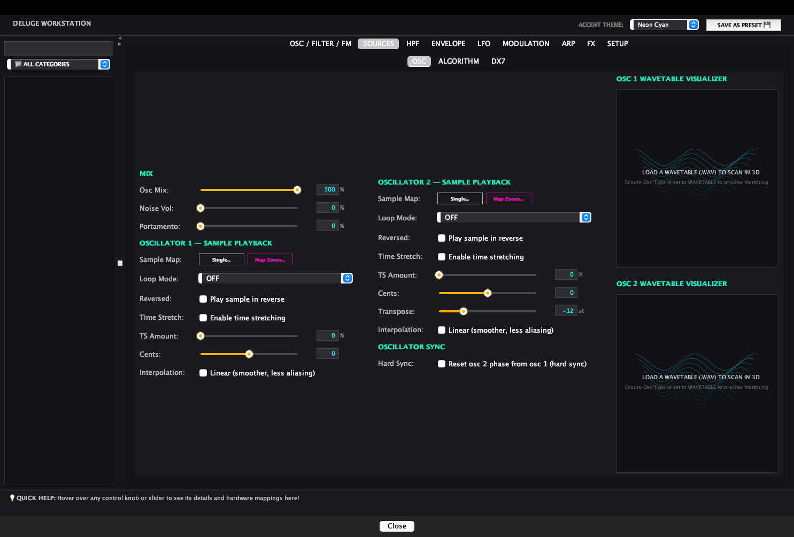
<!-- slide -->
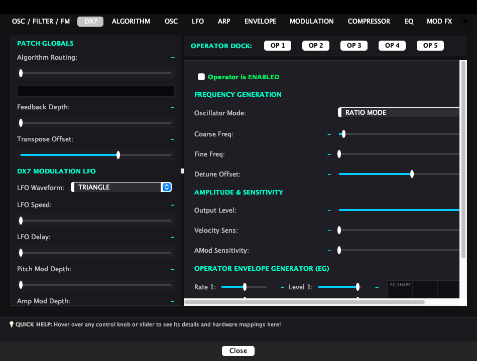
<!-- slide -->
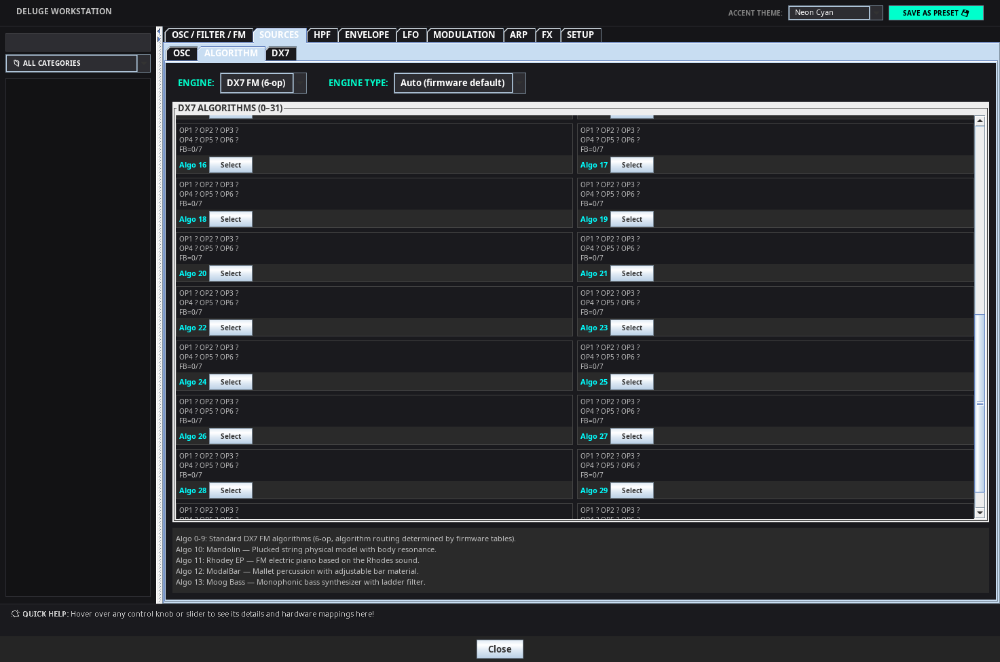
```

### 2.1 Subtractive Synthesizer Engine
Subtractive synthesis models standard analog signal paths: Oscillators ➔ Resonant Filters ➔ VCA Amplifier.
* **Dual Detuned Oscillators (Osc A & Osc B)**: Selectable shapes:
  * *Sine, Triangle, Sawtooth, Square wave with adjustable Pulse-Width (PW)*.
  * *Noise generator* (white/pink) to sculpt transient cracks or ambient grit.
* **Moog-Style Resonant Ladder Low-Pass Filter (LPF)**: A model of a 4-pole ($24\text{dB}/\text{octave}$) ladder filter with drive saturation and resonance.
* **High-Pass Filter (HPF)**: Separate resonant 2-pole high-pass path to carve out low-frequency rumble.

#### 🎸 Tutorial A: Detuned Analog Sub-Bass (Subtractive Mode)
1. Double-click the track name to open its sound editor, then open **SOURCES ▸ OSC**. Set:
   * **Osc A Shape**: **`SAWTOOTH`**, **Level**: **`90%`**.
   * **Osc B Shape**: **`SAWTOOTH`**, **Level**: **`80%`**, **Detune (Fine)**: **`+12 cents`** (detuning creates analog chorusing).
2. On the main **`OSC / FILTER / FM`** tab, in the **FILTER (LPF)** section set **LPF Mode** to **`24dB Low Pass`**, Cutoff to **`450Hz`**, and **Drive (Saturation)** to **`12%`** (adds harmonic grit).
3. Select the **`ENVELOPE`** tab (specifically Envelope 1 VCA). Set:
   * **Attack**: **`2ms`** (instant punch).
   * **Decay**: **`200ms`** (tight low-end decay).
   * **Sustain**: **`15%`** (low background drone).
   * **Release**: **`100ms`** (clean mute tail).
4. *Result*: Trigger a low step (e.g. C3 or G2) on the grid: you will hear an analog detuned bass with ladder saturation.

---

### 2.2 6-Operator FM Synthesizer
FM synthesis generates complex, metallic, and crystal timbres by modulating the frequency/phase of operators at audio rates. The engine provides:
* **32 Carrier-Modulator Algorithms**: Choose standard operator configurations (Algorithms 1 to 32) mapping who modulates whom.
* **Operator Multipliers & Feedback**: Program individual frequency ratio multipliers ($0.5$ to $32.0$), output levels, feedback lines, and dedicated ADSR envelopes per operator.

#### 🔔 Tutorial B: Crystal Bell (6-Operator FM Mode)
1. Open the sound editor and set **Synth Mode** (top of the editor) to **`FM`**.
2. Open **SOURCES ▸ ALGORITHM**. Set the active Algorithm to **`Algorithm 05`** (maps Op 6 and Op 5 as modulators cascading into Op 1 carrier).
3. Open **SOURCES ▸ DX7**. Let's configure the key operators:
   * **Operator 1 (Carrier)**: Set **Ratio Multiplier** to **`1.0`** (fundamental pitch), and Level to **`90%`**.
   * **Operator 5 (Primary Modulator)**: Set **Ratio Multiplier** to **`3.5`** (creates standard bell harmonics), and Level to **`75%`**.
   * **Operator 6 (High-Modulator)**: Set **Ratio Multiplier** to **`8.0`** (bright crystal chime), and Level to **`60%`**.
4. Select the **`ENVELOPE`** tab (specifically Operator 5 and 6 envelopes). Set:
   * **Attack**: **`0ms`** (instant sharp strike).
   * **Decay**: **`180ms`** (quick pluck decay).
   * **Sustain**: **`0%`** (no sustain for modulators, so the bell pluck decays to the carrier).
5. *Result*: Trigger a high step note (e.g. C6 or E5): you will hear the classic FM crystal chime bell.

---

### 2.3 Wavetable Oscillators
Wavetable is an **oscillator type within Subtractive mode** (set an oscillator's shape to Wavetable in **SOURCES ▸ OSC**). It loops a table of single-cycle waveforms, and sweeping the index morphs the waveshape:
* **Wavetable Index Sweeping**: choose a wavetable WAV, set the base index, and write index automation to morph the waveshape over time.

---

### 2.4 Legato Glide & Portamento Pitch Slides

Portamento (Glide) introduces a smooth, continuous slide transition between consecutive notes pitch frequencies rather than an immediate pitch step jump. 
* **Legato Portamento mode (Auto-Glide)**: The pitch glide slides **only** when note pad keys overlap on the step sequencer grid. If notes are played staccato (separated gaps), pitch jumps immediately.
* **Portamento Glide Time (ms)**: Scale the slide transition time from 10ms to 1200ms.

#### 🎸 Tutorial F: Portamento Glide
1. Open the sound editor, set **Synth Mode** to **`SUBTRACTIVE`**, and in **SOURCES ▸ OSC** set Osc A to **`SAWTOOTH`**.
2. On the main **`OSC / FILTER / FM`** tab, set LPF Cutoff to a deep **`600Hz`** and Resonance to a high **`75%`** (acid squelch). Set LPF Envelope Mod to **`+55%`** (filter dynamics).
3. At the top of the editor:
   * **Polyphony Mode**: switch from `POLY` to **`LEGATO`** (auto-glide mode).
   * **Portamento Glide Time**: Set to **`150ms`**.
4. Go to the Clip sequencer grid. Let's enter steps:
   * Column 1: note **`C3`** (Length = 2 steps! It extends to the end of Column 2).
   * Column 2: note **`G3`** (Note starts on Column 2. Because Column 1's C3 is still active, the notes OVERLAP. This triggers the auto-glide).
   * Column 3: note **`F3`** (Length = 1 step).
   * Column 4: note **`C4`** (Starts on Column 4, overlapping F3).
5. Go to step properties for the C4 note: check the **Fill %** as standard or leave velocity at **`100%`**.
6. *Result*: Press play: you will hear an acid bassline sequence, sliding its pitch on overlapping steps.

---

### 2.5 Multi-Sample Keyzones & Pitch Ranges

Multi-sampling is a **sample oscillator type within Subtractive mode**, not a separate engine. For realistic acoustic instruments (pianos, strings, choirs), stretching one sample across the whole keyboard sounds unnatural — so a multi-sample oscillator lets you load several WAV files split across distinct key ranges:

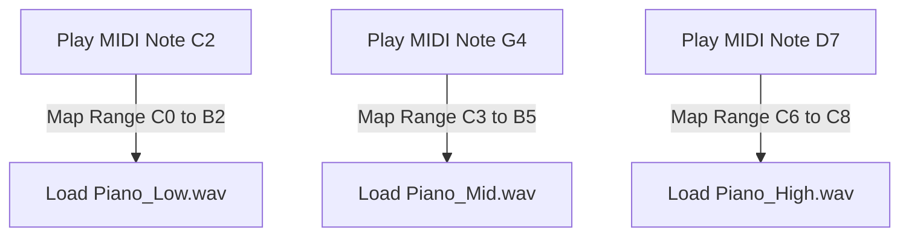
```mermaid
graph TD
    A[Play MIDI Note C2] -->|Map Range C0 to B2| B[Load Piano_Low.wav]
    C[Play MIDI Note G4] -->|Map Range C3 to B5| D[Load Piano_Mid.wav]
    E[Play MIDI Note D7] -->|Map Range C6 to C8| F[Load Piano_High.wav]
```

* **Keyzone Boundaries (Split Points)**: Configure target key boundaries (e.g., Zone 1 maps keys C0 to B2, Zone 2 maps C3 to B5, Zone 3 maps C6 to C8).
* **Root Pitch Mapping**: Assign the baseline root pitch for each WAV file (e.g., Zone 2 file is a recording of Middle C, so its root pitch is set to C4 / MIDI 60). The engine calculates detunes relative to the file's root pitch, ensuring correct pitch scaling.

#### 🎹 Tutorial G: Acoustic Piano Multi-Sampler
1. Open the sound editor (Synth Mode **`SUBTRACTIVE`**) and in **SOURCES ▸ OSC** set the oscillator type to the **multi-sample (sample)** source.
2. Add three keyzone slot rows mapping your instrument's raw acoustic recordings:
   * **Zone Slot 1**: Select file **`Piano_Bass_C2.wav`**. Set Key Range from **`C0 to B2`** and Root Pitch to **`C2 (MIDI 36)`**.
   * **Zone Slot 2**: Select file **`Piano_Mid_C4.wav`**. Set Key Range from **`C3 to B5`** and Root Pitch to **`C4 (MIDI 60)`**.
   * **Zone Slot 3**: Select file **`Piano_Treble_C6.wav`**. Set Key Range from **`C6 to C8`** and Root Pitch to **`C6 (MIDI 84)`**.
3. Go to the **`ENVELOPE`** tab (Envelope 1 VCA). Set Attack to **`1ms`** (instant strike), Decay to **`2.5s`**, Sustain to **`0%`**, and Release to **`250ms`** (natural acoustic resonance tail damping).
4. *Result*: Play steps across separate octaves: the sequencer will dynamically load and trigger different recordings, delivering a multi-sampled acoustic piano.

---

### 2.6 Ring Modulation Sound Synthesis

Ring Modulation multiplies two audio frequency signals at audio rates. The output signal contains the sum and difference frequencies of the input waves, but silences the individual original pitches, generating metallic or bell-like industrial timbres:

$$V_{out}(t) = \text{Osc A}(t) \times \text{Osc B}(t)$$

* **Oscillator A (Carrier) & Oscillator B (Modulator)**: Dual audio signal inputs multiplied at audio rates.
* **Frequency Ratio Splits**: Tuning the frequency split between Osc A and Osc B to non-harmonic intervals (e.g. detuning Osc B by a tritone or major 7th) yields complex robotic timbres.

#### 🤖 Tutorial H: Ring-Modulation Pluck
1. Open the sound editor and set **Synth Mode** (top of the editor) to **`RINGMOD`**.
2. Configure your dual input oscillators:
   * **Osc A Shape**: **`SINE`** (warm carrier fundamental), **Pitch Tuning**: **`0 semitones`**.
   * **Osc B Shape**: **`SAWTOOTH`** (rich modulator harmonics), **Pitch Tuning**: **`+11 semitones`** (detuned major 7th interval creates metallic ring-modulation splits).
3. Go to the main **`OSC / FILTER / FM`** tab, set LPF Cutoff base to a dark **`700Hz`** and Resonance to a moderate **`45%`**.
4. Go to the **`ENVELOPE`** tab (specifically Envelope 2 VCF). Set Attack to **`0ms`** (instant sharp strike), Decay to **`120ms`** (quick pluck decay), and Sustain to **`0%`**. Set the LPF Envelope Mod to a high **`+60%`** (plucky filter sweep).
5. *Result*: Sequence a steps phrase: you will hear a sharp, ring-modulated pluck for industrial leads.

### 2.7 Chord Keyboard (CORK & CORL Layouts)

The Chord Keyboard maps pads to chords, scale degrees, and inversions. Access this workspace by selecting **`CHORD_LIBRARY`** or **`CHORD`** from the **KB** dropdown JComboBox at the top toolbar (or via Tab view cycles):

* **Mode 1: PIANO Layout**: Standard isomorphic chromatic keyboard mapping. Pads in the current scale are highlighted in dim blue/slate, and root notes glow in mint-green.
* **Mode 2: CORK (Chord Keyboard)**:
  * **COLUMN Mode**: Harmonically similar chords are stacked vertically. Clicking a grid pad triggers scale-degree chords (I, ii, iii, IV, V, vi, vii) matching the selected key.
  * **ROW Mode**: Spreads scale intervals horizontally (Launchpad Pro style).
* **Mode 3: CORL (Chord Library)**: A comprehensive chord catalog. Columns represent the 12 chromatic root notes ($C \dots B$), and rows represent chord qualities (Major, Minor, Dominant 7th, Major 7th, Minor 7th, Diminished, Suspended, etc.). Scale-aware highlighting indicates in-key chords.
* **Chords Voicings & Inversions**: Select the Voicing mode dropdown to instantly change the note spreads across the operators voice allocations:
  1. *Close*: Standard tight stack.
  2. *Drop 2*: Drops the second-highest note by an octave (classic jazz voicing).
  3. *Open*: Spreads notes across wider octave intervals.
  4. *Spread*: Spans multiple octaves.
  5. *Rootless*: Plays only the 3rd, 5th, and extensions (7th, 9th) to leave room for bass tracks.
  6. *Octave*: Standard root-plus-octaves voicing.
* **Scroll Navigation**: Click the **`▲ / ▼`** buttons in the toolbar to shift the octave scale degree offset.

---

## 3. Drum Kits & Smart Keyword Auto-Mapper

A kit track holds up to 16 independent drum sounds, one per row. Beyond building a kit by hand, the **Kit Super-Generator** can assemble a whole kit from a folder of samples in one click, using a smart auto-mapper to sort files into the right slots. (For everyday kit editing — muting rows, reordering, recoloring — see §1.2.)

### 3.1 Smart Auto-Mapper Rules
When you pick a sample folder in the **`Kit Super-Generator (Tab 2)`**, the mapper matches filenames (case-insensitive substring, not full regex) to assign the first eight kit slots:

| Kit Slot | File-name keywords (any match) |
| :--- | :--- |
| **1 — Kick** | `KICK`, `BD`, `BASSDRUM`, `SUB` |
| **2 — Snare** | `SNARE`, `SD`, `RIM`, `STICK` |
| **3 — Closed Hat** | `CLOSED`, `CLH`, `CL_HAT`, `HHC`, `CH` (but not `CHORUS`/`CRASH`) |
| **4 — Open Hat** | `OPEN`, `OPH`, `OH`, `OP_HAT`, `HHO` |
| **5 — Clap** | `CLAP`, `CP`, `SNAP` |
| **6 — Perc / Shaker** | `RIM`, `SIDE`, `CLICK`, `PERC`, `TAMB`, `SHAKER` |
| **7 — Tom** | `TOM`, `FT`, `MT`, `HT`, `CONGA` |
| **8 — Cymbal / Ride** | `CRASH`, `RIDE`, `CYM`, `SPLASH`, `BELL`, `COWBELL` |

The mapper runs in two passes: first it fills slots 1–8 by keyword, then it fills any still-empty slots (up to 16 total) with the remaining unmatched samples in order — never assigning the same file twice.

### 🥁 Tutorial C: Drum Kit Construction & Auto-Choke
1. Press **`Ctrl + R` / `Cmd + R`** to summon the generators panel, and select **`Tab 2: Kit Super-Generator`**.
2. Click **`[📁 Browse Samples Directory]`** and select a folder of drum WAVs.
3. The mapper scans the directory, populates the slots 1–16 rows table, and applies the keyword templates.
4. Leave **`Auto-Choke Hats (Exclusion Mute Group 1)`** checked (it's on by default). This puts Slot 3 (Closed Hat) and Slot 4 (Open Hat) in Mute Group 1, so a closed hat cuts off the open hat's ring.
5. Click **`⚡ Generate & Load Drum Kit live`**. The workstation builds the kit, loads the samples, and rebuilds the track's audio players.
6. *Result*: Your active sequencer pads grid rows now house the drum kit. Sequence a kick, snare, and open/closed hats to hear the auto-choke behavior.

---

## 4. Visual Waveform Crop & Loop Markers Deck

Click the **⚙** button on a drum row to open that drum's settings editor, which includes the waveform crop deck:

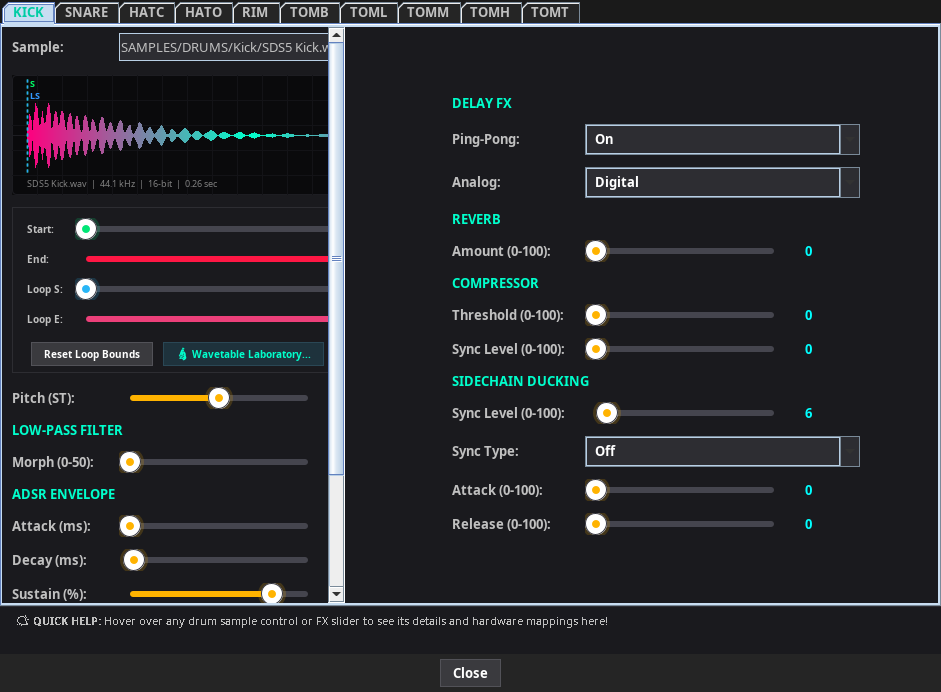

### Key Features:
* **Responsive loading**: samples decode in the background, so the waveform appears without freezing the interface.
* **Waveform canvas**: draws the sample's shape so you can see transients and set boundaries by eye.
* **4-Marker Interactive Crop Sliders**: drag in real time to set:
  * **Start Point (Green - S)**: Where the playback head begins reading samples.
  * **End Point (Red - E)**: Where the voice release completes.
  * **Loop Start (Blue - LS)**: Where continuous looping cycles begin.
  * **Loop End (Magenta - LE)**: Where continuous looping cycles wrap back to Loop Start.
* **💾 Save & Apply Crop Button**: Commits the sample frame limits back to the model, writes the XML kit configuration, and triggers playback reload so boundaries update instantly.

---

## 5. Automatic Loop Slicer & Kit Splitter

The menu action **`Tools ➔ Audio Loop Slicer...`** (global shortcut **`Ctrl + L` / `Cmd + L`**) opens the automatic breakbeat slicing dialog:

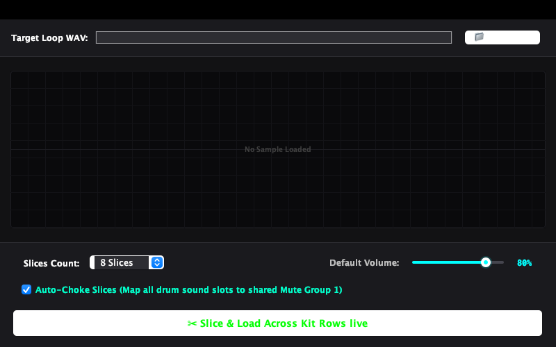

### Slicing Workflow:
1. **Choose a WAV loop**: Load any drum break, loop phrase, or sample WAV file. The waveform canvas draws the transients immediately.
2. **Select Slices Grid Combobox**: Choose divisions count (**`4 Slices`**, **`8 Slices`**, or **`16 Slices`**). The screen draws vertical dashed orange slice-dividers over the audio wave.
3. **Choke and Volume Setup**: Toggle checkboxes to auto-choke generated slices on Mute Group 1 (so triggering a new slice cuts off the playing tail) and scale initial volume multipliers.
4. **✂️ Slice & Load Across Kit Rows live**: click this button to split the loop, spread the slices across the kit's drum rows, save the kit to the `KITS/` folder, and load it onto the active track so you can play the sliced loop straight away.

---

## 6. The Visual Modulation Patchbay & Bipolar Modulation Math

Modulation routing functions like a virtual modulation patchbay. You can connect any modulation source to any destination with control over modulation polarity, depth, and summing.

### 6.1 The Modulation Summing Engine (The Mathematics)

When a target parameter (such as Low-Pass Filter Cutoff) has multiple active modulation paths, the engine sums the control signals. The mathematical formula for a modulated parameter value $V(t)$ is:

$$V(t) = V_{base} + \sum_{i=1}^{N} A_i \cdot S_i(t)$$

Where:
* $V_{base}$ is the scalar value of the parameter set by its main slider (e.g. LPF Cutoff set to $10\text{kHz}$).
* $A_i$ is the **Modulation Depth (Amount)** slider value ($-100\%$ to $+100\%$) cabled in the path list.
* $S_i(t)$ is the current real-time normalized output signal of the modulation source (ranging from $0.0$ to $1.0$ or $-1.0$ to $+1.0$).

#### Polarity Modes:
* **Unipolar Modulations (Uni)**: The source signal $S(t)$ scales from **`0.0 to 1.0`** (e.g. Velocity, Envelopes ADSR, Aftertouch, Sidechain). The modulation only increases the target value from the base offset (or decreases if the amount is negative).
* **Bipolar Modulations (Bi)**: The source signal $S(t)$ cycles symmetrically from **`-1.0 to +1.0`** (e.g. LFOs in standard mode, Key Tracking relative to middle C). The modulation moves the target value both above and below the base offset.

---

### 6.2 The Modulation Sources

The **Source** dropdown offers thirteen options — `velocity`, `envelope1`–`envelope4`, `lfo1`–`lfo4`, `aftertouch`, `note`, `random`, and `sidechain`. Each envelope and LFO is individually selectable:

1. **Velocity (Uni)**: note-on strike force. Useful for scaling volume, filter cutoff, or attack times by how hard a step is triggered.
2. **Envelope 1 (Uni)**: shapes the voice's volume outline (VCA) by default.
3. **Envelope 2 (Uni)**: sweeps the Low-Pass Filter cutoff by default.
4. **Envelopes 3 & 4 (Uni)**: two more ADSR envelopes, freely assignable (e.g. pitch or decay sweeps).
5. **LFO 1 & 3 (Bi, Global)**: Low Frequency Oscillators with one phase shared across all voices — good for synced, whole-patch movement. (Scope is fixed by slot, not selectable.)
6. **LFO 2 & 4 (Bi, Local)**: per-voice LFOs whose phase re-triggers on each note-on — good for independent per-note movement.
7. **Aftertouch (Uni)**: pressure held on pads during play.
8. **Note / Key Tracking (Bi)**: scales relative to MIDI pitch, centered on Middle C (note 60 = $0.0$); higher notes give positive offsets, lower notes negative.
9. **Random (Uni)**: a sample-and-hold value (0.0–1.0) chosen fresh on every note-on.
10. **Sidechain (Uni)**: envelope follower tracking Mute Group 1 (typically kicks) to duck other channels.

---

### 6.3 Operational Tutorial: The Modulation Matrix Tab UI

Open the sound editor (double-click the track name) and select the **`MODULATION`** tab to view the patchbay panel:

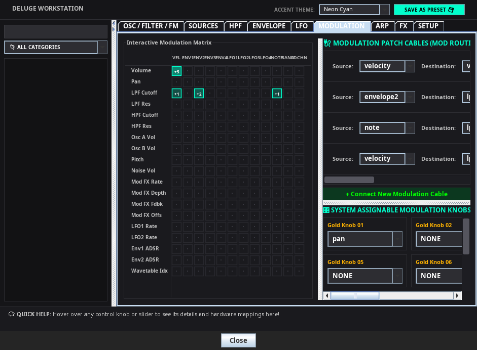

#### Managing Patch Cables:
* **Connect a New Cable**: Click the green **`[+ Connect New Modulation Cable]`** button at the bottom. A new routing row is instantiated at the end of the scroll list.
* **Configure Ports**: Select the source (e.g. `lfo1`) in the left combobox and the destination (e.g. `lpfFrequency`) in the right combobox.
* **Toggle Polarity**: Click the **`[Bipolar]`** toggle button. When selected, it glows in warm amber indicating bipolar mode (amount range $-100\%$ to $+100\%$); when unselected, it styles in dark charcoal indicating unipolar mode (amount range $0\%$ to $100\%$).
* **Adjust Slider Depth**: Drag the glowing cyan JSlider to set the modulation intensity. The numeric label displays the exact percentage (e.g. `+45%` or `-80%`). Changes are applied to the synthesis engine parameters.
* **Disconnect / Delete Cable**: Click the red **`[✖]`** button on the right to instantly disconnect the cable, restoring the destination's default behavior.

---

### 6.4 Six Step-by-Step Sound Design Tutorials

#### 🎹 Tutorial 1: Subtractive Brass Swell (Envelope 2 ➔ LPF Cutoff)
1. Double-click the track name to open its sound editor. In **SOURCES ▸ OSC** set Osc A to **`SAWTOOTH`**, and on the main **`OSC / FILTER / FM`** tab set LPF Mode to **`24dB Low Pass`**.
2. Select the main **`OSC / FILTER / FM`** tab and slide the Cutoff dial down to a low base value of **`800Hz`** (making the sound dark and warm).
3. Select the **`ENVELOPE`** tab (specifically Envelope 2). Set:
   * **Attack**: **`250ms`** (creates a gradual opening swell).
   * **Decay**: **`400ms`** (gradual decay).
   * **Sustain**: **`50%`** (steady sustained brightness level).
   * **Release**: **`300ms`** (clean fade out).
4. Select the **`MODULATION`** tab. Click **`[+ Connect New Modulation Cable]`**.
5. Set the Source combobox to **`envelope2`** and the Destination combobox to **`lpfFrequency`**.
6. Set the depth slider to **`+65%`** (making the filter sweep open on note triggers).
7. *Result*: Trigger a sequence step: you will hear a subtractive brass swell as the filter cutoff sweeps up and decays.

#### 🌀 Tutorial 2: Polyphonic Vibrato (LFO 1 ➔ Pitch)
1. Open your Synth Config Dialog, go to the **`LFO`** tab (LFO 1 section). Set LFO 1 shape to **`SINE`** and the rate to **`6.2Hz`** (vibrato speed).
2. Go to the **`MODULATION`** tab, click **`[+ Connect New Modulation Cable]`**.
3. Set the Source to **`lfo1`** and the Destination to **`pitch`**.
4. Click the **`[Bipolar]`** button so it glows in active amber (bipolar pitch vibrato).
5. Slide the depth slider to a very small positive percentage: **`+8%`** (subtle vibrato) or **`+15%`** (heavy chorused wiggle).
6. *Result*: Play steps: you will hear a vibrato.

#### 🌀 Tutorial 3: Organic Filter Sweeps (LFO 2 ➔ LPF Cutoff)
1. Open your Synth dialog, select the **`LFO`** tab (LFO 2 section). Set LFO 2 shape to **`TRIANGLE`** and set a very slow rate of **`0.35Hz`** (one full cycles sweep every 3 seconds).
2. Select the main **`OSC / FILTER / FM`** tab, set LPF Cutoff base to a middle frequency: **`2.5kHz`**.
3. Select the **`MODULATION`** tab, click **`[+ Connect New Modulation Cable]`**.
4. Set the Source to **`lfo2`** and the Destination to **`lpfFrequency`**. Ensure **`[Bipolar]`** is toggled active.
5. Slide the depth slider up to **`+45%`**.
6. *Result*: Hold down a long pad sequence gate: the filter cutoff will slowly open and close, creating a moving filter sweep.

#### 🎛️ Tutorial 4: Mod-of-Mod (LFO 2 ➔ LFO 1 Depth)
1. Setup standard vibrato first: Go to the **`LFO`** tab, set LFO 1 (vibrato LFO) shape to **`SINE`** and rate to **`6.5Hz`**. Set LFO 2 (modulator LFO) shape to **`TRIANGLE`** and rate to a slow **`0.5Hz`**.
2. Go to the **`MODULATION`** tab, click **`[+ Connect New Modulation Cable]`**.
3. Set the Source to **`lfo1`** and the Destination to **`pitch`**. Set Bipolar to active and set a moderate depth: **`+20%`**.
4. Click **`[+ Connect New Modulation Cable]`** to add a SECOND cable route (Modulation of Modulator!).
5. Set the Source to **`lfo2`** and set the Destination combobox to **`lfo1Rate`** (modulating LFO 1 vibrato rate!) or **`modFxDepth`**!
6. *Result*: The slow LFO 2 will dynamically modulate the vibrato speed and depth itself, modulating the vibrato speed/depth.

#### ⛽ Tutorial 5: Sidechain Ducking (Sidechain ➔ Volume)
1. Focus your drum kit track containing your Kick drum (Slot 1). Go to its slot configuration and ensure its Mute Group is set to **`1`** (or is named Kick).
2. Open the Synth track config dialog you want to duck behind the kick. Go to the **`MODULATION`** tab, click **`[+ Connect New Modulation Cable]`**.
3. Set the Source to **`sidechain`** and the Destination to **`volume`**.
4. Ensure the **`[Bipolar]`** button is UNSELECTED (unipolar mode, ducking volume down!).
5. Slide the depth slider to a negative percentage: **`-85%`** (near-total silence on Kick hits) or **`-50%`** (mild ducking).
6. *Result*: Press play on the sequencer: every time the Kick drum triggers on the grid, the Synth track's volume will duck, ducking the synthesizer volume.

#### 🎯 Tutorial 6: Velocity Filter Dynamics (Velocity ➔ LPF Cutoff)
1. Open your Synth config, set LPF Cutoff base to a warm **`1.2kHz`**.
2. Select the **`MODULATION`** tab, click **`[+ Connect New Modulation Cable]`**.
3. Set the Source to **`velocity`** and the Destination to **`lpfFrequency`**.
4. Set the depth to **`+50%`**.
5. Go to the step sequencer grid: enter steps and adjust their velocities (click a pad to open step properties, slide velocity values between `15%`, `50%`, and `100%`).
6. *Result*: Steps with low velocity will sound dark and muted, while steps hit with full velocity will open the filter wide, creating velocity-dependent filter variations.

---

## 7. Song & Arrangement Linear Timelines View

Switch between workspaces with the **view buttons in the top toolbar** — **CLIP**, **SONG**, **ARRANGEMENT**, and **PERF**. (The ARRANGEMENT button is a two-step toggle: one click shows the linear timeline; a second click shows Song view.)

* **CLIP View**: a single pattern's piano-roll grid — where you draw and edit notes (Chapters 1–2).
* **SONG View**: all your clips at once, one per row, shown as their actual note patterns and grouped into Song Sections. Launch and mute clips live to audition transitions and build structure.
* **ARRANGEMENT View**: a horizontal timeline, one lane per track, where you place clip blocks along bars to lay out the finished song. At the default zoom each grid column is **96 ticks** (one bar).

### 7.1 Song View — Launching & Muting Clips

Each row shows a clip drawn as its own step pattern, tinted by its Song Section colour, so you can read the whole arrangement at a glance.

* **Launch / mute a clip**: click a clip's launcher to start or stop it. The change is quantized to the loop boundary so it stays in time.
* **Launch a whole Section**: click a Section pad to queue every clip in that section together.
* **Status square** (in the sidebar): **green** = active, **red** = muted/stopped, **blue** = soloed; it dims when another track is soloing so the soloed one stands out. While a clip is *armed* and waiting for the loop boundary, the square **blinks white** — matching the hardware's blinking launch pad.

### 7.2 Arrangement View — Building the Timeline

Lay clip blocks along each track's lane to compose the full song:

* **Add a block**: click an empty slot in a track's lane to open a menu of that track's clips (plus **Create New Pattern Clip (1 bar)**); pick one to drop a block there.
* **Move a block**: drag a block horizontally. It snaps by whole columns (96 ticks / one bar), and can't move before the start of the timeline.
* **Resize a block**: hold **Shift** and drag a block's edge to lengthen or shorten how long it plays, again in one-bar steps (minimum one bar).
* **Delete a block**: right-click (or double-click) a block to remove that placement.

### 7.3 Live Capture

Enable **Live Capture** to record a Session performance straight into the arrangement: as you launch and stop clips in Song view, their start and length are written onto the timeline as Arrangement blocks, so you can perform an arrangement and keep it.

---

## 8. Master FX Console & Bottom Master Panel

Effects processing in the Deluge-Java Workstation is split into three levels: the **Bottom Master Panel** for global project controls, the **Master FX Console** dialog for global spatial effects, and per-track **Track-Level FX** inside the sound editor.

### 8.1 The Bottom Master Panel
Located directly under the step sequencer grid, this compact 54px panel provides key master parameters:
*   **Status Counter**: Shows the active playhead beat position in real time (e.g. `1:1:1`).
*   **Transpose**: Global playback transposition (-24 to +24 semitones).
*   **Scale Mode**: Quantizes isomorphic pads notes to the selected scale (Major, Minor, Pentatonic, Chromatic).
*   **Master Compressor**: Quick adjustments for Threshold, Attack, Release, Ratio, and Blend.
*   **Master Volume**: Overall song playback gain.

### 8.2 The Master FX Console
Clicking the **`🎛️ MASTER FX`** button in the top toolbar opens the global Mixing Console. It provides four tabs:
1.  **🌌 REVERB TANK**: global room size, decay, high-pass (HPF) damping, and stereo width. The reverb defaults to **Freeverb**, with Mutable/Rings and Digital Chamber models also available.
2.  **💨 REVERB COMP**: A dedicated sidechain compressor that ducks the reverb tail based on signal transients.
3.  **⏳ STEREO DELAY**: Configures delay feedback, tempo sync timing divisions, Ping-Pong mode, and Analog Mode (filter color simulation that dampens high frequencies on repeats).
4.  **🌋 DRIVE & SAT**: Adjusts master saturation threshold (adding analog tube saturation harmonics), sample-rate decimation, and bitcrush distortion.

### 8.3 Track-Level FX (Sound Editor)
Double-clicking a track name opens the sound editor (or Synth Configuration Dialog), containing dedicated panels for sculpting individual track signals:
*   **HPF**: A 2-pole resonant high-pass filter with feedback ladder overdrive to clean up low-end rumble.
*   **EQ**: Master 2-band shelving equalizer (Bass and Treble boost/cut).
*   **COMPRESSOR**: Dynamic compressor adjusting Threshold, Ratio, Attack, Release, and sidechain HPF.
*   **MOD FX**: Configures rate, depth, and feedback parameters for Chorus, Flanger, or Phaser modulation lines.

#### 🎛️ Tutorial D: Polish a Lead Synth (Track-Level FX)
1. Double-click the Synth track name to open its sound editor.
2. Select **FX ▸ MOD FX**. Set the type to **`FLANGER`**, the Rate to **`0.45Hz`** (slow movement), and the Depth to **`60%`**.
3. Select **FX ▸ EQ**. Boost **Treble** to **`+3dB`** and cut **Bass** to **`-2dB`** to help the lead cut through the mix.
4. Select **FX ▸ COMPRESSOR**. Set the Threshold to **`-18dB`**, the Ratio to **`4.0:1`**, and the Attack to **`15ms`**.
5. Select the **`HPF`** tab. Slide the HPF Cutoff to **`120Hz`** to filter out unnecessary low rumble.
6. *Result*: The lead synth now sounds wider, cleaner, and dynamically controlled in the stereo mix.

---

## 9. Delugeator Multi-Generator Dashboard Suite

The top menu action **`Tools ➔ Delugeator Randomizer...`** (global shortcut **`Ctrl + R` / `Cmd + R`**) opens the multi-tab sound generator dialog:

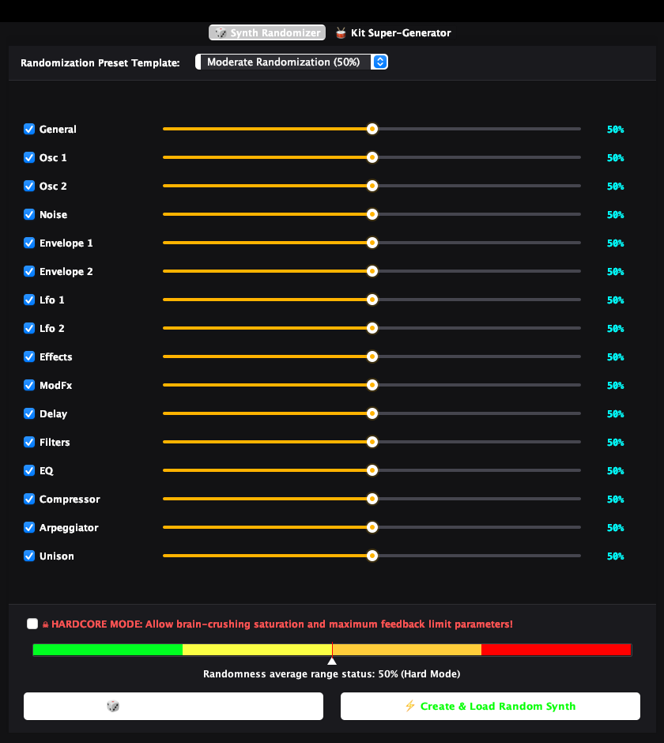

### Tab 1: 🎲 Synth Randomizer:
* **Continuous Probability Distributions**: Algorithms morph subtractive parameters, FM carrier multipliers, and filter feedback.
* **Live Randomness Gauge**: A horizontal multi-colored progress bar with a white tracking needle that maps the patch's average randomness percentage onto a visual range scale (from Safe/Mild up to Wild/Brain-Crushing).
* **Hardcore Mode**: Checking this box (**Hardcore Mode ☠️ (Worse presets, but fun)**) allows wider FM feedback loops, extreme ladder overdrive, and filter self-oscillation.

### Tab 2: 🥁 Kit Super-Generator:
* Select a sample directory, automatically map drum kits to track rows using the smart case-insensitive auto-mapper, audition steps, enable Auto-Choke (exclusion mute group 1) for hats, and generate ready-to-load drum kit XML presets in one click.

### 9.3 Drone Lab & Evolving Texture Generator:
The top menu action **`Tools ➔ Drone Lab & Texture Generator...`** (global shortcut **`Ctrl + D` / `Cmd + D`**) opens the Drone Lab dialog to build drone textures, apply microtonal temperaments, and sweep parameters.

*   **Synthesis Engines**:
    *   *Subtractive Unison Drone*: Configures detuned saw oscillators (with Osc 2 transposed one octave up and detuned by `16` cents), a 4-voice unison chorus with a wide `50%` stereo spread, a dark **24dB Moog-style Ladder LPF** (centered at a warm `1200.0` Hz cutoff, `0.35` resonance, and `0.12` drive), analog tape noise injection, and envelopes.
    *   *Golden Ratio FM Drone*: Configures metallic, non-harmonic modulator frequency multipliers—Modulator 1 at $\sqrt{2} \approx 1.414$ and Modulator 2 at $\phi \approx 1.618$—routed through a warm **12dB Ladder LPF** (cutoff at `2800.0` Hz) to craft crystal, industrial-metallic space textures.
*   **Just Intonation Microtuning**: Automatically tunes the project's scale to a pure **5-limit Just Intonation cents map**:
    $$\{0, -12, 4, 16, -14, -2, -16, 2, -10, -16, -12, -12\}$$
    This aligns perfect fifths and major thirds into absolute physical harmonic resonance, eliminating muddy phase clashes.
*   **16-Bar Tied Note Sequencing**: Programs a continuous, monophonic **16-bar holding note tie** starting at step `0` (pitch C2/MIDI `36`, gate length of `192.0` steps).
*   **Interactive Cyber-Grid X/Y Touch Pad**: A neon grid tracks mouse drags to sweep **Friction (X-axis)** (maps Osc 2 detune from 5 to 50 cents, and bitcrush decimation from 0% to 35%) and **Turbulence (Y-axis)** (sweeps LFO speed from 0.02Hz to 0.20Hz, and LFO depth) simultaneously.
*   **Parameter Sweeps**: Updates parameters in real-time on mouse drag.
*   **⚡ Generate Evolving Drone Button**: Builds the preset, loads the microtonal tuning, sequences the 16-bar holding note, and starts playback.

---

## 10. UI Panels & Shift Shortcuts System Behavior

The Deluge Workstation features a deeply integrated Shift action system and sound configuration dialogs. Holding down the **[SHIFT]** key (or clicking the virtual Shift button) triggers shortcuts and sub-labels overlays directly across the main pads grid.

### 10.1 The Shift Grid Shortcuts Overlay (Sound Editor Shortcuts)

Hold **Shift** in Track or Keyboard View and the grid turns into the **Sound Editor Shortcuts** overlay, printing a parameter name on each pad (mirroring the physical Deluge's gold-shortcut grid). Click a pad to jump straight to that parameter's control.

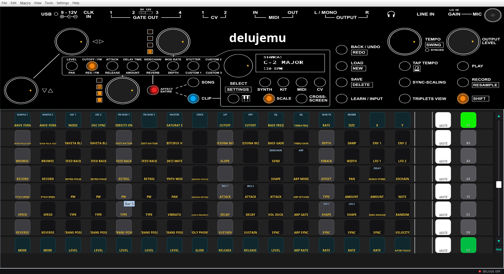

The 16 columns are grouped into dedicated parameter channels:

*   **Columns 1–2: SAMPLE 1 & SAMPLE 2 (Audio & Sample Controls)**:
    *   *Row 1–2*: `START` time / `END` time (adjust sample start/end markers in milliseconds).
    *   *Row 3–4*: `BROWSE` (open file explorer) / `RECORD` (record custom sample).
    *   *Row 5–6*: `PITCH SPEED` / `SPEED` (adjust sample playback rate & pitch).
    *   *Row 7–8*: `REVERSE` toggle / `MODE` (cycle ONCE, CUT, REPEat, STREtch).
*   **Columns 3–4: OSC 1 & OSC 2 (Dual Oscillators)**:
    *   *Row 1–2*: `NOISE` generator level / `OSC SYNC` toggle.
    *   *Row 3–4*: `FEEDBACK` level / `RETRIG PHASE` (retrigger phase in degrees).
    *   *Row 5–6*: `PW` (pulse width) / `TYPE` (SINE, SAW, SQUAre, TRIangle, SAMPle, IN).
    *   *Row 7–8*: `TRANSPOSE` (semitones) / `LEVEL` (oscillator volume).
*   **Columns 5–6: FM MOD 1 & FM MOD 2 (FM Modulators)**:
    *   *Row 1–2*: `DIRECTION` / `DESTINATION` (select routing target carrier).
    *   *Row 3–4*: `FEEDBACK` level / `RETRIG PHASE` (retrigger phase).
    *   *Row 5–6*: `PW` / `TYPE` (modulator waveform shape).
    *   *Row 7–8*: `TRANSPOSE` / `LEVEL` (modulation depth/amount).
*   **Columns 7–8: MASTER & VOICE (Global Voice Settings)**:
    *   *Row 1–3*: `SATURATE` / `BITCRUSH` / `DECIMATE` (lo-fi sample rate reduction).
    *   *Row 4–5*: `SYNTH MODE` (SUB, RING, FM) / `PAN` (voice panning).
    *   *Row 6–8*: `VIBRATO` depth / `TRANSPOSE` / `LEVEL` (global master transpose & volume).
*   **Columns 9–10: ENVELOPE 1 & ENVELOPE 2 (ADSR Envelopes)**:
    *   *Row 1–2*: LPF `CUTOFF` / LPF `RESONANCE`.
    *   *Row 3*: LPF `SLOPE` (toggle 12dB/24dB slope).
    *   *Row 5–8*: `ATTACK`, `DECAY`, `SUSTAIN`, and `RELEASE` times for Env 1 (VCA) and Env 2 (Filter/Modulation).
*   **Columns 11–12: SIDECHAIN & ARP (Dynamics & Arpeggiator)**:
    *   *Row 1–2*: `BASS FREQ` / `TREBLE FREQ` (EQ frequency controls).
    *   *Row 3–4*: Reverb `SEND` / `SHAPE` (envelope or compressor characteristics).
    *   *Row 5–8*: `ATTACK` (sidechain) / `VOL DUCK` / `SYNC` (timing division).
*   **Columns 13–14: LFO 1 & LFO 2 (Low Frequency Oscillators)**:
    *   *Row 1–2*: LFO `RATE` / LFO `DEPTH`.
    *   *Row 3–4*: LFO `FEEDBACK` / `OFFSET`.
    *   *Row 5–8*: LFO `TYPE` (SINE, SAW, SQUAre, TRIangle) / `SYNC` (tempo sync clock).
*   **Columns 15–16: DELAY, REVERB & MOD SOURCES (Effects & Modulations)**:
    *   *Row 1–3*: Reverb `ROOM SIZE` / Reverb `DAMP` / Reverb `WIDTH` (stereo image).
    *   *Row 4–5*: Delay `MONO/STEREO` / Reverb `AMOUNT` (mix blend).
    *   *Row 6–8*: Delay `DIGI/ANALOG` / Delay `SYNC` / Delay `RATE` (tempo-sync division).

---

### 10.2 Track Header & Top Toolbar Shift Shortcuts Map

In addition to the main grid pads, holding **[SHIFT]** while clicking top toolbar buttons, row header labels, or turning encoders activates quick operations:
*   **`Shift` + Click `[+ KIT]`, `[+ SYNTH]`, `[+ AUDIO]`**: Bypasses the standard track naming modal prompt and instantly creates a new default track (`SYNTH 1`, `KIT 1`, `AUDIO 1`) with generic initial presets.
*   **`Shift` + Click `[Track Name Label]`**: Toggles **One-Shot Playback Mode (`1SH`)** for sample-trigger track rows.
*   **`Shift` + Click `[MUTE]` Button**: Clears all active step note events on that specific lane (`Clear row`).
*   **`Shift` + Turn `[Horizontal Scroll Encoder ◄►]`**: Dynamically adjusts the play rate step speed resolution (horizontal zoom, e.g. from $1/16$ to $1/32$ straight or triplet mode) and updates the OLED display.
*   **`Shift` + Turn `[Vertical Scroll Encoder ▼▲]`**: Scrolls the visible note rows of the active grid by **exactly one octave (12 rows) per detent** instead of a single row, to scroll through the piano roll.
*   **Right-Click / Double-Click `[Track Name Label]`**: Spawns the multitrack Context Menu (`Clone Track`, `Delete Track`, `Change Swatch Color`).

---

### 10.3 Synth Configuration Dialog Tabs

Double-clicking a Synth track opens the sound editor, which displays parameter panels:

```carousel
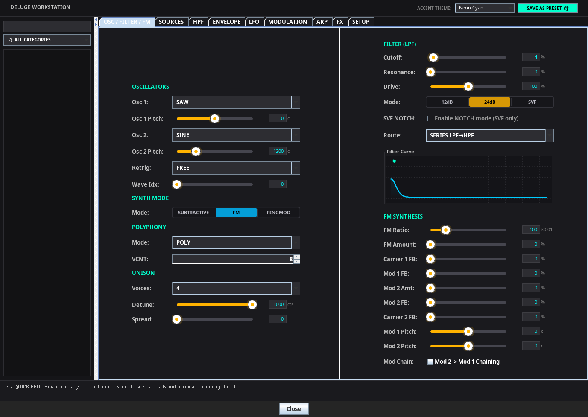
<!-- slide -->

<!-- slide -->

<!-- slide -->

<!-- slide -->
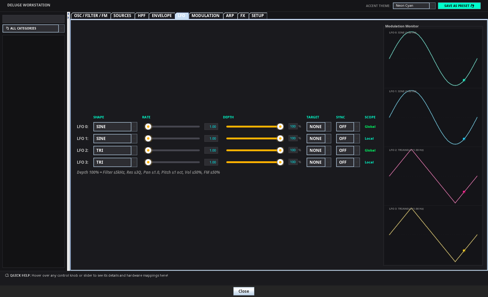
<!-- slide -->
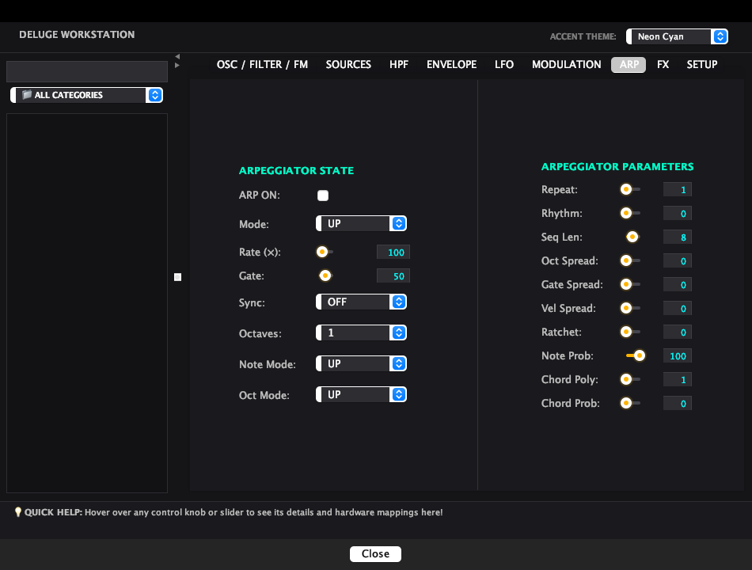
<!-- slide -->
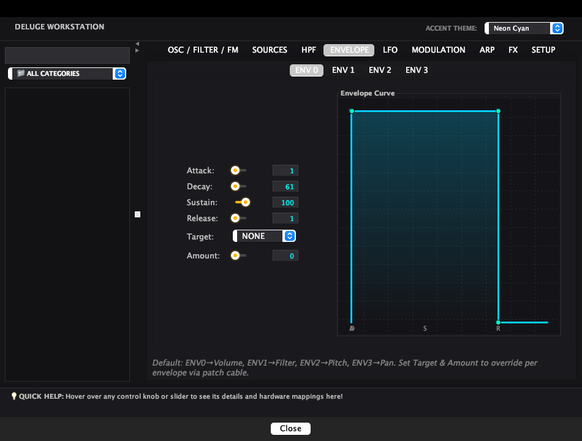
<!-- slide -->

<!-- slide -->
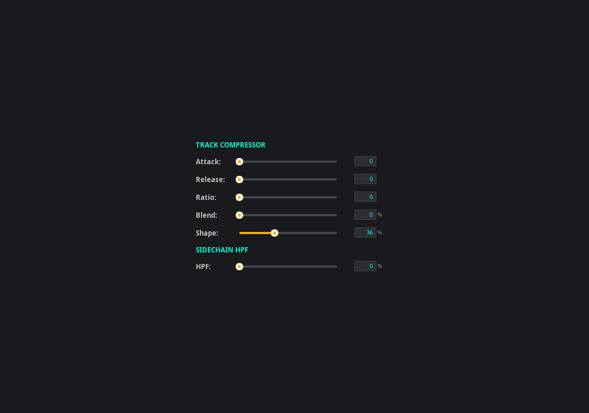
<!-- slide -->
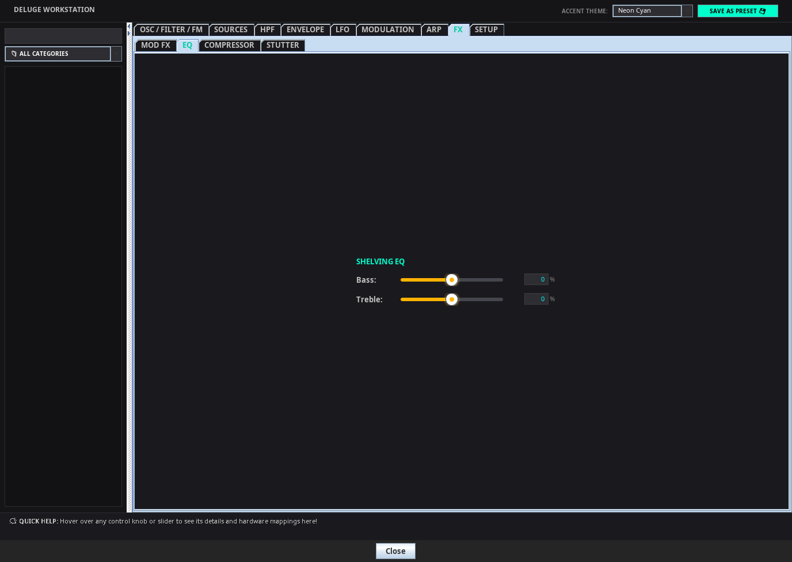
<!-- slide -->
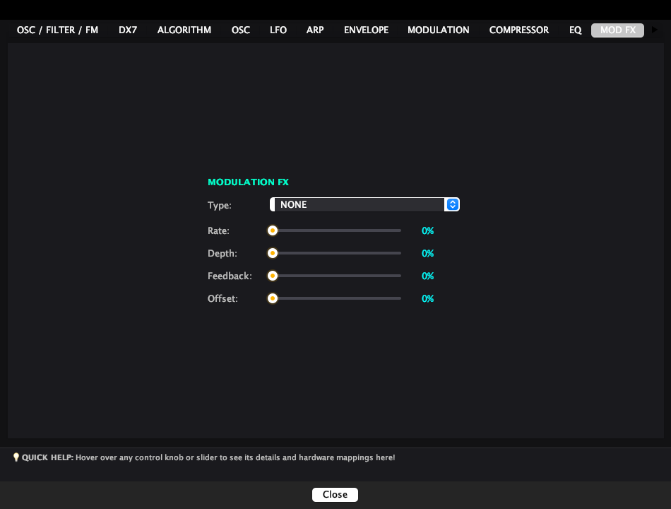
<!-- slide -->
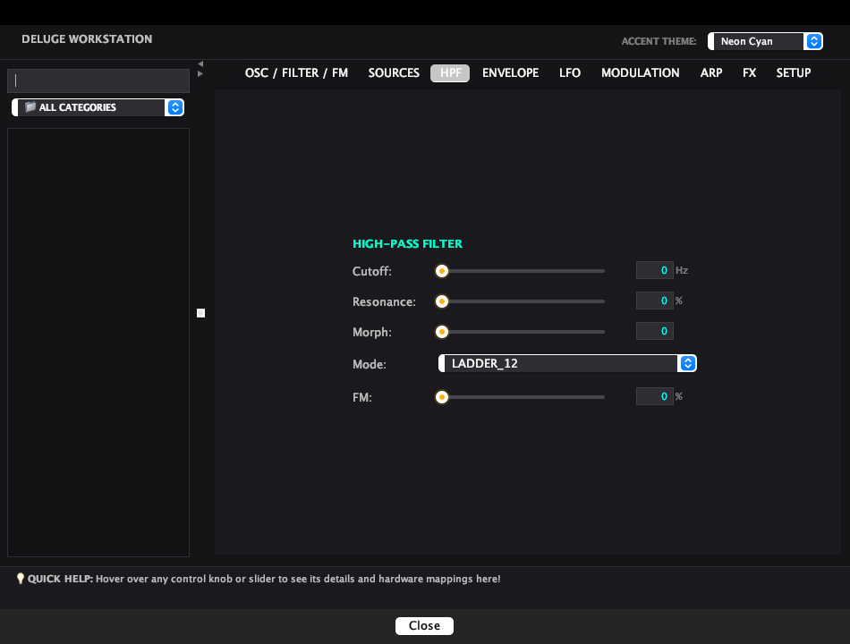
<!-- slide -->
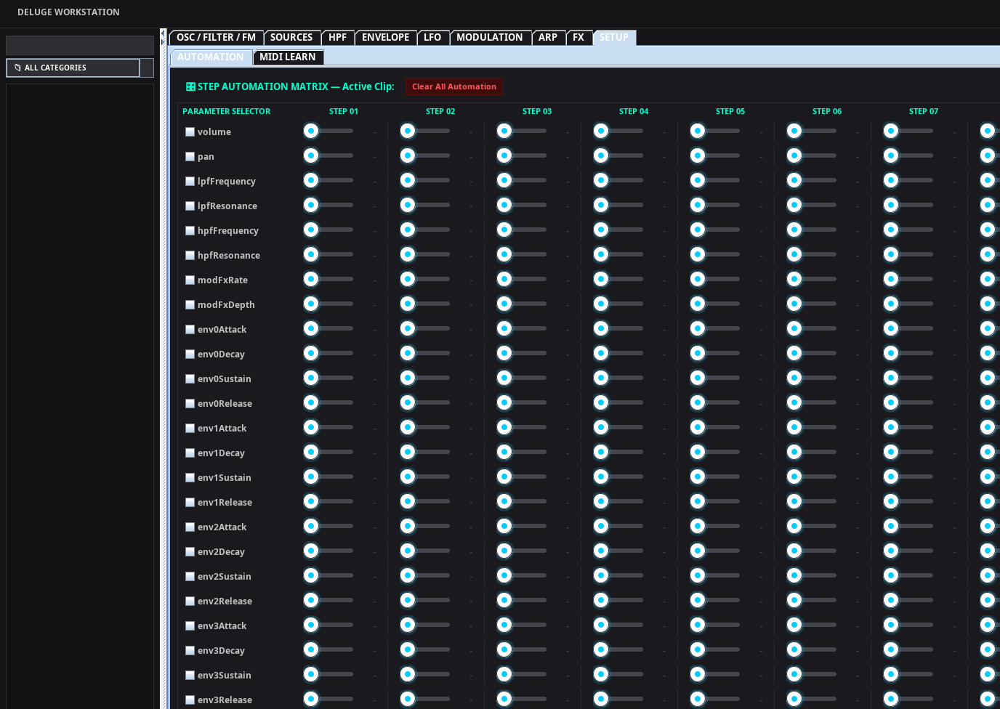
<!-- slide -->
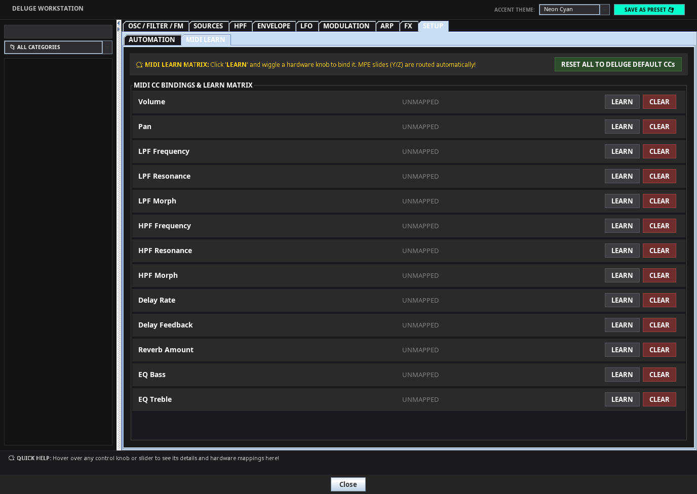
```

1. **OSC / FILTER / FM Panel (`deluge_synth_tab_osc___filter___fm.png`)**: The primary sound designer deck, featuring a unified overview of active oscillator shapes, resonant filter cutoffs/resonance, modulator FM depths, and quick-access decay times.
2. **DX7 FM Panel (`deluge_synth_tab_dx7.png`)**: Parses DX7 voice banks, allowing import of .SYX files, listing presets, selecting patch entries, and editing parameters.
3. **Algorithm Panel (`deluge_synth_tab_algorithm.png`)**: Displays a vector block diagram of the FM algorithm, illustrating operator relationships.
4. **OSC Panel (`deluge_synth_tab_osc.png`)**: Adjusts pulse-width modulation, pitch detuning, and oscillator shapes.
5. **LFO Panel (`deluge_synth_tab_lfo.png`)**: Configures rates, depths, and shapes (Sine, Saw, Triangle, Square, Random/S&H) for all 4 global and local low frequency oscillators.
6. **Arpeggiator Panel (`deluge_synth_tab_arp.png`)**: A standard modular arpeggiator engine adjusting speed sub-clocks (1/4 to 1/32 notes), octave ranges (+1 to +4), gate lengths, and sorting paths (Up, Down, Order Played, Random).
7. **Envelope Panel (`deluge_synth_tab_envelope.png`)**: Configures ADSR times and target parameters settings for all 4 sound path envelopes.
8. **Modulation Matrix Panel (`deluge_synth_tab_modulation.png`)**: Sleek routing table where sources are cabled to destinations with unipolar/bipolar sliders.
9. **Compressor Panel (`deluge_synth_tab_compressor.png`)**: Adjusts dynamic compressor thresholds, ratios, attacks, release, and sidechain HPF filters.
10. **EQ Panel (`deluge_synth_tab_eq.png`)**: Adjusts master shelving EQ Bass and Treble boost/cut decibels.
11. **Mod FX Panel (`deluge_synth_tab_mod_fx.png`)**: Configures modulation LFO speeds and feedback depths for active Chorus, Flanger, or Phaser lines.
12. **HPF Panel (`deluge_synth_tab_hpf.png`)**: Adjusts high-pass filter cutoff frequencies and feedback ladder overdrive.
13. **Automation Panel (`deluge_synth_tab_automation.png`)**: Lists all automate-able parameters with numeric draw step values for step-by-step tweaking.
14. **MIDI Learn Panel (`deluge_synth_tab_midi_learn.png`)**: Maps sequencer parameters to incoming hardware MIDI controller CC knob events via dynamic listener hooks.

---

### 10.4 Settings Preferences Dialog

The Settings Preferences Dialog provides preferences controls:

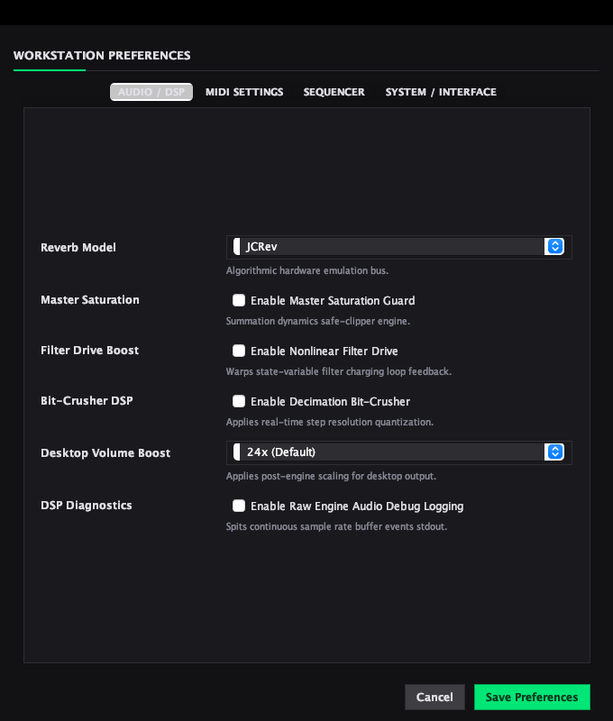

* **Library Path Preferences**: Browse and set the mounted parent library root directory path folder for all sample loading.
* **Grid Profiles Mode**: Standardize layout resolutions to `Grid 8x16` or `Grid 16x16`.
* **Sequencer Engine Backend**: Toggle between HIGH_FIDELITY (high-resolution Java DSP synthesis engine) and LEGACY sequencer timing backends.

---

## 11. Audio Tracks, Time-Stretching & Pitch-Shifting

Audio Tracks play back long audio resources (such as vocal tracks, live instrument stems, or guitar backdrops) rather than short notes or synthesized waveforms. The engine provides control over playback speed (Time-Stretching) and pitch (Pitch-Shifting):

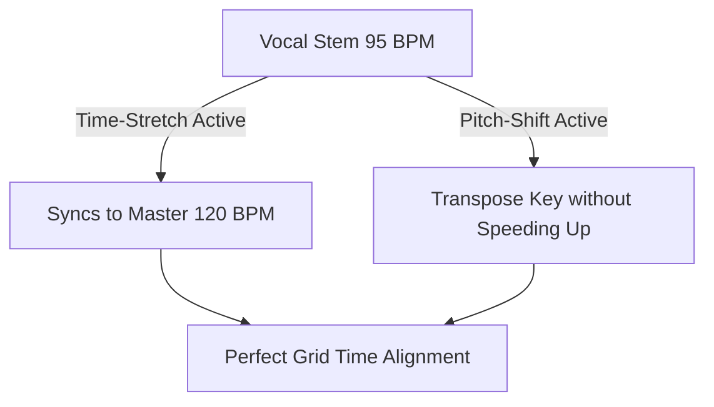
```mermaid
graph TD
    A[Vocal Stem 95 BPM] -->|Time-Stretch Active| B[Syncs to Master 120 BPM]
    A -->|Pitch-Shift Active| C[Transpose Key without Speeding Up]
    B --> D[Perfect Grid Time Alignment]
    C --> D
```

* **Independent Time-Stretching**: Forces a loaded WAV stem loop to stretch its playback speed to match the global tempo (BPM) exactly, without altering the loop's original key or pitch. Changing the master BPM keeps the loop locked to the sequencer grid.
* **Real-Time Pitch-Shifting**: Transposes the loop's pitch up or down by semitones and cents, without changing the speed of playback.
* **Transient Lock Points**: Pins specific timing landmarks within the file to maintain perfect time alignment even under extreme tempo shifts.

#### 🎤 Tutorial I: Time-Stretching and Pitch-Shifting a Vocal Stem Loop
1. Click the **`+ AUDIO`** button in the top toolbar to create a new audio track (or Shift-Click to instantly create a default named one).
2. Drag and drop your vocal phrase WAV/AIF stem file from your system file explorer or the local library browser directly onto the track name label in the sidebar header to load it. The waveform will render in the background of the sequencer row.
3. Double-click the track name to open the settings panel (or click its gear **⚙** button).
4. Locate the **Length (Bars)** field: set it to **`4 Bars`** (informs the engine that the loop represents exactly four bars of music).
5. Toggle the **`Time-Stretch`** checkbox to active. The engine stretches the sample loop playback speed to match your current session tempo (e.g. $120\text{ BPM}$).
6. Click the **Transpose** slider: set it to **`+3 semitones`** to pitch-shift the vocals higher.
7. *Result*: Press play: the vocal stem plays in synchronization with your drum kit beats, maintaining its pitch even as session tempo changes.

### 11.1 Threshold Loop Sampler & Real-Time Recording

The **Threshold Loop Sampler** provides a dedicated real-time audio recording dashboard to capture live external audio (via microphone or line-in) and load it instantly into your workstation.

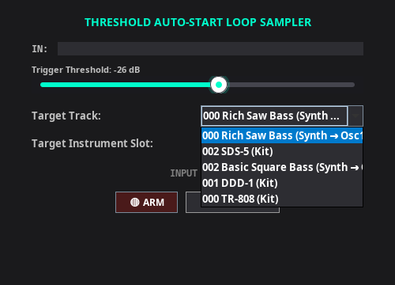

#### Key Features:
* **Threshold-Triggered Recording**: The recording waits in an idle "Armed" state until the input signal level exceeds your set threshold (e.g. `-26 dB` default), starting automatically.
* **Dynamic Target Routing**: You can select where the recorded audio is loaded when recording completes:
  - **Kit Tracks**: Records a quick drum sample and loads it directly into a specific drum kit instrument row (Slots 1–16).
  - **Synth Tracks**: Records a sample and loads it directly into the first oscillator of the synthesizer voice (Oscillator 1).
  - **Audio Tracks**: Records a long vocal/instrument phrase and instantiates it as a continuous **Audio Clip** on a target audio track.
* **Loop Alignment**: Calculates the duration of the recorded loop and aligns it to the grid for synchronized playback.

#### 🎤 Tutorial L: Real-Time Threshold-Triggered Vocal Capture
1. Connect your microphone or line-in instrument.
2. Select **`Tools ➔ Threshold Loop Sampler...`** (or press the global shortcut **`Ctrl + H` / `Cmd + H`**).
3. Select the **Target Track** dropdown: choose your desired destination track (e.g., **`Track 1 (Audio Clip)`** to record a continuous vocal phrase).
4. Slide the **Threshold** dial to **`-35dB`** to set the noise-gate trigger level.
5. Click **`[ Arm Recording ]`**. The button turns yellow and flashes, waiting for input.
6. Sing or play your phrase. The instant your voice exceeds $-35\text{dB}$, the recorder turns solid red and captures the audio in real-time.
7. Click **`[ Stop & Load ]`** when finished. The workstation automatically saves the recorded WAV, binds it to the selected track, and updates the engine. Press play to hear the recorded loop in sync.

---

## 12. Advanced Wavetable Index Scan Editor

The **`Wavetable Index Laboratory`** provides an editor to slice, scan, and modulate multi-cycle wavetable WAV files.

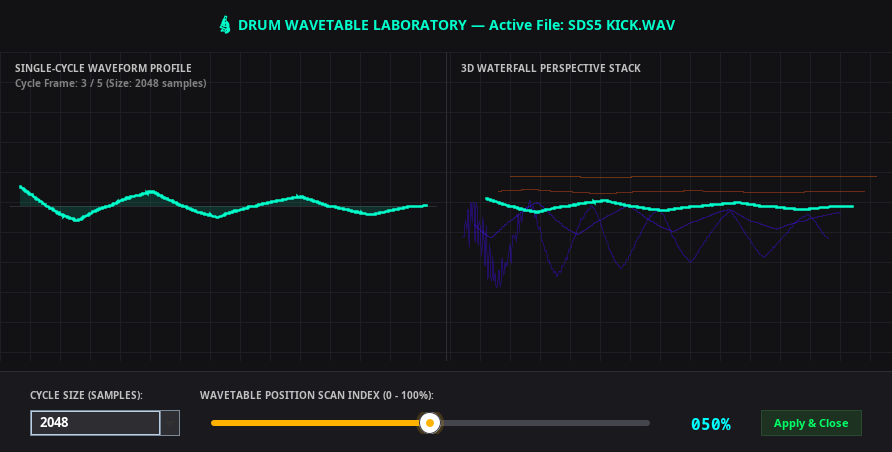

### 12.1 Dynamic Double-View Oscilloscope Architecture
* **Left Panel: Single-Cycle Waveform Profile**: Renders a curve representing the single-cycle waveform at the selected position index. It updates and morphs in real-time as you drag the slider.
* **Right Panel: 3D Perspective Waterfall Stack**: Projects a 3D perspective waterfall stack of 15 surrounding cycles. Skewed with coordinate offsets, it projects the wavetable spectrum in color-coded HSL gradients: deep purple at the back (lower index cycles), cyan in the center (current cycle), and amber at the front (higher index cycles).

### 12.2 Cycle Slicing and Hot-Swaps
* **Selectable Cycle Size**: Slice custom WAV files into standard cycle frames (256, 512, 1024, 2048, or 4096 samples per cycle) to support different wavetable formats.
* **Wavetable Position Scan Slider**: A horizontal slider allows you to change the wavetable index from `0%` to `100%`.
* **Parameter Sweeps**: Sweeping the slider sends wave position indices to the synthesis engine, hot-swapping active cycle arrays on every frame shift.

#### 🔬 Tutorial K: Sculpting Dynamic Morphing Wavetable Patches
1. Open a kit track lane and click the gear **⚙** button next to a drum row header to open its settings editor.
2. Click **`Browse...`** next to the sample path field and load a multi-cycle wavetable WAV file.
3. Click the **`🔬 Wavetable Laboratory...`** button next to the loop bounds panel. The laboratory window opens in the center.
4. Look at the **Cycle Size (Samples)** menu: set it to **`2048`** (the standard wavetable size). The 3D waterfall stack aligns, projecting the consecutive wave lines.
5. Drag the **`Wavetable Position Scan Slider`** back and forth: watch the left curve morph between sine, saw, and spectral shapes, while the active white cursor line tracks the position in the 3D waterfall stack.
6. Play the sequencer to hear the active synth voice sweep. Click **`Apply & Close`** to save your selected wave state.

---

## 13. Audio Track Overdubbing & PCM Layer Mixing

The Deluge-Java Workstation provides support for recording, layering, and mixing multiple audio layers on Audio Tracks using external MIDI foot-pedals.

### 13.1 MIDI Looper Pedal Integration
You can bind a physical foot-pedal (or MIDI fader/button) to control recording and overdubbing hands-free:
*   **CC Mapping**: In the MIDI CC Learn section of Preferences (**`Settings ➔ MIDI Settings...`**), input the parameter name **`action_looper_pedal`** and sweep your controller fader or click the foot-pedal to automatically bind the CC action.
*   **Looper State Machine**: A single foot-pedal tap cycles through the looper's active phases:
    1.  **Idle / Armed**: Tapping the pedal immediately arms and starts recording on the active track (using a `-60 dB` threshold for instant trigger). If the workstation is not currently playing, it automatically toggles the master play clock.
    2.  **Recording**: Tapping the pedal while recording finishes the current layer, stops recording, and begins looping the captured phrase.
    3.  **Overdubbing**: On subsequent takes, the workstation automatically detects that a baseline WAV file exists. It enters overdub mode, mixing the incoming signal with the existing file in real-time. Tapping the pedal again stops overdub recording and preserves loop playback.

### 13.2 Auto-BPM Tempo Detection
When you record your baseline loop without a click track, the workstation automatically estimates and sets the master tempo:
*   **Tempo Parity Calculation**: When the first recording on an Audio Track stops, the engine calculates the duration of the captured PCM audio in seconds. It compares this duration against the track's configured clip length (expressed in beats) using the formula:
    $$\text{BPM} = \frac{\text{beatsCount} \times 60}{\text{duration}}$$
*   **Automatic Tempo Sync**: The project's BPM and play clock are updated to match the detected tempo (clamped between 40 and 280 BPM). The new tempo value is sent to the physical hardware display to confirm the sync.

### 13.3 Track Controls
Real-time playback and recording are managed via the **`Audio Track`** panel inside the sidebar or track inspector:
*   **REC**: Toggles microphone/line-in capture. If `overdubsShouldCloneAudioTrack` is active, it layers new input on top of the active clip.
*   **PLAY**: Starts or stops playback of the track's audio clip.
*   **LOOP**: Toggles loop wrap-around on or off.
*   **Rate Slider**: Speeds up or slows down the playback rate (from `0.25x` to `4.00x`).

> [!NOTE]
> **Unimplemented Features**: Layer-by-layer looper undo/redo (reverting only the last overdub layer) is not currently implemented.

---

## 14. MIDI Hardware, Device Mappings & Pure SD File Explorer

The Deluge Workstation separates file-system assets browsing from hardware device settings. The **SD Card Explorer** is a directory tree, while physical MIDI controllers, inputs, CC learning, and sync channels are managed in a dedicated settings dialogue.

### 14.0 Step-by-Step MIDI Connection & Operations Guide

Connecting a physical Deluge hardware unit to the Deluge-Java Workstation provides an interactive studio environment. Follow these steps to connect:

#### 🔌 Connection Sequence:
1. **Connect the Cable**: Plug a standard USB cable into the back of your physical Deluge, and connect it directly to your computer. 
2. **Power On**: Turn on the Deluge. It mounts its USB MIDI interface.
3. **Configure MIDI Port**: Open the Workstation and select **`Settings ➔ Preferences...`** (or press the global shortcut **`Cmd+Shift+M`** / **`Ctrl+Shift+M`**).
4. **Select Port**: Under the **MIDI Input Device** dropdown, select **`Deluge Port 1`** (the system maps it to the midi service). Click **Apply** or **Save**.
5. **Verify Status**: Check the top toolbar status panel: the Led indicator dot will glow green and display **`DELUGE ON`**.

#### 🛰️ Realized Hardware Features (What You Can Do Today):
* **Real-Time OLED Screen Mirroring**: Once connected, the Workstation sends a stream request. A background 1.5-second keep-alive timer manages display streaming. The virtual OLED panel mirrors menu scrolls, waveform draws, and parameter edits on the physical hardware.
* **Stateful SD Card Explorer**: Open the SD Explorer (`Cmd+B` / `📁` icon) and click **`🔄 REFRESH`** on the **`📡 HARDWARE`** tab. The workstation processes SysEx packets to populate SONGS, SYNTHS, and KITS directories.
* **Remote Song Audition & Load**: Double-click any song XML in the remote hardware tree. The Workstation sends SysEx requests to download the XML file, parse it, and load the song into the audio engine.
* **Low-Latency Virtual Sound Triggering**: Play notes on the physical pads grid or keyboard layout to trigger the workstation's subtractive, FM, or ring-modulation voices.

---

### 14.1 Pure JTree SD Card Explorer (`deluge_project_explorer.png`)
* **The Interface**: Access the sidebar or float dialogue by pressing **`Command/Ctrl + E`** (or selecting **`File ➔ Show Explorer`**). The explorer is a file and preset tree panel scrolling through active SD Card paths:
  * **`KITS`**: Browse kit XML files and load them directly onto project tracks.
  * **`SYNTHS`**: Load individual voice presets.
  * **`SONGS`**: Double-click to load complete multi-track sequence song XML nodes.
  * **`PATTERNS`**: Double-click to load saved track clip sequences or load script files.
* **Zero Clutter**: Mocked or static placeholder tabs have been removed.

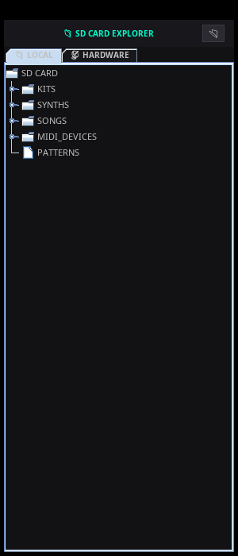

---

### 14.1.1 Contextual Library Picker & Track Inspector (Scoped Preset / Sample Swapping)

The global JTree explorer above is the "browse everything" view. For the common case of swapping a specific sound, the Workstation adds **contextual pickers** scoped to only the relevant assets.

* **Fixed Track-Inspector Strip**: An always-visible strip sits **above the grid**, showing the **active track** as `ACTIVE TRACK · T<n> · <name> [TYPE]` with two controls:
  * **`⚙ Configure`** — opens the config dialog for the active track.
  * **`▾ Preset…`** — opens the contextual Library Picker scoped to **SYNTHS** (synth track) or **KITS** (kit track).
  These controls remain visible when the grid is scrolled.

* **The Library Picker** (a modal popover) is **scoped** to one category — it lists only the relevant files (e.g. SAMPLES, or SYNTHS) with a **search filter**, a **waveform / wavetable preview**, and a **▶ Audition** button. Pickers present action options:
  * **`Replace track`** — hot-swaps the active track's sound *in place*, preserving clips, notes, and color.
  * **`Load as NEW`** — adds a brand-new track from the chosen preset.

* **Drum Sample Chip**: In the Kit config dialog, each drum slot's **`Change…`** button opens the picker scoped to **SAMPLES** (with waveform preview + audition) to swap that drum's WAV.

* **Synth Oscillator Source Chip**: In the Synth config dialog, setting an oscillator type to **`SAMPLE`** or **`WAVETABLE`** reveals a **source chip** that opens the picker scoped to **SAMPLES** / **WAVETABLES** to choose the file for that oscillator.

> **Design principle**: scope to the target, anchor to the widget, name the verb (Replace vs Load-as-new), and preview/audition before committing.

---

### 14.2 Dedicated MIDI Settings & CC Learn Laboratory (`deluge_midi_device_settings.png`)
* **The Interface**: Press **`Command/Ctrl + Shift + M`** (or select **`Settings ➔ MIDI Device Settings...`**) to open the MIDI Configuration dialog. This panel acts as the master hub for external keyboard controllers, physical knobs mappings, and controller assignments:
  * **Device Port Selector**: A dropdown list of all active physical MIDI input interfaces.
  * **CC Mappings Table**: A scrollable list tracking active parameter bindings, CC signals, and connection states.
  * **Real-Time CC Learn**: Enter a parameter target name, click **`[START LEARN]`**, and sweep a physical knob/fader on your controller: the CC binding registers and updates the mappings.

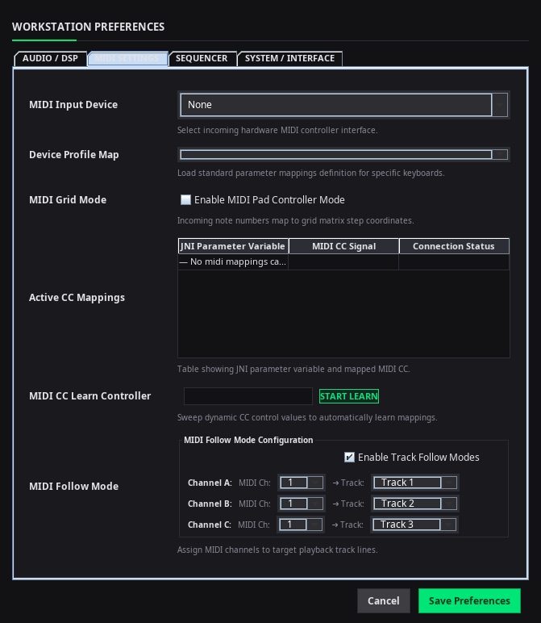

---

### 14.3 MIDI Clock Master/Slave Sync Modes
* **MIDI Clock Master (Send Sync)**: The application sends system clocks ($24\text{ pulses per quarter note (PPQN)}$ standard) to the active MIDI output ports, driving external instruments.
* **MIDI Clock Slave (Receive Sync)**: The application listens to incoming MIDI clock ticks, locking the internal playback playhead speed and start/stop triggers to the external clock.

### 14.4 MIDI Program Changes & Hardware Chains
* **MIDI Program Change (PC) Messages**: Send PC commands (values 0–127) and bank select indices dynamically from target sequencer steps to automatically swap active presets.
* **Multi-Device Chains (MIDI Thru)**: Daisy-chain multiple hardware synthesizers: set each sequencer lane to send data to a distinct MIDI Channel (Channels 1–16) to play parts across separate physical keyboards from a single master track.

### 14.5 MIDI CC Parameter Takeover Algorithms

To prevent sudden audio level spikes when wiggling physical knobs on MIDI controllers (whose physical position might differ from the virtual parameter value in memory), the application implements three parameter takeover algorithms:

1. **JUMP Mode (Default)**: The virtual parameter immediately jumps to match the incoming CC value.
2. **PICKUP Mode**: The virtual parameter value remains locked and ignores CC sweeps until the physical knob is swept past the current virtual value.
3. **SCALE Mode (Runway-Delta Scaling)**: Proportional scaling based on the remaining distance between the current value and the parameter limits:
  * If the physical knob is wiggled, the virtual parameter moves toward the target limits, scaling the travel speed dynamically so that both physical and virtual reach the bounds simultaneously.

### 14.6 Bidirectional SysEx Command Protocol

The integration between the Deluge-Java Workstation and the physical hardware uses a SysEx protocol over MIDI envelopes.

#### 📦 The SysEx Packet Structure:
All communications adhere to the following byte layout:
`[0xF0] [0x00 0x21 0x7B 0x01] [Command ID] [Sequence ID] [JSON Payload...] [0x00 (Spacer)] [Binary Payload...] [0xF7]`
*   `0xF0`: Standard SysEx Start byte.
*   `0x00 0x21 0x7B 0x01`: The official Manufacturer Header.
*   `Command ID`: `0x02` (HID Display stream data), `0x04` (JSON Request), `0x05` (JSON Reply), or `0x03` (Debug print stream).
*   `Sequence ID`: 1-indexed transaction counter (`1 to 127`, or specific session negotiated limits) to match asynchronous callbacks.
*   `0x00 (Spacer)`: Optional division byte separating JSON metadata from raw binary blocks.
*   `0xF7`: Standard SysEx End byte.

---

#### 🗺️ Bidirectional Command Matrix (The Protocol Reference):

Below is the reference of commands supported by the system:

| Direction | Command / Action | JSON Payload Template | Binary Payload / Behavior | Status |
| :--- | :--- | :--- | :--- | :--- |
| **Host ➔ HW** | **Heartbeat Ping** | `{"ping": {}}` | *None*. Hardware replies instantly with `^ping`. | **Realized** |
| **Host ➔ HW** | **List Directory** | `{"dir": {"path": "/SONGS"}}` | *None*. Triggers remote SD card directory scanning. | **Realized** |
| **Host ➔ HW** | **Open Remote File** | `{"open": {"path": "/S/S1.XML", "mode": "r"}}` | *None*. Opens file handle on Deluge SD card. | **Realized** |
| **Host ➔ HW** | **Read File Block** | `{"read": {"fid": 1, "offset": 0, "size": 512}}` | *None*. Requests 512-byte block from open handle. | **Realized** |
| **Host ➔ HW** | **Close Remote File**| `{"close": {"fid": 1}}` | *None*. Closes open file handle and flushes memory. | **Realized** |
| **Host ➔ HW** | **Start OLED Stream** | *None* | Sends `[0xF0] [0x00 0x21 0x7B 0x01] [0x02] [0x00] [0x03] [0xF7]` | **Realized** |
| **HW ➔ Host** | **OLED Frame Delta** | *None* | Command `0x02`, Subtype `0x40`. RLE-compressed display differences to redraw OLED screen. | **Realized** |
| **HW ➔ Host** | **7-Segment Display** | *None* | Command `0x02`, Subtype `0x41`. Character segment configurations. | **Realized** |
| **HW ➔ Host** | **Ping Response** | `{"^ping": {}}` | *None*. Heartbeat echo confirming hardware is online. | **Realized** |
| **HW ➔ Host** | **Directory Reply** | `{"^dir": {"list": [{"name": "s1.xml", "size": 19974}], "err": 0}}` | *None*. Returns structured file arrays to sidebar. | **Realized** |
| **HW ➔ Host** | **Open File Reply** | `{"^open": {"fid": 1, "size": 19974, "err": 0}}` | *None*. Returns file descriptor and byte size. | **Realized** |
| **HW ➔ Host** | **Read Block Reply** | `{"^read": {"fid": 1, "err": 0}}` | Raw 512-byte segment of file unpacked on receipt. | **Realized** |
| **HW ➔ Host** | **Key Event** | `{"key_event": {"code": 42, "state": 1}}` | Notification that physical button #42 was pressed. | **Future** |
| **HW ➔ Host** | **Encoder Rotation** | `{"encoder_event": {"id": 2, "delta": -1}}` | Notification that parameter knob #2 rotated CCW. | **Future** |

---

#### 🔭 Future Horizons:

Upcoming bidirectional capabilities include:

1. **128-Pad Grid LED Streaming**:
   * **Concept**: Mirror active backlit states of physical grid pads to the screen in real-time.
   * **Implementation**: We can extend display streaming to package the LED grid state and send it as a broadcast packet. The workstation updates the grid lights based on this stream.
2. **Physical Encoder Telemetry**:
   * **Concept**: Sweep software knobs, draw automation curves, and scroll parameters in the UI using physical encoders on the hardware.
   * **Implementation**: The hardware streams delta values. Knobs are updated using Jump, Pickup, or Scale algorithms.
3. **Remote SD Card Management**:
   * **Concept**: Organize and upload files on the hardware SD card from your computer's explorer.
   * **Implementation**: Exposing write/delete commands allows preset uploads over USB MIDI.
4. **Clock & Transport Synchronization**:
   * **Concept**: Sync transport controls and tempo simultaneously with clock alignment.
   * **Implementation**: Exposing transport commands allows remote play/stop triggers to sync with the workstation's timeline.

---

### 14.7 DAW Import Suite: Ableton Live Set (.als) Importer

The Deluge Workstation features a **DAW Import Suite** that lets you import Ableton Live Sets (`.als` files) directly into the sequencer. It parses the Ableton project and reconstructs the track layout, mixer volume levels, MIDI clips, arranger timeline, and instrument parameters.

#### ⚙️ The Smart Hybrid Importer Architecture
Because Ableton Live Sets can contain a mixture of native instruments and third-party VST plugins, the importer employs a **Hybrid Import Pipeline**:

1. **Generic Native Simpler/Sampler Parameter Extractor (Fully Generic)**:
   * When the importer detects a native Ableton `<OriginalSimpler>` or `<MultiSampler>` device on a MIDI track, it parses the instrument parameters directly from the XML.
   * **Volume Envelopes (ADSR)**: Automatically extracts Attack, Decay, Sustain, and Release times in milliseconds from the `<VolumeAndPan>` -> `<Envelope>` subtree, converts them to seconds, and maps them directly to the Deluge's **Env 0** (Volume envelope).
   * **Logarithmic Filter Cutoff Frequency**: Extracts the manual filter cutoff frequency in Hz (ranging from $30\text{Hz}$ to $22,000\text{Hz}$). Since filter frequency is logarithmic, it maps it mathematically to the Deluge's normalized `0..1` scale:
     $$\text{normFreq} = \frac{\ln(f) - \ln(30)}{\ln(22000) - \ln(30)}$$
   * **Filter Resonance & Morph**: Parses the filter Q factor and resonance, converting and clamping them to the Deluge's normalized resonance range.
   * **Dynamic Filter Envelopes**: Parses the filter envelope's ADSR rates and its modulation depth (`Amount`, ranging from $-72$ to $+72$ semitones). It normalizes the depth relative to the 72-semitone ceiling and maps it to the Deluge's **Env 1** (Filter envelope).
   * **Transposition & Pitch**: Parses the manual semitone transposition (`TransposeKey`) and fine-tuning cents (`TransposeFine`) and maps them directly to the pitch controls.
2. **Name-Based Semantic Preset Auto-Mapper (Scalable Fallback)**:
   * If a track uses a third-party VST plugin (like Serum) where the preset is stored in a proprietary binary block, the importer falls back to a Semantic Preset Mapper.
   * It scans the track name for keywords (like `"bass"`, `"lead"`, `"choir"`, `"trumpet"`, `"guitar"`, `"string"`, `"pad"`) and automatically applies custom-tailored synthesizer patches (such as detuned Juno-style Square+Saw bass, vocal-like resonant Meuw Lead, or Oberheim-style bright brass).

#### 🛰️ Core Audio Engine Patch Matrix Synthesis
To make these imported parameters sound alive, the core audio engine (`FirmwareFactory.java`) dynamically compiles the imported envelope targets into the **Modulation Patch Matrix**:
* **The Concept**: While Envelope 0 is hardwired to master volume, Envelopes 1, 2, and 3 must be patched dynamically in the DSP engine.
* **The Execution**: If the importer maps an envelope to `"FILTER"` or `"PITCH"`, the engine physically synthesizes a virtual **PatchCable** connecting `PatchSource.ENVELOPE_1` to `Param.LOCAL_LPF_FREQ` or `Param.LOCAL_PITCH_ADJUST` in the voice mixer. This unlocks real-time, snappy filter sweeps and pitch modulations for the very first time!

#### 🎹 Step-by-Step Ableton Import Tutorial
Follow these precise steps to import your Ableton Live Set and play it in the Deluge Workstation:
1. **Prepare Your Assets**: Save your Ableton Live Set (`.als`) and ensure all audio samples used in the project are collected into a single directory (e.g., using Ableton's *File ➔ Collect All and Save*).
2. **Open the Importer**: In the Workstation, select **`File ➔ Import Ableton Project...`** (or press the global shortcut **`Cmd+Shift+I`** / **`Ctrl+Shift+I`**).
3. **Select the Project File**: Browse and select your `.als` project file. (The workstation automatically decompresses the gzipped XML stream in the background in under 10ms!).
4. **Select the Samples Folder**: Browse and select the folder containing your collected WAV samples.
5. **Load the Project**: Click **`Import & Load Project`**. The workstation parses the tracks, extracts the clips, runs the hybrid parameter translator, writes the Deluge Song XML, and loads it directly into the audio engine.
6. **Press Play**: Watch the playhead sweep across the sequencer grid in perfect sync, triggering rich, bouncy detuned basslines, resonant vocal leads, and crisp drum kits with absolute timbral parity!

---

### 14.8 Card Sync, Live DSP-Tap & Parity Calibration

The Workstation features a **Hardware Calibration & Sync Deck** designed for developers and power users who want to link their physical Deluge directly to the software workstation via USB for file transfers and sample-accurate DSP comparisons.

#### 🗂️ 1. USB SD Card Synchronization (Push & Pull)
Instead of ejecting and inserting the SD card continually, the workstation communicates directly with the physical Deluge's file system over USB using the Card Sync utility:
* **Pulling Songs/Presets**: Right-click the **Hardware Status Panel** (or the **Pure SD Card Explorer** sidebar) and select **"Pull Calibration Files"** or **"Sync Card Content"**. This reads XML files and samples directly from the physical Deluge's SD Card and clones them into the local directory.
* **Pushing Workstation Edits**: Edit your song or synth parameters in the Java UI, then select **"Push Current Song to Card"** from the status panel. The workstation packages the XML payload and transfers it over USB, saving it instantly on the physical Deluge's SD Card.

#### 🔭 2. Live DSP-Tap Hardware Capture
For absolute audio-fidelity debugging, you can capture raw, sample-accurate, 32-bit floating-point audio data directly from the physical Deluge's hardware DSP rendering buffer over USB. This allows you to compare the physical hardware's audio output side-by-side with the Java emulation:
* **Requirements**: Connect the physical Deluge via USB and ensure it is running the custom C++ firmware compiled from the `feat/dsp-buffer-dump` branch.
* **Arming the Capture**: Run the hardware harness (`HardwareDspTapTest`) from your terminal:
  ```bash
  mvn test -Dtest=HardwareDspTapTest -Pslow-tests -Dgpg.skip=true
  ```
* **Triggering**: The harness communicates with the Deluge via SysEx, sends a MIDI note-on trigger, arms the capture on the hardware at note-onset to capture the exact attack transient, and reads back the 4096-sample rendering buffer chunk-by-chunk.
* **Analysis**: The captured samples are stored locally to let you run spectral analysis and time-resolved cosine comparisons to calibrate envelopes, filters, and modulation indices.

#### 🛠️ Example: Debugging & Calibrating an FM Bell Patch
Here is how to run a live debugging session to calibrate the FM synthesis engine (e.g., `068 FM Bells 1`) to match the hardware:
1. **Connect the Deluge**: Enable USB MIDI on your hardware running the debug firmware.
2. **Synchronize the Patch**: Right-click the status panel and select **"Pull Calibration Files"**. This pulls the XML preset onto your computer.
3. **Capture Hardware Output**: Run the tap harness with `-Dtap.onset=true`. Strike the note pad on the physical Deluge. The harness arms, captures the sound, and saves the raw DSP float buffer to `target/tap_capture.txt`.
4. **Compare & Calibrate**: Run the FM Index Sweep test suite:
   ```bash
   mvn test -Pslow-tests -Dtest=FmIndexSweepTest
   ```
   This renders the patch inside the Java engine at different modulation index multiplier scales and compares each mathematically (log-spectral cosine similarity) against the hardware capture.
5. **Adjust Engine Parameters**: Use the sweep results to identify whether the mismatch is a constant scaling difference (e.g., index multiplier needs to be scaled by 0.5) or an envelope decay issue, and adjust your synthesis coefficients in `org.deluge.firmware2` to achieve perfect parity.

---

## 15. Performance View & FX Touch-Pads Grid

The **`Performance View (PERF)`** provides a hardware-inspired 18-column × 8-row dynamic interactive touch grid. It maps variables and sends real-time global sweeps straight to the active focus track, creating an electronic performance launch pad.

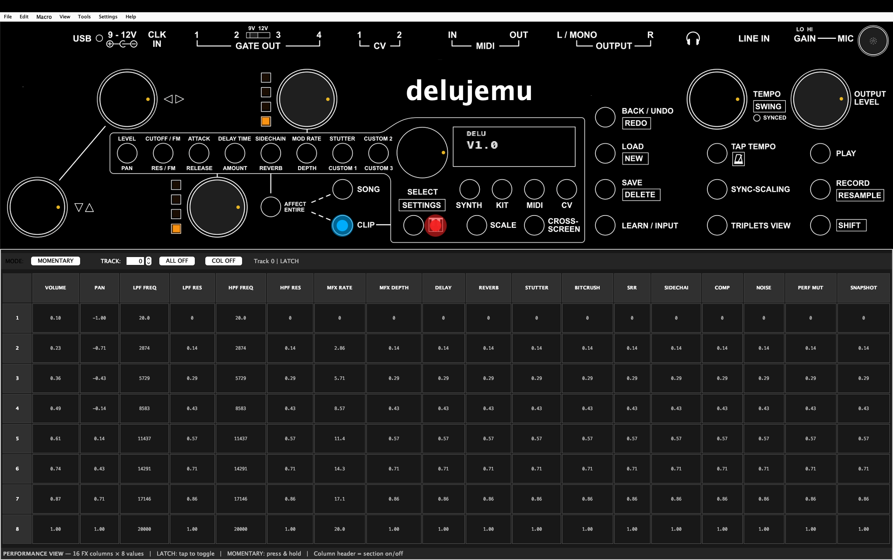

### 15.1 Column FX Variables and Row Intensities Mapping
* **18 Columns FX Destinations**:
  1. `VOLUME`: Master track volume leveling.
  2. `PAN`: Sound spatial panning sweep.
  3. `LPF FREQ`: Low-pass filter cutoff frequency.
  4. `LPF RES`: Low-pass filter resonance feedback.
  5. `HPF FREQ`: High-pass filter cutoff sweep.
  6. `HPF RES`: High-pass filter resonance sweep.
  7. `MOD FX RATE`: Modulation LFO speed.
  8. `MOD FX DEPTH`: Chorus/flanger depth.
  9. `DELAY`: Echo send intensity.
  10. `REVERB`: Space reverb send density.
  11. `STUTTER`: Sequencer clock grid retrigger loop rate.
  12. `BITCRUSH`: Digital sample resolution decimator.
  13. `SRR`: Sample rate reduction sweep.
  14. `SIDECHAIN`: Direct kick ducking volume envelope.
  15. `COMP`: Master compressor threshold drive.
  16. `NOISE VOL`: White noise generator injection.
  17. `PERF MUTE`: Global performance mute group trigger.
  18. `SNAPSHOT`: Temporarily saves or recalls parameters states.
* **8 Rows Value Intensities (0 to 7)**: Row 0 represents the minimum value range of the column FX, and Row 7 represents the maximum value intensity. Clicking a pad lights it up and writes the level change instantly to playback parameters.

### 15.2 Dual Interaction Play Modes: LATCH vs MOMENTARY
* **LATCH Mode**: Tapping a pad toggles the effect on/off like a static switch, allowing you to select and keep multiple columns active at once (multi-select style) to build custom static multi-effects matrices!
* **MOMENTARY Mode**: Actively triggers effects while you press-and-hold down a pad, and instantly restores the original parameters state the moment you release the mouse/pad! Perfect for quick glitch fills, transient filter sweeps, and dramatic drop build-ups!
* **Mode Toggle**: Managed via the **`MODE`** toggle button in the panel's top bar (which displays the active state, `LATCH` or `MOMENTARY`).
* **Column Section Mutes**: Pressing a column's header button acts as a group bypass/mute, instantly resetting all active values in that column block back to their safe baseline states.

#### 🔊 Tutorial L: Live High-Pass Filtering & Stutter Sweeps during Drops
1. Press **`Spacebar`** to start playing a heavy, 4-bar drum beat sequence.
2. Click the **`PERF`** button on the top toolbar to open the Performance touch-pads grid.
3. Look at the Performance top bar: toggle the **`MODE`** button to **`MOMENTARY`** to activate live momentary triggers mode!
4. As the song approaches the end of the 2nd bar, click and drag a vertical line on Column 5 (**`HPF FREQ`**) from Row 0 up to Row 7! You will hear the sound thin out beautifully as a high-pass sweeping filter slices out the low-end!
5. Hold down the pad at Column 11 (**`STUTTER`**) Row 5: the drum beat instantly enters a fast, repeating $1/16$-note stutter loop!
6. Exactly on the downbeat of the 3rd bar, release the mouse! The high-pass filter instantly snaps open, the stutter loop ends, the full thumping bass kick crashes back in, and the song drops with perfect timing!

---

## 16. MPE & Multi-Dimensional Controller Expression

Multi-Dimensional Polyphonic Expression (MPE) is the modern standard for expressive controller tracking, supported natively by the sound engine:

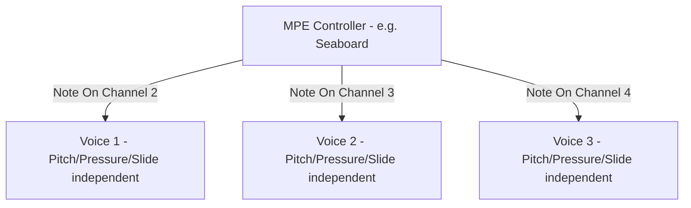
```mermaid
graph TD
    A[MPE Controller - e.g. Seaboard] -->|Note On Channel 2| B[Voice 1 - Pitch/Pressure/Slide independent]
    A -->|Note On Channel 3| C[Voice 2 - Pitch/Pressure/Slide independent]
    A -->|Note On Channel 4| D[Voice 3 - Pitch/Pressure/Slide independent]
```

* **Polyphonic Multi-Channel Routing**: Unlike standard MIDI where modulations (like pitch bend or mod wheel) affect ALL active sounding notes globally, MPE assigns each individual voice note to its own distinct MIDI Channel (Channels 2–15).
* **Multi-Dimensional Voice Vectors**: Tracks three axes of movement independently per key pressed:
  * **X-Axis (Pitch Bend)**: Horizontal key movement. Smoothly bends the individual voice pitch across custom ranges (from $\pm 2\text{ semitones}$ to full $\pm 48\text{ semitones}$ ranges).
  * **Y-Axis (Timbre / Slide)**: Vertical key position slides. Routed directly to filter cutoffs, FM modulation rates, or pulse-widths to sweep sounds individually.
  * **Z-Axis (Pressure / Aftertouch)**: Dynamic key pressure depth. Routed to virtual VCAs or envelope intensities to modulate volumes and swell single chords polyphonically!

---

## 17. System Settings, Directories Preferences & Shortcuts Table

The **`Settings ➔ Preferences...`** panel manages your paths and grid configurations without native hooks:
* **SD Card Mounted Library Directory**: Set the root parent directory folder path representing your physical SD card library. All subdirectories (`SAMPLES/`, `KITS/`, `SYNTHS/`, `SONGS/`) are resolved relative to this parent root dynamically.
* **Grid Layout Profiles**: Standardize your interface to **`Grid 8x16`** or extended **`Grid 16x16`** formats.
* **Microtuning & Custom Temperaments**: Fully integrated at the song-level, allowing you to break free from standard 12-TET tuning and explore dynamic, alternative temperaments, historical scales, and custom EDO microtonality (described in detail in [Section 17.2](#172-microtuning-custom-temperaments--scala-scl-imports) below).

### 17.1 Hardware Character Emulations & DSP FX Engines
To reproduce the exact, iconic lo-fi and physical audio character of the vintage Deluge hardware unit, the application incorporates specialized DSP emulation settings under the **Audio** tab in the Preferences panel (**`Settings ➔ Preferences...`**):
* **Reverb Model**: Select your preferred algorithmic hardware emulation reverb bus from the dropdown:
  * **`JCRev`**: Classic John Chowning-style waveguide reverberator.
  * **`FreeVerb`**: Classic high-density Schroeder/Moorer feedback comb filter matrix.
  * **`MVerb`**, **`ProceduralReverb`**, or **`RingsReverb`**.
* **Master Saturation Guard**: Check **`Enable Master Saturation Guard`** to enable the warm analog headroom compression of physical output op-amps via a state-space tanh lookup:
  $$V_{out}(t) = \tanh(V_{in}(t) \cdot \text{drive})$$
* **Nonlinear Filter Drive**: Check **`Enable Nonlinear Filter Drive`** to mimic input stage clipping and feedback charging loops inside the transistor ladder filter algorithms (`SVFilter` and `LpLadderFilter`).
* **Bit-Crusher DSP**: Check **`Enable Decimation Bit-Crusher`** to simulate early Deluge DAC converter grit by truncating the 24-bit audio stream to a 14-bit integer space with dither.

### 17.2 Microtuning, Custom Temperaments & Scala (.scl) Imports
The Deluge-Java Workstation features a microtuning engine that is fully integrated into the song structure and sound synthesis pipelines. You can configure custom temperaments, detune individual note classes, calibrate the base reference pitch, and import standard Scala `.scl` files.

Access the interface by selecting **`Settings ➔ Tuning & Temperaments...`** from the global menu bar:

#### 1. Temperament Core Settings
*   **Tuning Type Selector**: Choose between **Equal Temperament** (which detunes notes relative to equal subdivisions of the octave) and **Custom Ratios** (which builds scales from custom harmonic multipliers, such as Just Intonation).
*   **Notes / Octave Spinner**: Adjust the number of microtonal notes within the octave from **1 to 64 notes**. If you change this value, the note adjustment grid below immediately rebuilds itself to match! This makes it effortless to explore dynamic EDO systems like 19-TET, 31-TET, or 53-TET.
*   **Reference Pitch Calibration**: Calibrate the base reference frequency of Note 0 (defaults to A = 440.0 Hz) to alternative reference pitches (such as A = 432 Hz for organic resonances, A = 415 Hz for baroque temperaments, or A = 444 Hz) across the synthesizer engine.
*   **Scala (.scl) File Import**: Click the **`Import Scala (.scl) File...`** button to open a file browser, select any standard `.scl` file on your disk, and import it. The parser reads the file, extracts step count and ratios, and updates the settings.

#### 2. Note-by-Note Scaling Map
*   **Cents Adjustments (Equal Temperament Mode)**: Displays a vertical list of rows for notes `00` to `N-1`. Each row has a **JSlider** and a **JSpinner** bound bidirectionally to detune that note class by up to **$\pm 100$ cents**.
*   **Fractional Ratios (Custom Ratios Mode)**: Displays text fields to type custom ratios. Note 0 is locked to `1.0` (unison). Subsequent text fields support decimal entries and fractional ratios. Evaluated decimal values display next to each text field in real-time.

#### 3. ⚡ Real-Time Live Auditioning
All microtuning adjustments are applied directly to the active synthesizer voices. **Dragging a cents slider or typing a new ratio instantly recalculates frequencies and updates the pitch of active playing voices in real-time during playback!** This allows you to audit, play, and tune scales dynamically while the sequencer is running.

#### 4. 💾 Song-Level XML Persistence
Microtuning configurations are serialized directly inside the song's `.XML` file under the `<microtuning>` element:
*   Standard 12-TET songs are untouched, keeping files 100% clean and backward-compatible.
*   Custom tunings store note count, temperament type, reference pitch, and cents/ratios arrays.

### Complete Keyboard Shortcuts Reference:
| Shortcut Combination | Focused Panel / Action | Operational Description |
| :--- | :--- | :--- |
| **`Spacebar`** | Global Play / Stop | Starts or stops the sequencer playback. |
| **`Ctrl + R` / `Cmd + R`** | Tools menu dropdown | Opens the **Delugeator Randomizer & Generators Suite** dialog window. |
| **`Ctrl + L` / `Cmd + L`** | Tools menu dropdown | Opens the **Audio Loop Slicer & Kit Splitter** breakbeat tool dialog. |
| **`Ctrl + O` / `Cmd + O`** | File menu dropdown | Spawns a file browser to load a `.XML` project Song/Kit from disk. |
| **`Ctrl + S` / `Cmd + S`** | File menu dropdown | Overwrites and exports the current active `ProjectModel` structure back to XML. |
| **`Ctrl + Z` / `Cmd + Z`** | Edit action | Undoes the last grid step note change or gate timing adjustment. |
| **`Ctrl + Y` / `Cmd + Y`** | Edit action | Redoes the last undone sequencer state change from the transaction history stack. |
| **`Tab` Key** | View Mode | Toggles active display focus between CLIP, SONG, and ARRANGEMENT grid views. |
| **`Escape` Key** | Dialog focus | Closes the active frontmost dialog instantly. |

### 17.3 Deluge-Java Workstation Exclusive Power Features

The Deluge-Java Workstation extends the capabilities of the original physical hardware, leveraging the desktop environment's processing power, high-resolution display, disk throughput, and robust JDK libraries. Below is an overview of these exclusive power features:

#### 1. 📦 Standalone WAV Stem Exporter (Offline Mixdown)
Unlike the physical hardware—which only allows real-time stereo recording of a performance—Deluge-Java includes a high-performance **Offline WAV Stem Exporter**.
*   **Background Multi-Threaded Rendering**: Utilizing a background worker thread (`SwingWorker`), Deluge-Java renders the entire song at maximum CPU speed without interrupting the user interface.
*   **Track Isolation (Multi-Stem)**: The exporter runs a dedicated rendering pass for each individual track (Synth, Drum Kit, and Audio Track) by isolating its specific voice oscillators and filters. This outputs perfectly aligned, sample-accurate, phase-locked individual stem files (e.g. `Track_1_Drums_stem.wav`, `Track_2_Lead_stem.wav`) alongside a combined `Master_mix.wav` stem.
*   **Arranger-Sync Duration**: The exporter automatically scans the arranger timeline to detect the precise length of your song, or falls back to a user-specified duration.

#### 2. 🎹 Multi-Track MIDI Exporter
Exporting your arrangements to a digital audio workstation (DAW) like Ableton Live, Logic Pro, or Reaper is completely seamless.
*   **Arranger-Aligned MIDI tracks**: The MIDI exporter converts the song's arranger timeline into a standard multi-track MIDI file (`.mid`) with **96 PPQ** (Pulses Per Quarter Note) resolution.
*   **Sequencer Step Conversion**: Sequencer note triggers and gates are mathematically converted to precise MIDI tick boundaries, mapping straight drum slots to standard General MIDI keys (starting at C3 / MIDI 36 for drum pads) and synth notes to chromatic channels.
*   **Arranger Fallback**: If the arranger timeline is empty, the exporter automatically builds sequential blocks of your session clips (separated by a 1-bar gap) so you can easily import your patterns as clean, separate MIDI tracks!

#### 3. ⏱️ MIDI Clock Sync (Master & Slave Modes)
To bridge Deluge-Java with external hardware (such as drum machines, pocket operators, modular synthesizers, or secondary computers running DAWs), the workstation incorporates a dual-mode **System Real-Time MIDI Clock Sync** manager.
*   **Master Mode (Clock Transmitter)**: When playing internally, Deluge-Java acts as the master clock. It sends MIDI Start (`0xFA`), Stop (`0xFC`), and Clock (`0xF8`) messages to the selected MIDI output port at a rate of 24 clocks per quarter note, allowing external gear to run in perfect tempo-phase sync.
*   **Slave Mode (Clock Receiver)**: Locked to incoming MIDI clocks on the selected MIDI input port. Upon receiving a MIDI Start (`0xFA`) or Stop (`0xFC`), the transport state shifts instantly. The local playhead's advance rate is slaved exclusively to incoming Clock (`0xF8`) messages, disabling the local audio card sample clock driver to prevent double-triggering or phase drift!

#### 4. 🎚️ Fluid Viewport Grid Zooming & Proportional Layouts
Physical Deluge grids are locked to an 8x16 matrix. Deluge-Java introduces **Fluid Viewport Grid Zooming**:
*   **Pads Scaling**: Instantly scale the matrix grid (`Ctrl + =` or `Ctrl + -`) between **`8x16 (Large)`**, **`16x16 (Medium)`**, **`24x16 (Small)`**, and **`16x24 (Wide)`** grid resolutions. The pads automatically resize to fill the screen space perfectly.
*   **Decoupled Layout Rows**: Fixed control rows (like macro knobs and the isomorphic keyboard) dynamically shift their positions and scale their heights in perfect proportion to the pad size, saving massive vertical screen space and ensuring the interface is always clean and legible.

#### 5. 🗂️ Unified Pitch Fold Mode
*   For complex melodic parts, toggling **Fold Mode** collapses all empty chromatic rows, displaying *only* the lanes that contain active notes.
*   The **Unified Pitch Resolver** ensures that note edits on the folded grid are mapped with 100% mathematical integrity back to their absolute MIDI pitches in the audio engine and XML saver, maintaining perfect data parity.

---

## 18. Hardware Commands & UI Equivalents Reference

The following table maps the standard Deluge hardware button combinations (from the official Synthstrom Popular Commands Guide) to the equivalent modern desktop mouse clicks and keyboard shortcuts inside the Deluge-Java Workstation:

| Category | Hardware Command | Hardware Button Key Sequence | Java UI Desktop Equivalent Action |
| :--- | :--- | :--- | :--- |
| **All Views** | Adjust Brightness | `Shift` + `Learn` + turn `▼▲` knob | Adjust monitor brightness, or configure desktop layouts under **`Settings ➔ Preferences...`** |
| | Time resolution (rate) | Press `◄►` knob | Pick the resolution from the rate selector at the bottom of the clip grid |
| | Grid (pad) zoom | — | **`Ctrl + =`** / **`Ctrl + -`**, or the **View** menu, to resize the pad grid |
| | Previous / next clip | — | **`[`** / **`]`** |
| | Shift clip notes sideways | Push `▼▲` + turn `◄►` | **`Alt + ←`** / **`Alt + →`** (wraps around) |
| | Scroll grid horizontally | Turn `◄►` knob | Turn horizontal encoder knob in top toolbar / encoder strip, scroll mouse wheel horizontally, drag bottom scroll bar, or glide cursor near borders |
| | Zoom resolution / rate | `Shift` + turn `◄►` knob | Hold **`Shift`** + turn the horizontal scroll encoder in top toolbar / encoder strip to scale sequencer rate |
| | Scroll grid vertically | Turn `▼▲` knob | Turn vertical encoder knob in top toolbar / encoder strip, or scroll mouse wheel vertically |
| | Octave-scroll vertical | `Shift` + turn `▼▲` knob | Hold **`Shift`** + turn the vertical scroll encoder in top toolbar / encoder strip to scroll view by exactly one octave (12 rows) |
| | Metronome toggle | `Shift` + `Tap Tempo` | Check **`[✓] Metronome`** in transport toolbar or hold `Shift` + `T` |
| | Delete song | `Shift` + `Save/Delete` | Right-click Song XML file in Sidebar Explorer ➔ Delete |
| | New song | `Shift` + `Load` ➔ `Load` | Select **`File ➔ New Project`** (`Ctrl + N`) |
| | Undo / Redo | `Back` / `Shift` + `Back` | **`Ctrl + Z`** (Undo) / **`Ctrl + Y`** (Redo) or via **Edit** menu dropdown |
| **Knobs Push** | Cutoff / HPF / EQ Toggle | Push Upper-Right Parameter Knob | Select **Cutoff**, **HPF**, or **EQ** tab in bottom dials deck, or turn gold dials directly |
| | Delay Time Ping-Pong | Push Upper-Right delay knob | Toggle **`[Ping-Pong]`** checkbox in Delay deck |
| | Delay style Digital/Analog | Push Lower-Left delay knob | Toggle **`[Analog Mode]`** checkbox in Delay deck |
| | Compressor speed Fast/Slow | Push Upper-Right sidechain knob | Toggle **`[Fast Release]`** in Compressor tab |
| | Reverb room Size | Push Lower-Left reverb knob | Select **Reverb Model** (JCRev vs Freeverb) or slide Room Size |
| | Mod FX type cycle | Push Upper-Right ModFX knob | Select Chorus, Flanger, or Phaser from Mod FX combobox |
| **Song View** | Adjust Track parameter | Hold track pad + turn dial | Adjust dials directly on the track row, or double-click header to open **Sound Editor** |
| | Launch Song Section | Press Section pad | Click colored Section launch buttons in **SONG view** |
| | Section repeat length | Push section pad + turn Select | Click loop countdown combobox on song row |
| | Clone track | Hold track pad + tap another row | Right-click track row header ➔ **`Clone Track`** |
| | Solo track | `Hold ◄►` + press launch | Click the **`[S]`** button next to track name |
| | Delete track | Hold track pad + `Save/Delete` | Right-click track row header ➔ **`Delete Track`** |
| **Track View** | Adjust track length | `Shift` + turn `◄►` knob | **`Ctrl + [`** / **`Ctrl + ]`** (shorten / lengthen), or click the length badge (e.g. `[16]`) and type a step count (1–192) |
| | Double clip (duplicate content) | `Shift` + push `◄►` knob | Right-click the length badge ➔ **Double clip length (duplicate content)** |
| | Open Piano Roll editor | — | **`Tools ➔ Piano Roll Editor…`** (**`Ctrl + P`**), or right-click a step ➔ Open Piano Roll Editor… |
| | Horizontal shift note | Push `▼▲` + turn `◄►` knob | Drag selected note block horizontally, or use Nudge slider |
| | Note length/Tie | Hold start pad + tap end pad | Click a note pad and drag mouse horizontally along the row |
| | Note velocity | Hold pad + turn `◄►` knob | Hover step to slide velocity wiggler, or double-click to set value |
| | Per-step parameter lock | Hold pad + turn parameter dial | Hold **`Shift`** and click pad ➔ adjust slider |
| | Clear track content | Push `◄►` knob + `Back` | Click **`[Clear Track]`** button or right-click track ➔ Clear |
| | Load sample to track | `Audition` pad + `Load` | Drag WAV file from **Sidebar Explorer** straight onto row lane |
| | Sound Editor | `Shift` + shortcut pad, or push Select | Double-click track name header to open **Synth Editor Dialog** |
| **Sound Presets** | Save preset | `Save` button | Select **`File ➔ Save Project`** (`Ctrl + S`) or click Save icon |
| | Load blank Synth/Kit | `Shift` + `Synth` / `Kit` | Right-click sidebar empty space ➔ **`Add Synth Track`** or **`Add Kit Track`** |
| | Load / Hot-Swap Preset | Turn `SELECT` encoder | Right-click track header ➔ Track Inspector ➔ Select Preset to swap sound (retains notes) |

---

## 19. Community Quick Reference & Adaptation Guide

This chapter provides a direct, code-by-code mapping of every shortcut code from the official **Deluge Community Quick Reference Guide v3.1** to the equivalent mouse/keyboard actions in the Java desktop Workstation:

### 19.1 Global & Song Settings (GL)

| Code | Hardware Function | Hardware Button Sequence | Java Workstation Equivalent Action |
| :--- | :--- | :--- | :--- |
| **GL01** | Zoom level view | Turn `◄►` knob | Choose the resolution in the rate selector at the bottom of the clip grid; resize the pad grid with **`Ctrl + =`** / **`Ctrl + -`** |
| **GL02** | Scroll grid | Turn `◄►` or `▼▲` knob | Drag grid scrollbars, use mouse scrollwheel, or hover border to auto-scroll |
| **GL03** | Undo action | Press `Back` button | **`Ctrl + Z`** or select **`Edit ➔ Undo`** |
| **GL04** | Redo action | Press `Shift` + `Back` | **`Ctrl + Y`** or select **`Edit ➔ Redo`** |
| **GL05** | Load Song | Press `Load` button, select | Double-click Song XML in Sidebar Explorer, or **`File ➔ Open Project...`** |
| **GL06** | Load Song (Keep Tempo) | Hold `Tempo` + press `Load` | Select Open Project, tempo magnitude matching adapts automatically |
| **GL07** | Delay Song Change | Hold `Load` | Song transitions loop boundaries are armed and timed automatically |
| **GL08** | Save Song (Incremental)| Press `Save` button | Select **`File ➔ Save Project`** (`Ctrl + S`). Automatically suggests and saves to next incremented revision number/letter (`SONG003.xml` ➔ `SONG003A.xml`) to preserve previous snapshot revisions! |
| **GL09** | Save Song (Collect All) | Hold `Save` + select | Select **`File ➔ Save Project`** (packages and copies samples to `/SONGS`) |
| **GL10** | Delete Song | Press `Shift` + `Save/Delete` | Right-click Song XML file in Sidebar Explorer ➔ Delete |
| **GL11** | New Song | Press `Shift` + `Load` ➔ `Load` | Select **`File ➔ New Project`** (`Ctrl + N`) |
| **GL12** | Settings Menu | Press `Shift` + push `Select` | Select **`Settings ➔ Preferences...`** |
| **GL13** | Open Sound Editor | `Shift` + Grid Shortcut | Double-click track name header to open **Synth Configuration Dialog** |
| **GL14** | Adjust Brightness | `Shift` + `Learn` + turn `▼▲` | Handled by OS settings, or layout colors in preferences |
| **GL15** | Swing amount | `Shift` + turn `Tempo` knob | Drag Swing slider in top transport toolbar / `g_swing` |
| **GL16** | QWERTY Keyboard Search | Automatic on name browse | Type directly in file browse filters or dialog text fields |
| **GL17** | Pad Refresh Rate | Scroll menu ➔ refresh rate | Optimized dynamically in Java UI JViewport paint loops |
| **GL18** | Firmware Update | Hold `Shift` + Power On | Managed by Maven compile and shade packages rebuilds |
| **GL19** | File System Explorer | Press `Back` button in menus | Navigate Sidebar JTree explorer (`📁 SD CARD EXPLORER`). All subdirectories (grouped first) and candidate files (`.XML`, `.ck`) are automatically sorted alphabetically (`A–Z`)! |
| **GL20** | Collect All Samples | Choose collect menu | Handled on Save Project serialization to SD card structure |

### 19.2 Step Sequencing Parity (SQ)

| Code | Hardware Function | Hardware Button Sequence | Java Workstation Equivalent Action |
| :--- | :--- | :--- | :--- |
| **SQ01** | Make note | Tap grid pad | Click grid cell to place note event |
| **SQ02** | Make long note (tie) | Hold start pad + tap end pad | Click a note pad and drag mouse horizontally along the row |
| **SQ03** | Adjust note velocity | Hold pad + turn `◄►` knob | Right-click the step ➔ **Edit Step Properties…** ➔ Velocity slider |
| **SQ04** | Note probability | Hold pad + turn `Select` left | Right-click the step ➔ **Edit Step Properties…** ➔ Probability / Fill slider |
| **SQ05** | Note iteration | Hold pad + turn `Select` right | Right-click the step ➔ **Edit Step Properties…** ➔ Iteration spinner |
| **SQ06** | Copy notes | Hold `Learn` + push `◄►` | Select notes or columns + press **`Ctrl + Shift + C`** |
| **SQ07** | Paste notes | Hold `Learn` + `Shift` + push `◄►`| Select target cell + press **`Ctrl + Shift + V`** |
| **SQ08** | Euclidean Rhythm | Push `Select` in Euclidean menu | Right-click a step in the target row ➔ **Euclidean Fill Row…** |
| **SQ09** | Shift all clip notes | Push `▼▲` + turn `◄►` knob | **`Alt + ←`** / **`Alt + →`** shifts every note one step (wraps around) |
| **SQ10** | Clear clip | Press `Shift` + `Back` + push `◄►`| Click **`[Clear Track]`** button, or right-click track ➔ Clear |
| **SQ11** | Change clip color | `Shift` + press `▼▲` knob | Click colored track swatch in track row header |
| **SQ12** | Adjust clip length | `Shift` + turn `◄►` knob | **`Ctrl + [`** / **`Ctrl + ]`**, or click the length badge (e.g. `[16]`) and type a step count (1–192) |
| **SQ13** | Duplicate clip content | `Shift` + push `◄►` knob | Right-click the length badge ➔ **Double clip length (duplicate content)** |
| **SQ14** | Note repeat (stutter) | Hold pad + turn parameter knob | Right-click the step ➔ **Edit Step Properties…** ➔ Iteration / Gate |
| **SQ15** | Play direction | Track menu ➔ direction | Select Forward/Reverse/Ping-Pong/Random track modes dropdown |
| **SQ16** | Step Parameter Lock | Hold note pad + turn parameter knob | Hold **`Shift`** + click step pad to arm, then adjust any configuration slider |

### 19.3 Song View (SV)

| Code | Hardware Function | Hardware Button Sequence | Java Workstation Equivalent Action |
| :--- | :--- | :--- | :--- |
| **SV01** | Stop/Launch clip | Tap colored launch pad | Click colored trigger pad on SONG view grid row |
| **SV02** | Solo clip (arm) | Hold `◄►` + press launch pad | Click the **`[S]`** (Solo) button next to track name |
| **SV03** | Solo clip (immediate) | Hold `◄►` + `Shift` + launch | Hold **`Shift`** + click **`[S]`** (Solo) button |
| **SV04** | Mute/Launch immediately | Press launch pad | Click Column 16 launcher pad (Launch Active Clip) / Hold **`Shift`** + click Column 16 launcher pad to mute |
| **SV05** | Delete clip | Press `Shift` + `Save/Delete` | Right-click track row header ➔ **`Delete Track`** |
| **SV06** | Create new clip | Click empty row button | Click empty grid row pad, or select `Add Track` |
| **SV07** | Move clip row | Hold pad + turn `▼▲` knob | Click and drag track row header up or down |
| **SV08** | Clone clip | Hold pad + press blank row pad | Right-click track row header ➔ **`Clone Track`** |
| **SV09** | Clip section color | `Shift` + press section pad | Click colored Section launch buttons in SONG view |
| **SV10** | Launch section | Press section pad | Click colored Section launch buttons in SONG view |
| **SV11** | Section repeat | Hold section pad + turn `Select` | Select repeat loop count dropdown on song row |
| **SV12** | Clip Parameter Change | Hold clip pad + turn knob | Adjust dials directly on track row, or double-click to open Sound Editor |
| **SV13** | Clip Type change | Hold row button + select type | Right-click track header ➔ Convert to MIDI Track / Convert to Synth Track |

### 19.4 Recording / Resampling (RS)

| Code | Hardware Function | Hardware Button Sequence | Java Workstation Equivalent Action |
| :--- | :--- | :--- | :--- |
| **RS01** | Record sample | Press `Record` + `Play` | Click Looper **`[● REC]`** button |
| **RS02** | Record sample into kit row| Hold kit pad + press `Record` | Click kit row config ➔ record input |
| **RS03** | Synth Resample | Press `Shift` + `Record` | Select **MIX** or **OUTPut** as oscillator source in Sound Editor |
| **RS04** | Slice sample | Press `Shift` + `Kit` (select SLIC)| Select **`Tools ➔ Audio Loop Slicer...`** (`Ctrl + L`) |
| **RS05** | Rename sample | Name menu ➔ QWERTY search | Right-click sample in Sidebar Explorer ➔ Rename |

### 19.5 Audio Clips (AC)

| Code | Hardware Function | Hardware Button Sequence | Java Workstation Equivalent Action |
| :--- | :--- | :--- | :--- |
| **AC01** | Create audio clip | Click empty row + select Audio | Select **`File ➔ Load Audio Track...`** |
| **AC02** | Input source | Click input source menu | Select LEFT, RIGHt, STEReo, BALAnced, MIX, or OUTPut in crop panel |
| **AC03** | Loop length | Click endpoint column | Adjust loop start/end crop markers in visual WAV crop panel |
| **AC04** | Clear audio clip | Press `Shift` + `Save/Delete` | Click crop panel `[Delete]` button, or clear track |

### 19.6 Modifying Sounds (MS)

| Code | Hardware Function | Hardware Button Sequence | Java Workstation Equivalent Action |
| :--- | :--- | :--- | :--- |
| **MS01** | New Synth/Kit | Press `Shift` + `Synth` / `Kit` | Right-click empty sidebar space ➔ **`Add Synth Track`** or **`Add Kit Track`** |
| **MS02** | Save preset | Press `Save` button | Select **`File ➔ Save Project`** (`Ctrl + S`) or click Save icon |
| **MS03** | Clear notes & automation | Hold `◄►` + press `Back` | Click **`[Clear Track]`** button |
| **MS04** | Choke group | Kit menu ➔ select Choke | Check `Auto-Choke Hats` or set choke index in Kit slots configurations |
| **MS05** | Cycle default scales | Press `Shift` + `Scale` | Click Scala Scale browse dialog under Preferences |
| **MS06** | Change root note | Hold `Scale` + audition pad | Select root key dropdown on track header |
| **MS07** | Transpose clip | Push + turn `▼▲` knob | Adjust Transpose spinner on track header |
| **MS08** | Clone preset | Preset menu ➔ select Clone | Right-click preset ➔ Save As |
| **MS09** | Affect Entire | Hold `Affect Entire` + turn parameter knob | Toggle **`ALL`** button on top toolbar to edit all tracks globally |
| **MS10** | Tap tempo | Tap the tempo encoder | Click **`TAP`** button next to BPM slider to set tempo by tapping |

### 19.7 Arranger View (AV)

| Code | Hardware Function | Hardware Button Sequence | Java Workstation Equivalent Action |
| :--- | :--- | :--- | :--- |
| **AV01** | Add Clip | Press grid cell in arranger | Click empty arranger step cell |
| **AV02** | Move Clip instances | Turn `◄►` knob | Click and drag arranger block horizontally |
| **AV03** | Change instance length | Turn `◄►` + `Shift` | Hold Shift and drag arranger block edges |
| **AV04** | Delete clip instance | Hold pad + press `Save/Delete` | Double-click or right-click arranger block |
| **AV05** | Mute/Unmute | Press track launch button | Click `[M]` button on track row header |
| **AV06** | Solo instrument | Hold `◄►` + press launch pad | Click `[S]` button on track row header |
| **AV07** | Enter Clip | Press pad to view/edit | Double-click arranger block to zoom into Clip View |
| **AV08** | Start Playback | Press `Play` | Playhead scheduler syncs play to visible viewport |
| **AV09** | Live performance record | Press `Record` | Click **`[🔴 CAPTURE]`** button |

### 19.8 MIDI Commands (MC)

| Code | Hardware Function | Hardware Button Sequence | Java Workstation Equivalent Action |
| :--- | :--- | :--- | :--- |
| **MC01** | MIDI Out setup | Hold row button ➔ select MIDI | Select MIDI Channel dropdown in MIDI track header |
| **MC02** | CC learn | Hold param knob ➔ turn CC select| Select parameter and click **`[START LEARN]`** in MIDI Device settings |
| **MC03** | MIDI Note Input | Play external keys | Mapped on active track input, plays virtual synth engine |
| **MC04** | Takeover modes | Managed in menus | Configure JUMP, PICKUP, or SCALE in Preferences dialog |

### 19.9 FM Multipliers to Semitones & Cents Table
Use the following table to map FM multipliers to semitone offsets and fine cent tuning adjustments when designing FM presets:

| Target FM Ratio | Semitone Pitch Offset | Cent Tuning Offset | Sonic Characteristics |
| :--- | :--- | :--- | :--- |
| **1:1** (Fundamental) | 0 semitones | 0.0 cents | Baseline carrier tone |
| **1:2** (1st Octave) | 12 semitones | 0.0 cents | Hollow octave sound |
| **1:3** (Fifth Overone) | 19 semitones | 2.0 cents | Warm, organ-like fifth |
| **1:4** (2nd Octave) | 24 semitones | 0.0 cents | Bright fundamental clarity |
| **1:5** (Major Third) | 27 semitones | 86.0 cents | Sweet harmonic third |
| **1:6** (Fifth Octave) | 31 semitones | 2.0 cents | High harmonic organ |
| **1:7** (Harmonic Seventh)| 33 semitones | 69.0 cents | Aggressive, metallic chime |
| **1:8** (3rd Octave) | 36 semitones | 0.0 cents | Crystal chime pluck |
| **1:9** (Major Second) | 38 semitones | 4.0 cents | Industrial detune friction |
| **1:10** (Major Third) | 39 semitones | 86.0 cents | High harmonic bite |
| **1:12** (Fifth Octave) | 43 semitones | 2.0 cents | Searing digital bells |

---

## 20. Creative Workflow Tips & Best Practices

The following workflow tips and practices help organize project sessions:

*   **Sequencing as Loops**: Use Clip View for loops, and Arrangement View to chain them into complete songs.
*   **Keep Song Mode at 1/16th Resolution**: When navigating song structures in **SONG View**, stick to a standard 1/16th zoom level. At this zoom level, the backlit pads patterns form distinct color patterns for each track, helping you locate and switch clips rapidly without visual clutter.
*   **Protect the Source (Non-Destructive Editing)**: When experimenting, clone your active clip or section first before performing destructive actions (e.g. clearing steps, applying extreme randomizations, or recording live automation). This keeps a safe baseline copy of your original ideas, letting you iterate fearlessly.
*   **Drums Kit Consolidation**: To keep your session responsive and conserve system memory, avoid filling drum kits with hundreds of unused samples. Group kit slots logically (e.g. Kick/Snare/Hats in one kit, ambient loops in another, and SFX in a third) across separate track lanes.
*   **Resampling**: If multiple synth voices or complex modulation strain CPU, use the export audio feature to bounce track lanes into a single WAV sample.
*   **Calibrate Tempo-Synced Delay**: To sync the master Delay to your tempo, ensure the Delay Time parameter is set to its default value (the dials are centered). Adjust the Division selector (e.g. from 16th to a wider 8th or 4th note) to create spacious, tempo-locked delays.

---

> [!NOTE]
> All resources and WAV samples are dynamically loaded from your preference SD Card Mounted Library path directory. Ensure your paths are configured inside **`Settings ➔ Preferences...`** to load library instruments stably.

---

## 21. Appendix: Keyboard Shortcuts & Hardware Parity Matrix

Maps hardware buttons to keyboard shortcuts and mouse gestures. Sections marked ⚠ are not implemented in the desktop UI.

---

### A. Symbol Key

| Symbol | Meaning |
| :--- | :--- |
| `Click` | Left mouse button |
| `Right-click` | Right mouse button |
| `Hold` | Press and keep held |
| `Drag` | Hold + move mouse |
| `Ctrl+X` | Hold Ctrl, press X |
| `Shift+X` | Hold Shift, press X |
| `Alt+X` | Hold Alt, press X |
| `Wheel` | Mouse scroll wheel |
| **[▶]** | Play button in toolbar |
| **[■]** | Stop button in toolbar |
| **[○]** | Audition pad (row header) |
| **[M]** | Mute button (row header) |
| **[⚙]** | Config / Sound Editor button (row header) |
| `Q` `W` | Gold Knob 1 / Gold Knob 2 (hold + wheel or drag) |
| ⚠ | Feature not yet implemented in the desktop UI |

---

### A2. Undo & Redo Coverage

Edits are undoable with **`Ctrl + Z`** / **`Ctrl + Y`** (or the **Edit** menu). What is on the undo stack today:

| Undoable | Not yet on the undo stack |
| :--- | :--- |
| Note/step toggles, velocity, probability, iteration, gate | Change Track Color |
| Step copy/paste, clear step | Kit Super-Generator (Tab 2) results |
| Per-step & clip automation edits | Master FX **Stereo Delay** and **Drive & Saturation** |
| Master FX **Reverb Tank** & **Reverb Comp** | |
| Euclidean **Fill Row** | |
| Synth/kit parameter changes; arpeggiator changes | |
| Project params (BPM, swing, master volume, reverb) | |
| Add / remove / move / rename / duplicate track & clip | |
| Set clip length (typed) and **Double clip length** | |
| **Synth Randomizer** (Delugeator, Tab 1) | |

If you're about to run the Kit Super-Generator, save the project first (`Ctrl + S`) so you can revert.

---

### B. Window Layout

```
┌─────────────────────────────────────────────────────────────────────┐
│ Menu: File | Settings | View                          [MIDI status] │
├──────────────────┬──────────────────────────────────────────────────┤
│                  │  Toolbar: [▶] [■] BPM──── SWING──── [VOL]       │
│  Sidebar         ├──────────────────────────────────────────────────┤
│  (Project        │  View tabs: [CLIP] [SONG] [ARRANGEMENT]          │
│   Tree /         ├──────────────────────────────────────────────────┤
│   Library)       │                                                  │
│                  │         GRID (rows × 18 columns)                 │
│  SONGS/          │  [○][M][⚙] track name │ step cells 1-16 │ctrl│  │
│  KITS/           │  [○][M][⚙] track name │ step cells 1-16 │ctrl│  │
│  SYNTHS/         │         …                                        │
│  SAMPLES/        ├──────────────────────────────────────────────────┤
│                  │  Velocity / visualiser strip                     │
└──────────────────┴──────────────────────────────────────────────────┘
```

---

### C. Song / Project Lifecycle `PL`

#### PL-A: Song operations

| # | Action | How | Notes |
| :--- | :--- | :--- | :--- |
| PL01 | **New Song** | `Ctrl+N` or File > New Project | Confirms before discarding unsaved changes; creates 1 Kit + 1 Synth track |
| PL02 | **Open Song** | `Ctrl+O` or File > Open Project | File chooser → parses Song XML; engine reloads samples |
| PL03 | **Save Song** | `Ctrl+S` or File > Save Project | Saves to current file; shows Save As dialog if not yet saved |
| PL04 | **Save Song As** | `Ctrl+Shift+S` or File > Save Project As | New filename; window title updates |
| PL05 | **Duplicate Song** | File > Save Project As, then `Ctrl+N` to start fresh | Saves current state as a new file; original is unaffected |
| PL06 | **Open Synth editor standalone** | Sidebar → double-click a file in SYNTHS/ | Loads as a single-track CLIP-mode view |
| PL07 | **Open Kit editor standalone** | Sidebar → double-click a file in KITS/ | Loads as a single-track CLIP-mode view |
| PL08 | **Save Kit as preset** | Right-click Kit row header → Save as Kit preset… | File chooser opens in KITS/ with track name pre-filled |
| PL09 | **Save Synth as preset** | Right-click Synth row header → Save as Synth preset… | File chooser opens in SYNTHS/ with track name pre-filled |

> **Library directory:** Set once via Settings > Set Samples Directory… pointing to the SAMPLES folder. The app derives `SONGS/`, `KITS/`, `SYNTHS/` as sibling folders. Default: `~/Deluge/`.

#### PL-B: Track management

| # | Action | How | Notes |
| :--- | :--- | :--- | :--- |
| PL10 | **Add Kit track** | Toolbar "+ KIT" button | Prompts for name; adds a Kit row with one empty clip |
| PL11 | **Add Synth track** | Toolbar "+ SYNTH" button | Prompts for name; adds a Synth row with one empty clip |
| PL12 | **Rename track** | Right-click row header → Rename | In-place prompt |
| PL13 | **Set track color** | Right-click row header → Set Color | Color chooser; saved to XML |
| PL14 | **Move track up** | Right-click row header → Move Up | Disabled when track is already first |
| PL15 | **Move track down** | Right-click row header → Move Down | Disabled when track is already last |
| PL16 | **Delete track** | Right-click row header → Delete Track | Confirmation dialog; removes all clips |

#### PL-C: Clip management (in Song View)

| # | Action | How | Notes |
| :--- | :--- | :--- | :--- |
| PL20 | **Add clip to track** | In SONG view, left-click an empty pad slot in the track's row | Creates a new empty clip at that position |
| PL21 | **Rename clip** | In SONG view, right-click a clip pad → Rename Clip | In-place prompt |
| PL22 | **Duplicate clip** | In SONG view, right-click a clip pad → Duplicate Clip | Deep copy; appended after existing clips |
| PL23 | **Delete clip** | In SONG view, right-click a clip pad → Delete Clip | Confirmation; a track must retain at least one clip |
| PL24 | **Copy clip between songs** | Duplicate source song (PL05), then open target song and use LOAD XML to import | Full inter-song clipboard ⚠ not yet implemented |

---

### D. GLOBAL `GL`

| # | Action | How |
| :--- | :--- | :--- |
| GL01 | Zoom grid (time) | `Ctrl+Wheel` |
| GL02 | Scroll grid left/right | `Shift+Wheel` or drag scrollbar |
| GL03 | Scroll grid up/down | `Wheel` on grid |
| GL04 | Undo | `Ctrl+Z` |
| GL05 | Redo | `Ctrl+Shift+Z` or `Ctrl+Y` |
| GL06 | Load Song (XML) | `Ctrl+O` or File > Open Project, or Sidebar double-click |
| GL07 | Save Song | `Ctrl+S` or File > Save Project |
| GL07b | Save Song As | `Ctrl+Shift+S` or File > Save Project As |
| GL08 | New Song | `Ctrl+N` or File > New Project |
| GL09 | Save + Collect All Samples | ⚠ not yet implemented |
| GL10 | Change Tempo | BPM slider (toolbar), or `Ctrl+Up/Down` |
| GL11 | Tap Tempo | `T` (focus on main window) |
| GL12 | Metronome On/Off | Shift+click tap tempo button, or press Shift+T |
| GL13 | Swing | SWING slider (toolbar), default 50% = no swing |
| GL14 | Settings / Preferences | **Settings > Preferences…** |
| GL15 | Set Samples Directory | **Settings > Set Samples Directory…** |
| GL16 | Reverb Model | **Settings > Preferences… → Reverb Model** |
| GL17 | MIDI Input Device | **Settings > Preferences… → MIDI Input** |
| GL18 | Adjust UI Font Size | Controlled by `PreferencesManager` |
| GL19 | Firmware Update | N/A — update the JAR file |
| GL20 | Show/Hide Visualisers | **Settings > Preferences… → Show Visualizers** |

---

### E. SEQUENCING `SQ`

#### Step Grid

| # | Action | How |
| :--- | :--- | :--- |
| SQ01 | Toggle step on/off | `Click` cell |
| SQ02 | Make a long note (tie) | Click and drag the note tail horizontally along the row |
| SQ03 | Adjust note velocity | `Right-click` cell → **Step Editor** → velocity slider |
| SQ04 | Set note probability | `Right-click` cell → **Step Editor** → probability slider |
| SQ05 | Set per-step filter | `Right-click` cell → **Step Editor** → filter offset |
| SQ06 | Set per-step pan | `Right-click` cell → **Step Editor** → pan offset |
| SQ07 | Set sample start/end | `Right-click` cell → **Step Editor** → start / end |
| SQ08 | Set clip length | Click the length badge (e.g. `[16]`) at the bottom of the clip grid and type a step count (1–192) |
| SQ09 | Edit a long, multi-bar clip | Open the **Piano Roll Editor** (`Ctrl + P`) for a scrollable whole-clip view, or zoom out to fit the clip on the grid |
| SQ10 | Add track row | Click '+ KIT' or '+ SYNTH' in top toolbar |
| SQ11 | Record live notes | `R` (while focused on grid) |
| SQ12 | Resample | ⚠ not yet implemented |
| SQ13 | Shift all clip notes | **`Alt + ←`** / **`Alt + →`** (shifts every note one step, wraps around) |
| SQ14 | Clear clip | ⚠ not yet implemented (`Ctrl+Delete` planned) |
| SQ15 | Change track color | Right-click row header ➔ Change Track Color |
| SQ16 | Note nudge | Right-click step ➔ Step Editor ➔ nudge slider |
| SQ17 | Reduce clip length | `Ctrl+[` |
| SQ18 | Increase clip length | `Ctrl+]` |
| SQ19 | Reset clip length to 16 | `Ctrl+Shift+L` |
| SQ20 | Poly Rhythms | Set each row's length independently via `Ctrl+[` / `Ctrl+]` when that row is focused. |
| SQ21 | Move kit clip row | ⚠ not yet implemented |
| SQ22 | Note repeat (stutter) | Right-click step ➔ Step Editor ➔ repeats slider |
| SQ23 | Copy notes | `Ctrl+Shift+C` |
| SQ24 | Paste notes | `Ctrl+Shift+V` |
| SQ25 | Set note iteration group | ⚠ not yet implemented |

---

### F. SONG VIEW `SV`

Switch to Song view: `F2` or click **[SONG]** tab.

| # | Action | How |
| :--- | :--- | :--- |
| SV01 | Launch / stop clip | `Click` clip block in song grid |
| SV02 | Launch clip immediately | `Click` |
| SV03 | Enter clip (edit) | `Click` clip block or track name button → switches to CLIP view |
| SV04 | Create new clip | `Right-click` empty row → **New Clip** |
| SV05 | Move track row up/down | Right-click row header ➔ Move Up / Move Down |
| SV06 | Duplicate clip variant | Right-click clip pad ➔ Duplicate Clip |
| SV07 | Delete clip variant | Right-click clip pad ➔ Delete Clip |
| SV08 | Solo track | `Click` **[S]** button on row header |
| SV09 | Un-solo | `Click` **[S]** again |
| SV10 | Mute / unmute track | `Click` **[M]** button on row header |
| SV11 | Mute tracks 1–8 | `Alt+1` … `Alt+8` |
| SV12 | Arm clip for recording | ⚠ not yet implemented |
| SV13 | Clip section colour | ⚠ not yet implemented |
| SV14 | Section repeat count | ⚠ not yet implemented |
| SV15 | Share / clone clip status | ⚠ not yet implemented |
| SV16 | Check clip / instrument name | Hover over row header — tooltip shows name |

#### Row Label Display Rules

| Track Type / Column | Hardware Parity & Visual Readout Behavior |
| :--- | :--- |
| **Kit Track Rows** | Each matrix row displays the parsed sample name with extensions trimmed. |
| **Synth Track (Scale Mode)** | Matrix rows map to scale degrees. At boot, C4 and C3 octave rows are visually highlighted. |
| **Vertical Scrolling (Scale Mode)** | Viewport shifts diatonically. |
| **Columns 17 & 18 (Utility Pads)** | Renders 8 backlit buttons across all track types. |
| **OLED Screen Readout** | Renders 3-line layout showing context strings. |

In SONG and ARRANGER views, all rows display the project track name.

---

### G. RECORDING & SAMPLES `RS`

| # | Action | How |
| :--- | :--- | :--- |
| RS01 | Record sample / audio (live) | Click Looper [● REC] button on a looper track |
| RS02 | Resample synth output | ⚠ not yet implemented |
| RS03 | Load sample into kit row | Row **[⚙]** → Sample section → **Browse…** |
| RS04 | Load all samples to kit | ⚠ (auto-loaded from XML) |
| RS05 | Slice sample | Select Tools ➔ Audio Loop Slicer... (Ctrl+L) |
| RS06 | Loop resample | ⚠ not yet implemented |
| RS07 | Rename sample | ⚠ rename via OS file manager |
| RS08 | Multi-sampling | ⚠ not yet implemented |

---

### H. MODIFYING SOUNDS `MS`

#### Kit Track — open with row **[⚙]**

| # | Action | How |
| :--- | :--- | :--- |
| MS01 | Load / change sample | **[⚙]** → Sample → **Browse…** |
| MS02 | Pitch (semitones) | **[⚙]** → Pitch & Modulation → Pitch slider (−24 to +24) |
| MS03 | Reverse playback | **[⚙]** → Reverse toggle |
| MS04 | Per-sample ADSR | **[⚙]** → ADSR section |
| MS05 | Mute group / choke | **[⚙]** → Mute Group picker |
| MS06 | Sample start/end points | `Right-click` step → Step Editor |

#### Synth Track — open with row **[⚙]**

| # | Action | How |
| :--- | :--- | :--- |
| MS10 | Oscillator type | **[⚙]** → Oscillator section → Type combo |
| MS11 | Filter mode / cutoff / res | **[⚙]** → Filter section |
| MS12 | FM ratio / FM amount | **[⚙]** → FM Synthesis section |
| MS13 | Arpeggiator on/rate/octave | **[⚙]** → Arpeggiator section |
| MS14 | LFO 0–3 (rate/shape/depth/target) | **[⚙]** → LFO section |
| MS21 | Save preset | **[⚙]** → **💾 SAVE PRESET** |

---

### I. PARAMETER CONTROLS `PD`

| Row | Q-key (LR) controls | W-key (UR) controls |
| :--- | :--- | :--- |
| MASTER | Volume | Pan |
| LPF | Cutoff frequency | Resonance |
| HPF | Cutoff frequency | Resonance |
| ENV 1 | Attack | Release |
| DELAY | Feedback | Time |
| REVERB | Room size | Damping |
| MOD FX | Rate | Depth |
| SIDECHAIN | Duck depth | Release time |

---

### J. LFO MODULATION `LF`

| # | Action | How |
| :--- | :--- | :--- |
| LF01 | Open LFO editor (synth) | Row **[⚙]** → LFO section |
| LF02 | Set LFO shape | LFO slot → Shape combo |
| LF03 | Set LFO rate | LFO slot → Rate slider |
| LF04 | Set LFO depth | LFO slot → Depth slider |
| LF05 | Set LFO target | LFO slot → Target combo |

---

### K. Workstation Panels Index

| Panel / Dashboard | Functional Description | Interface Placement / How to Access |
| :--- | :--- | :--- |
| **LFO Modulation Editor** | 4 full LFO slots with rate, shape, depth, and target routing. | Synth Config ➔ LFO Tab |
| **Kit Sound ADSR Envelope** | Individual Attack/Decay/Sustain/Release milliseconds sliders. | Kit Row Config [⚙] ➔ ADSR Section |
| **Kit Sound Mute Groups** | Drop-down selections to dynamically cut off sounds. | Kit Row Config [⚙] ➔ Mute Group |
| **Kit Sound Sample Reverse** | Toggle to reverse sample playback directions. | Kit Row Config [⚙] ➔ Reverse Toggle |
| **Step Properties Editor** | Adjust velocity, probability, and nudge values for individual notes. | Right-click a sequenced note pad |
| **Undo / Redo History** | Undo or redo transport and note editing adjustments. | Main Menu: Edit ➔ Undo / Redo |
| **MIDI Learn Interface** | Map panel parameters to physical MIDI CC controller knobs. | Synth Config ➔ MIDI Learn Tab |
| **Track Solo & Mute Deck** | Isolate or silence tracks in the mix. | Row Headers: Click [S] (Solo) or [M] (Mute) |

---

## 22. Macro Scripting & Song Automation

The Deluge-Java Workstation features a **Macro Scripting & Song Automation Engine**. This system allows you to record actions in real-time, serialize them into a text script, and play them back to procedurally build songs.

### 22.1 How to Record a Macro
1. Open the **Macro** menu.
2. Click **Start Recording Macro**. The menu header transforms into: **`Macro ●`** in red text.
3. Perform sequencing actions: toggle steps, add tracks, load presets, adjust parameters.
4. Open the **Macro** menu and click **Stop Recording Macro**.
5. Click **Save Macro Script...** to save as a `.txt` file.

### 22.2 Script Syntax Reference
Macro scripts are line-based text files.

| Command Token | Arguments Syntax & Description | Example |
| :--- | :--- | :--- |
| **`BPM_SWING`** | `paramName\|value` | `BPM_SWING\|bpm\|128.000000` |
| **`TRACK_STRUCT`** | `ADD\|trackIdx\|trackType\|trackName` | `TRACK_STRUCT\|ADD\|1\|SYNTH\|Bass` |
| **`LOAD_PRESET`** | `trackIdx\|presetName` | `LOAD_PRESET\|1\|049 Basic FM` |
| **`STEP`** | `trackIdx\|clipIdx\|row\|step\|active...` | `STEP\|1\|0\|0\|2\|true\|0.85...` |
| **`SYNTH_PARAM`** | `trackIdx\|paramName\|value` | `SYNTH_PARAM\|1\|lpfCutoff\|45.000000` |

### 22.3 Pre-Baked Showcases
*   **techno_creator.txt**: 130 BPM techno beat.
*   **deep_house_groove.txt**: 122 BPM House groove.
*   **cinematic_ambient.txt**: Cinematic soundscape.

---

## 23. Interactive Synth Preset Designer

Designing custom sounds is a key workflow in the Deluge-Java Workstation. The application features a comprehensive, multi-tab **Synth Track Editor** window that exposes every aspect of the synthesis engine, including oscillators, envelopes, modulation matrices, LFOs, and hardware-modeled filters.

Double-click any Synth Track's header name in the sequencer grid to open the editor.

### 23.1 Detailed Synth Configurator Layout & Tabs

The editor organizes the parameters into logical tabs to keep the workflow clean and intuitive:

#### 1. 🎛️ OSC / FILTER / FM (MAIN PANEL)
A consolidated quick-access panel showing the core synthesis controls. Ideal for rapid wiggling during performances:
*   **Oscillators**: Type and volume leveling for Osc 1 and Osc 2.
*   **LPF (Low-Pass Filter)**: Cutoff frequency and resonance sliders.
*   **FM Intensity**: Depth of frequency modulation between oscillators.

#### 2. 🌊 SOURCES
Detailed configurations for the synth's voice generators:
*   **OSC Sub-Tab**: Waveform selectors (Sine, Saw, Square, Triangle, Noise, Sample, or Wavetable) for Osc 1 and Osc 2. Includes pulse-width modulation (PWM), oscillator sync, and frequency detuning.
*   **ALGORITHM Sub-Tab**: Selects the active synthesis engine type:
  *   **`SUBTRACTIVE`**: Traditional analog modeling using dual oscillators through a low-pass filter.
  *   **`FM`**: Frequency modulation where Osc 2 modulates the frequency of Osc 1.
  *   **`RINGMOD`**: Ring modulation multiplying the signals of Osc 1 and Osc 2.
  *   **Voice Polyphony Mode**: Selects `POLY` (polyphonic play), `MONO` (monophonic), `LEGATO` (smooth sliding notes), `AUTO`, or `CHOKE` groups.
*   **DX7 Sub-Tab**: A dedicated DX7 patch importer. Click **`Import DX7 Cartridge...`** to load a standard `.SYX` DX7 cartridge bank file and instantly convert its patch configurations to Deluge parameters!

#### 3. 📉 HPF (HIGH-PASS FILTER)
A dedicated panel to configure the high-pass filter cutoff frequency and resonance, letting you carve out muddy low frequencies from synth pads.

#### 4. ✉️ ENVELOPE
Exposes **Envelope 1** (typically routed to volume/VCA) and **Envelope 2** (typically routed to LPF cutoff) ADSR sliders. Drag sliders to adjust Attack, Decay, Sustain, and Release times, and watch the real-time ADSR curve update in the graphical readout.

#### 5. 〰️ LFO
Provides controls for **LFO 1** and **LFO 2**:
*   Select LFO waveform shapes (Sine, Triangle, Saw, Square, or Random Sample-and-Hold).
*   Adjust LFO frequency rate.
*   A real-time animated oscillator visualizes the LFO frequency and wave cycle shape in real-time.

#### 6. 🔌 MODULATION (THE PATCHBAY MATRIX)
An interactive routing grid. Create custom patch cables connecting mod sources (e.g. `ENV1`, `ENV2`, `LFO1`, `LFO2`, `VELOCITY`, `AFTERTOUCH`) to destination parameters (e.g. `LPF Cutoff`, `Pitch`, `Volume`, `Pan`). Each connection has a bipolar slider adjusting the modulation depth.

#### 7. 🎹 ARP (ARPEGGIATOR)
Adjust the arpeggiator rate, octave range, sync division, chord gating modes, and click **`Enable Arpeggiator`** to sweep keys polyphonically.

#### 8. 🎚️ FX RACK
Exposes track-level effects processors:
*   **MOD FX**: Select Chorus, Flanger, or Phaser, and adjust depth, feedback, and rate.
*   **EQ**: Bass and Treble shelving gains.
*   **COMPRESSOR**: Dynamic threshold and release compression controls.

#### 9. ⚙️ SETUP UTILITIES
*   **AUTOMATION**: An automation lanes table. Click the checkbox next to any automatable parameter to enable it, exposing a step-by-step slider grid to draw automation directly.
*   **MIDI LEARN**: A table mapping synth parameters to physical MIDI CC signals. Click **`[MIDI Learn]`**, click a parameter slider in the UI, and sweep your hardware controller dial to map them instantly.

---

### 23.2 Synth Preset Browser Sidebar

On the right-hand side of the editor is a collapsible **`Preset Browser Sidebar`**:
*   Lists all `.XML` synth presets in your SD Card Mounted Library (`SYNTHS/` folder).
*   Presets are loaded instantly on double-click, letting you audition presets rapidly during sequencing.
*   Click **`COLLAPSE ➔`** to hide the browser and maximize editor screen space.

---

### 23.3 Saving Your Presets
Click the **`SAVE AS PRESET 💾`** button in the header toolbar of the editor:
1. Enter a custom name when prompted (e.g. `Fat Sub Bass`).
2. The workstation automatically serializes the active track parameters into a standard Deluge-compatible song XML element structure and saves it to `[LibraryRoot]/SYNTHS/Fat Sub Bass.XML`.
3. If you copy this file to your physical SD card, it can be loaded directly onto your Deluge hardware synthesizer!

---

## 24. Master FX Console & Modulation Dashboard

The **Master FX Console & Modulation Dashboard** is a premium, high-fidelity mixing desk that exposes all global, song-level effects parameters to the user interface. It provides visual, tactile control over spatial room acoustics, sidechain dynamics, stereo delay timing, and output saturation drive in real-time.

The console groups its parameters into four tabbed panels — Reverb Tank, Reverb Compressor, Stereo Delay, and Drive & Saturation:

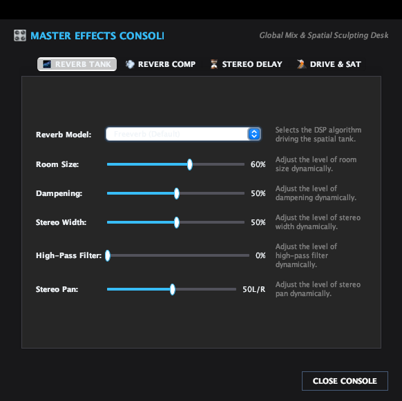
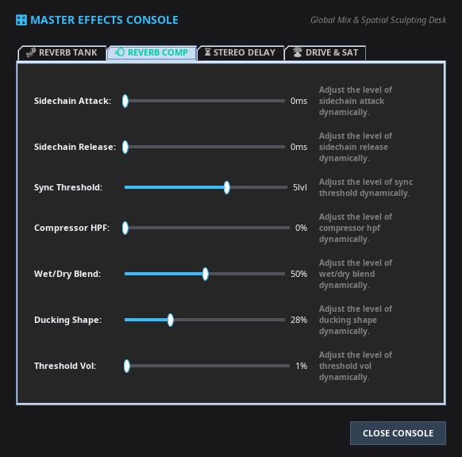
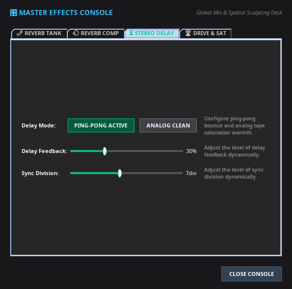
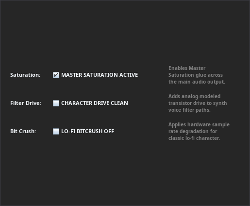

### 24.1 Tactile Console Layout & Parameters

The console is organized into four distinct HSL-tailored panels, each targeting a specific master processing block:

#### 1. 🌌 REVERB TANK
Controls the density, room acoustics, and spatial characteristics of the global algorithmic reverb bus:
*   **Reverb Model**: Selects the DSP algorithm (0 = Freeverb, 1 = Mutable Rings Excitation, 2 = Digital Chamber).
*   **Room Size**: Adjusts the virtual spatial room dimension and decay time (0% to 100%).
*   **Dampening**: Simulates acoustic absorption of high frequencies in the room (0% to 100%).
*   **Stereo Width**: Spreads the wet signal across the stereo image (0% to 100%).
*   **High-Pass Filter**: Cuts low frequencies from the input to prevent mud in the tail (0% to 100%).
*   **Stereo Pan**: Pans the reverb bus output across the Left/Right field.

#### 2. 💨 REVERB COMPRESSOR (SIDECHAIN DYNAMICS)
Controls a sidechain compressor dedicated to the reverb return path, letting you duck the reverb tail out of the way of primary beats (like the kick drum):
*   **Attack**: Adjusts how quickly the compressor ducks the reverb when a transient hit occurs.
*   **Release**: Adjusts how quickly the reverb swells back in after the hit.
*   **Sync Threshold**: Calibrates the sidechain detection threshold level (0 to 8).
*   **Compressor HPF**: High-pass filter for the sidechain side-path to ignore bass transients.
*   **Wet/Dry Blend**: Blends the dry reverb tail with the ducked tail (0% to 100%).

#### 3. ⏳ STEREO DELAY LINE
Controls the global feedback delay line for spacious, rhythmic echo patterns:
*   **Delay Mode**: Toggle buttons for **Ping-Pong Mode** (which bounces echoes between Left and Right channels) and **Analog Warmth** (which emulates vintage tape saturation and high-frequency degradation).
*   **Delay Feedback**: Adjusts the number of echo repeats (0% to 100%).
*   **Sync Division**: Locks the delay time to structural musical divisions slaved to the song's BPM (0 to 16 divisions).

#### 4. 🌋 DRIVE & SATURATION
Applies final mix-bus gluing and analog character modeling to the master output:
*   **Master Saturation (Tanh)**: Emulates the rich harmonic distortion and soft clipping of physical output op-amps.
*   **Filter Character Drive**: Injects modeled transistor drive into all synthesizer voice filter paths.
*   **Lo-Fi Bitcrush**: Degrades the sample resolution to 14-bit for retro digital crunch.

---

### 24.2 Real-Time Bridge Sync & Undo Stack

Every knob turn, slider drag, or button toggle inside the console performs a three-way real-time synchronization:
1.  **High-Level Model Update**: Updates the active project song model configuration.
2.  **Bridge Sync**: Pushes the updated parameters directly to the audio engine, updating the audio rendering pipeline.
3.  **OLED Display Readout**: Prints transient readouts on the OLED screen (e.g. `RV.RM 75%`, `DL.PP ON`) for hardware-parity visual feedback.
4.  **Undo/Redo Registration**: Reverb Tank and Reverb Compressor changes are registered on the undo stack (`Ctrl + Z` / `Ctrl + Y`). Stereo Delay and Drive & Saturation changes are applied live but are not yet undoable.

---

### 24.3 💾 Hardware Compatibility & SD Card Portability

Any changes made inside the Master FX Console are written directly to the standard Synthstrom Deluge song XML format upon saving (`Ctrl + S`). 
Because the physical Deluge hardware loads these exact song-level parameters from its XML songs, your master effects mix will transfer losslessly to your physical SD card and sound identical when loaded on your physical Deluge unit.

---

### 🔊 Tutorial M: Mixing and Mastering a Heavy Electronic Groove

Follow these steps to sculpt a mix with sidechain ducking and analog warmth using the Master FX Console:

1.  Press **`Spacebar`** to start playing a heavy electronic drum and bass sequence.
2.  Click the **`🎛️ MASTER FX`** button next to the master volume slider on the top toolbar to open the console.
3.  Navigate to the **`🌋 DRIVE & SAT`** tab:
    *   Click **`[✓] MASTER SATURATION ACTIVE`** to glue the mix together.
    *   Click **`[✓] CHARACTER DRIVE ACTIVE`** to add subtle analog harmonics to the filter paths.
4.  Navigate to the **`⏳ STEREO DELAY`** tab:
    *   Click the **`[PING-PONG OFF]`** button to toggle it to **`[PING-PONG ACTIVE]`**.
    *   Click the **`[ANALOG CLEAN]`** button to toggle it to **`[ANALOG WARMTH ON]`**.
    *   Slide **`Delay Feedback`** to **`45%`** and set **`Sync Division`** to **`4`** ($1/8$ triplet echo). You will hear the delay bounce warmly across the stereo field!
5.  Navigate to the **`🌌 REVERB TANK`** tab:
    *   Set the **`Reverb Model`** combobox to **`Digital Chamber`**.
    *   Slide **`Room Size`** to **`70%`** and **`Stereo Width`** to **`80%`**. You will hear a massive, cathedral-like spatial reverb, but it might wash out the kick drum.
6.  Navigate to the **`💨 REVERB COMP`** tab to sculpt the sidechain pump:
    *   Slide **`Sidechain Release`** to **`120ms`** and **`Wet/Dry Blend`** to **`100%`**.
    *   Watch the kick drum hits: the massive reverb tail now ducks completely out of the way during the kick, then swells back in beautifully during the gaps, creating a pumping, high-energy spatial rhythm!
7.  Once you are happy with the mix, press **`CLOSE CONSOLE`** and hit **`Ctrl + S`** to save your masterpiece! Your song is now mixed, mastered, and ready to be loaded onto your physical Deluge SD card!

---

## 25. Arranger Track Mutes, Solos & Live Capture

The **Arranger Track Mutes, Solos & Live Capture** provides a high-fidelity, hardware-accurate track management deck for the linear timeline arranger. It allows independent, non-destructive mute/solo states on the Arranger timeline, which are saved in the song XML format.

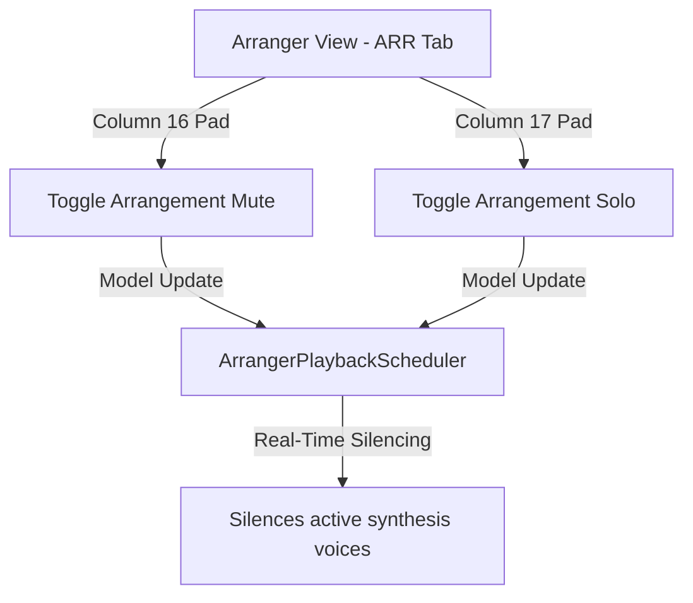
```mermaid
graph TD
    A[Arranger View - ARR Tab] -->|Column 16 Pad| B[Toggle Arrangement Mute]
    A -->|Column 17 Pad| C[Toggle Arrangement Solo]
    B -->|Model Update| D[ArrangerPlaybackScheduler]
    C -->|Model Update| D
    D -->|Real-Time Silencing| E[Silences active synthesis voices]
```

### 25.1 Tactile Arranger Headers

In Arranger view (click the **`[ARR]`** button in the top toolbar), the two right-hand columns of the grid act as per-track headers alongside the timeline lanes:

*   **Mute column** (text **`MUTE`** / **`UNMUTE`**):
    *   *Visual States*: **green** when the track is active (unmuted), **yellow-orange** (`#FFA000`) with the text **`UNMUTE`** when muted, and **blue** when this track is the soloed one; it dims when another track is soloing.
    *   *Behavior*: click to toggle the track's arrangement mute.
*   **Solo column** (text **`SOLO`**):
    *   *Visual States*: dark slate (`#2D2D32`) when off, and **cyan** (`#00FFCC`) when this track is soloed.
    *   *Behavior*: click to toggle the track's arrangement solo.

---

### 25.2 Real-Time Playback Silencing

The background playback loop dynamically monitors the arrangement-specific mute/solo states of all tracks on every quarter-note step tick:

1.  **Ducking/Silencing Evaluation**: On every step tick, the scheduler evaluates if a track should be silenced:
    *   *Mute Evaluation*: The track is explicitly muted in the arrangement.
    *   *Solo Evaluation*: Another track in the project is soloed, and this track is not soloed.
2.  **Engine Update**: If a track is silenced, the scheduler overrides its active timeline clip placement, clearing active steps in the engine to silence synthesizers and audio players.
3.  **Instant Engine Sync**: Toggling mute/solo in the GUI immediately silences the track's playback, updating the active audio rendering stream.

---

### 25.3 💾 Hardware Compatibility & XML Parity Attributes

All arrangement-specific mute/solo configurations are written directly to the standard Synthstrom Deluge XML schema upon saving (`Ctrl + S`), ensuring 100% portability to your physical unit:

*   **Instrument Tracks**: Serialized on each track's active clips inside the `<instrumentClip>` node:
    ```xml
    <instrumentClip isMutedInArrangement="1" isSoloingInArrangement="0" ...>
    ```
*   **Audio Tracks**: Serialized on the track's audio clips inside the `<audioClip>` node:
    ```xml
    <audioClip isMutedInArrangement="0" isSoloingInArrangement="1" ...>
    ```
*   **Lossless XML Parsing**: When loading a song XML from your physical Deluge SD card, the parser recovers these attributes and maps them back onto the track model, ensuring your linear mix arrangement is perfectly preserved.

---

### 25.4 🔴 Live Capture Log Integration

When the red **`[🔴 CAPTURE]`** button is active during playback, muting/unmuting tracks in Song View automatically records linear arrangement clips in real-time onto the Arranger timeline:

*   **Dampening / Mute Action**: Muting a track finalizes and logs the active arranger clip block placement up to the current playhead step.
*   **Relaunch / Unmute Action**: Unmuting a track automatically draws a new linear arranger placement starting at the current playhead step.
*   *Result*: You can perform your song live by simply muting and unmuting tracks in Song View, and the workstation will automatically record your entire performance into a linear Arranger timeline layout.

---

### 🔊 Tutorial N: Recording and Sculpting a Linear Arrangement

Follow these steps to record a live performance and sculpt it with track-level mutes/solos in the Arranger:

1.  Open a multi-track song and click the **`[SONG]`** button to enter Song View.
2.  Click the **`● CAPTURE`** button on the top toolbar to arm live arranger capture.
3.  Click **Play (▶)** in the transport to start playback. All tracks are unmuted and begin logging arranger blocks.
4.  At the end of the 4th bar, click the **`MUTE`** button on the Bass synth track header: the bass is silenced, and the capture engine logs a 4-bar arranger block on the timeline.
5.  At the end of the 8th bar, click the Bass track's **`UNMUTE`** button: the bass returns, and a new arranger block starts at that point.
6.  Click the **`[ARR]`** button to enter Arranger View:
    *   Your live performance appears as linear clip blocks on the timeline.
7.  Sculpt the arrangement further:
    *   Click the **`SOLO`** button on the Lead synth track: it turns **cyan** and the Drum and Bass tracks are instantly silenced.
    *   Click **`SOLO`** again to restore the full mix.
8.  Press **`Ctrl + S`** to save your song. Copy the XML to your physical Deluge's SD card, load it, and hear your linear arrangement play back identically on the physical hardware!


## 26. The Track Inspector

The **Track Inspector** is a compact, tabbed utility for inspecting and adjusting a single track without opening the full synth/kit editor. Open it by right-clicking a track's row header and choosing **Track Inspector…**. Each tab focuses on one concern:

*   **Mixer** — per-track Channel Volume and Channel Panning.

    

*   **Presets** — quick preset browsing/selection for the track.

    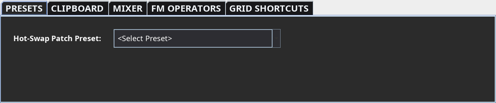

*   **Clipboard** — copy/paste of track and clip data.

    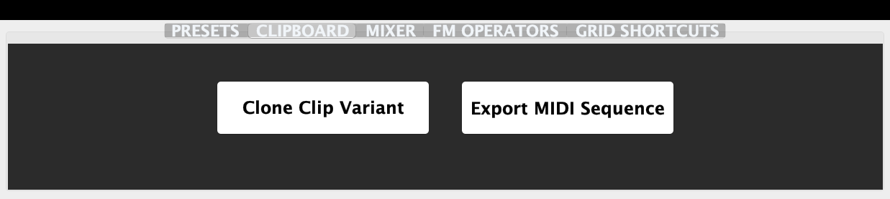

*   **FM Operators** — a summary of the 2-operator FM carrier/modulator amounts.

    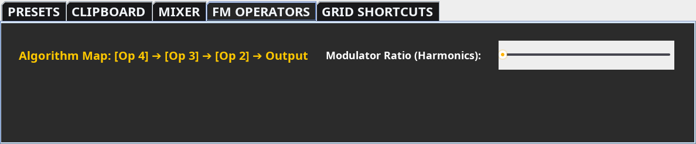

*   **Grid Shortcuts** — a reference of the pad-grid button combinations.

    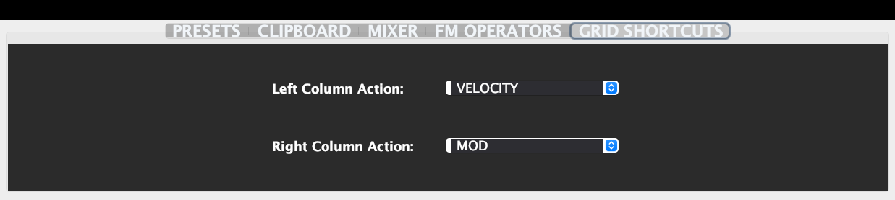

## 27. Workstation Dialogs & Tools

These focused dialogs cover tuning, generative textures, rhythm generation, sample zone mapping, wavetable creation, and housekeeping. **Tuning & Temperaments**, **Drone Lab**, and the **Orphaned Recording Cleaner** open from the **Tools** menu; the others open in context (from a step's right-click menu or the oscillator/sample settings).

*   **Tuning & Temperaments** (Tools menu) — choose an equal or microtonal temperament, notes-per-octave, reference pitch (A), import a Scala `.scl` file, and set a per-note scaling map (cents offset for each of the 12 notes).

    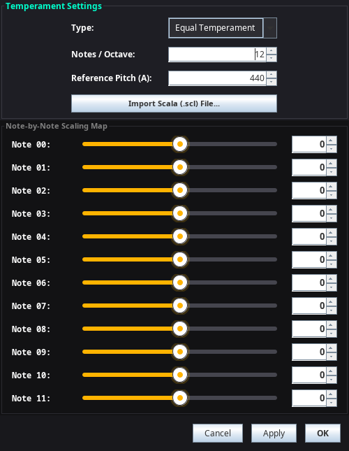

*   **Drone Lab & Texture Generator** — build evolving drones/textures from a synth track.

    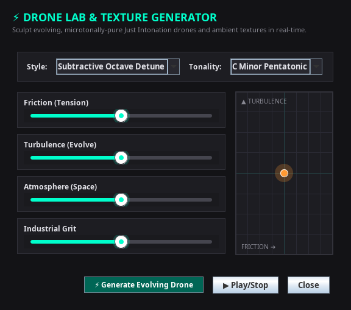

*   **Euclidean Rhythm Generator** (right-click a step ➔ **Euclidean Fill Row…**) — distribute N hits evenly across the step count to create Euclidean patterns for a note row (§1.10).

    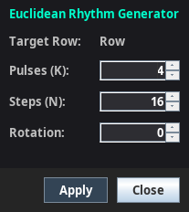

*   **Bar Automation** — toggle per-bar automation events (e.g. a low-pass filter sweep or a volume fade-in) on the timeline.

    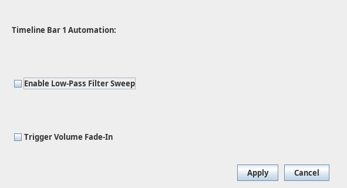

*   **Multi-Sample Zone Mapper** — map sample files to key/velocity zones for a multisample oscillator.

    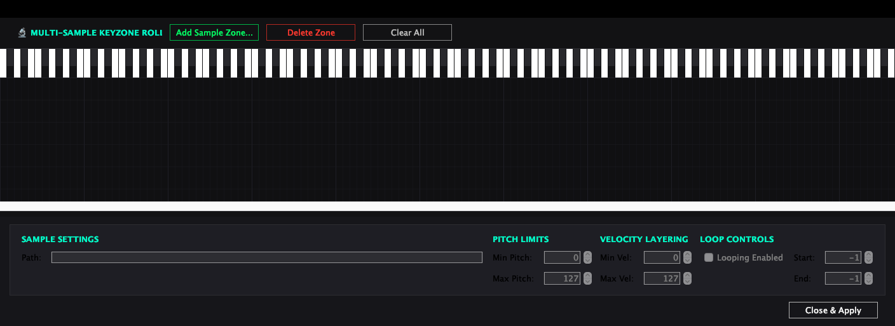

*   **Wavetable Creator & Editor** — author/edit the wavetable used by a synth oscillator.

    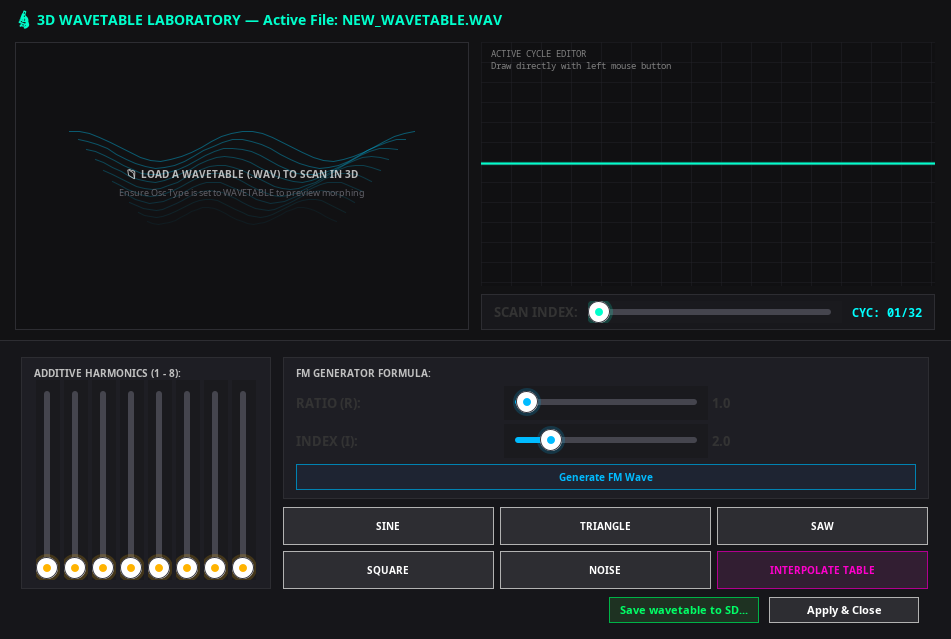

*   **Orphaned Recording Cleaner** — find and remove orphaned/unused recording files from the SD card.

    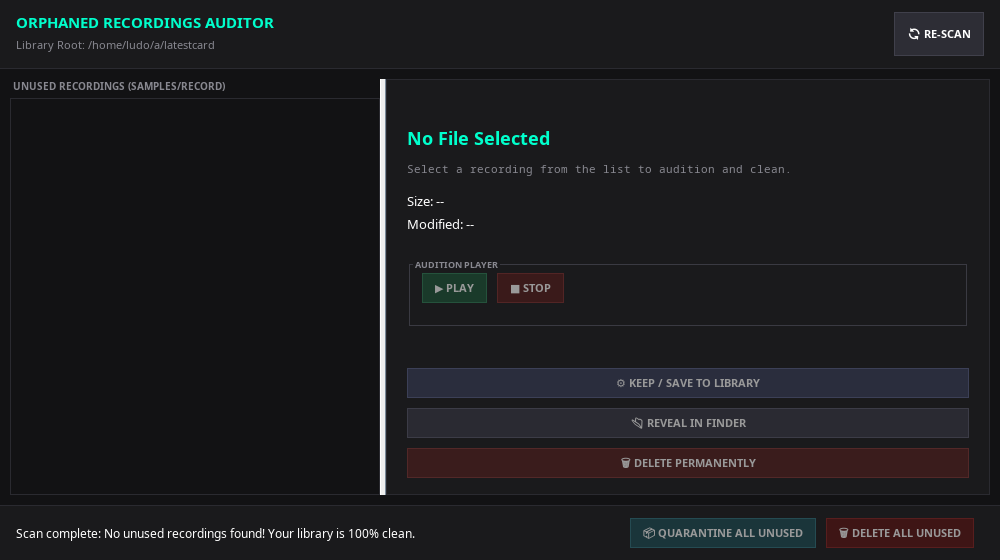

## 28. Application Menus

The desktop menu bar exposes file, editing, tooling, view, settings, macro, and help commands (with keyboard shortcuts). These desktop menus have no direct equivalent on the hardware — they are conveniences for the Java workstation.

*   **File** — new/open/save projects, show the explorer, export Audio / WAV stems / MIDI, assemble a kit from synths, import Ableton/MIDI/audio, run scripts.

    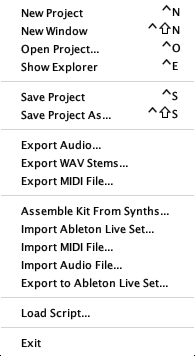

*   **Edit** — editing commands (undo/redo and clipboard operations).

    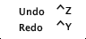

*   **Tools** — generators and utilities.

    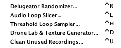

*   **View** — workspace/view switching.

    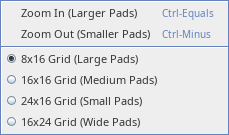

*   **Settings** — preferences and configuration.

    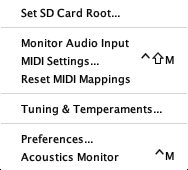

*   **Macro** — the macro scripting / song-automation commands (see §22).

    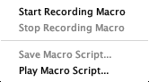

*   **Help** — documentation and about.

    


## 29. Premium User Interface & Interactive Displays

The Deluge-Java Workstation features a modern, dark-themed interface built for real-time visual feedback and intuitive navigation.

### 29.1 Integrated Sidebar Browser Tab Layout
The sidebar organizes project assets and remote MIDI connections into two distinct tabs:
*   **Library Tab**: Displays a directory tree browser of presets, samples, and projects on the simulated SD card. It supports full text search, file drag-and-drop, and project folders expansion.
*   **Hardware Tab**: Configures and manages remote MIDI connections to a physical Deluge unit, allowing you to sync directories, upload/download presets, and perform remote backups.

### 29.2 Backlit Silicone LED Grid Pads & Hover Glow
The main step sequencer grid emulates backlit physical silicone rubber LED pads:
*   **Silicone Hotspot Effect**: Playing pads render with a glowing white hotspot in the center, diffusing smoothly into the track's custom color.
*   **Interactive Hover Halos**: Moving your cursor over pads triggers a subtle, glowing halo outline, indicating the focused step.

### 29.3 3D Wavetable Morphing Visualizer
The Synth Sound Editor's wavetable visualizer includes:
*   **3D Wireframe Mesh**: Displays a rotating 3D double sine-wave mesh in the theme's colors when no custom wavetable is loaded.
*   **Real-Time Playhead Tracking**: A vertical slicing plane scans through the 3D wavetable in real-time, visualizing LFO sweeps, envelope morphs, and manual index changes.

### 29.4 CRT Cathode LFO Monitor & Waveform Editor
*   **CRT Cathode Oscilloscope**: Displays real-time LFO waveforms using neon-glow oscilloscope lanes, tracking LFO cycles and phase sweeps.
*   **Interactive Node Drawer**: The custom LFO drawer highlights grid steps on hover and places handles on nodes to edit custom LFO shapes.

### 29.5 Bipolar Modulation Matrix & Routing Highlights
The modulation matrix panel maps modulations visually:
*   **Bipolar Connection Squares**: Active modulation routes show up as rounded indicators, colored by polarity (positive offsets glow in the primary theme accent color, while negative offsets use the secondary color).
*   **Crosshair Hover Highlights**: Hovering over any cell in the grid draws a light highlight crosshair back to the source column and destination row labels, making complex modulation routings instantly readable.

