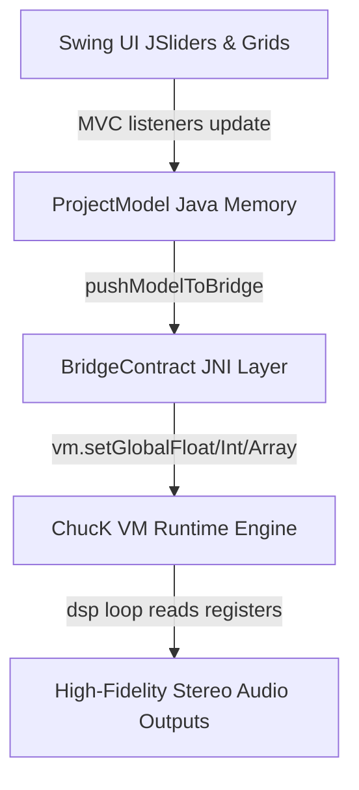

# ChucK-Java Deluge Workstation — Operations Manual & User Guide

Welcome to the **ChucK-Java Deluge Workstation**, a modern, high-fidelity software recreation and operations controller dashboard inspired by the Synthstrom Deluge hardware sequencer and synthesizer workflow. By combining a robust, multi-voice Java JRE control system with the high-performance ChucK (strongly-timed audio synthesis language) virtual machine engine, this workstation delivers zero-latency, sample-accurate step sequencing, physical DSP modeling, MPC-grade breakbeat auto-slicing, and modular modulation route routing.

---

## Table of Contents
1. [The Step Sequencer & Clip View](#1-the-step-sequencer--clip-view)
2. [Synthesizers & Sound Engines (Subtractive, FM, Wavetable)](#2-synthesizers--sound-engines-subtractive-fm-wavetable)
3. [Drum Kits & Smart Keyword Auto-Mapper](#3-drum-kits--smart-keyword-auto-mapper)
4. [DAW-Grade Visual Waveform Crop & Loop Markers Deck](#4-daw-grade-visual-waveform-crop--loop-markers-deck)
5. [MPC-Style Automatic Loop Slicer & Kit Splitter](#5-mpc-style-automatic-loop-slicer--kit-splitter)
6. [The Visual Modulation Patchbay & Gold Assignable Dials](#6-the-visual-modulation-patchbay--gold-assignable-dials)
7. [Song & Arrangement Linear Timelines View](#7-song--arrangement-linear-timelines-view)
8. [DSP FX Bounding Box Dials Deck](#8-dsp-fx-bounding-box-dials-deck)
9. [Delugeator Multi-Generator Dashboard Suite](#9-delugeator-multi-generator-dashboard-suite)
10. [System Settings, Directories Preferences & Shortcuts Table](#10-system-settings-directories-preferences--shortcuts-table)
11. [Appendix: Programmatic High-Fidelity JNI Registers Architecture](#11-appendix-programmatic-high-fidelity-jni-registers-architecture)
12. [Appendix: Pending Work Items & Future Development Roadmap (TODO List)](#12-appendix-pending-work-items--future-development-roadmap-todo-list)

---

## 1. The Step Sequencer & Clip View

The central focus of the Deluge Workstation is the multi-lane visual step sequencer. Represented as a responsive, high-contrast pads grid, it maps your sequencing notes and durations with absolute sample accuracy.


### Key Features:
* **Interactive Step Matrix Grid**: A standard 16x8 matrix scroll list representing time divisions (columns) across voice lanes (rows). Pads are backlit and glow in warm HSL colors reflecting step status and velocity levels.
* **Note Characteristics Tweak Deck**: Hovering over or clicking a step exposes a dynamic wiggler slider to adjust:
  * **Velocity**: Scale note triggers velocities from `1%` to `100%`.
  * **Duration (Length)**: Extend a note's gate across consecutive pads from a quick sixteenth trigger up to multiple bars.
  * **Nudge (Micro-Timing)**: Offset step triggers by micro-fractions to introduce organic, humanized shuffle swings.
  * **Repeat (Stutter)**: Subdivide a single grid step into automatic stutter retriggers (1x, 2x, 4x, 8x speed) for trap-style rolls.
* **Quantized Playback Head**: A moving vertical white indicator line tracks the JNI playhead position across columns in real-time, matching standard system clocks.

---

## 2. Synthesizers & Sound Engines (Subtractive, FM, Wavetable)

The sound design panel operates in three distinct, JRE-swappable hardware modeling modes:

* **Subtractive Synthesizer Engine**:
  * **Dual Oscillators (Osc A & Osc B)**: Selectable shapes (Sine, Triangle, Sawtooth, Square wave with pulse-width modulation, Noise generator).
  * **Moog-Style Ladder Low-Pass Filter (LPF)**: A high-fidelity 4-pole filter with cutoffs, resonance feedback loop saturation, and direct unipolar envelope modulators mapping.
  * **High-Pass Filter (HPF)**: Separate resonant 2-pole high-pass path to carve out low-frequency rumble.
* **6-Operator DX7-Style FM Synthesizer**:
  * Phase-modulated operator algorithms mapping carrier/modulator feedback chains, individual frequency multipliers ratios, and independent envelopes logic.
* **Wavetable Sound Module**:
  * Reads multi-cycle table sample waveforms, letting you sweep the index scan position dynamically to generate complex organic morphs.

---

## 3. Drum Kits & Smart Keyword Auto-Mapper

Building custom drum kits has never been so fast. Open the Kit configuration deck to access automated assembling features:

* **Stems Keyword Auto-Mapper**: Select a target sample folder path. The dual-pass regex search engine scans filenames and automatically assigns drums to standard Slots 1–8:
  * `Kick` keywords ➔ Slot 1
  * `Snare` / `Rim` keywords ➔ Slot 2
  * `Closed Hat` keywords ➔ Slot 3
  * `Open Hat` keywords ➔ Slot 4
  * `Clap` / `Shaker` keywords ➔ Slot 5
  * `Tom` keywords ➔ Slot 6/7
  * `Cymbal` / `Crash` / `Ride` keywords ➔ Slot 8
  * Remaining unmatched files populate slots 9 to 16 dynamically without duplicate overlaps!
* **Hi-Hat Mute Choke Groups**: Auto-links Open and Closed hats slots to Mute Group 1 by default, automatically choking hi-hat decays during live sequencing sweeps for realistic performance boundaries.
* **Direct Audition Triggers**: Quick thread-safe play button icons next to each slot allow rapid background file previews.

---

## 4. DAW-Grade Visual Waveform Crop & Loop Markers Deck

Double-click any drum track or click its `[CFG]` button to enter the real-time graphic wav file crop editor:


### Key Features:
* **Loom Parallel WAV Decoders**: Spawns highly responsive background JVM virtual threads (Project Loom) to decode PCM streams in under 5ms without locking the primary event dispatch thread (EDT).
* **Teal-to-Magenta Symmetric HSL Envelope Canvas**: Paints a stunning visual representation of the WAV stream's transient spike cycles. The gradient center-split shapes morph horizontally from a modern neon teal (`#00ffcc` at the center) to a hot magenta/pink (`#ff007f` at the borders) over an oscilloscope laboratory dark backdrop.
* **4-Marker Interactive Crop Sliders**: Glide standard parameters in real-time to locate:
  * **Start Point (Green - S)**: Where the playback head begins reading samples.
  * **End Point (Red - E)**: Where the voice release completes.
  * **Loop Start (Blue - LS)**: Where continuous looping cycles begin.
  * **Loop End (Magenta - LE)**: Where continuous looping cycles wrap back to Loop Start.
* **💾 Save & Apply Crop Button**: Commits the raw sample frame limits numbers back to the `SoundDrum` model, writes the XML kit configuration, and triggers a real-time JNI playback reload so boundaries update in live playback instantly!

---

## 5. MPC-Style Automatic Loop Slicer & Kit Splitter

The menu action **`Tools ➔ Audio Loop Slicer...`** (global shortcut **`Ctrl + L` / `Cmd + L`**) opens our spacious, automatic breakbeat slicing suite:


### Slicing Workflow:
1. **Choose a WAV loop**: Load any drum break, loop phrase, or sample WAV file. The large waveform canvas draws the spike transients immediately.
2. **Select Slices Grid Combobox**: Choose divisions count (**`4 Slices`**, **`8 Slices`**, or **`16 Slices`**). The screen instantly overlay-draws numbered vertical dashed orange slice-dividers over the audio wave!
3. **Choke and Volume Setup**: Toggle standard checkboxes to auto-choke all generated slices on Mute Group 1 (so triggering a new slice cuts off the playing tail for tight MPC-style breakbeat grooves) and scale initial volume multipliers.
4. **⚡ Slice & Load Across Kit Rows Button**: Click this button to split the breakbeat mathematically, populate drum kit rows 0 to 15 with the precise sample crops boundaries, write the Kit XML to the SD card `KITS/` folder, and hot-swap your active sequencer grid lane to play your newly sliced loops kit live instantly!

---

## 6. The Visual Modulation Patchbay & Gold Assignable Dials

Modulation is what breathes organic life into electronic sequences. The dedicated **`MODULATION`** sound configuration panel bridges virtual physical cables directly:

* **Interactive Modulation Routing Bay**: High-fidelity modular list where you can choose a Source, a Destination, a Bipolar polarity mode, and drag an amount slider to patch parameters dynamically:
  * **10 Modulation Sources**: Velocity, Envelope 1 (VCA ADSR), Envelope 2 (VCF ADSR), Envelope 3, Envelope 4, LFO 1, LFO 2, LFO 3, LFO 4, Aftertouch, Key Tracking Note, Random, and Sidechain bus.
  * **19 Modulation Destinations**: Volume, Pan, LPF Frequency, LPF Resonance, HPF Frequency, HPF Resonance, Osc A Volume, Osc B Volume, Pitch, Noise Volume, Mod FX (Rate/Depth/Feedback/Offset), LFO 1/2 Rates (Mod-of-Mod!), Envelope 1/2 ADSR times, and Wavetable index scan position.
* **Live JNI Hot-Swap Cable Sync**: Every slider drag or combo choice instantly calls `bridge.setSynthPatchCables(...)` to write vectors to the audio playback thread, creating real-time sweeps live!
* **System Assignable Gold Knobs**: A 4x4 matrix mapping standard hardware Assignable Gold Knobs parameters (LPF Cutoff, Decay, Reverb Level, Delay Time, HPF Cutoff, etc.) which saves selections straight to your XML sound templates.

---

## 7. Song & Arrangement Linear Timelines View

The workstation provides three distinct workspace perspectives to support multiple arrangement stages:

* **CLIP View**: Focuses on a single sequencer pattern grid lane to draw steps and adjust gate timings.
* **SONG View**: A launching matrix where different clip patterns (rows) are grouped into Song Sections. Launch or mute rows live to test transitions and structure arrangements.
* **ARRANGEMENT View**: A horizontal linear track timeline grid where clip instances blocks are sequenced from left-to-right (time timeline). Drag the edge of a block to extend its playback length, solo vocal lanes, or draw structured linear builds.

---

## 8. DSP FX Bounding Box Dials Deck

The bottom segment of your grid dashboard houses our dedicated premium stereo effects path processors:

* **Mod FX Module**: Selectable Chorus, Flanger, or Phaser modulators adjusting rate, feedback, depth, and LFO phase offset.
* **2-Band Shelving Master EQ**: Smooth shelving Bass and Treble dials to isolate low-ends and polish high frequencies.
* **Stereo Ping-Pong Delay**: Features standard delay time milliseconds sweeps, feedback loop saturation, and direct Ping-Pong stereo panning switches.
* **High-Contrast Reverb Deck (JCRev Engine)**: Customizable Room Size, High-Pass Filter (HPF) damping, and stereo spatial width selectors to craft small rooms or cavernous spaces.
* **Overdrive distortion Chain**: Interactive controls for Master Saturation threshold, sample-rate decimation, and Bitcrusher distortion levels for raw lo-fi tracks.

---

## 9. Delugeator Multi-Generator Dashboard Suite

The top menu action **`Tools ➔ Delugeator Randomizer...`** (global shortcut **`Ctrl + R` / `Cmd + R`**) summons our cohesive, multi-tab sound generator JDialog:


### Tab 1: 🎲 Synth Randomizer:
* **Continuous Triangular Probability Distributions**: Standardized algorithms centered around safe default limits morph subtractive parameters, FM carrier multipliers, and filter feedback.
* **Vibrant HSL Live Needle Gauge**: A custom-drawn circular dial maps average patch randomness onto a HSL color scale. Standard dials are green-teal (safe), yellow (active/vibrant), and red-magenta (extreme distortion).
* **Hardcore Overdrive Toggle**: Check this box to bypass standard safety probability curves, opening up massive FM feedback loops, extreme ladder overdrive, and chaotic filter self-oscillation ranges!

### Tab 2: 🥁 Kit Super-Generator:
* Select folders, map drum kits with smart auto-stems regex, audition steps, auto-choke hats, and output ready-to-load KITS XML presets in seconds.

---

## 10. UI Panels & Shift Shortcuts System Behavior

The Deluge Workstation features a deeply integrated Shift action system and dedicated modular sound configuration dialogs. Holding down the **Shift** key (or clicking the virtual Shift button) triggers hardware-accurate shortcuts and sub-labels overlays directly across the main pads grid.

### 10.1 The Shift Grid Shortcuts Overlay (Shift Held)

When Shift state is active, the standard step sequencing grid changes context, displaying backlit function shortcuts sub-labels directly on the pads.


#### Grid Function Shortcuts Map:
* **Row 1 (Synthesis Osc A/B)**: Quick shortcut mappings for `osc1Type`, `osc1Shape`, `osc1PW`, `osc1Sync`, `osc2Type`, `osc2Shape`, `osc2PW`, `osc2Sync`.
* **Row 2 (Low-Pass & High-Pass Filters)**: Quick shortcuts for LPF Mode, Cutoff, Resonance, LPF Envelope, HPF Mode, Cutoff, Resonance, and HPF Envelope.
* **Row 3 (Envelopes ADSR)**: Direct sliders quick focus bounds for Envelope 1 (Attack, Decay, Sustain, Release) and Envelope 2 (Attack, Decay, Sustain, Release).
* **Row 4 (LFO Modulators)**: Quick focus parameters for LFO 1 Rate, Shape, Depth and LFO 2 Rate, Shape, Depth.
* **Row 5 (Master Stereo FX Deck)**: Quick dials focus for Mod FX (Chorus, Flanger, Phaser), Reverb damping, Delay feedback, Panning, Master Volume, and Transpose.
* **Row 6 (Sequencer Clocks & MIDI CC)**: Quick settings keys for Tempo clock, Swing shuffle, Step Quantization, MIDI CC Learn channels, and device Clear actions.
* **Row 7 (System & File IO Operations)**: Disk quick triggers for Preset Load, Preset Save, Stems Import, XML Export, Undo transitions, and Redo stacks.
* **Row 8 (Workspaces View Modes)**: Quick view selectors to toggle grids to CLIP, SONG, ARRANGEMENT, AUTOMATION, PERFORMANCE, or system PREFERENCES.

---

### 10.2 Synth Configuration Dialog JTabbedPane Tabs

Double-clicking a Synth track triggers our wide-screen, compact sound editor. It cycles programmatically through twelve dedicated parameter decks:

```carousel

<!-- slide -->

<!-- slide -->

<!-- slide -->

<!-- slide -->

<!-- slide -->

<!-- slide -->

<!-- slide -->

<!-- slide -->

<!-- slide -->

<!-- slide -->

<!-- slide -->

<!-- slide -->

```

1. **DX7 FM Panel (`deluge_synth_tab_dx7.png`)**: Houses a complete Yamaha DX7 voice banks parser! Allows importing standard bulk `.SYX` sysex files, listing all 32 presets, choosing patch entries, and editing FM operator feedback, envelope rates, and keyboard level scaling.
2. **Algorithm Panel (`deluge_synth_tab_algorithm.png`)**: Displays a high-fidelity vector block diagram of the active FM operator algorithm (Algorithms 1 to 32), illustrating carrier-modulator frequency routing paths.
3. **OSC Panel (`deluge_synth_tab_osc.png`)**: Adjusts unipolar pulse-width modulations, fine pitch detuning steps, and dual oscillators wave shapes with smooth slate knobs.
4. **LFO Panel (`deluge_synth_tab_lfo.png`)**: Configures rates, depths, and shapes (Sine, Saw, Triangle, Square, Random/S&H) for all 4 global and local low frequency oscillators.
5. **Arpeggiator Panel (`deluge_synth_tab_arp.png`)**: A standard modular arpeggiator engine adjusting speed sub-clocks (1/4 to 1/32 notes), octave ranges (+1 to +4), gate lengths, and sorting paths (Up, Down, Order Played, Random).
6. **Envelope Panel (`deluge_synth_tab_envelope.png`)**: Configures unipolar ADSR times and target parameters amount settings for all 4 sound path envelopes.
7. **Modulation Matrix Panel (`deluge_synth_tab_modulation.png`)**: Sleek timeline routing rows table where sources are cabled to destinations with unipolar/bipolar sliders.
8. **Compressor Panel (`deluge_synth_tab_compressor.png`)**: Adjusts dynamic compressor thresholds, ratios, attacks, release, and sidechain HPF filters.
9. **EQ Panel (`deluge_synth_tab_eq.png`)**: Adjusts master shelving EQ Bass and Treble boost/cut decibels.
10. **Mod FX Panel (`deluge_synth_tab_mod_fx.png`)**: Configures modulation LFO speeds and feedback depths for active Chorus, Flanger, or Phaser lines.
11. **HPF Panel (`deluge_synth_tab_hpf.png`)**: Adjusts high-pass filter cutoff frequencies and feedback ladder overdrive drive.
12. **Automation Panel (`deluge_synth_tab_automation.png`)**: Lists all automate-able parameters with numeric draw step values for step-by-step tweaking.
13. **MIDI Learn Panel (`deluge_synth_tab_midi_learn.png`)**: Maps sequencer parameters to incoming hardware MIDI controller CC knob events via dynamic listener hooks.

---

### 10.3 Settings Preferences JDialog

The Settings Preferences Dialog is programmatically cabled in high-contrast slate-dark design tokens, providing safe, JNI-free controls:


* **Library Path Preferences**: Browse and set the mounted parent library root directory path folder for all sample loading.
* **Grid Profiles Mode**: Standardize layout resolutions to `Grid 8x16` or `Grid 16x16`.
* **Sequencer Engine Backend**: Toggle between ChucK (strongly-timed audio synthesis language engine) and Pure Java direct soundcard playback backends.

---

## 11. System Settings, Directories Preferences & Shortcuts Table

The **`Settings ➔ Preferences...`** panel manages your paths and grid configurations without JNI hooks:
* **SD Card Mounted Library Directory**: Set the root parent directory folder path representing your physical SD card library. All subdirectories (`SAMPLES/`, `KITS/`, `SYNTHS/`, `SONGS/`) are resolved relative to this parent root dynamically.
* **Grid Layout Profiles**: Standardize your interface to **`Grid 8x16`** or extended **`Grid 16x16`** formats.

### Complete Keyboard Shortcuts Reference:
| Shortcut Combination | Focused Panel / Action | Operational Description |
| :--- | :--- | :--- |
| **`Spacebar`** | Global Play / Stop | Starts or stops the JNI/ChucK virtual playback thread clock live. |
| **`Ctrl + R` / `Cmd + R`** | Tools menu dropdown | Opens the **Delugeator Randomizer & Generators Suite** JDialog window. |
| **`Ctrl + L` / `Cmd + L`** | Tools menu dropdown | Opens the **Audio Loop Slicer & Kit Splitter** breakbeat tool JDialog. |
| **`Ctrl + O` / `Cmd + O`** | File menu dropdown | Spawns a JFileChooser file browser to load a `.XML` project Song/Kit from disk. |
| **`Ctrl + S` / `Cmd + S`** | File menu dropdown | Overwrites and exports the current active `ProjectModel` structure back to XML. |
| **`Ctrl + Z` / `Cmd + Z`** | Edit action | Undoes the last grid step note change or gate timing adjustment. |
| **`Ctrl + Y` / `Cmd + Y`** | Edit action | Redoes the last undone sequencer state change from the transaction history stack. |
| **`Tab` Key** | View Mode | Toggles active display focus between CLIP, SONG, and ARRANGEMENT grid views. |
| **`Escape` Key** | Dialog focus | Closes the active frontmost modeless JDialog frame window instantly. |

---

## 11. Appendix: Programmatic High-Fidelity JNI Registers Architecture

When you play a sequence, the control parameters are written straight to ChucK VM global registers arrays. Below is a breakdown of the dynamic real-time data registers:



### Main ChucK Global Registers:
* **`g_bpm`** *(float)*: System sequencer tempo clock speed.
* **`g_swing`** *(float)*: Quantized grid micro-timing shuffle percentage (0.0 to 1.0).
* **`g_master_vol`** *(float)*: Master hardware gain multiplier path limits (0.0 to 1.0).
* **`g_kit_pitch`** *(float array[16])*: Real-time transposition playback speed modifier per drum kit voice row lane.
* **`g_kit_mute_group`** *(int array[16])*: Choke exclusion group bindings parameters per drum kit sound slot.
* **`g_synth_patch_cables`** *(float array[8*4])*: Encodes the source-destination matrices parameters mapping amount, polarity, and ports index to multi-voice virtual synthesis structures.

---

## 12. Appendix: Pending Work Items & Future Development Roadmap (TODO List)

While the ChucK-Java Deluge Workstation provides a comprehensive operations platform, several features from the Deluge OS 4.0 firmware guidebook remain planned for upcoming development.

### 📋 Future Technical Roadmap:
* **[ ] 12.1 Triplet Column Grid Divisions View (SwingGridPanel & ChucK Sequencer)**:
  * *Goal*: Add a `[3]` grid toolbar toggle button to switch time divisions. The grid columns redraw from 16 to 12 segments (subdividing quarter beats into triplets of 3 instead of standard 4 eighth/sixteenth notes).
  * *ChucK Sync*: The clock step increment timing step shifts from $1/4$ note beats step parameters to $1/6$ divisions timing steps dynamically.
* **[ ] 12.2 Advanced Wavetable Index Scan Editor (SwingKitConfigDialog & Synth Oscillators)**:
  * *Goal*: Build an interactive 3D grid visualizer to inspect single-cycle waves nodes in wavetable files.
  * *UI Control*: Drag a horizontal slider to sweep target table slices indexes, automatically redrawing the cycle frame outlines live and pushing JNI coordinates back to synthesis voice tracks.
* **[ ] 12.3 MPE & Polyphonic Aftertouch Multi-Dimensional JNI Sweeps**:
  * *Goal*: Add active tracking layers for MPE controllers pressure (Z-axis) and vertical position slide (Y-axis) MIDI events.
  * *JNI Routing*: Cable these dynamic parameters to real-time arrays to drive individual synthesizer voice filters and pulse widths independently per key played.
* **[ ] 12.4 Continuous Recursive Looper Stacking (Pedal-Style Overdub Panel)**:
  * *Goal*: Implement a live looper deck letting users layer endless audio overdubs recursively onto consecutive parallel lane tracks.
  * *Features*: Tempo detection algorithms automatically calibrate BPM clocks from the first recorded audio buffer frame limits, and dynamic undo buttons snip out individual loop layers in real-time.
* **[ ] 12.5 Arranger Live Capture Suite**:
  * *Goal*: Add a **`[🔴 Capture Live Performance]`** record mode. Actively records live SONG view launching clicks, mutes, solos, and tempo alterations straight into block timeline tracks inside ARRANGEMENT view for structured linear timelines exports!

---

> [!NOTE]
> All resources and WAV samples are dynamically loaded from your preference SD Card Mounted Library path directory. Ensure your paths are configured inside **`Settings ➔ Preferences...`** to load library instruments stably.
