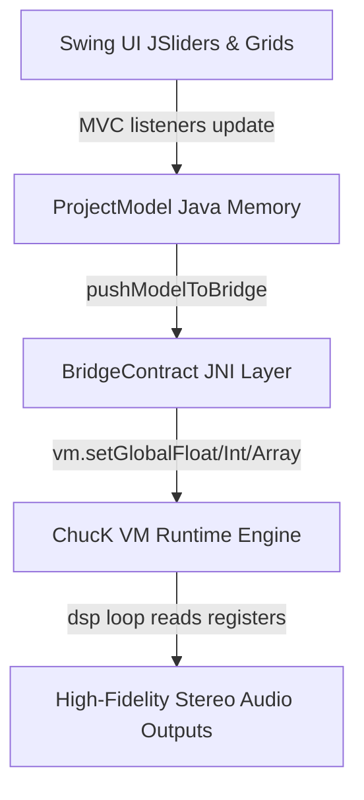

# ChucK-Java Deluge Workstation — Operations Manual & User Guide

Welcome to the **ChucK-Java Deluge Workstation**, a modern, high-fidelity software recreation and operations controller dashboard inspired by the Synthstrom Deluge hardware sequencer and synthesizer workflow. By combining a robust, multi-voice Java JRE control system with the high-performance ChucK (strongly-timed audio synthesis language) virtual machine engine, this workstation delivers zero-latency, sample-accurate step sequencing, physical DSP modeling, MPC-grade breakbeat auto-slicing, and modular modulation route routing.

---

## Table of Contents
1. [The Step Sequencer & Clip View](#1-the-step-sequencer--clip-view)
2. [Synthesizers & Sound Engines (Subtractive, FM, Wavetable)](#2-synthesizers--sound-engines-subtractive-fm-wavetable)
3. [Drum Kits & Smart Keyword Auto-Mapper](#3-drum-kits--smart-keyword-auto-mapper)
4. [DAW-Grade Visual Waveform Crop & Loop Markers Deck](#4-daw-grade-visual-waveform-crop--loop-markers-deck)
5. [MPC-Style Automatic Loop Slicer & Kit Splitter](#5-mpc-style-automatic-loop-slicer--kit-splitter)
6. [The Visual Modulation Patchbay & Bipolar Modulation Math](#6-the-visual-modulation-patchbay--bipolar-modulation-math)
7. [Song & Arrangement Linear Timelines View](#7-song--arrangement-linear-timelines-view)
8. [DSP FX Bounding Box Dials Deck](#8-dsp-fx-bounding-box-dials-deck)
9. [Delugeator Multi-Generator Dashboard Suite](#9-delugeator-multi-generator-dashboard-suite)
10. [UI Panels & Shift Shortcuts System Behavior](#10-ui-panels-&-shift-shortcuts-system-behavior)
11. [System Settings, Directories Preferences & Shortcuts Table](#11-system-settings-directories-preferences--shortcuts-table)
12. [Appendix: Programmatic High-Fidelity JNI Registers Architecture](#12-appendix-programmatic-high-fidelity-jni-registers-architecture)
13. [Appendix: Pending Work Items & Future Development Roadmap (TODO List)](#13-appendix-pending-work-items--future-development-roadmap-todo-list)

---

## 1. The Step Sequencer & Clip View

The central focus of the Deluge Workstation is the multi-lane visual step sequencer. Represented as a responsive, high-contrast pads grid, it maps your sequencing notes and durations with absolute sample accuracy.


### Key Features:
* **Interactive Step Matrix Grid**: A standard 16x8 matrix scroll list representing time divisions (columns) across voice lanes (rows). Pads are backlit and glow in warm HSL colors reflecting step status and velocity levels.
* **Note Characteristics Tweak Deck**: Hovering over or clicking a step exposes a dynamic wiggler slider to adjust:
  * **Velocity**: Scale note triggers velocities from `1%` to `100%`.
  * **Duration (Length)**: Extend a note's gate across consecutive pads from a quick sixteenth trigger up to multiple bars.
  * **Nudge (Micro-Timing)**: Offset step triggers by micro-fractions to introduce organic, humanized shuffle swings.
  * **Repeat (Stutter)**: Subdivide a single grid step into automatic stutter retriggers (1x, 2x, 4x, 8x speed) for trap-style rolls.
* **Quantized Playback Head**: A moving vertical white indicator line tracks the JNI playhead position across columns in real-time, matching standard system clocks.

---

## 2. Synthesizers & Sound Engines (Subtractive, FM, Wavetable)

The sound design panel operates in three distinct, JRE-swappable hardware modeling modes:

```carousel

<!-- slide -->

<!-- slide -->

```

### 2.1 Subtractive Synthesizer Engine
Subtractive synthesis models standard analog hardware signal paths: Oscillators ➔ Resonant Filters ➔ VCA Amplifier.
* **Dual Detuned Oscillators (Osc A & Osc B)**: Selectable shapes:
  * *Sine, Triangle, Sawtooth, Square wave with adjustable Pulse-Width (PW)*.
  * *Noise generator* (white/pink) to sculpt transient cracks or ambient grit.
* **Moog-Style Resonant Ladder Low-Pass Filter (LPF)**: A high-fidelity physical model of a 4-pole ($24\text{dB}/\text{octave}$) ladder filter with drive saturation (ladder filter feedback clipping paths) and self-oscillating resonance!
* **High-Pass Filter (HPF)**: Separate resonant 2-pole high-pass path to carve out low-frequency rumble.

#### 🎸 Tutorial A: Thick Detuned Analog Sub-Bass (Subtractive Mode)
1. Double-click a Synth step cell to open the Synth editor, and select the **`OSC`** tab. Set:
   * **Osc A Shape**: **`SAWTOOTH`**, **Level**: **`90%`**.
   * **Osc B Shape**: **`SAWTOOTH`**, **Level**: **`80%`**, **Detune (Fine)**: **`+12 cents`** (detuning creates thick analog chorusing!).
2. Select the **`FILTER`** tab (or HPF tab). Set **LPF Mode** to **`24dB Low Pass`**, LPF Cutoff base to **`450Hz`**, and **LPF Drive (Saturation)** to **`12%`** (adds harmonics clipping grit!).
3. Select the **`ENVELOPE`** tab (specifically Envelope 1 VCA). Set:
   * **Attack**: **`2ms`** (instant punch).
   * **Decay**: **`200ms`** (tight low-end decay).
   * **Sustain**: **`15%`** (low background drone).
   * **Release**: **`100ms`** (clean mute tail).
4. *Result*: Trigger a low step (e.g. C3 or G2) on the grid: you will hear a massive, thick analog detuned club bass with warm ladder saturation!

---

### 2.2 6-Operator Yamaha DX7-Style FM Synthesizer
FM synthesis generates complex, metallic, and crystal timbres by modulating the frequency/phase of operators at audio rates. The engine provides:
* **32 Carrier-Modulator Algorithms**: Choose standard operator configurations (Algorithms 1 to 32) mapping who modulates whom.
* **Operator Multipliers & Feedback**: Program individual frequency ratio multipliers ($0.5$ to $32.0$), output levels, feedback lines, and dedicated ADSR envelopes per operator.

#### 🔔 Tutorial B: Classic 80s Crystal Bell (6-Operator FM Mode)
1. Open the Synth Config editor, go to the **`OSC`** tab. Change the Synthesizer Mode from `SUBTRACTIVE` to **`FM`**.
2. Select the **`ALGORITHM`** tab. Set the active Algorithm index to **`Algorithm 05`** (maps Op 6 and Op 5 as modulators cascading into Op 1 carrier!).
3. Select the **`DX7`** tab. Let's configure our key operators:
   * **Operator 1 (Carrier)**: Set **Ratio Multiplier** to **`1.0`** (fundamental pitch), and Level to **`90%`**.
   * **Operator 5 (Primary Modulator)**: Set **Ratio Multiplier** to **`3.5`** (creates standard bell harmonics!), and Level to **`75%`**.
   * **Operator 6 (High-Modulator)**: Set **Ratio Multiplier** to **`8.0`** (bright crystal chime!), and Level to **`60%`**.
4. Select the **`ENVELOPE`** tab (specifically Operator 5 and 6 envelopes). Set:
   * **Attack**: **`0ms`** (instant sharp strike).
   * **Decay**: **`180ms`** (quick pluck decay).
   * **Sustain**: **`0%`** (no sustain for modulators, so the bell pluck turns into a warm carrier hum!).
5. *Result*: Trigger a high step note (e.g. C6 or E5): you will hear the classic, bright FM crystal chime bell made famous by DX7 keyboard patches!

---

### 2.3 Wavetable Synthesis Engine
Wavetable synthesis loops single-cycle wave tables, allowing complex wavetable sweeps:
* **Wavetable Index Sweeping**: Choose a multi-cycle wavetable WAV, set base index position coordinates, and write index automation sweeps to morph the waveshape over time.

---

## 3. Drum Kits & Smart Keyword Auto-Mapper

The **`KITS`** drum workstation houses 16 independent sound rows. Standardizing sample imports is managed by our smart auto-mapping engine.

### 3.1 Stem Keywords Map Rules
When you select a sample folder path inside the **`Kit Super-Generator (Tab 2)`**, the mapper runs regex keyword stems lookups on filenames to auto-assign slots:

| Target Drum Kit Slot | Classpath Lane ID | File Name Keyword Stem Regex Tokens |
| :--- | :--- | :--- |
| **Slot 1 (Kick)** | `Lane 00` | `kick`, `kik`, `bassdrum`, `sub_kick`, `808kick` |
| **Slot 2 (Snare)** | `Lane 01` | `snare`, `snr`, `rim`, `side_stick`, `sd` |
| **Slot 3 (Closed Hat)** | `Lane 02` | `closed_hat`, `cl_hat`, `hat_closed`, `ch`, `hhc` |
| **Slot 4 (Open Hat)** | `Lane 03` | `open_hat`, `op_hat`, `hat_open`, `oh`, `hho` |
| **Slot 5 (Clap/Shaker)** | `Lane 04` | `clap`, `clp`, `shaker`, `shk`, `cabasa` |
| **Slot 6 (Tom Low)** | `Lane 05` | `low_tom`, `floor_tom`, `tom_low`, `t_low` |
| **Slot 7 (Tom High)** | `Lane 06` | `high_tom`, `tom_high`, `t_high`, `conga_high` |
| **Slot 8 (Cymbal/Ride)** | `Lane 07` | `cymbal`, `crash`, `ride`, `splash`, `china` |

Remaining slots 9–16 are automatically filled with percussion, cowbells, woodblocks, and other samples without duplicate overlaps!

### 🥁 Tutorial C: Step-by-Step Drum Kit Construction & Auto-Choke
1. Press **`Ctrl + R` / `Cmd + R`** to summon the generators panel, and select **`Tab 2: Kit Super-Generator`**.
2. Click **`[📁 Browse Samples Directory]`** and select a folder of drum WAVs (e.g., standard 808 or acoustic stems!).
3. The mapper immediately scans the directory, populates the slots 1–16 rows table, and applies the keyword templates!
4. Check the **`[✓] Auto-Choke Hats`** box! This automatically maps Slot 3 (Closed Hat) and Slot 4 (Open Hat) to shared **Mute Group 1**, so triggering a closed hat instantly cuts off the open hat's trailing ring!
5. Click **`[Generate & Load Kit]`**. The workstation saves the Kit XML, registers files inside memory, and rebuilds the JNI play links!
6. *Result*: Your active sequencer pads grid rows now house the full detuned drum set. Sequence a kick, snare, and open/closed hats: you will hear tight, realistic, auto-choked drum parts playing live!

---

## 4. DAW-Grade Visual Waveform Crop & Loop Markers Deck

Double-click any drum track or click its `[CFG]` button to enter the real-time graphic wav file crop editor:


### Key Features:
* **Loom Parallel WAV Decoders**: Spawns highly responsive background JVM virtual threads (Project Loom) to decode PCM streams in under 5ms without locking the primary event dispatch thread (EDT).
* **Teal-to-Magenta Symmetric HSL Envelope Canvas**: Paints a stunning visual representation of the WAV stream's transient spike cycles. The gradient center-split shapes morph horizontally from a modern neon teal (`#00ffcc` at the center) to a hot magenta/pink (`#ff007f` at the borders) over an oscilloscope laboratory dark backdrop.
* **4-Marker Interactive Crop Sliders**: Glide standard parameters in real-time to locate:
  * **Start Point (Green - S)**: Where the playback head begins reading samples.
  * **End Point (Red - E)**: Where the voice release completes.
  * **Loop Start (Blue - LS)**: Where continuous looping cycles begin.
  * **Loop End (Magenta - LE)**: Where continuous looping cycles wrap back to Loop Start.
* **💾 Save & Apply Crop Button**: Commits the raw sample frame limits numbers back to the `SoundDrum` model, writes the XML kit configuration, and triggers a real-time JNI playback reload so boundaries update in live playback instantly!

---

## 5. MPC-Style Automatic Loop Slicer & Kit Splitter

The menu action **`Tools ➔ Audio Loop Slicer...`** (global shortcut **`Ctrl + L` / `Cmd + L`**) opens our spacious, automatic breakbeat slicing suite:


### Slicing Workflow:
1. **Choose a WAV loop**: Load any drum break, loop phrase, or sample WAV file. The large waveform canvas draws the spike transients immediately.
2. **Select Slices Grid Combobox**: Choose divisions count (**`4 Slices`**, **`8 Slices`**, or **`16 Slices`**). The screen instantly overlay-draws numbered vertical dashed orange slice-dividers over the audio wave!
3. **Choke and Volume Setup**: Toggle standard checkboxes to auto-choke all generated slices on Mute Group 1 (so triggering a new slice cuts off the playing tail for tight MPC-style breakbeat grooves) and scale initial volume multipliers.
4. **⚡ Slice & Load Across Kit Rows Button**: Click this button to split the breakbeat mathematically, populate drum kit rows 0 to 15 with the precise sample crops boundaries, write the Kit XML to the SD card `KITS/` folder, and hot-swap your active sequencer grid lane to play your newly sliced loops kit live instantly!

---

## 6. The Visual Modulation Patchbay & Bipolar Modulation Math

Modulation is what breathes organic life into electronic sound. In the Deluge Workstation, modulation routing functions like a virtual modular synthesizer patchbay. Instead of rigid hardwired paths, you can connect any modulation source to any destination with precise, real-time control over modulation polarity, depth, and summing mathematics.

### 6.1 The Modulation Summing Engine (The Mathematics)

When a target parameter (such as Low-Pass Filter Cutoff) has multiple active modulation paths, the internal DSP engine sums the control signals at sample-accurate rates. The mathematical formula for a modulated parameter value $V(t)$ is:

$$V(t) = V_{base} + \sum_{i=1}^{N} A_i \cdot S_i(t)$$

Where:
* $V_{base}$ is the standard scalar value of the parameter set by its main slider (e.g. LPF Cutoff set to $10\text{kHz}$).
* $A_i$ is the **Modulation Depth (Amount)** slider value ($-100\%$ to $+100\%$) cabled in the path list.
* $S_i(t)$ is the current real-time normalized output signal of the modulation source (ranging from $0.0$ to $1.0$ or $-1.0$ to $+1.0$).

#### Polarity Modes:
* **Unipolar Modulations (Uni)**: The source signal $S(t)$ scales from **`0.0 to 1.0`** (e.g. Velocity, Envelopes ADSR, Aftertouch, Sidechain). The modulation only increases the target value from the base offset (or decreases if the amount is negative).
* **Bipolar Modulations (Bi)**: The source signal $S(t)$ cycles symmetrically from **`-1.0 to +1.0`** (e.g. LFOs in standard mode, Key Tracking relative to middle C). The modulation moves the target value both above and below the base offset.

---

### 6.2 The Ten Modulation Sources

1. **Velocity (Uni)**: Triggered by note-on strike force. Useful for scaling volume, filter cutoff, or attack times based on how hard a step is triggered.
2. **Envelope 1 (Uni)**: Hardwired to the Voice VCA (Master Volume path) by default, shaping the volume outline.
3. **Envelope 2 (Uni)**: Hardwired to the Low-Pass Filter (LPF Cutoff path) by default, creating subtractive filter sweeps.
4. **Envelope 3 & 4 (Uni)**: Aux envelopes for auxiliary parameters, like decay modulation or pitch sweeps.
5. **LFO 1 & 2 (Bi)**: Low Frequency Oscillators. LFO 1 can be set to "Global" (syncs cycle phase across all voices) while LFO 2 is always "Local" (polyphonic, re-triggering phase per note-on).
6. **LFO 3 & 4 (Bi)**: Auxiliary modular low frequency oscillators for secondary rate offsets or panning wiggles.
7. **Aftertouch (Uni)**: Polyphonic channel pressure. Scales values based on pressure held on grid pads during play.
8. **Note / Key Tracking (Bi)**: Scales parameters relative to the note's MIDI pitch. The center pitch is Middle C (MIDI note 60 = $0.0$). Notes above Middle C output positive offsets ($>0.0$), while notes below output negative offsets ($<0.0$).
9. **Random (Uni)**: Sample & Hold step generator. Produces a static random value (0.0 to 1.0) on every note-on trigger.
10. **Sidechain Bus (Uni)**: Envelope follower that tracks the signal level of Mute Group 1 (typically Kicks/Drums) to duck other channels.

---

### 6.3 Operational Tutorial: The Modulation Matrix Tab UI

Open the Synth Config Dialog (double-click a synth track or double-click a grid step) and select the **`MODULATION`** tab to view the patchbay panel:


#### Managing Patch Cables:
* **Connect a New Cable**: Click the prominent green **`[+ Connect New Modulation Cable]`** button at the bottom. A new routing row is instantiated at the end of the scroll list.
* **Configure Ports**: Select the source (e.g. `lfo1`) in the left combobox and the destination (e.g. `lpfFrequency`) in the right combobox.
* **Toggle Polarity**: Click the **`[Bipolar]`** toggle button! When selected, it glows in warm amber indicating bipolar mode (amount range $-100\%$ to $+100\%$); when unselected, it styles in dark charcoal indicating unipolar mode (amount range $0\%$ to $100\%$).
* **Adjust Slider Depth**: Drag the glowing cyan JSlider to set the modulation intensity. The numeric label displays the exact percentage (e.g. `+45%` or `-80%`). Changes are hot-swapped to ChucK VM memory registers in real-time!
* **Disconnect / Delete Cable**: Click the red **`[✖]`** button on the right to instantly disconnect the cable, restoring the destination's default behavior.

---

### 6.4 Six Step-by-Step Sound Design Tutorials

#### 🎹 Tutorial 1: Classic Subtractive Brass Swell (Envelope 2 ➔ LPF Cutoff Bipolar)
1. Double-click your Synth track to open the configuration dashboard, and select the **`OSC`** tab. Set Osc A wave shape to **`SAWTOOTH`** and set LPF Mode to **`24dB Low Pass`**.
2. Select the **`FILTER`** tab and slide the Cutoff dial down to a low base value of **`800Hz`** (making the sound dark and warm).
3. Select the **`ENVELOPE`** tab (specifically Envelope 2). Set:
   * **Attack**: **`250ms`** (creates a gradual opening swell).
   * **Decay**: **`400ms`** (gradual decay).
   * **Sustain**: **`50%`** (steady sustained brightness level).
   * **Release**: **`300ms`** (clean fade out).
4. Select the **`MODULATION`** tab. Click **`[+ Connect New Modulation Cable]`**.
5. Set the Source combobox to **`envelope2`** and the Destination combobox to **`lpfFrequency`**.
6. Set the depth slider to **`+65%`** (making the filter sweep open wide on note triggers!).
7. *Result*: Trigger a sequence step: you will hear a gorgeous, classic analog subtractive brass swell as the filter cutoff sweeps up and decays!

#### 🌀 Tutorial 2: Polyphonic Vibrato (LFO 1 ➔ Pitch Bipolar)
1. Open your Synth Config Dialog, go to the **`LFO`** tab (LFO 1 section). Set LFO 1 shape to **`SINE`** and the rate to **`6.2Hz`** (vibrato speed).
2. Go to the **`MODULATION`** tab, click **`[+ Connect New Modulation Cable]`**.
3. Set the Source to **`lfo1`** and the Destination to **`pitch`**.
4. Click the **`[Bipolar]`** button so it glows in active amber (bipolar pitch vibrato!).
5. Slide the depth slider to a very small positive percentage: **`+8%`** (subtle vibrato) or **`+15%`** (heavy chorused wiggle).
6. *Result*: Play steps: you will hear a smooth, realistic polyphonic vibrato that adds massive acoustic space to raw lead waves!

#### 🌊 Tutorial 3: Organic Filter Sweeps (LFO 2 ➔ LPF Cutoff Bipolar)
1. Open your Synth dialog, select the **`LFO`** tab (LFO 2 section). Set LFO 2 shape to **`TRIANGLE`** and set a very slow rate of **`0.35Hz`** (one full cycles sweep every 3 seconds).
2. Select the **`FILTER`** tab, set LPF Cutoff base to a middle frequency: **`2.5kHz`**.
3. Select the **`MODULATION`** tab, click **`[+ Connect New Modulation Cable]`**.
4. Set the Source to **`lfo2`** and the Destination to **`lpfFrequency`**. Ensure **`[Bipolar]`** is toggled active.
5. Slide the depth slider up to **`+45%`**.
6. *Result*: Hold down a long pad sequence gate: the filter cutoff will slowly open and close across a wide frequency path, creating a beautiful organic moving sweep!

#### 🎛️ Tutorial 4: Advanced Mod-of-Mod Vibrato Swell (LFO 2 ➔ LFO 1 Depth Bipolar)
1. Setup standard vibrato first: Go to the **`LFO`** tab, set LFO 1 (vibrato LFO) shape to **`SINE`** and rate to **`6.5Hz`**. Set LFO 2 (modulator LFO) shape to **`TRIANGLE`** and rate to a slow **`0.5Hz`**.
2. Go to the **`MODULATION`** tab, click **`[+ Connect New Modulation Cable]`**.
3. Set the Source to **`lfo1`** and the Destination to **`pitch`**. Set Bipolar to active and set a moderate depth: **`+20%`**.
4. Click **`[+ Connect New Modulation Cable]`** to add a SECOND cable route (Modulation of Modulator!).
5. Set the Source to **`lfo2`** and set the Destination combobox to **`lfo1Rate`** (modulating LFO 1 vibrato rate!) or **`modFxDepth`**!
6. *Result*: The slow LFO 2 will dynamically modulate the vibrato speed and depth itself, creating an advanced evolving texture where the pitch vibrato gets faster and deeper recursively!

#### ⛽ Tutorial 5: Sidechain Kick Ducking / The Pump Effect (Sidechain ➔ Volume Unipolar)
1. Focus your drum kit track containing your Kick drum (Slot 1). Go to its slot configuration and ensure its Mute Group is set to **`1`** (or is named Kick).
2. Open the Synth track config dialog you want to duck behind the kick. Go to the **`MODULATION`** tab, click **`[+ Connect New Modulation Cable]`**.
3. Set the Source to **`sidechain`** and the Destination to **`volume`**.
4. Ensure the **`[Bipolar]`** button is UNSELECTED (unipolar mode, ducking volume down!).
5. Slide the depth slider to a negative percentage: **`-85%`** (near-total silence on Kick hits) or **`-50%`** (mild ducking).
6. *Result*: Press play on the sequencer: every time the Kick drum triggers on the grid, the Synth track's volume will instantly slam down and pump back up as the kick decays, creating the famous modern electronic "Sidechain Pump" effect!

#### 🎯 Tutorial 6: Physical Velocity Filter Dynamics (Velocity ➔ LPF Cutoff Bipolar)
1. Open your Synth config, set LPF Cutoff base to a warm **`1.2kHz`**.
2. Select the **`MODULATION`** tab, click **`[+ Connect New Modulation Cable]`**.
3. Set the Source to **`velocity`** and the Destination to **`lpfFrequency`**.
4. Set the depth to **`+50%`**.
5. Go to the step sequencer grid: enter steps and adjust their velocities (click a pad to open step properties, slide velocity values between `15%`, `50%`, and `100%`).
6. *Result*: Steps with low velocity will sound dark and muted, while steps hit with full velocity will open the filter wide, creating bright, aggressive transients that mimic acoustic string or percussion instruments!

---

## 7. Song & Arrangement Linear Timelines View

The workstation provides three distinct workspace perspectives to support multiple arrangement stages:

* **CLIP View**: Focuses on a single sequencer pattern grid lane to draw steps and adjust gate timings.
* **SONG View**: A launching matrix where different clip patterns (rows) are grouped into Song Sections. Launch or mute rows live to test transitions and structure arrangements.
* **ARRANGEMENT View**: A horizontal linear track timeline grid where clip instances blocks are sequenced from left-to-right (time timeline). Drag the edge of a block to extend its playback length, solo vocal lanes, or draw structured linear builds.

### 7.1 Clip sequencing & Song Sections Workflow
* **Grid Entry in CLIP Mode**: Click a cell to add a note event, double-click a step to configure its specific gate and velocity timings, or scroll mouse wheel vertically to search up/down vocal pitch scale lanes.
* **Song Section Building**: Go to SONG mode (press **`Tab`** key). Create different pattern segments (e.g., Row 0 = Intro Beat, Row 1 = Chorus, Row 2 = Breakdown). 
  * Pads backlit represent each clip's state: *Solid Amber* (ready/loaded), *Flashing Green* (playing), *Unlit* (muted/empty).
  * Click a Pad to queue a pattern play swap: the transition waits for the current bar loop boundary to complete and then swaps the audio streams programmatically in perfect tempo sync!

### 7.2 Linear Multitrack Arrangement Sequencing
Go to ARR mode (press **`Tab`**). The screen displays horizontal timeline lanes per track:
* **Sequencing Blocks**: Tap pads horizontally to spawn play blocks.
* **Resizing Gate Boundaries**: Hold the right boundary cell of a play block and scroll or drag the mouse to extend its playback timeline from 2 bars to 8 bars dynamically!
* **Track Solo/Mute Focus**: Click the left track header buttons to isolate build components (e.g. soloing vocal leads during drop builds).

---

## 8. DSP FX Bounding Box Dials Deck

The bottom segment of your grid dashboard houses our dedicated premium stereo effects path processors:

```carousel

<!-- slide -->

<!-- slide -->

<!-- slide -->

```

* **Mod FX (Chorus / Flanger / Phaser)**: 
  * Selectable modulation types adjusting LFO speed Hz, feedback delay line loops, depth width, and phase offset splits for wide-screen stereo images.
* **2-Band shelving Master EQ**: 
  * Smooth shelving Bass and Treble dials to isolate low-ends and polish high frequencies.
* **Stereo Ping-Pong Delay**: 
  * Features delay time divisions sync parameters ($1/4$, $1/8$, $1/16$ notes or dotted eighths!), feedback loop path clipping, and "Analog Mode" filter color simulation (gradually dampens high frequencies inside the delay line on every repeat for standard analog warmth!).
* **High-Contrast Reverb Deck (JCRev Engine)**: 
  * Customizable Room Size volume ratios, High-Pass Filter (HPF) damping cutoffs, and stereo spatial width selectors to craft small spaces or long cathedral tails.
* **Overdrive Distortion Chain**: 
  * Interactive controls for Master Saturation threshold level (adds warm tube clipping saturation harmonics!), sample-rate decimation steps, and Bitcrusher distortion levels for raw lo-fi digital tracks.

#### 🎛️ Tutorial D: The Ultimate Synth Polish Effects Chain
1. Open your active Synth track config dialog and select the **`MOD FX`** tab. Set the Mod FX type to **`FLANGER`**, set the Rate to **`0.45Hz`** (slow movement), and the Depth to **`60%`** (rich flanging space!).
2. Go to the **`EQ`** tab. Boost the **Treble** slightly to **`+3dB`** (adds bright clarity) and trim the **Bass** to **`-2dB`** (removes low mud).
3. Go to the **`COMPRESSOR`** tab. Set the Threshold to **`-18dB`**, the Ratio to **`4.0:1`**, and the Attack to **`15ms`** (locks dynamic peaks and glues the sound!).
4. Go to the **`HPF`** tab. Slide HPF Cutoff to a safe low-cut point: **`120Hz`** to clean up raw sub rumble from your synth pads.
5. *Result*: Press play: you will hear a professionally polished, dynamic, wide stereo spatial synth pad with standard studio-grade analog warmth!

---

## 9. Delugeator Multi-Generator Dashboard Suite

The top menu action **`Tools ➔ Delugeator Randomizer...`** (global shortcut **`Ctrl + R` / `Cmd + R`**) summons our cohesive, multi-tab sound generator JDialog:


### Tab 1: 🎲 Synth Randomizer:
* **Continuous Triangular Probability Distributions**: Standardized algorithms centered around safe default limits morph subtractive parameters, FM carrier multipliers, and filter feedback.
* **Vibrant HSL Live Needle Gauge**: A custom-drawn circular dial maps average patch randomness onto a HSL color scale. Standard dials are green-teal (safe), yellow (active/vibrant), and red-magenta (extreme distortion).
* **Hardcore Overdrive Toggle**: Check this box to bypass standard safety probability curves, opening up massive FM feedback loops, extreme ladder overdrive, and chaotic filter self-oscillation ranges!

### Tab 2: 🥁 Kit Super-Generator:
* Select folders, map drum kits with smart auto-stems regex, audition steps, auto-choke hats, and output ready-to-load KITS XML presets in seconds.

---

## 10. UI Panels & Shift Shortcuts System Behavior

The Deluge Workstation features a deeply integrated Shift action system and dedicated modular sound configuration dialogs. Holding down the **Shift** key (or clicking the virtual Shift button) triggers hardware-accurate shortcuts and sub-labels overlays directly across the main pads grid.

### 10.1 The Shift Grid Shortcuts Overlay (Shift Held)

When Shift state is active, the standard step sequencing grid changes context, displaying backlit function shortcuts sub-labels directly on the pads.


#### Grid Function Shortcuts Map:
* **Row 1 (Synthesis Osc A/B)**: Quick shortcut mappings for `osc1Type`, `osc1Shape`, `osc1PW`, `osc1Sync`, `osc2Type`, `osc2Shape`, `osc2PW`, `osc2Sync`.
* **Row 2 (Low-Pass & High-Pass Filters)**: Quick shortcuts for LPF Mode, Cutoff, Resonance, LPF Envelope, HPF Mode, Cutoff, Resonance, and HPF Envelope.
* **Row 3 (Envelopes ADSR)**: Direct sliders quick focus bounds for Envelope 1 (Attack, Decay, Sustain, Release) and Envelope 2 (Attack, Decay, Sustain, Release).
* **Row 4 (LFO Modulators)**: Quick focus parameters for LFO 1 Rate, Shape, Depth and LFO 2 Rate, Shape, Depth.
* **Row 5 (Master Stereo FX Deck)**: Quick dials focus for Mod FX (Chorus, Flanger, Phaser), Reverb damping, Delay feedback, Panning, Master Volume, and Transpose.
* **Row 6 (Sequencer Clocks & MIDI CC)**: Quick settings keys for Tempo clock, Swing shuffle, Step Quantization, MIDI CC Learn channels, and device Clear actions.
* **Row 7 (System & File IO Operations)**: Disk quick triggers for Preset Load, Preset Save, Stems Import, XML Export, Undo transitions, and Redo stacks.
* **Row 8 (Workspaces View Modes)**: Quick view selectors to toggle grids to CLIP, SONG, ARRANGEMENT, AUTOMATION, PERFORMANCE, or system PREFERENCES.

---

### 10.2 Synth Configuration Dialog JTabbedPane Tabs

Double-clicking a Synth track triggers our wide-screen, compact sound editor. It cycles programmatically through twelve dedicated parameter decks:

```carousel

<!-- slide -->

<!-- slide -->

<!-- slide -->

<!-- slide -->

<!-- slide -->

<!-- slide -->

<!-- slide -->

<!-- slide -->

<!-- slide -->

<!-- slide -->

<!-- slide -->

<!-- slide -->

```

1. **DX7 FM Panel (`deluge_synth_tab_dx7.png`)**: Houses a complete Yamaha DX7 voice banks parser! Allows importing standard bulk `.SYX` sysex files, listing all 32 presets, choosing patch entries, and editing FM operator feedback, envelope rates, and keyboard level scaling.
2. **Algorithm Panel (`deluge_synth_tab_algorithm.png`)**: Displays a high-fidelity vector block diagram of the active FM operator algorithm (Algorithms 1 to 32), illustrating carrier-modulator frequency routing paths.
3. **OSC Panel (`deluge_synth_tab_osc.png`)**: Adjusts unipolar pulse-width modulations, fine pitch detuning steps, and dual oscillators wave shapes with smooth slate knobs.
4. **LFO Panel (`deluge_synth_tab_lfo.png`)**: Configures rates, depths, and shapes (Sine, Saw, Triangle, Square, Random/S&H) for all 4 global and local low frequency oscillators.
5. **Arpeggiator Panel (`deluge_synth_tab_arp.png`)**: A standard modular arpeggiator engine adjusting speed sub-clocks (1/4 to 1/32 notes), octave ranges (+1 to +4), gate lengths, and sorting paths (Up, Down, Order Played, Random).
6. **Envelope Panel (`deluge_synth_tab_envelope.png`)**: Configures unipolar ADSR times and target parameters amount settings for all 4 sound path envelopes.
7. **Modulation Matrix Panel (`deluge_synth_tab_modulation.png`)**: Sleek timeline routing rows table where sources are cabled to destinations with unipolar/bipolar sliders.
8. **Compressor Panel (`deluge_synth_tab_compressor.png`)**: Adjusts dynamic compressor thresholds, ratios, attacks, release, and sidechain HPF filters.
9. **EQ Panel (`deluge_synth_tab_eq.png`)**: Adjusts master shelving EQ Bass and Treble boost/cut decibels.
10. **Mod FX Panel (`deluge_synth_tab_mod_fx.png`)**: Configures modulation LFO speeds and feedback depths for active Chorus, Flanger, or Phaser lines.
11. **HPF Panel (`deluge_synth_tab_hpf.png`)**: Adjusts high-pass filter cutoff frequencies and feedback ladder overdrive drive.
12. **Automation Panel (`deluge_synth_tab_automation.png`)**: Lists all automate-able parameters with numeric draw step values for step-by-step tweaking.
13. **MIDI Learn Panel (`deluge_synth_tab_midi_learn.png`)**: Maps sequencer parameters to incoming hardware MIDI controller CC knob events via dynamic listener hooks.

---

### 10.3 Settings Preferences JDialog

The Settings Preferences Dialog is programmatically cabled in high-contrast slate-dark design tokens, providing safe, JNI-free controls:


* **Library Path Preferences**: Browse and set the mounted parent library root directory path folder for all sample loading.
* **Grid Profiles Mode**: Standardize layout resolutions to `Grid 8x16` or `Grid 16x16`.
* **Sequencer Engine Backend**: Toggle between ChucK (strongly-timed audio synthesis language engine) and Pure Java direct soundcard playback backends.

---

## 11. System Settings, Directories Preferences & Shortcuts Table

The **`Settings ➔ Preferences...`** panel manages your paths and grid configurations without JNI hooks:
* **SD Card Mounted Library Directory**: Set the root parent directory folder path representing your physical SD card library. All subdirectories (`SAMPLES/`, `KITS/`, `SYNTHS/`, `SONGS/`) are resolved relative to this parent root dynamically.
* **Grid Layout Profiles**: Standardize your interface to **`Grid 8x16`** or extended **`Grid 16x16`** formats.

### Complete Keyboard Shortcuts Reference:
| Shortcut Combination | Focused Panel / Action | Operational Description |
| :--- | :--- | :--- |
| **`Spacebar`** | Global Play / Stop | Starts or stops the JNI/ChucK virtual playback thread clock live. |
| **`Ctrl + R` / `Cmd + R`** | Tools menu dropdown | Opens the **Delugeator Randomizer & Generators Suite** JDialog window. |
| **`Ctrl + L` / `Cmd + L`** | Tools menu dropdown | Opens the **Audio Loop Slicer & Kit Splitter** breakbeat tool JDialog. |
| **`Ctrl + O` / `Cmd + O`** | File menu dropdown | Spawns a JFileChooser file browser to load a `.XML` project Song/Kit from disk. |
| **`Ctrl + S` / `Cmd + S`** | File menu dropdown | Overwrites and exports the current active `ProjectModel` structure back to XML. |
| **`Ctrl + Z` / `Cmd + Z`** | Edit action | Undoes the last grid step note change or gate timing adjustment. |
| **`Ctrl + Y` / `Cmd + Y`** | Edit action | Redoes the last undone sequencer state change from the transaction history stack. |
| **`Tab` Key** | View Mode | Toggles active display focus between CLIP, SONG, and ARRANGEMENT grid views. |
| **`Escape` Key** | Dialog focus | Closes the active frontmost modeless JDialog frame window instantly. |

---

## 12. Appendix: Programmatic High-Fidelity JNI Registers Architecture

When you play a sequence, the control parameters are written straight to ChucK VM global registers arrays. Below is a breakdown of the dynamic real-time data registers:



### Main ChucK Global Registers:
* **`g_bpm`** *(float)*: System sequencer tempo clock speed.
* **`g_swing`** *(float)*: Quantized grid micro-timing shuffle percentage (0.0 to 1.0).
* **`g_master_vol`** *(float)*: Master hardware gain multiplier path limits (0.0 to 1.0).
* **`g_kit_pitch`** *(float array[16])*: Real-time transposition playback speed modifier per drum kit voice row lane.
* **`g_kit_mute_group`** *(int array[16])*: Choke exclusion group bindings parameters per drum kit sound slot.
* **`g_synth_patch_cables`** *(float array[8*4])*: Encodes the source-destination matrices parameters mapping amount, polarity, and ports index to multi-voice virtual synthesis structures.

---

## 13. Appendix: Pending Work Items & Future Development Roadmap (TODO List)

While the ChucK-Java Deluge Workstation provides a comprehensive operations platform, several features from the Deluge OS 4.0 firmware guidebook remain planned for upcoming development.

### 📋 Future Technical Roadmap:
* **[ ] 13.1 Triplet Column Grid Divisions View (SwingGridPanel & ChucK Sequencer)**:
  * *Goal*: Add a `[3]` grid toolbar toggle button to switch time divisions. The grid columns redraw from 16 to 12 segments (subdividing quarter beats into triplets of 3 instead of standard 4 eighth/sixteenth notes).
  * *ChucK Sync*: The clock step increment timing step shifts from $1/4$ note beats step parameters to $1/6$ divisions timing steps dynamically.
* **[ ] 13.2 Advanced Wavetable Index Scan Editor (SwingKitConfigDialog & Synth Oscillators)**:
  * *Goal*: Build an interactive 3D grid visualizer to inspect single-cycle waves nodes in wavetable files.
  * *UI Control*: Drag a horizontal slider to sweep target table slices indexes, automatically redrawing the cycle frame outlines live and pushing JNI coordinates back to synthesis voice tracks.
* **[ ] 13.3 MPE & Polyphonic Aftertouch Multi-Dimensional JNI Sweeps**:
  * *Goal*: Add active tracking layers for MPE controllers pressure (Z-axis) and vertical position slide (Y-axis) MIDI events.
  * *JNI Routing*: Cable these dynamic parameters to real-time arrays to drive individual synthesizer voice filters and pulse widths independently per key played.
* **[ ] 13.4 Continuous Recursive Looper Stacking (Pedal-Style Overdub Panel)**:
  * *Goal*: Implement a live looper deck letting users layer endless audio overdubs recursively onto consecutive parallel lane tracks.
  * *Features*: Tempo detection algorithms automatically calibrate BPM clocks from the first recorded audio buffer frame limits, and dynamic undo buttons snip out individual loop layers in real-time.
* **[ ] 13.5 Arranger Live Capture Suite**:
  * *Goal*: Add a **`[🔴 Capture Live Performance]`** record mode. Actively records live SONG view launching clicks, mutes, solos, and tempo alterations straight into block timeline tracks inside ARRANGEMENT view for structured linear timelines exports!

---

> [!NOTE]
> All resources and WAV samples are dynamically loaded from your preference SD Card Mounted Library path directory. Ensure your paths are configured inside **`Settings ➔ Preferences...`** to load library instruments stably.
