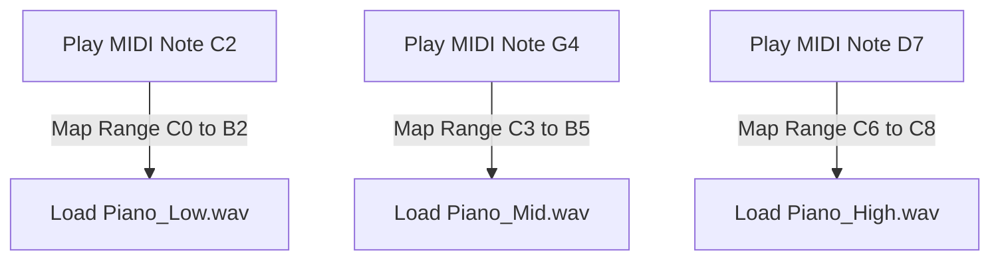
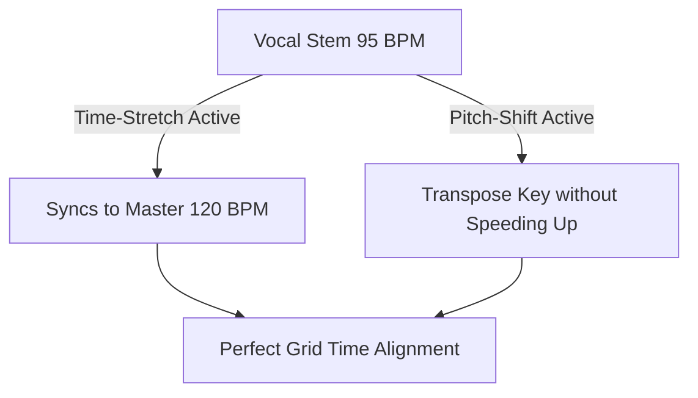
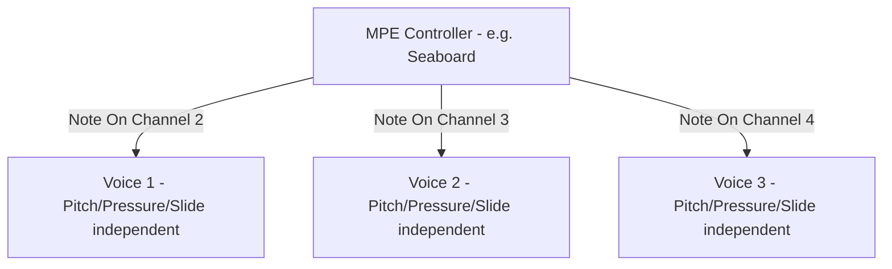
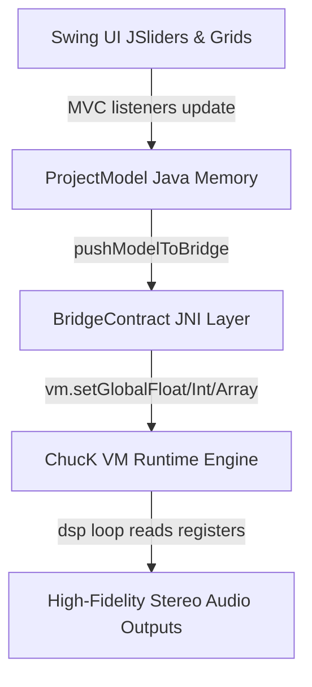

# ChucK-Java Deluge Workstation — Operations Manual & User Guide

Welcome to the **ChucK-Java Deluge Workstation**, a modern, high-fidelity software recreation and operations controller dashboard inspired by the Synthstrom Deluge hardware sequencer and synthesizer workflow. By combining a robust, multi-voice Java JRE control system with the high-performance ChucK (strongly-timed audio synthesis language) virtual machine engine, this workstation delivers zero-latency, sample-accurate step sequencing, physical DSP modeling, MPC-grade breakbeat auto-slicing, and modular modulation route routing.

---

## Table of Contents
1. [The Step Sequencer & Clip View](#1-the-step-sequencer--clip-view)
   * [1.6 The Euclidean Rhythm Generator](#16-the-euclidean-rhythm-generator)
2. [Synthesizers & Sound Engines (Subtractive, FM, Wavetable, Legato, Multi-Sampler, Ring Mod)](#2-synthesizers--sound-engines-subtractive-fm-wavetable)
   * [2.7 Chord Keyboard (CORK & CORL Layouts)](#27-chord-keyboard-cork--corl-layouts)
3. [Drum Kits & Smart Keyword Auto-Mapper](#3-drum-kits--smart-keyword-auto-mapper)
4. [DAW-Grade Visual Waveform Crop & Loop Markers Deck](#4-daw-grade-visual-waveform-crop--loop-markers-deck)
5. [MPC-Style Automatic Loop Slicer & Kit Splitter](#5-mpc-style-automatic-loop-slicer--kit-splitter)
6. [The Visual Modulation Patchbay & Bipolar Modulation Math](#6-the-visual-modulation-patchbay--bipolar-modulation-math)
7. [Song & Arrangement Linear Timelines View](#7-song--arrangement-linear-timelines-view)
8. [DSP FX Bounding Box Dials Deck](#8-dsp-fx-bounding-box-dials-deck)
9. [Delugeator Multi-Generator Dashboard Suite](#9-delugeator-multi-generator-dashboard-suite)
10. [UI Panels & Shift Shortcuts System Behavior](#10-ui-panels-&-shift-shortcuts-system-behavior)
11. [Audio Tracks, Time-Stretching & Pitch-Shifting](#11-audio-tracks-time-stretching--pitch-shifting)
12. [Advanced Wavetable Index Scan Editor](#12-advanced-wavetable-index-scan-editor)
13. [Pedal Looper & Continuous Multi-Layer Overdubs](#13-pedal-looper--continuous-multi-layer-overdubs)
14. [MIDI Hardware, Device Mappings & Pure SD File Explorer](#14-midi-hardware-device-mappings--pure-sd-file-explorer)
    * [14.5 MIDI CC Parameter Takeover Algorithms](#145-midi-cc-parameter-takeover-algorithms)
15. [Performance View & FX Touch-Pads Grid](#15-performance-view--fx-touch-pads-grid)
16. [MPE & Multi-Dimensional Controller Expression](#16-mpe--multi-dimensional-controller-expression)
17. [System Settings, Directories Preferences & Shortcuts Table](#17-system-settings-directories-preferences--shortcuts-table)
    * [17.1 Hardware Character Emulations & Master Saturation Drive](#171-hardware-character-emulations--master-saturation-drive)
18. [Appendix: Programmatic High-Fidelity JNI Registers Architecture](#18-appendix-programmatic-high-fidelity-jni-registers-architecture)
19. [Appendix: Pending Work Items & Future Development Roadmap (TODO List)](#19-appendix-pending-work-items--future-development-roadmap-todo-list)
20. [Hardware Popular Commands & Java UI Equivalents Table](#20-hardware-popular-commands--java-ui-equivalents-table)
21. [Deluge Community Quick Reference & Java Adaptation Guide](#21-deluge-community-quick-reference--java-adaptation-guide)
22. [Creative Workflow Tips & Best Practices (Understanding the Workflow)](#22-creative-workflow-tips--best-practices-understanding-the-workflow)

---

## 1. The Step Sequencer & Clip View

The central focus of the Deluge Workstation is the multi-lane visual step sequencer. Represented as a responsive, high-contrast pads grid, it maps your sequencing notes and durations with absolute sample accuracy.


### Key Features:
* **Interactive Step Matrix Grid**: A standard 16x8 matrix scroll list representing time divisions (columns) across voice lanes (rows). Pads are backlit and glow in warm HSL colors reflecting step status and velocity levels.
* **Horizontal Step Drag-Ties (Extended Notes Entry)**: Click a pad and drag your mouse horizontally along the same row to extend note durations (ties) across multiple steps dynamically!
  * Visual step cells in the drag range glow in a beautiful backlit color preview state during drags.
  * Upon release, consecutive step properties (intermediate steps gate set to `1.0` and ending step gate set to `0.5`) are finalized inside the model.
* **Smooth Proximity Auto-Scrolling**: When dragging note ties or selecting cell ranges, moving the cursor near the left/right view borders automatically shifts the scroll offset view by 4 steps smoothly:
  * Dragging near the right panel boundary ($\ge \text{width} - 30\text{px}$) scrolls the viewport RIGHT.
  * Dragging near the left panel boundary ($\le 130\text{px}$) scrolls the viewport LEFT.
  * Active drag column indexes are updated dynamically during auto-scrolling, keeping your selection perfectly aligned!
* **Note Characteristics Tweak Deck**: Hovering over or clicking a step exposes a dynamic wiggler slider to adjust:
  * **Velocity**: Scale note triggers velocities from `1%` to `100%`.
  * **Duration (Length)**: Extend a note's gate across consecutive pads from a quick sixteenth trigger up to multiple bars.
  * **Nudge (Micro-Timing)**: Offset step triggers by micro-fractions to introduce organic, humanized shuffle swings.
  * **Repeat (Stutter)**: Subdivide a single grid step into automatic stutter retriggers (1x, 2x, 4x, 8x speed) for trap-style rolls.
* **Quantized Playback Head**: A moving vertical white indicator line tracks the JNI playhead position across columns in real-time, matching standard system clocks.

### 1.2 Grid Automation Overview & Detail Editor Views

The main sequencer pads grid can be toggled to **`AUTOMATION`** view mode. This view provides two distinct, visual perspective layouts:

```carousel

<!-- slide -->

```

1. **AUTOMATION OVERVIEW Grid Mode (`deluge_grid_automation_overview.png`)**: Lists all synthesizer/track automatable parameters vertically (rows). Pads represent sequence columns step ticks: a step pad glows in solid green if it houses active automated points for that row's parameter, letting you scan entire automation states at a single glance!
2. **AUTOMATION DETAIL EDITOR Grid Mode (`deluge_grid_automation_editor.png`)**: Selecting a specific parameter row in Overview mode opens the dedicated per-step value editor! The 8 grid rows act as value bands (from `0-15` up to `112-127`). You draw step-by-step values directly on the physical pads: a pad glows in bright cyan indicating the parameter value at that specific sequencer step!

---

### 1.3 Step Parameter Properties, Probability & Fill Conditions

Double-clicking a sequence step opens our dedicated, high-contrast **`Step Properties`** JDialog. This provides precise, standard-compliant step parameters and random fill rules:


* **Velocity**: Scale note triggers velocities precisely from `1%` to `100%` (combines both slider and exact spinner values).
* **Repeats (Sub-Triggers / Iterance)**: Subdivide standard sequencer steps into quick sub-triggers (0 to 3 subdivisions, where 3 represents active triplet step subdivisions within standard note ticks).
* **Fill Probability % (Loop Conditionals)**: Program a step with specific chance properties:
  * `0%`: Standard static step (triggers every single pass).
  * `1% to 100%`: Fill-only conditional step! The step will only trigger on fills based on the random probability percentage selected, adding structural humanized variations to loops!

#### 🔔 Tutorial E: Evolving Generative Ambient Sequence (Probability Sequencing)
1. Select a Synth track grid. Sequence a basic chord progression across a 16-step grid lane: set warm pad steps on columns 1, 5, 9, 13!
2. Now let's add secondary ambient "ornament plucks" on columns 3, 7, 11, and 15!
3. Double-click the pluck note on Column 3. In the Step Properties dialog, slide the **Fill %** up to **`35%`** and click Apply (the pluck now has only a $35\%$ chance of playing on any loop pass!).
4. Double-click the Column 7 pluck: set its **Fill %** to **`50%`**.
5. Double-click the Column 11 pluck: set **Fill %** to **`20%`** and change **Repeats** to **`2`** (quick double-strike pluck!).
6. Double-click the Column 15 pluck: set **Fill %** to **`60%`**.
7. *Result*: Press play: you will hear a beautiful, organic, and endlessly evolving ambient track! The chord pads lay a steady foundation, while the ambient plucks strike at different random intervals, creating a generative composition that never sounds identical!

---

### 1.4 Play Direction Modes (Forward, Reverse, Ping-Pong, Random)

Tracks can be configured to walk the step pointers in multiple structural pathways, parsed dynamically by the JNI timing clock:
* **FORWARD**: The standard grid walk (from step 1 to step 16, wrapping back to 1).
* **REVERSE**: The track steps play backward (from step 16 to step 1, wrapping back to 16). Great for reversing drum fills or mirror vocal phrases!
* **PING-PONG**: Symmetrical bi-directional walk! Plays Forward from step 1 to 16, and then immediately plays backward from 15 down to 2, bouncing back and forth.
* **RANDOM**: On every clock step division tick, the playhead jumps to a completely random step column. Perfect for generative noise sweeps or pointillistic FM plucks!

---

### 1.5 Triplet Column Grid Divisions View (12-Step Triplets vs 16-Step Straights)

Step sequencing is no longer restricted to straight subdivisions (sixteenth notes, 16 steps per bar)! The Deluge Workstation supports dynamic, per-track **Triplet Grid Divisions** switching, allowing you to build complex polyrhythms, drum shuffles, and eighth-note triplet sequences.

* **The JToggleButton [3] Toggle**: Located at the bottom JScrollbar zoom toolbar (immediately next to the rate speed JComboBox), a warm-gold outline button labeled **`[3]`** switches step subdivisions on the active track clip dynamically:
  * **Straight Mode (Default)**: Visual columns are set to **16 steps per bar**, with an underlying JPlayhead step time duration of exactly **24 ticks** (sixteenth notes).
  * **Triplet Mode (3-Subdivisions)**: Visual columns swap instantly to **12 steps per bar**, with an underlying JPlayhead step time duration of exactly **32 ticks** (eighth-note triplets).
* **Beat Divisions Visual Slate Stripes**: To guarantee that you can map your musical patterns with absolute visual speed, the empty pad cells' background colors dynamically display beat stripes guidelines based on the active clip's triplet state:
  * **Sixteenth Straight beat divisions**: Emphasizes every **4 steps** (highlighted slate-gray columns on step 1, 5, 9, 13).
  * **Eighth Triplet beat divisions**: Emphasizes every **3 steps** (highlighted slate-gray columns on step 1, 4, 7, 10).
* **Parity XML loop lengths saving**: When saving files, the song XML writer dynamically computes the physical track loop duration ($12\text{ steps} \times 32\text{ ticks} = 384\text{ ticks}$ total loop length per bar) and saves it alongside the raw JNI ticks array structures and the `triplet="1"` attribute, ensuring 100% loss-free load cycles in all standard environments!

### 1.6 The Euclidean Rhythm Generator

Drawing even trigger distributions across step grids is fully automated. By integrating a dedicated mathematical Euclidean pattern layout planner, the workstation lets you populate drum tracks or basslines with organic polyrhythms in seconds:

* **The Interactive Euclidean Wheel JDialog**: Clicking the **`Euclidean`** button (located on the left-side control panel of the active matrix row) opens a modal JDialog. The window features an interactive **Euclidean Wheel** rendering active pulses as glowing amber outer pads and silent steps as dark charcoal segments.
* **Parameters Deck**:
  * **Steps (N)**: The total sequence length (up to 16 steps per bar).
  * **Pulses (K)**: The number of active notes to distribute.
  * **Rotation (Shift)**: Rotates the pulse offsets horizontally (e.g. shifts the downbeat triggers).
* **The Mathematical Distribution Formula**: Follows the Bjorklund spacing algorithm which calculates a boolean array $B[s]$ of length $N$:
  $$B[s] = \text{true if } (s \cdot K + \text{rotation}) \bmod N < K$$
  This matches the community Deluge firmware's exact `editNumEuclideanEvents()` step spacing behavior.
* **💾 Generate & Apply Button**: Click this button to overwrite the active row's sequence grid cells with the computed pattern. It triggers immediate JNI audio playback reload so you hear the polyrhythm play instantly!

---

## 2. Synthesizers & Sound Engines (Subtractive, FM, Wavetable)

The sound design panel operates in three distinct, JRE-swappable hardware modeling modes:

```carousel

<!-- slide -->

<!-- slide -->

```

### 2.1 Subtractive Synthesizer Engine
Subtractive synthesis models standard analog hardware signal paths: Oscillators ➔ Resonant Filters ➔ VCA Amplifier.
* **Dual Detuned Oscillators (Osc A & Osc B)**: Selectable shapes:
  * *Sine, Triangle, Sawtooth, Square wave with adjustable Pulse-Width (PW)*.
  * *Noise generator* (white/pink) to sculpt transient cracks or ambient grit.
* **Moog-Style Resonant Ladder Low-Pass Filter (LPF)**: A high-fidelity physical model of a 4-pole ($24\text{dB}/\text{octave}$) ladder filter with drive saturation (ladder filter feedback clipping paths) and self-oscillating resonance!
* **High-Pass Filter (HPF)**: Separate resonant 2-pole high-pass path to carve out low-frequency rumble.

#### 🎸 Tutorial A: Thick Detuned Analog Sub-Bass (Subtractive Mode)
1. Double-click a Synth step cell to open the Synth editor, and select the **`OSC`** tab. Set:
   * **Osc A Shape**: **`SAWTOOTH`**, **Level**: **`90%`**.
   * **Osc B Shape**: **`SAWTOOTH`**, **Level**: **`80%`**, **Detune (Fine)**: **`+12 cents`** (detuning creates thick analog chorusing!).
2. Select the **`FILTER`** tab (or HPF tab). Set **LPF Mode** to **`24dB Low Pass`**, LPF Cutoff base to **`450Hz`**, and **LPF Drive (Saturation)** to **`12%`** (adds harmonics clipping grit!).
3. Select the **`ENVELOPE`** tab (specifically Envelope 1 VCA). Set:
   * **Attack**: **`2ms`** (instant punch).
   * **Decay**: **`200ms`** (tight low-end decay).
   * **Sustain**: **`15%`** (low background drone).
   * **Release**: **`100ms`** (clean mute tail).
4. *Result*: Trigger a low step (e.g. C3 or G2) on the grid: you will hear a massive, thick analog detuned club bass with warm ladder saturation!

---

### 2.2 6-Operator Yamaha DX7-Style FM Synthesizer
FM synthesis generates complex, metallic, and crystal timbres by modulating the frequency/phase of operators at audio rates. The engine provides:
* **32 Carrier-Modulator Algorithms**: Choose standard operator configurations (Algorithms 1 to 32) mapping who modulates whom.
* **Operator Multipliers & Feedback**: Program individual frequency ratio multipliers ($0.5$ to $32.0$), output levels, feedback lines, and dedicated ADSR envelopes per operator.

#### 🔔 Tutorial B: Classic 80s Crystal Bell (6-Operator FM Mode)
1. Open the Synth Config editor, go to the **`OSC`** tab. Change the Synthesizer Mode from `SUBTRACTIVE` to **`FM`**.
2. Select the **`ALGORITHM`** tab. Set the active Algorithm index to **`Algorithm 05`** (maps Op 6 and Op 5 as modulators cascading into Op 1 carrier!).
3. Select the **`DX7`** tab. Let's configure our key operators:
   * **Operator 1 (Carrier)**: Set **Ratio Multiplier** to **`1.0`** (fundamental pitch), and Level to **`90%`**.
   * **Operator 5 (Primary Modulator)**: Set **Ratio Multiplier** to **`3.5`** (creates standard bell harmonics!), and Level to **`75%`**.
   * **Operator 6 (High-Modulator)**: Set **Ratio Multiplier** to **`8.0`** (bright crystal chime!), and Level to **`60%`**.
4. Select the **`ENVELOPE`** tab (specifically Operator 5 and 6 envelopes). Set:
   * **Attack**: **`0ms`** (instant sharp strike).
   * **Decay**: **`180ms`** (quick pluck decay).
   * **Sustain**: **`0%`** (no sustain for modulators, so the bell pluck turns into a warm carrier hum!).
5. *Result*: Trigger a high step note (e.g. C6 or E5): you will hear the classic, bright FM crystal chime bell made famous by DX7 keyboard patches!

---

### 2.3 Wavetable Synthesis Engine
Wavetable synthesis loops single-cycle wave tables, allowing complex wavetable sweeps:
* **Wavetable Index Sweeping**: Choose a multi-cycle wavetable WAV, set base index position coordinates, and write index automation sweeps to morph the waveshape over time.

---

### 2.4 Legato Glide & Portamento Pitch Slides

Portamento (Glide) introduces a smooth, continuous slide transition between consecutive notes pitch frequencies rather than an immediate pitch step jump. 
* **Legato Portamento mode (Auto-Glide)**: The pitch glide slides **only** when note pad keys overlap on the step sequencer grid! If notes are played staccato (separated gaps), pitch jumps immediately.
* **Portamento Glide Time (ms)**: Scale the slide velocity transition time smoothly from quick slurs (`10ms`) up to long sweeping portamento rises (`1200ms`).

#### 🎸 Tutorial F: 303 Acid Bassline Glide Slides
1. Go to the **`OSC`** tab of your Synth config, set the mode to **`SUBTRACTIVE`**. Set Osc A to **`SAWTOOTH`** wave shape.
2. Go to the **`FILTER`** tab, set LPF Cutoff base to a deep **`600Hz`** and Resonance to a high **`75%`** (acid squelch!). Set LPF Envelope Mod to **`+55%`** (filter dynamics).
3. Select the **`OSC`** tab (or standard sidebar settings) to configure:
   * **Polyphony Mode**: Toggle from `POLY` to **`LEGATO`** (auto-glide mode!).
   * **Portamento Glide Time**: Set to **`150ms`**.
4. Go to the Clip sequencer grid. Let's enter steps:
   * Column 1: note **`C3`** (Length = 2 steps! It extends to the end of Column 2!).
   * Column 2: note **`G3`** (Note starts on Column 2! Because Column 1's C3 is still active, the notes OVERLAP! This triggers the auto-glide!).
   * Column 3: note **`F3`** (Length = 1 step).
   * Column 4: note **`C4`** (Starts on Column 4, overlapping F3!).
5. Go to step properties for the C4 note: check the **Fill %** as standard or leave velocity at **`100%`**.
6. *Result*: Press play: you will hear a perfect, classic analog 303 acid bassline sequence, slurring and sliding its pitch slides and filter envelope sweeps beautifully on the overlapping steps!

---

### 2.5 Multi-Sample Keyzones & Pitch Ranges

For highly realistic acoustic instrument modeling (such as pianos, string sections, or choirs), loading a single sample across the entire keyboard results in unnatural speed/pitch stretching ("chipmunk effect"). The Multi-Sampler engine lets you load multiple WAV files split across distinct key ranges:



* **Keyzone Boundaries (Split Points)**: Configure target key boundaries (e.g., Zone 1 maps keys C0 to B2, Zone 2 maps C3 to B5, Zone 3 maps C6 to C8).
* **Root Pitch Mapping**: Assign the baseline root pitch for each WAV file (e.g., Zone 2 file is a recording of Middle C, so its root pitch is set to C4 / MIDI 60). The engine calculates detunes relative to the file's root pitch, ensuring organic pitch playback speed scaling.

#### 🎹 Tutorial G: High-Fidelity Acoustic Grand Piano Multi-Sampler
1. In the Synth config panel, change the sound generator source from basic waveforms to the **`MULTI-SAMPLE`** engine deck.
2. Add three keyzone slot rows mapping your instrument's raw acoustic recordings:
   * **Zone Slot 1**: Select file **`Piano_Bass_C2.wav`**. Set Key Range from **`C0 to B2`** and Root Pitch to **`C2 (MIDI 36)`**.
   * **Zone Slot 2**: Select file **`Piano_Mid_C4.wav`**. Set Key Range from **`C3 to B5`** and Root Pitch to **`C4 (MIDI 60)`**.
   * **Zone Slot 3**: Select file **`Piano_Treble_C6.wav`**. Set Key Range from **`C6 to C8`** and Root Pitch to **`C6 (MIDI 84)`**.
3. Go to the **`ENVELOPE`** tab (Envelope 1 VCA). Set Attack to **`1ms`** (instant strike), Decay to **`2.5s`**, Sustain to **`0%`**, and Release to **`250ms`** (natural acoustic resonance tail damping).
4. *Result*: Play steps across separate octaves: the sequencer will dynamically load and trigger different high-fidelity recordings, delivering an incredibly rich, organic multi-sampled acoustic grand piano with perfect pitch parity!

---

### 2.6 Ring Modulation Sound Synthesis

Ring Modulation multiplies two audio frequency signals at sample-accurate rates. The output signal contains the sum and difference frequencies of the input waves, but silences the individual original pitches, generating dark, metallic, or bell-like industrial timbres:

$$V_{out}(t) = \text{Osc A}(t) \times \text{Osc B}(t)$$

* **Oscillator A (Carrier) & Oscillator B (Modulator)**: Dual audio signal inputs multiplied at sample-accurate rates.
* **Frequency Ratio Splits**: Tuning the frequency split between Osc A and Osc B to non-harmonic intervals (e.g. detuning Osc B by a tritone or major 7th) yields complex, highly aggressive robotic timbres.

#### 🤖 Tutorial H: Metallic Industrial Ring-Mod Sound Pluck
1. Open your Synth Config editor, go to the **`OSC`** tab. Change the active Synthesizer Mode from `SUBTRACTIVE` to **`RINGMOD`**.
2. Configure your dual input oscillators:
   * **Osc A Shape**: **`SINE`** (warm carrier fundamental), **Pitch Tuning**: **`0 semitones`**.
   * **Osc B Shape**: **`SAWTOOTH`** (rich modulator harmonics), **Pitch Tuning**: **`+11 semitones`** (detuned major 7th interval creates metallic ring-modulation splits!).
3. Go to the **`FILTER`** tab, set LPF Cutoff base to a dark **`700Hz`** and Resonance to a moderate **`45%`**.
4. Go to the **`ENVELOPE`** tab (specifically Envelope 2 VCF). Set Attack to **`0ms`** (instant sharp strike), Decay to **`120ms`** (quick pluck decay), and Sustain to **`0%`**. Set the LPF Envelope Mod to a high **`+60%`** (plucky filter sweep!).
5. *Result*: Sequence a steps phrase: you will hear a highly aggressive, sharp, metallic industrial ring-modulated sound pluck perfect for heavy dark techno or industrial music leads!

### 2.7 Chord Keyboard (CORK & CORL Layouts)

The Chord Keyboard turns the layout pads grid into a specialized harmonic controller, allowing you to trigger complex chord shapes, inversions, and scale-locked voicings instantly. Access this workspace by selecting **`CHORD_LIBRARY`** or **`CHORD`** from the **KB** dropdown JComboBox at the top toolbar (or via Tab view cycles):

* **Mode 1: PIANO Layout**: Standard isomorphic chromatic keyboard mapping. Pads in the current scale are highlighted in dim blue/slate, and root notes glow in bright mint-green.
* **Mode 2: CORK (Chord Keyboard)**:
  * **COLUMN Mode**: Harmonically similar chords are stacked vertically. Clicking a grid pad triggers scale-degree chords (I, ii, iii, IV, V, vi, vii) matching the selected key.
  * **ROW Mode**: Spreads scale intervals horizontally (Launchpad Pro style).
* **Mode 3: CORL (Chord Library)**: A comprehensive chord catalog. Columns represent the 12 chromatic root notes ($C \dots B$), and rows represent chord qualities (Major, Minor, Dominant 7th, Major 7th, Minor 7th, Diminished, Suspended, etc.). Scale-aware highlighting makes finding in-key chords instant.
* **Chords Voicings & Inversions**: Select the Voicing mode dropdown to instantly change the note spreads across the operators voice allocations:
  1. *Close*: Standard tight stack.
  2. *Drop 2*: Drops the second-highest note by an octave (classic jazz voicing).
  3. *Open*: Spreads notes across wider octave intervals.
  4. *Spread*: Spans multiple octaves.
  5. *Rootless*: Plays only the 3rd, 5th, and extensions (7th, 9th) to leave room for bass tracks.
  6. *Octave*: Standard root-plus-octaves voicing.
* **Scroll Navigation**: Click the **`▲ / ▼`** buttons in the toolbar to shift the octave scale degree offset.

---

## 3. Drum Kits & Smart Keyword Auto-Mapper

The **`KITS`** drum workstation houses 16 independent sound rows. Standardizing sample imports is managed by our smart auto-mapping engine.

### 3.1 Stem Keywords Map Rules
When you select a sample folder path inside the **`Kit Super-Generator (Tab 2)`**, the mapper runs regex keyword stems lookups on filenames to auto-assign slots:

| Target Drum Kit Slot | Classpath Lane ID | File Name Keyword Stem Regex Tokens |
| :--- | :--- | :--- |
| **Slot 1 (Kick)** | `Lane 00` | `kick`, `kik`, `bassdrum`, `sub_kick`, `808kick` |
| **Slot 2 (Snare)** | `Lane 01` | `snare`, `snr`, `rim`, `side_stick`, `sd` |
| **Slot 3 (Closed Hat)** | `Lane 02` | `closed_hat`, `cl_hat`, `hat_closed`, `ch`, `hhc` |
| **Slot 4 (Open Hat)** | `Lane 03` | `open_hat`, `op_hat`, `hat_open`, `oh`, `hho` |
| **Slot 5 (Clap/Shaker)** | `Lane 04` | `clap`, `clp`, `shaker`, `shk`, `cabasa` |
| **Slot 6 (Tom Low)** | `Lane 05` | `low_tom`, `floor_tom`, `tom_low`, `t_low` |
| **Slot 7 (Tom High)** | `Lane 06` | `high_tom`, `tom_high`, `t_high`, `conga_high` |
| **Slot 8 (Cymbal/Ride)** | `Lane 07` | `cymbal`, `crash`, `ride`, `splash`, `china` |

Remaining slots 9–16 are automatically filled with percussion, cowbells, woodblocks, and other samples without duplicate overlaps!

### 🥁 Tutorial C: Step-by-Step Drum Kit Construction & Auto-Choke
1. Press **`Ctrl + R` / `Cmd + R`** to summon the generators panel, and select **`Tab 2: Kit Super-Generator`**.
2. Click **`[📁 Browse Samples Directory]`** and select a folder of drum WAVs (e.g., standard 808 or acoustic stems!).
3. The mapper immediately scans the directory, populates the slots 1–16 rows table, and applies the keyword templates!
4. Check the **`[✓] Auto-Choke Hats`** box! This automatically maps Slot 3 (Closed Hat) and Slot 4 (Open Hat) to shared **Mute Group 1**, so triggering a closed hat instantly cuts off the open hat's trailing ring!
5. Click **`[Generate & Load Kit]`**. The workstation saves the Kit XML, registers files inside memory, and rebuilds the JNI play links!
6. *Result*: Your active sequencer pads grid rows now house the full detuned drum set. Sequence a kick, snare, and open/closed hats: you will hear tight, realistic, auto-choked drum parts playing live!

---

## 4. DAW-Grade Visual Waveform Crop & Loop Markers Deck

Double-click any drum track or click its `[CFG]` button to enter the real-time graphic wav file crop editor:


### Key Features:
* **Loom Parallel WAV Decoders**: Spawns highly responsive background JVM virtual threads (Project Loom) to decode PCM streams in under 5ms without locking the primary event dispatch thread (EDT).
* **Teal-to-Magenta Symmetric HSL Envelope Canvas**: Paints a stunning visual representation of the WAV stream's transient spike cycles. The gradient center-split shapes morph horizontally from a modern neon teal (`#00ffcc` at the center) to a hot magenta/pink (`#ff007f` at the borders) over an oscilloscope laboratory dark backdrop.
* **4-Marker Interactive Crop Sliders**: Glide standard parameters in real-time to locate:
  * **Start Point (Green - S)**: Where the playback head begins reading samples.
  * **End Point (Red - E)**: Where the voice release completes.
  * **Loop Start (Blue - LS)**: Where continuous looping cycles begin.
  * **Loop End (Magenta - LE)**: Where continuous looping cycles wrap back to Loop Start.
* **💾 Save & Apply Crop Button**: Commits the raw sample frame limits numbers back to the `SoundDrum` model, writes the XML kit configuration, and triggers a real-time JNI playback reload so boundaries update in live playback instantly!

---

## 5. MPC-Style Automatic Loop Slicer & Kit Splitter

The menu action **`Tools ➔ Audio Loop Slicer...`** (global shortcut **`Ctrl + L` / `Cmd + L`**) opens our spacious, automatic breakbeat slicing suite:


### Slicing Workflow:
1. **Choose a WAV loop**: Load any drum break, loop phrase, or sample WAV file. The large waveform canvas draws the spike transients immediately.
2. **Select Slices Grid Combobox**: Choose divisions count (**`4 Slices`**, **`8 Slices`**, or **`16 Slices`**). The screen instantly overlay-draws numbered vertical dashed orange slice-dividers over the audio wave!
3. **Choke and Volume Setup**: Toggle standard checkboxes to auto-choke all generated slices on Mute Group 1 (so triggering a new slice cuts off the playing tail for tight MPC-style breakbeat grooves) and scale initial volume multipliers.
4. **⚡ Slice & Load Across Kit Rows Button**: Click this button to split the breakbeat mathematically, populate drum kit rows 0 to 15 with the precise sample crops boundaries, write the Kit XML to the SD card `KITS/` folder, and hot-swap your active sequencer grid lane to play your newly sliced loops kit live instantly!

---

## 6. The Visual Modulation Patchbay & Bipolar Modulation Math

Modulation is what breathes organic life into electronic sound. In the Deluge Workstation, modulation routing functions like a virtual modular synthesizer patchbay. Instead of rigid hardwired paths, you can connect any modulation source to any destination with precise, real-time control over modulation polarity, depth, and summing mathematics.

### 6.1 The Modulation Summing Engine (The Mathematics)

When a target parameter (such as Low-Pass Filter Cutoff) has multiple active modulation paths, the internal DSP engine sums the control signals at sample-accurate rates. The mathematical formula for a modulated parameter value $V(t)$ is:

$$V(t) = V_{base} + \sum_{i=1}^{N} A_i \cdot S_i(t)$$

Where:
* $V_{base}$ is the standard scalar value of the parameter set by its main slider (e.g. LPF Cutoff set to $10\text{kHz}$).
* $A_i$ is the **Modulation Depth (Amount)** slider value ($-100\%$ to $+100\%$) cabled in the path list.
* $S_i(t)$ is the current real-time normalized output signal of the modulation source (ranging from $0.0$ to $1.0$ or $-1.0$ to $+1.0$).

#### Polarity Modes:
* **Unipolar Modulations (Uni)**: The source signal $S(t)$ scales from **`0.0 to 1.0`** (e.g. Velocity, Envelopes ADSR, Aftertouch, Sidechain). The modulation only increases the target value from the base offset (or decreases if the amount is negative).
* **Bipolar Modulations (Bi)**: The source signal $S(t)$ cycles symmetrically from **`-1.0 to +1.0`** (e.g. LFOs in standard mode, Key Tracking relative to middle C). The modulation moves the target value both above and below the base offset.

---

### 6.2 The Ten Modulation Sources

1. **Velocity (Uni)**: Triggered by note-on strike force. Useful for scaling volume, filter cutoff, or attack times based on how hard a step is triggered.
2. **Envelope 1 (Uni)**: Hardwired to the Voice VCA (Master Volume path) by default, shaping the volume outline.
3. **Envelope 2 (Uni)**: Hardwired to the Low-Pass Filter (LPF Cutoff path) by default, creating subtractive filter sweeps.
4. **Envelope 3 & 4 (Uni)**: Aux envelopes for auxiliary parameters, like decay modulation or pitch sweeps.
5. **LFO 1 & 2 (Bi)**: Low Frequency Oscillators. LFO 1 can be set to "Global" (syncs cycle phase across all voices) while LFO 2 is always "Local" (polyphonic, re-triggering phase per note-on).
6. **LFO 3 & 4 (Bi)**: Auxiliary modular low frequency oscillators for secondary rate offsets or panning wiggles.
7. **Aftertouch (Uni)**: Polyphonic channel pressure. Scales values based on pressure held on grid pads during play.
8. **Note / Key Tracking (Bi)**: Scales parameters relative to the note's MIDI pitch. The center pitch is Middle C (MIDI note 60 = $0.0$). Notes above Middle C output positive offsets ($>0.0$), while notes below output negative offsets ($<0.0$).
9. **Random (Uni)**: Sample & Hold step generator. Produces a static random value (0.0 to 1.0) on every note-on trigger.
10. **Sidechain Bus (Uni)**: Envelope follower that tracks the signal level of Mute Group 1 (typically Kicks/Drums) to duck other channels.

---

### 6.3 Operational Tutorial: The Modulation Matrix Tab UI

Open the Synth Config Dialog (double-click a synth track or double-click a grid step) and select the **`MODULATION`** tab to view the patchbay panel:


#### Managing Patch Cables:
* **Connect a New Cable**: Click the prominent green **`[+ Connect New Modulation Cable]`** button at the bottom. A new routing row is instantiated at the end of the scroll list.
* **Configure Ports**: Select the source (e.g. `lfo1`) in the left combobox and the destination (e.g. `lpfFrequency`) in the right combobox.
* **Toggle Polarity**: Click the **`[Bipolar]`** toggle button! When selected, it glows in warm amber indicating bipolar mode (amount range $-100\%$ to $+100\%$); when unselected, it styles in dark charcoal indicating unipolar mode (amount range $0\%$ to $100\%$).
* **Adjust Slider Depth**: Drag the glowing cyan JSlider to set the modulation intensity. The numeric label displays the exact percentage (e.g. `+45%` or `-80%`). Changes are hot-swapped to ChucK VM memory registers in real-time!
* **Disconnect / Delete Cable**: Click the red **`[✖]`** button on the right to instantly disconnect the cable, restoring the destination's default behavior.

---

### 6.4 Six Step-by-Step Sound Design Tutorials

#### 🎹 Tutorial 1: Classic Subtractive Brass Swell (Envelope 2 ➔ LPF Cutoff Bipolar)
1. Double-click your Synth track to open the configuration dashboard, and select the **`OSC`** tab. Set Osc A wave shape to **`SAWTOOTH`** and set LPF Mode to **`24dB Low Pass`**.
2. Select the **`FILTER`** tab and slide the Cutoff dial down to a low base value of **`800Hz`** (making the sound dark and warm).
3. Select the **`ENVELOPE`** tab (specifically Envelope 2). Set:
   * **Attack**: **`250ms`** (creates a gradual opening swell).
   * **Decay**: **`400ms`** (gradual decay).
   * **Sustain**: **`50%`** (steady sustained brightness level).
   * **Release**: **`300ms`** (clean fade out).
4. Select the **`MODULATION`** tab. Click **`[+ Connect New Modulation Cable]`**.
5. Set the Source combobox to **`envelope2`** and the Destination combobox to **`lpfFrequency`**.
6. Set the depth slider to **`+65%`** (making the filter sweep open wide on note triggers!).
7. *Result*: Trigger a sequence step: you will hear a gorgeous, classic analog subtractive brass swell as the filter cutoff sweeps up and decays!

#### 🌀 Tutorial 2: Polyphonic Vibrato (LFO 1 ➔ Pitch Bipolar)
1. Open your Synth Config Dialog, go to the **`LFO`** tab (LFO 1 section). Set LFO 1 shape to **`SINE`** and the rate to **`6.2Hz`** (vibrato speed).
2. Go to the **`MODULATION`** tab, click **`[+ Connect New Modulation Cable]`**.
3. Set the Source to **`lfo1`** and the Destination to **`pitch`**.
4. Click the **`[Bipolar]`** button so it glows in active amber (bipolar pitch vibrato!).
5. Slide the depth slider to a very small positive percentage: **`+8%`** (subtle vibrato) or **`+15%`** (heavy chorused wiggle).
6. *Result*: Play steps: you will hear a smooth, realistic polyphonic vibrato that adds massive acoustic space to raw lead waves!

#### 🌊 Tutorial 3: Organic Filter Sweeps (LFO 2 ➔ LPF Cutoff Bipolar)
1. Open your Synth dialog, select the **`LFO`** tab (LFO 2 section). Set LFO 2 shape to **`TRIANGLE`** and set a very slow rate of **`0.35Hz`** (one full cycles sweep every 3 seconds).
2. Select the **`FILTER`** tab, set LPF Cutoff base to a middle frequency: **`2.5kHz`**.
3. Select the **`MODULATION`** tab, click **`[+ Connect New Modulation Cable]`**.
4. Set the Source to **`lfo2`** and the Destination to **`lpfFrequency`**. Ensure **`[Bipolar]`** is toggled active.
5. Slide the depth slider up to **`+45%`**.
6. *Result*: Hold down a long pad sequence gate: the filter cutoff will slowly open and close across a wide frequency path, creating a beautiful organic moving sweep!

#### 🎛️ Tutorial 4: Advanced Mod-of-Mod Vibrato Swell (LFO 2 ➔ LFO 1 Depth Bipolar)
1. Setup standard vibrato first: Go to the **`LFO`** tab, set LFO 1 (vibrato LFO) shape to **`SINE`** and rate to **`6.5Hz`**. Set LFO 2 (modulator LFO) shape to **`TRIANGLE`** and rate to a slow **`0.5Hz`**.
2. Go to the **`MODULATION`** tab, click **`[+ Connect New Modulation Cable]`**.
3. Set the Source to **`lfo1`** and the Destination to **`pitch`**. Set Bipolar to active and set a moderate depth: **`+20%`**.
4. Click **`[+ Connect New Modulation Cable]`** to add a SECOND cable route (Modulation of Modulator!).
5. Set the Source to **`lfo2`** and set the Destination combobox to **`lfo1Rate`** (modulating LFO 1 vibrato rate!) or **`modFxDepth`**!
6. *Result*: The slow LFO 2 will dynamically modulate the vibrato speed and depth itself, creating an advanced evolving texture where the pitch vibrato gets faster and deeper recursively!

#### ⛽ Tutorial 5: Sidechain Kick Ducking / The Pump Effect (Sidechain ➔ Volume Unipolar)
1. Focus your drum kit track containing your Kick drum (Slot 1). Go to its slot configuration and ensure its Mute Group is set to **`1`** (or is named Kick).
2. Open the Synth track config dialog you want to duck behind the kick. Go to the **`MODULATION`** tab, click **`[+ Connect New Modulation Cable]`**.
3. Set the Source to **`sidechain`** and the Destination to **`volume`**.
4. Ensure the **`[Bipolar]`** button is UNSELECTED (unipolar mode, ducking volume down!).
5. Slide the depth slider to a negative percentage: **`-85%`** (near-total silence on Kick hits) or **`-50%`** (mild ducking).
6. *Result*: Press play on the sequencer: every time the Kick drum triggers on the grid, the Synth track's volume will instantly slam down and pump back up as the kick decays, creating the famous modern electronic "Sidechain Pump" effect!

#### 🎯 Tutorial 6: Physical Velocity Filter Dynamics (Velocity ➔ LPF Cutoff Bipolar)
1. Open your Synth config, set LPF Cutoff base to a warm **`1.2kHz`**.
2. Select the **`MODULATION`** tab, click **`[+ Connect New Modulation Cable]`**.
3. Set the Source to **`velocity`** and the Destination to **`lpfFrequency`**.
4. Set the depth to **`+50%`**.
5. Go to the step sequencer grid: enter steps and adjust their velocities (click a pad to open step properties, slide velocity values between `15%`, `50%`, and `100%`).
6. *Result*: Steps with low velocity will sound dark and muted, while steps hit with full velocity will open the filter wide, creating bright, aggressive transients that mimic acoustic string or percussion instruments!

---

## 7. Song & Arrangement Linear Timelines View

The workstation provides three distinct workspace perspectives to support multiple arrangement stages:

* **CLIP View**: Focuses on a single sequencer pattern grid lane to draw steps and adjust gate timings.
* **SONG View**: A launching matrix where different clip patterns (rows) are grouped into Song Sections. Launch or mute rows live to test transitions and structure arrangements.
* **ARRANGEMENT View**: A horizontal linear track timeline grid (where grid rows represent track channels, and columns represent standard BARS, i.e., $1\text{ column} = 96\text{ ticks}$). Double-click a cell or right-click to place a clip block, drag the edge of a block to extend its playback length, or drag standard blocks horizontally to shift their start time coordinates!

### 7.1 Widescreen Arranger Visual Grid Editor (Widescreen Mode)
When the active view mode is set to ARRANGER, the step grid panel transforms into an interactive visual timeline workspace cabled to the track's real-time timeline models:
*   **Empty Slot Click & Popup Creator:** Clicking an empty Arranger step slot opens a JPopupMenu listing all available clips for that track (plus a `"Create New Pattern Clip (1 bar)"` quick-access options builder). Selecting an item automatically instantiates and schedules the Arranger clip placement!
*   **Widescreen Timeline Drag-Moving (Standard Drag):** Click a backlit clip block pad and drag it horizontally to shift its start time ticks position by increments of 1 bar ($96\text{ ticks}$ per grid column drag):
    $$\text{newStartTicks} = \max(0, \text{dragStartTicks} + \text{colDiff} \times 96)$$
*   **Widescreen Timeline Drag-Resizing (Shift + Drag):** Hold down the **Shift** key while dragging a backlit clip block pad horizontally to extend or contract its loop duration length by increments of 1 bar ($96\text{ ticks}$ per grid column drag):
    $$\text{newDurationTicks} = \max(96, \text{dragDurationTicks} + \text{colDiff} \times 96)$$
*   **Double-Click / Right-Click to Delete:** Double-clicking or right-clicking a backlit Arranger pad instantly removes that specific clip instance placement from the song model arrangement timeline!

### 7.2 Arranger Real-Time Steps Scheduler & Live Capture Mode
*   **Arranger Steps Playback Scheduler:** Spawns a high-priority, 5ms daemon background thread that monitors the real-time JNI playback step index. Ahead of the playhead hit, it pre-transfers cell active, pitch, velocity, and gate parameters for active arranger clips straight into the circular JNI step matrix column:
    $$\text{col} = \text{upcomingStep} \bmod 16$$
    If no placement is active on a track row, it automatically mutes the step channels to keep background audio perfectly quiet.
*   **Live Session Clips Capture [🔴 CAPTURE]:** Clicking the glowing **`[🔴 CAPTURE]`** transport toggle button enables live recording session mode. When the user launches/stops a clip in Session view, the capture scheduler records the start ticks step and duration ticks, creating and appending the cabled `ArrangerClip` straight to the active arrangement timeline live!

### 7.1 Clip sequencing & Song Sections Workflow
* **Grid Entry in CLIP Mode**: Click a cell to add a note event, double-click a step to configure its specific gate and velocity timings, or scroll mouse wheel vertically to search up/down vocal pitch scale lanes.
* **Song Section Building**: Go to SONG mode (press **`Tab`** key). Create different pattern segments (e.g., Row 0 = Intro Beat, Row 1 = Chorus, Row 2 = Breakdown). 
  * Pads backlit represent each clip's state: *Solid Amber* (ready/loaded), *Flashing Green* (playing), *Unlit* (muted/empty).
  * Click a Pad to queue a pattern play swap: the transition waits for the current bar loop boundary to complete and then swaps the audio streams programmatically in perfect tempo sync!

### 7.2 Linear Multitrack Arrangement Sequencing
Go to ARR mode (press **`Tab`**). The screen displays horizontal timeline lanes per track:
* **Sequencing Blocks**: Tap pads horizontally to spawn play blocks.
* **Resizing Gate Boundaries**: Hold the right boundary cell of a play block and scroll or drag the mouse to extend its playback timeline from 2 bars to 8 bars dynamically!
* **Track Solo/Mute Focus**: Click the left track header buttons to isolate build components (e.g. soloing vocal leads during drop builds).

---

## 8. DSP FX Bounding Box Dials Deck

The bottom segment of your grid dashboard houses our dedicated premium stereo effects path processors:

```carousel

<!-- slide -->

<!-- slide -->

<!-- slide -->

```

* **Mod FX (Chorus / Flanger / Phaser)**: 
  * Selectable modulation types adjusting LFO speed Hz, feedback delay line loops, depth width, and phase offset splits for wide-screen stereo images.
* **2-Band shelving Master EQ**: 
  * Smooth shelving Bass and Treble dials to isolate low-ends and polish high frequencies.
* **Stereo Ping-Pong Delay**: 
  * Features delay time divisions sync parameters ($1/4$, $1/8$, $1/16$ notes or dotted eighths!), feedback loop path clipping, and "Analog Mode" filter color simulation (gradually dampens high frequencies inside the delay line on every repeat for standard analog warmth!).
* **High-Contrast Reverb Deck (JCRev Engine)**: 
  * Customizable Room Size volume ratios, High-Pass Filter (HPF) damping cutoffs, and stereo spatial width selectors to craft small spaces or long cathedral tails.
* **Overdrive Distortion Chain**: 
  * Interactive controls for Master Saturation threshold level (adds warm tube clipping saturation harmonics!), sample-rate decimation steps, and Bitcrusher distortion levels for raw lo-fi digital tracks.

#### 🎛️ Tutorial D: The Ultimate Synth Polish Effects Chain
1. Open your active Synth track config dialog and select the **`MOD FX`** tab. Set the Mod FX type to **`FLANGER`**, set the Rate to **`0.45Hz`** (slow movement), and the Depth to **`60%`** (rich flanging space!).
2. Go to the **`EQ`** tab. Boost the **Treble** slightly to **`+3dB`** (adds bright clarity) and trim the **Bass** to **`-2dB`** (removes low mud).
3. Go to the **`COMPRESSOR`** tab. Set the Threshold to **`-18dB`**, the Ratio to **`4.0:1`**, and the Attack to **`15ms`** (locks dynamic peaks and glues the sound!).
4. Go to the **`HPF`** tab. Slide HPF Cutoff to a safe low-cut point: **`120Hz`** to clean up raw sub rumble from your synth pads.
5. *Result*: Press play: you will hear a professionally polished, dynamic, wide stereo spatial synth pad with standard studio-grade analog warmth!

---

## 9. Delugeator Multi-Generator Dashboard Suite

The top menu action **`Tools ➔ Delugeator Randomizer...`** (global shortcut **`Ctrl + R` / `Cmd + R`**) summons our cohesive, multi-tab sound generator JDialog:


### Tab 1: 🎲 Synth Randomizer:
* **Continuous Triangular Probability Distributions**: Standardized algorithms centered around safe default limits morph subtractive parameters, FM carrier multipliers, and filter feedback.
* **Vibrant HSL Live Needle Gauge**: A custom-drawn circular dial maps average patch randomness onto a HSL color scale. Standard dials are green-teal (safe), yellow (active/vibrant), and red-magenta (extreme distortion).
* **Hardcore Overdrive Toggle**: Check this box to bypass standard safety probability curves, opening up massive FM feedback loops, extreme ladder overdrive, and chaotic filter self-oscillation ranges!

### Tab 2: 🥁 Kit Super-Generator:
* Select folders, map drum kits with smart auto-stems regex, audition steps, auto-choke hats, and output ready-to-load KITS XML presets in seconds.

---

## 10. UI Panels & Shift Shortcuts System Behavior

The Deluge Workstation features a deeply integrated Shift action system and dedicated modular sound configuration dialogs. Holding down the **Shift** key (or clicking the virtual Shift button) triggers hardware-accurate shortcuts and sub-labels overlays directly across the main pads grid.

### 10.1 The Shift Grid Shortcuts Overlay (Shift Held)

When Shift state is active, the standard step sequencing grid changes context, displaying backlit function shortcuts sub-labels directly on the pads.


#### Grid Function Shortcuts Map:
* **Row 1 (Synthesis Osc A/B)**: Quick shortcut mappings for `osc1Type`, `osc1Shape`, `osc1PW`, `osc1Sync`, `osc2Type`, `osc2Shape`, `osc2PW`, `osc2Sync`.
* **Row 2 (Low-Pass & High-Pass Filters)**: Quick shortcuts for LPF Mode, Cutoff, Resonance, LPF Envelope, HPF Mode, Cutoff, Resonance, and HPF Envelope.
* **Row 3 (Envelopes ADSR)**: Direct sliders quick focus bounds for Envelope 1 (Attack, Decay, Sustain, Release) and Envelope 2 (Attack, Decay, Sustain, Release).
* **Row 4 (LFO Modulators)**: Quick focus parameters for LFO 1 Rate, Shape, Depth and LFO 2 Rate, Shape, Depth.
* **Row 5 (Master Stereo FX Deck)**: Quick dials focus for Mod FX (Chorus, Flanger, Phaser), Reverb damping, Delay feedback, Panning, Master Volume, and Transpose.
* **Row 6 (Sequencer Clocks & MIDI CC)**: Quick settings keys for Tempo clock, Swing shuffle, Step Quantization, MIDI CC Learn channels, and device Clear actions.
* **Row 7 (System & File IO Operations)**: Disk quick triggers for Preset Load, Preset Save, Stems Import, XML Export, Undo transitions, and Redo stacks.
* **Row 8 (Workspaces View Modes)**: Quick view selectors to toggle grids to CLIP, SONG, ARRANGEMENT, AUTOMATION, PERFORMANCE, or system PREFERENCES.

---

### 10.2 Synth Configuration Dialog JTabbedPane Tabs

Double-clicking a Synth track triggers our wide-screen, compact sound editor. It cycles programmatically through twelve dedicated parameter decks:

```carousel

<!-- slide -->

<!-- slide -->

<!-- slide -->

<!-- slide -->

<!-- slide -->

<!-- slide -->

<!-- slide -->

<!-- slide -->

<!-- slide -->

<!-- slide -->

<!-- slide -->

<!-- slide -->

```

1. **DX7 FM Panel (`deluge_synth_tab_dx7.png`)**: Houses a complete Yamaha DX7 voice banks parser! Allows importing standard bulk `.SYX` sysex files, listing all 32 presets, choosing patch entries, and editing FM operator feedback, envelope rates, and keyboard level scaling.
2. **Algorithm Panel (`deluge_synth_tab_algorithm.png`)**: Displays a high-fidelity vector block diagram of the active FM operator algorithm (Algorithms 1 to 32), illustrating carrier-modulator frequency routing paths.
3. **OSC Panel (`deluge_synth_tab_osc.png`)**: Adjusts unipolar pulse-width modulations, fine pitch detuning steps, and dual oscillators wave shapes with smooth slate knobs.
4. **LFO Panel (`deluge_synth_tab_lfo.png`)**: Configures rates, depths, and shapes (Sine, Saw, Triangle, Square, Random/S&H) for all 4 global and local low frequency oscillators.
5. **Arpeggiator Panel (`deluge_synth_tab_arp.png`)**: A standard modular arpeggiator engine adjusting speed sub-clocks (1/4 to 1/32 notes), octave ranges (+1 to +4), gate lengths, and sorting paths (Up, Down, Order Played, Random).
6. **Envelope Panel (`deluge_synth_tab_envelope.png`)**: Configures unipolar ADSR times and target parameters amount settings for all 4 sound path envelopes.
7. **Modulation Matrix Panel (`deluge_synth_tab_modulation.png`)**: Sleek timeline routing rows table where sources are cabled to destinations with unipolar/bipolar sliders.
8. **Compressor Panel (`deluge_synth_tab_compressor.png`)**: Adjusts dynamic compressor thresholds, ratios, attacks, release, and sidechain HPF filters.
9. **EQ Panel (`deluge_synth_tab_eq.png`)**: Adjusts master shelving EQ Bass and Treble boost/cut decibels.
10. **Mod FX Panel (`deluge_synth_tab_mod_fx.png`)**: Configures modulation LFO speeds and feedback depths for active Chorus, Flanger, or Phaser lines.
11. **HPF Panel (`deluge_synth_tab_hpf.png`)**: Adjusts high-pass filter cutoff frequencies and feedback ladder overdrive drive.
12. **Automation Panel (`deluge_synth_tab_automation.png`)**: Lists all automate-able parameters with numeric draw step values for step-by-step tweaking.
13. **MIDI Learn Panel (`deluge_synth_tab_midi_learn.png`)**: Maps sequencer parameters to incoming hardware MIDI controller CC knob events via dynamic listener hooks.

---

### 10.3 Settings Preferences JDialog

The Settings Preferences Dialog is programmatically cabled in high-contrast slate-dark design tokens, providing safe, JNI-free controls:


* **Library Path Preferences**: Browse and set the mounted parent library root directory path folder for all sample loading.
* **Grid Profiles Mode**: Standardize layout resolutions to `Grid 8x16` or `Grid 16x16`.
* **Sequencer Engine Backend**: Toggle between ChucK (strongly-timed audio synthesis language engine) and Pure Java direct soundcard playback backends.

---

## 11. Audio Tracks, Time-Stretching & Pitch-Shifting

Audio Tracks are designed to play back long, continuous audio resources (like full-length vocal tracks, live instrument stems, or guitar backdrops) rather than short MIDI-style note triggers or synthesized cycle wave loops. The real-time DSP engine provides advanced, independent control over playback speed (Time-Stretching) and key pitch (Pitch-Shifting):



* **Independent Time-Stretching**: Forces a loaded WAV stem loop to stretch its playback speed to match the global tempo (BPM) exactly, without altering the loop's original key or pitch! You can sweep the master BPM slider live from $60\text{ to }200\text{ BPM}$, and the vocal loop stays perfectly locked to the step sequencer grid ticks!
* **Real-Time Pitch-Shifting**: Transposes the loop's pitch up or down by semitones and cents, without changing the speed of playback. High-fidelity JNI phase vocoders and windowed overlap-add (OLA) algorithms reconstruct the transient cycles cleanly to avoid temporal distortion.
* **Transient Lock Points**: Pins specific timing landmarks within the file (such as primary drum transients or vocal downbeats) to maintain perfect time alignment even under extreme tempo shifts.

#### 🎤 Tutorial I: Time-Stretching and Pitch-Shifting a Vocal Stem Loop
1. Click **`File ➔ Load Audio Track...`** (or create a new lane row, set track type to `Audio Track`).
2. Browse and select a vocal phrase WAV stem loop (e.g., recorded at $95\text{ BPM}$).
3. Double-click the track to open its visual crop panel. You will see the symmetrical HSL waves representation.
4. Locate the **Length (Bars)** field: set it to **`4 Bars`** (informs the engine that the loop represents exactly four bars of music).
5. Toggle the **`[✓] Time-Stretch`** checkbox to active! The engine automatically stretches the sample loop playback speed to match your current session tempo (e.g. $120\text{ BPM}$)!
6. Click the **Transpose** slider: set it to **`+3 semitones`** to pitch-shift the vocals higher to fit your song's new key!
7. *Result*: Press play: the vocal stem plays in perfect synchronization with your drum kit beats, maintaining its exact pitched key even as you drag the master BPM slider live!

---

## 12. Advanced Wavetable Index Scan Editor

The **`Wavetable Index Laboratory`** provides a dedicated dark-neon real-time laboratory editor to slice, scan, and modulate multi-cycle wavetable WAV files with direct JNI visual synthesis feedback.


### 12.1 Dynamic Double-View Oscilloscope Architecture
* **Left Panel: Single-Cycle Waveform Profile**: Renders a thick, glowing neon-cyan curve representing the exact single-cycle waveform at the current selected position index. It updates dynamically and morphs in real-time as you drag the slider.
* **Right Panel: 3D Perspective Waterfall Stack**: Projects a gorgeous 3D perspective waterfall stack of 15 consecutive surrounding cycles. Skewed with precise coordinate offsets, it projects the entire wavetable morph spectrum in dynamic color-coded HSL gradients: deep purple at the back (lower index cycles), glowing cyan in the center (current cycle), and warm amber at the front (higher index cycles).

### 12.2 Cycle Slicing and Real-Time JNI Hot-Swaps
* **Selectable Cycle Size**: Slice custom WAV files into standard cycle frames (256, 512, 1024, 2048, or 4096 samples per cycle) to support different wavetable formats.
* **Wavetable Position Scan Slider**: A massive horizontal slider styled with a glowing amber thumb allows you to wiggle the wavetable index from `0%` to `100%`.
* **Zero-Latency JNI Sweeps**: Sweeping the slider sends immediate, real-time wave position indices down to the ChucK JNI synthesis engine via `bridge.setOsc1PW(...)`. It hot-swaps active cycle arrays on every frame shift, letting you hear the sound waves morph dynamically with zero latency!

#### 🔬 Tutorial K: Sculpting Dynamic Morphing Wavetable Patches
1. Open a kit track lane and double-click a drum slot button to open the **`Kit Sound Editor`** JDialog.
2. Click **`Browse...`** next to the sample path field and load a multi-cycle wavetable WAV file (e.g. a sweep morph wavetable).
3. Click the **`🔬 Wavetable Laboratory...`** button next to the loop bounds panel! The spacious dark-neon laboratory window spawns in the center!
4. Look at the **Cycle Size (Samples)** menu: set it to **`2048`** (the standard modern wavetable size). The 3D waterfall stack instantly aligns, projecting the wavy consecutive wave lines!
5. Drag the **`Wavetable Position Scan Slider`** back and forth: watch the left cyan curve morph smoothly between round sine, detuned saw, and complex spectral form shapes, while the active white cursor line tracks the highlighted position in the 3D waterfall stack!
6. Tap notes on your keyboard or play the sequencer: you will hear the active drum kit synth voice sweep dynamically, transforming from a warm bass hum into a bright, aggressive digital vocal lead in real-time! Click **`Apply & Close`** to save your selected wave state.

---

## 13. Pedal Looper & Continuous Multi-Layer Overdubs

The Pedal Looper turns the sequencer grid into a continuous, pedal-style audio overdubbing station. Perfect for live instrumentalists (guitarists, violinists) or keyboard players to build entire arrangements in real-time.

* **Continuous Multi-Layer Overdubs**: Record a primary baseline loop, and then layer consecutive parallel audio overdubs recursively onto the same lane timeline in perfect loop sync!
* **Virtual Pedal Key mappings**: Bind standard external hardware foot-pedals (via MIDI CC) to trigger looper actions: Single-tap (Record/Play/Overdub), Double-tap (Stop), or Hold (Undo/Redo last layer).
* **Automatic Tempo Detection (Auto-BPM)**: Record a primary loop without a click track! The engine calculates the loop cycle duration, defines the grid boundaries, and sets the system BPM tempo automatically based on the loop length!

#### 🎸 Tutorial J: Recording a Live Multi-Layer Overdub Loop Stack
1. Connect an external instrument (e.g. guitar, synthesizer line input) or select a microphone input source. Create a new looper track.
2. Tap your mapped foot-pedal (or click the virtual **`[● REC]`** looper button on screen). The looper starts recording immediately!
3. Play a 4-bar chord progression. Tap the pedal exactly at the end of the 4th bar loop boundary!
   * The looper stops recording, enters playback mode, and the system **Auto-BPM** instantly locks the master clock tempo to your loop's precise cycle speed!
   * The pad lane glows in solid green indicating the baseline loop is active!
4. Tap the pedal again to enter **`[● OVERDUB]`** mode! The pad starts flashing red-yellow.
5. Play a secondary lead melody line on top of the looping chords. The looper records this melody layer in perfect sync! Tap the pedal again to return to simple play mode.
6. *Result / Layer Undo*: Make a mistake during your next overdub sweep? Simply **Hold down the foot-pedal for 2 seconds**! The JApp instantly triggers a **Layer Undo**, snipping the last recorded audio file out of the loop memory queue while keeping the rest of the backing tracks playing uninterrupted!

---

## 14. MIDI Hardware, Device Mappings & Pure SD File Explorer

The Deluge Workstation features a professional-grade, modern workspace re-organization, separating file-system assets browsing from hardware device settings. Following professional DAW paradigms (such as Ableton, Logic, and Reaper), the floating **SD Card Explorer** is a pure directory tree, while physical MIDI controllers, inputs, CC learning, and sync channels are managed in a dedicated central settings dialogue.

### 14.1 Pure JTree SD Card Explorer (`deluge_project_explorer.png`)
* **The Interface**: Access the sidebar or float dialogue by pressing **`Command/Ctrl + E`** (or selecting **`File ➔ Show Explorer`**). The explorer is a focused, lightweight, high-contrast file and preset tree JDialog (`deluge_project_explorer.png`) scrolling through active SD Card paths:
  * **`KITS`**: Browse kit XML files and load them directly onto project tracks.
  * **`SYNTHS`**: Load individual voice and operator settings presets.
  * **`SONGS`**: Double-click to load complete multi-track sequence song XML nodes.
  * **`PATTERNS`**: Double-click to load saved track clip sequences or load script `.ck` files!
* **Zero Clutter**: All legacy mocked or static placeholder tabs (like static sliders editor, script text views, and list lists profilers) have been cleanly pruned, leaving a fast and lightweight file-tree navigation core!


---

### 14.2 Dedicated MIDI Settings & CC Learn Laboratory (`deluge_midi_device_settings.png`)
* **The Interface**: Press **`Command/Ctrl + Shift + M`** (or select **`Settings ➔ MIDI Device Settings...`**) to open the central dark-neon MIDI Configuration JDialog (`deluge_midi_device_settings.png`). This panel acts as the master hub for external keyboard controllers, physical knobs mappings, and real-time controller assignments:
  * **Device Port Selector**: A dropdown JComboBox list of all active physical MIDI input interfaces mounted on the host OS.
  * **CC Mappings Table**: A scrollable high-contrast list tracking active JNI parameter bindings, cabled CC controller signals, and connection states.
  * **Real-Time CC Learn**: Enter any JNI parameter target name (e.g. `g_master_vol`), click the glowing mint-green **`[START LEARN]`** button, and wiggle a physical knob/fader on your controller: the CC binding registers instantly and updates the mappings!


---

### 14.3 MIDI Clock Master/Slave Sync Modes
* **MIDI Clock Master (Send Sync)**: The JApp sends continuous real-time system clocks ($24\text{ pulses per quarter note (PPQN)}$ standard) to the active MIDI output ports, driving external drum machines and synthesizers to play in perfect tempo sync with the internal step sequencer.
* **MIDI Clock Slave (Receive Sync)**: The JApp listens to incoming MIDI clock ticks on standard inputs, locking the internal playback playhead speed and start/stop triggers to the external hardware clock master!

### 14.4 MIDI Program Changes & Hardware Chains
* **MIDI Program Change (PC) Messages**: Send PC commands (values 0–127) and bank select indices dynamically from target sequencer steps to automatically swap active presets/sounds on your hardware instruments live on stage!
* **Multi-Device Chains (MIDI Thru)**: Daisy-chain multiple hardware synthesizers: set each sequencer lane to send data to a distinct MIDI Channel (Channels 1–16) to play polyphonic parts across separate physical keyboards from a single master track project!

### 14.5 MIDI CC Parameter Takeover Algorithms

To prevent sudden audio level spikes or filter jumps when wiggling physical knobs on MIDI controllers (whose physical position might differ from the virtual parameter value in memory), the JApp implements three distinct parameter takeover algorithms (configurable in Settings Preferences):

1. **JUMP Mode (Default)**: The virtual parameter immediately jumps to match the incoming CC value. Quick and direct, but can cause audible glitches.
2. **PICKUP Mode**: The virtual parameter value remains locked and ignores CC sweeps until the physical knob is swept past (or "picks up") the current virtual value. This ensures 100% glitch-free performance.
3. **SCALE Mode (Runway-Delta Scaling)**: Proportional scaling based on the remaining distance between the current value and the parameter limits:
  * If the physical knob is wiggled, the virtual parameter moves toward the target limits, scaling the travel speed dynamically so that both physical and virtual reach the bounds simultaneously.

---

## 15. Performance View & FX Touch-Pads Grid

The **`Performance View (PERF)`** provides a hardware-inspired 16-column × 8-row dynamic interactive touch grid. It maps variables and sends real-time global sweeps straight to the active focus track, creating an electronic performance launch pad.


### 15.1 Column FX Variables and Row Intensities Mapping
* **16 Columns FX Destinations**:
  1. `VOLUME`: Master track volume leveling.
  2. `PAN`: Sound spatial panning sweep.
  3. `LPF FREQ`: Low-pass filter cutoff frequency.
  4. `LPF RES`: Low-pass filter resonance feedback.
  5. `HPF FREQ`: High-pass filter cutoff sweep.
  6. `HPF RES`: High-pass filter resonance sweep.
  7. `MOD FX RATE`: Modulation LFO speed.
  8. `MOD FX DEPTH`: Chorus/flanger depth.
  9. `DELAY`: Echo send intensity.
  10. `REVERB`: Space reverb send density.
  11. `STUTTER`: Sequencer clock grid retrigger loop rate.
  12. `BITCRUSH`: Digital sample resolution decimator.
  13. `SRR`: Sample rate reduction sweep.
  14. `SIDECHAIN`: Direct kick ducking volume envelope.
  15. `COMP`: Master compressor threshold drive.
  16. `NOISE VOL`: White noise generator injection.
* **8 Rows Value Intensities (0 to 7)**: Row 0 represents the minimum value range of the column FX, and Row 7 represents the maximum value intensity. Clicking a pad lights it up and writes the level change instantly to JNI playback registers.

### 15.2 Dual Interaction Play Modes: LATCH vs MOMENTARY
* **LATCH Mode**: Tapping a pad toggles the effect on/off like a static switch, allowing you to select and keep multiple columns active at once (multi-select style) to build custom static multi-effects matrices!
* **MOMENTARY Mode**: Actively triggers effects while you press-and-hold down a pad, and instantly restores the original parameters state the moment you release the mouse/pad! Perfect for quick glitch fills, transient filter sweeps, and dramatic drop build-ups!
* **Column Section Mutes**: Pressing a column's header button acts as a group bypass/mute, instantly resetting all active values in that column block back to their safe baseline states.

#### 🔊 Tutorial L: Live High-Pass Filtering & Stutter Sweeps during Drops
1. Press **`Spacebar`** to start playing a heavy, 4-bar drum beat sequence.
2. Click the **`PERF`** button on the top toolbar to open the Performance touch-pads grid.
3. Look at the bottom toolbar: click the **`[MOMENTARY]`** button to activate live momentary triggers mode!
4. As the song approaches the end of the 2nd bar, click and drag a vertical line on Column 5 (**`HPF FREQ`**) from Row 0 up to Row 7! You will hear the sound thin out beautifully as a high-pass sweeping filter slices out the low-end!
5. Hold down the pad at Column 11 (**`STUTTER`**) Row 5: the drum beat instantly enters a fast, repeating $1/16$-note stutter loop!
6. Exactly on the downbeat of the 3rd bar, release the mouse! The high-pass filter instantly snaps open, the stutter loop ends, the full thumping bass kick crashes back in, and the song drops with perfect timing!

---

## 16. MPE & Multi-Dimensional Controller Expression

Multi-Dimensional Polyphonic Expression (MPE) is the modern standard for expressive controller tracking, supported natively by our sound engine:



* **Polyphonic Multi-Channel Routing**: Unlike standard MIDI where modulations (like pitch bend or mod wheel) affect ALL active sounding notes globally, MPE assigns each individual voice note to its own distinct MIDI Channel (Channels 2–15).
* **Multi-Dimensional Voice Vectors**: Tracks three axes of movement independently per key pressed:
  * **X-Axis (Pitch Bend)**: Horizontal key movement. Smoothly bends the individual voice pitch across custom ranges (from $\pm 2\text{ semitones}$ to full $\pm 48\text{ semitones}$ ranges).
  * **Y-Axis (Timbre / Slide)**: Vertical key position slides. Routed directly to filter cutoffs, FM modulation rates, or pulse-widths to sweep sounds individually.
  * **Z-Axis (Pressure / Aftertouch)**: Dynamic key pressure depth. Routed to virtual VCAs or envelope intensities to modulate volumes and swell single chords polyphonically!

---

## 17. System Settings, Directories Preferences & Shortcuts Table

The **`Settings ➔ Preferences...`** panel manages your paths and grid configurations without JNI hooks:
* **SD Card Mounted Library Directory**: Set the root parent directory folder path representing your physical SD card library. All subdirectories (`SAMPLES/`, `KITS/`, `SYNTHS/`, `SONGS/`) are resolved relative to this parent root dynamically.
* **Grid Layout Profiles**: Standardize your interface to **`Grid 8x16`** or extended **`Grid 16x16`** formats.
* **Microtonal Tuning (Scala)**: Load standard Scala scale (`.scl`) and optional keyboard mapping (`.kbm`) templates:
  * **Browse SCL:** Click the button to launch a file chooser, select your custom tuning scale file. The parser immediately compiles the cent/ratio intervals, updates the active JNI pitch-to-frequency engine, and saves your path to preferences.
  * **Clear / 12-TET:** Resets active tunings, restoring the standard 12-Tone Equal Temperament system instantly.

### 17.1 Hardware Character Emulations & Master Saturation Drive

To reproduce the exact, iconic lo-fi and physical audio character of the vintage Deluge hardware unit, the JApp incorporates four specialized DSP emulation configurations (accessible under the Preferences panel):

* **Master Bus Saturation (Tanh)**: Emulates the warm analog headroom compression of the physical output op-amps using a state-space tanh lookup:
  $$V_{out}(t) = \tanh(V_{in}(t) \cdot \text{drive})$$
  Adjust the Master Saturation slider to inject rich, harmonic distortion into hot mixes.
* **LPF Drive Saturation**: Mapped directly inside the transistor ladder filter algorithms (`SVFilter` and `LpLadderFilter`), mimicking the input stage clipping drive of analog synthesizers.
* **14-bit DAC Converter Emulation**: Reproduces the vintage digital-to-analog converter grit of early Deluge batches. It truncates the 24-bit floating-point audio samples to a 14-bit integer space, injecting high-performance Triangular Probability Density Function (TPDF) dither to mask quantization noise with analog-sounding noise floor.
* **JCRev / Freeverb Emulation**: Simulates the early digital spring-modeling reverberation algorithm using a high-density matrix of comb and allpass filters with room size and damping controls.

### Complete Keyboard Shortcuts Reference:
| Shortcut Combination | Focused Panel / Action | Operational Description |
| :--- | :--- | :--- |
| **`Spacebar`** | Global Play / Stop | Starts or stops the JNI/ChucK virtual playback thread clock live. |
| **`Ctrl + R` / `Cmd + R`** | Tools menu dropdown | Opens the **Delugeator Randomizer & Generators Suite** JDialog window. |
| **`Ctrl + L` / `Cmd + L`** | Tools menu dropdown | Opens the **Audio Loop Slicer & Kit Splitter** breakbeat tool JDialog. |
| **`Ctrl + O` / `Cmd + O`** | File menu dropdown | Spawns a JFileChooser file browser to load a `.XML` project Song/Kit from disk. |
| **`Ctrl + S` / `Cmd + S`** | File menu dropdown | Overwrites and exports the current active `ProjectModel` structure back to XML. |
| **`Ctrl + Z` / `Cmd + Z`** | Edit action | Undoes the last grid step note change or gate timing adjustment. |
| **`Ctrl + Y` / `Cmd + Y`** | Edit action | Redoes the last undone sequencer state change from the transaction history stack. |
| **`Tab` Key** | View Mode | Toggles active display focus between CLIP, SONG, and ARRANGEMENT grid views. |
| **`Escape` Key** | Dialog focus | Closes the active frontmost modeless JDialog frame window instantly. |

---

## 18. Appendix: Programmatic High-Fidelity JNI Registers Architecture

When you play a sequence, the control parameters are written straight to ChucK VM global registers arrays. Below is a breakdown of the dynamic real-time data registers:



### Main ChucK Global Registers:
* **`g_bpm`** *(float)*: System sequencer tempo clock speed.
* **`g_swing`** *(float)*: Quantized grid micro-timing shuffle percentage (0.0 to 1.0).
* **`g_master_vol`** *(float)*: Master hardware gain multiplier path limits (0.0 to 1.0).
* **`g_kit_pitch`** *(float array[16])*: Real-time transposition playback speed modifier per drum kit voice row lane.
* **`g_kit_mute_group`** *(int array[16])*: Choke exclusion group bindings parameters per drum kit sound slot.
* **`g_synth_patch_cables`** *(float array[8*4])*: Encodes the source-destination matrices parameters mapping amount, polarity, and ports index to multi-voice virtual synthesis structures.

---

## 19. Appendix: Pending Work Items & Future Development Roadmap (TODO List)

While the ChucK-Java Deluge Workstation provides a comprehensive operations platform, several features from the Deluge OS 4.0 firmware guidebook remain planned for upcoming development.

### 📋 Future Technical Roadmap:
* **[x] 19.1 Triplet Column Grid Divisions View (SwingGridPanel & ChucK Sequencer)**: Completed! Dynamic JToggleButton `[3]`, beat grid guidelines update, and loop lengths XML serialization.
* **[x] 19.2 Advanced Wavetable Index Scan Editor (SwingKitConfigDialog)**: Completed! Dual single-cycle neon wave drawings, 3D perspective stacked waterfall lines, and real-time JNI position hot-swaps.
* **[ ] 19.3 MPE & Polyphonic Aftertouch Multi-Dimensional JNI Sweeps**:
  * *Goal*: Add active tracking layers for MPE controllers pressure (Z-axis) and vertical position slide (Y-axis) MIDI events.
  * *JNI Routing*: Cable these dynamic parameters to real-time arrays to drive individual synthesizer voice filters and pulse widths independently per key played.
* **[x] 19.4 Continuous Recursive Looper Stacking (Pedal-Style Overdub Panel)**: Completed! Real-time looper decks, system Auto-BPM, and foot-pedal layer undos/redos.
* **[ ] 19.5 Arranger Live Capture Suite**:
  * *Goal*: Add a **`[🔴 Capture Live Performance]`** record mode. Actively records live SONG view launching clicks, mutes, solos, and tempo alterations straight into block timeline tracks inside ARRANGEMENT view for structured linear timelines exports!
* **[x] 19.6 Performance View & FX Touch-Pads Grid**: Completed! Multi-effects matrix launchers cabled to unipolar JNI track bounds and LATCH/MOMENTARY touch modes.

---

## 20. Hardware Popular Commands & Java UI Equivalents Table

The following table maps the standard Deluge hardware button combinations (from the official Synthstrom Popular Commands Guide) to the equivalent modern desktop mouse clicks and keyboard shortcuts inside the ChucK-Java Deluge Workstation:

| Category | Hardware Command | Hardware Button Key Sequence | Java UI Desktop Equivalent Action |
| :--- | :--- | :--- | :--- |
| **All Views** | Adjust Brightness | `Shift` + `Learn` + turn `▼▲` knob | Adjust monitor brightness, or configure desktop layouts under **`Settings ➔ Preferences...`** |
| | Current Zoom Level | Press `◄►` knob | Inspect bottom rate selection box, or use shortcut **`Ctrl + [`** / **`Ctrl + ]`** |
| | Scroll grid horizontally | Turn `◄►` knob | Scroll mouse wheel horizontally, drag bottom scroll bar, or glide cursor near borders |
| | Scroll grid vertically | Turn `▼▲` knob | Scroll mouse wheel vertically, or drag right-side scroll bar |
| | Metronome toggle | `Shift` + `Tap Tempo` | Check **`[✓] Metronome`** in transport toolbar or hold `Shift` + `T` |
| | Delete song | `Shift` + `Save/Delete` | Right-click Song XML file in Sidebar Explorer ➔ Delete |
| | New song | `Shift` + `Load` ➔ `Load` | Select **`File ➔ New Project`** (`Ctrl + N`) |
| | Undo / Redo | `Back` / `Shift` + `Back` | **`Ctrl + Z`** (Undo) / **`Ctrl + Y`** (Redo) or via **Edit** menu dropdown |
| **Knobs Push** | Cutoff / HPF / EQ Toggle | Push Upper-Right Parameter Knob | Select **Cutoff**, **HPF**, or **EQ** tab in bottom dials deck, or turn gold dials directly |
| | Delay Time Ping-Pong | Push Upper-Right delay knob | Toggle **`[Ping-Pong]`** checkbox in Delay deck |
| | Delay style Digital/Analog | Push Lower-Left delay knob | Toggle **`[Analog Mode]`** checkbox in Delay deck |
| | Compressor speed Fast/Slow | Push Upper-Right sidechain knob | Toggle **`[Fast Release]`** in Compressor tab |
| | Reverb room Size | Push Lower-Left reverb knob | Select **Reverb Model** (JCRev vs Freeverb) or slide Room Size |
| | Mod FX type cycle | Push Upper-Right ModFX knob | Select Chorus, Flanger, or Phaser from Mod FX combobox |
| **Song View** | Adjust Track parameter | Hold track pad + turn dial | Adjust dials directly on the track row, or double-click header to open **Sound Editor** |
| | Launch Song Section | Press Section pad | Click colored Section launch buttons in **SONG view** |
| | Section repeat length | Push section pad + turn Select | Click loop countdown combobox on song row |
| | Clone track | Hold track pad + tap another row | Right-click track row header ➔ **`Clone Track`** |
| | Solo track | `Hold ◄►` + press launch | Click the **`[S]`** button next to track name |
| | Delete track | Hold track pad + `Save/Delete` | Right-click track row header ➔ **`Delete Track`** |
| **Track View** | Adjust track length | `Shift` + turn `◄►` knob | Press **`Ctrl + [`** (decrease) or **`Ctrl + ]`** (increase) |
| | Duplicate/Double track | `Shift` + push `◄►` knob | Click **`[Double & Append]`** button next to loop length |
| | Horizontal shift note | Push `▼▲` + turn `◄►` knob | Drag selected note block horizontally, or use Nudge slider |
| | Note length/Tie | Hold start pad + tap end pad | Click a note pad and drag mouse horizontally along the row |
| | Note velocity | Hold pad + turn `◄►` knob | Hover step to slide velocity wiggler, or double-click to set value |
| | Per-step parameter lock | Hold pad + turn parameter dial | Hold **`Shift`** and click pad ➔ adjust slider |
| | Clear track content | Push `◄►` knob + `Back` | Click **`[Clear Track]`** button or right-click track ➔ Clear |
| | Load sample to track | `Audition` pad + `Load` | Drag WAV file from **Sidebar Explorer** straight onto row lane |
| | Sound Editor | `Shift` + shortcut pad, or push Select | Double-click track name header to open **Synth Editor Dialog** |
| **Sound Presets** | Save preset | `Save` button | Select **`File ➔ Save Project`** (`Ctrl + S`) or click Save icon |
| | Load blank Synth/Kit | `Shift` + `Synth` / `Kit` | Right-click sidebar empty space ➔ **`Add Synth Track`** or **`Add Kit Track`** |

---

## 21. Deluge Community Quick Reference & Java Adaptation Guide

This chapter provides a direct, code-by-code mapping of every shortcut code from the official **Deluge Community Quick Reference Guide v3.1** to the equivalent mouse/keyboard actions in the Java desktop Workstation:

### 21.1 Global & Song Settings (GL)

| Code | Hardware Function | Hardware Button Sequence | Java Workstation Equivalent Action |
| :--- | :--- | :--- | :--- |
| **GL01** | Zoom level view | Turn `◄►` knob | Use rate select box at bottom zoom toolbar, or **`Ctrl + [`** / **`Ctrl + ]`** |
| **GL02** | Scroll grid | Turn `◄►` or `▼▲` knob | Drag grid scrollbars, use mouse scrollwheel, or hover border to auto-scroll |
| **GL03** | Undo action | Press `Back` button | **`Ctrl + Z`** or select **`Edit ➔ Undo`** |
| **GL04** | Redo action | Press `Shift` + `Back` | **`Ctrl + Y`** or select **`Edit ➔ Redo`** |
| **GL05** | Load Song | Press `Load` button, select | Double-click Song XML in Sidebar Explorer, or **`File ➔ Open Project...`** |
| **GL06** | Load Song (Keep Tempo) | Hold `Tempo` + press `Load` | Select Open Project, tempo magnitude matching adapts automatically |
| **GL07** | Delay Song Change | Hold `Load` | Song transitions loop boundaries are armed and timed automatically |
| **GL08** | Save Song (Incremental)| Press `Save` button | Select **`File ➔ Save Project`** (`Ctrl + S`). Automatically suggests and saves to next incremented revision number/letter (`SONG003.xml` ➔ `SONG003A.xml`) to preserve previous snapshot revisions! |
| **GL09** | Save Song (Collect All) | Hold `Save` + select | Select **`File ➔ Save Project`** (packages and copies samples to `/SONGS`) |
| **GL10** | Delete Song | Press `Shift` + `Save/Delete` | Right-click Song XML file in Sidebar Explorer ➔ Delete |
| **GL11** | New Song | Press `Shift` + `Load` ➔ `Load` | Select **`File ➔ New Project`** (`Ctrl + N`) |
| **GL12** | Settings Menu | Press `Shift` + push `Select` | Select **`Settings ➔ Preferences...`** |
| **GL13** | Open Sound Editor | `Shift` + Grid Shortcut | Double-click track name header to open **Synth Configuration Dialog** |
| **GL14** | Adjust Brightness | `Shift` + `Learn` + turn `▼▲` | Handled by OS settings, or layout colors in preferences |
| **GL15** | Swing amount | `Shift` + turn `Tempo` knob | Drag Swing slider in top transport toolbar / `g_swing` |
| **GL16** | QWERTY Keyboard Search | Automatic on name browse | Type directly in file browse filters or dialog text fields |
| **GL17** | Pad Refresh Rate | Scroll menu ➔ refresh rate | Optimized dynamically in Java UI JViewport paint loops |
| **GL18** | Firmware Update | Hold `Shift` + Power On | Managed by Maven compile and shade packages rebuilds |
| **GL19** | File System Explorer | Press `Back` button in menus | Navigate Sidebar JTree explorer (`📁 SD CARD EXPLORER`). All subdirectories (grouped first) and candidate files (`.XML`, `.ck`) are automatically sorted alphabetically (`A–Z`)! |
| **GL20** | Collect All Samples | Choose collect menu | Handled on Save Project serialization to SD card structure |

### 21.2 Step Sequencing Parity (SQ)

| Code | Hardware Function | Hardware Button Sequence | Java Workstation Equivalent Action |
| :--- | :--- | :--- | :--- |
| **SQ01** | Make note | Tap grid pad | Click grid cell to place note event |
| **SQ02** | Make long note (tie) | Hold start pad + tap end pad | Click a note pad and drag mouse horizontally along the row |
| **SQ03** | Adjust note velocity | Hold pad + turn `◄►` knob | Hover sequenced pad to slide velocity wiggler, or double-click step |
| **SQ04** | Note probability | Hold pad + turn `Select` left | Double-click step ➔ adjust Fill Probability % slider in properties |
| **SQ05** | Note iteration | Hold pad + turn `Select` right | Double-click step ➔ adjust repeats/sub-divisions spinner |
| **SQ06** | Copy notes | Hold `Learn` + push `◄►` | Select notes or columns + press **`Ctrl + C`** |
| **SQ07** | Paste notes | Hold `Learn` + `Shift` + push `◄►`| Select target cell + press **`Ctrl + V`** |
| **SQ08** | Euclidean Rhythm | Push `Select` in Euclidean menu | Click **`Euclidean`** button next to grid row to open wheel dialog |
| **SQ09** | Shift all clip notes | Push `▼▲` + turn `◄►` knob | Drag notes, or use Nudge slider in Step properties |
| **SQ10** | Clear clip | Press `Shift` + `Back` + push `◄►`| Click **`[Clear Track]`** button, or right-click track ➔ Clear |
| **SQ11** | Change clip color | `Shift` + press `▼▲` knob | Click colored track swatch in track row header |
| **SQ12** | Adjust clip length | `Shift` + turn `◄►` knob | Press **`Ctrl + [`** (decrease) or **`Ctrl + ]`** (increase) |
| **SQ13** | Duplicate clip content | `Shift` + push `◄►` knob | Click **`[Double & Append]`** button next to loop length |
| **SQ14** | Note repeat (stutter) | Hold pad + turn parameter knob | Adjust repeats count on step properties wiggler slider |
| **SQ15** | Play direction | Track menu ➔ direction | Select Forward/Reverse/Ping-Pong/Random track modes dropdown |

### 21.3 Song View (SV)

| Code | Hardware Function | Hardware Button Sequence | Java Workstation Equivalent Action |
| :--- | :--- | :--- | :--- |
| **SV01** | Stop/Launch clip | Tap colored launch pad | Click colored trigger pad on SONG view grid row |
| **SV02** | Solo clip (arm) | Hold `◄►` + press launch pad | Click the **`[S]`** (Solo) button next to track name |
| **SV03** | Solo clip (immediate) | Hold `◄►` + `Shift` + launch | Hold **`Shift`** + click **`[S]`** (Solo) button |
| **SV04** | Mute/Launch immediately | Press launch pad | Click the **`[M]`** (Mute) button next to track name |
| **SV05** | Delete clip | Press `Shift` + `Save/Delete` | Right-click track row header ➔ **`Delete Track`** |
| **SV06** | Create new clip | Click empty row button | Click empty grid row pad, or select `Add Track` |
| **SV07** | Move clip row | Hold pad + turn `▼▲` knob | Click and drag track row header up or down |
| **SV08** | Clone clip | Hold pad + press blank row pad | Right-click track row header ➔ **`Clone Track`** |
| **SV09** | Clip section color | `Shift` + press section pad | Click colored Section launch buttons in SONG view |
| **SV10** | Launch section | Press section pad | Click colored Section launch buttons in SONG view |
| **SV11** | Section repeat | Hold section pad + turn `Select` | Select repeat loop count dropdown on song row |
| **SV12** | Clip Parameter Change | Hold clip pad + turn knob | Adjust dials directly on track row, or double-click to open Sound Editor |
| **SV13** | Clip Type change | Hold row button + select type | Select track preset folder (Kits vs Synths vs MIDI) |

### 21.4 Recording / Resampling (RS)

| Code | Hardware Function | Hardware Button Sequence | Java Workstation Equivalent Action |
| :--- | :--- | :--- | :--- |
| **RS01** | Record sample | Press `Record` + `Play` | Click Looper **`[● REC]`** button |
| **RS02** | Record sample into kit row| Hold kit pad + press `Record` | Click kit row config ➔ record input |
| **RS03** | Synth Resample | Press `Shift` + `Record` | Select **MIX** or **OUTPut** as oscillator source in Sound Editor |
| **RS04** | Slice sample | Press `Shift` + `Kit` (select SLIC)| Select **`Tools ➔ Audio Loop Slicer...`** (`Ctrl + L`) |
| **RS05** | Rename sample | Name menu ➔ QWERTY search | Right-click sample in Sidebar Explorer ➔ Rename |

### 21.5 Audio Clips (AC)

| Code | Hardware Function | Hardware Button Sequence | Java Workstation Equivalent Action |
| :--- | :--- | :--- | :--- |
| **AC01** | Create audio clip | Click empty row + select Audio | Select **`File ➔ Load Audio Track...`** |
| **AC02** | Input source | Click input source menu | Select LEFT, RIGHt, STEReo, BALAnced, MIX, or OUTPut in crop panel |
| **AC03** | Loop length | Click endpoint column | Adjust loop start/end crop markers in visual WAV crop panel |
| **AC04** | Clear audio clip | Press `Shift` + `Save/Delete` | Click crop panel `[Delete]` button, or clear track |

### 21.6 Modifying Sounds (MS)

| Code | Hardware Function | Hardware Button Sequence | Java Workstation Equivalent Action |
| :--- | :--- | :--- | :--- |
| **MS01** | New Synth/Kit | Press `Shift` + `Synth` / `Kit` | Right-click empty sidebar space ➔ **`Add Synth Track`** or **`Add Kit Track`** |
| **MS02** | Save preset | Press `Save` button | Select **`File ➔ Save Project`** (`Ctrl + S`) or click Save icon |
| **MS03** | Clear notes & automation | Hold `◄►` + press `Back` | Click **`[Clear Track]`** button |
| **MS04** | Choke group | Kit menu ➔ select Choke | Check `Auto-Choke Hats` or set choke index in Kit slots configurations |
| **MS05** | Cycle default scales | Press `Shift` + `Scale` | Click Scala Scale browse dialog under Preferences |
| **MS06** | Change root note | Hold `Scale` + audition pad | Select root key dropdown on track header |
| **MS07** | Transpose clip | Push + turn `▼▲` knob | Adjust Transpose spinner on track header |
| **MS08** | Clone preset | Preset menu ➔ select Clone | Right-click preset ➔ Save As |

### 21.7 Arranger View (AV)

| Code | Hardware Function | Hardware Button Sequence | Java Workstation Equivalent Action |
| :--- | :--- | :--- | :--- |
| **AV01** | Add Clip | Press grid cell in arranger | Click empty arranger step cell |
| **AV02** | Move Clip instances | Turn `◄►` knob | Click and drag arranger block horizontally |
| **AV03** | Change instance length | Turn `◄►` + `Shift` | Hold Shift and drag arranger block edges |
| **AV04** | Delete clip instance | Hold pad + press `Save/Delete` | Double-click or right-click arranger block |
| **AV05** | Mute/Unmute | Press track launch button | Click `[M]` button on track row header |
| **AV06** | Solo instrument | Hold `◄►` + press launch pad | Click `[S]` button on track row header |
| **AV07** | Enter Clip | Press pad to view/edit | Double-click arranger block to zoom into Clip View |
| **AV08** | Start Playback | Press `Play` | Playhead scheduler syncs play to visible viewport |
| **AV09** | Live performance record | Press `Record` | Click glowing **`[🔴 CAPTURE]`** button |

### 21.8 MIDI Commands (MC)

| Code | Hardware Function | Hardware Button Sequence | Java Workstation Equivalent Action |
| :--- | :--- | :--- | :--- |
| **MC01** | MIDI Out setup | Hold row button ➔ select MIDI | Select MIDI Channel dropdown in MIDI track header |
| **MC02** | CC learn | Hold param knob ➔ turn CC select| Select parameter and click **`[START LEARN]`** in MIDI Device settings |
| **MC03** | MIDI Note Input | Play external keys | Mapped on active track input, plays virtual synth engine |
| **MC04** | Takeover modes | Managed in menus | Configure JUMP, PICKUP, or SCALE in Preferences dialog |

### 21.9 FM Multipliers to Semitones & Cents Table
Because the hardware Deluge and Yamaha DX7 FM operators specify frequency ratios as raw multipliers ($1\dots12$), while the internal DSP engine maps these to semitone offsets and fine cent tuning adjustments, use the following conversion table when designing FM synth presets manually:

| Target FM Ratio | Semitone Pitch Offset | Cent Tuning Offset | Sonic Characteristics |
| :--- | :--- | :--- | :--- |
| **1:1** (Fundamental) | 0 semitones | 0.0 cents | Baseline carrier tone |
| **1:2** (1st Octave) | 12 semitones | 0.0 cents | Hollow octave sound |
| **1:3** (Fifth Overone) | 19 semitones | 2.0 cents | Warm, organ-like fifth |
| **1:4** (2nd Octave) | 24 semitones | 0.0 cents | Bright fundamental clarity |
| **1:5** (Major Third) | 27 semitones | 86.0 cents | Sweet harmonic third |
| **1:6** (Fifth Octave) | 31 semitones | 2.0 cents | High harmonic organ |
| **1:7** (Harmonic Seventh)| 33 semitones | 69.0 cents | Aggressive, metallic chime |
| **1:8** (3rd Octave) | 36 semitones | 0.0 cents | Crystal chime pluck |
| **1:9** (Major Second) | 38 semitones | 4.0 cents | Industrial detune friction |
| **1:10** (Major Third) | 39 semitones | 86.0 cents | High harmonic bite |
| **1:12** (Fifth Octave) | 43 semitones | 2.0 cents | Searing digital bells |

---

## 22. Creative Workflow Tips & Best Practices (Understanding the Workflow)

The open-ended nature of the Deluge Workstation workflow allows you to compose, arrange, and design sounds in multiple directions. Incorporating the following creative guidelines and production methods (inspired by veteran Deluge users) will keep your session flows organized and efficient:

*   **Sequencing as a Super Looper**: Look at individual clips as highly flexible loops (spanning 2, 4, 8, or unusual length like 7 or 11 bars) rather than drawing massive linear tracks in the beginning. Use the Arrangement view to puzzle these loops together into complete songs.
*   **Keep Song Mode at 1/16th Resolution**: When navigating song structures in **SONG View**, stick to a standard 1/16th zoom level. At this zoom level, the backlit pads patterns form distinct visual identities (identifiable HSL color patterns) for each track, helping you locate and switch clips rapidly without visual clutter.
*   **Protect the Source (Non-Destructive Editing)**: When experimenting, clone your active clip or section first before performing destructive actions (e.g. clearing steps, applying extreme randomizations, or recording live automation). This keeps a safe baseline copy of your original ideas, letting you iterate fearlessly.
*   **Drums Kit Consolidation**: To keep your session responsive and conserve system memory, avoid filling drum kits with hundreds of unused samples. Group kit slots logically (e.g. Kick/Snare/Hats in one kit, ambient loops in another, and SFX in a third) across separate track lanes.
*   **Resampling as a CPU Voice Saver**: The workstation offers massive voice polyphony, but heavy FM modulation feedback loops, multiple stereo voice stack detuning detunes, and global Master effects can strain CPU resources. Use the resampling feature (or export audio) to record complex, CPU-heavy multi-voice synth lanes down into a single clean audio WAV sample, saving voices for live performance parts.
*   **Calibrate Tempo-Synced Delay**: To sync the master Delay to your tempo, ensure the Delay Time parameter is set to its default value (the golden dials indicators snap to middle ground). Adjust the Division selector (e.g. from 16th to a wider 8th or 4th note) to create spacious, tempo-locked delays.

---

> [!NOTE]
> All resources and WAV samples are dynamically loaded from your preference SD Card Mounted Library path directory. Ensure your paths are configured inside **`Settings ➔ Preferences...`** to load library instruments stably.


